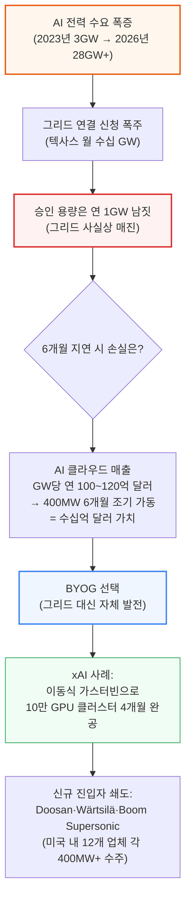
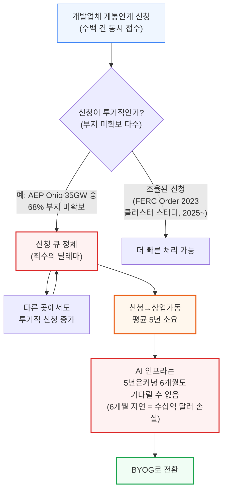

# How AI Labs Are Solving the Power Crisis: The Onsite Gas Deep Dive

> **출처**: [SemiAnalysis Newsletter](https://newsletter.semianalysis.com/p/how-ai-labs-are-solving-the-power)
> **저자**: Ajey Pandey
> **발행일**: 2025-12-31

---

## 📑 목차

### 전체 섹션
 1. [🟢 서론: 전력망이 AI를 따라가지 못하는 이유](#1-서론-전력망이-ai를-따라가지-못하는-이유)
 2. [🟡 전력망이 구조적으로 느릴 수밖에 없는 이유](#2-전력망이-구조적으로-느릴-수밖에-없는-이유)
 3. [🟢 BYOG란 무엇인가: 옛 방식과 새 방식의 대결](#3-byog란-무엇인가-옛-방식과-새-방식의-대결)
 4. [🟡 발전 장비 지형도 개관](#4-발전-장비-지형도-개관)
 5. [🔴 항공유도 가스터빈(Aero)과 산업용 가스터빈(IGT)](#5-항공유도-가스터빈aero과-산업용-가스터빈igt)
 6. [🔴 왕복동 엔진(RICE)](#6-왕복동-엔진rice)
 7. [🟡 연료전지와 Bloom Energy의 부상](#7-연료전지와-bloom-energy의-부상)
 8. [🔴 대형 가스터빈과 복합화력(CCGT): 왜 너무 느린가](#8-대형-가스터빈과-복합화력ccgt-왜-너무-느린가)
 9. [🔴 배치 전략: 브릿지 전력, 이중화 설계, 부하 변동 대응](#9-배치-전략-브릿지-전력-이중화-설계-부하-변동-대응)
10. [🟡 가스터빈을 충분히 만들 수 있는가: 공급망 병목](#10-가스터빈을-충분히-만들-수-있는가-공급망-병목)
11. [🟢 새로운 진입자들: 제트기와 선박에서 온 발전기](#11-새로운-진입자들-제트기와-선박에서-온-발전기)
12. [🔴 온사이트 전력 TCO 분석과 그리드 재연결 후 활용 전략](#12-온사이트-전력-tco-분석과-그리드-재연결-후-활용-전략)
13. [🟢 승자는 누구인가: 제조사별 경쟁 구도](#13-승자는-누구인가-제조사별-경쟁-구도)
14. [🟡 다음 병목: 건설 지원 생태계](#14-다음-병목-건설-지원-생태계)

---

## 🔑 용어 정리

본문을 순서대로 읽기 전에 알아두면 좋은 용어들입니다. 자세한 수치와 설명은 본문에서 처음 등장하는 위치에 나옵니다.

- **BYOG (Bring Your Own Generation)**: 전력회사의 그리드 연결을 기다리지 않고, 데이터센터 부지에 직접 발전 설비를 지어 전력을 자체 조달하는 전략
- **CCGT (복합화력발전, Combined-Cycle Gas Turbine)**: 가스터빈이 내뿜는 뜨거운 배기가스로 증기터빈을 한 번 더 돌려, 같은 연료로 전기를 두 번 뽑아내는 고효율 발전 방식
- **단순 사이클 (Simple-Cycle)**: 가스터빈만 돌리고 배기열은 그냥 버리는 기본 발전 방식. CCGT보다 효율은 낮지만 빠르고 간단
- **항공유도 가스터빈 (Aeroderivative, "Aero")**: 여객기 제트엔진을 땅 위에 고정해 발전기로 개조한 것. 가볍고 빠르게 설치 가능
- **산업용 가스터빈 (Industrial Gas Turbine, IGT)**: 처음부터 지상 고정용으로 설계된 가스터빈. 항공유도보다 저렴하지만 기동이 느림
- **중대형 가스터빈 (Heavy-Duty Gas Turbine)**: 발전소용 초대형 가스터빈. 효율은 가장 높지만 설치에만 수년이 걸림
- **RICE (왕복동 엔진, Reciprocating Internal Combustion Engine)**: 자동차 엔진처럼 피스톤이 왕복 운동하며 전기를 만드는 엔진. 터빈보다 작고 유연하게 운영 가능
- **고속 엔진 / 중속 엔진 (High-speed / Medium-speed Engine)**: RICE를 분당 회전수로 나눈 구분. 고속은 작고 저렴하며, 중속은 크지만 정비 부담이 적음
- **SOFC (고체산화물 연료전지, Solid Oxide Fuel Cell)**: 연소 과정 없이 화학 반응만으로 천연가스에서 전기를 뽑아내는 방식. Bloom Energy의 핵심 기술
- **E-Class / F-Class / H-Class**: 대형 가스터빈을 연소 온도 기준으로 나눈 세대 구분. 알파벳이 뒤로 갈수록 최신·고온·고효율 설계
- **N+1 / N+1+1 (백업 장비 구성)**: 필요한 발전 용량(N)에 예비 1대를 더하는 구성. N+1+1은 예비 1대에 정비 교체용 1대를 추가로 더한 것
- **BESS (배터리 에너지 저장 장치, Battery Energy Storage System)**: 대형 배터리로 전력을 저장했다가 필요할 때 순간적으로 방출하는 설비
- **EaaS (Energy-as-a-Service)**: 발전 설비 조달부터 설계, 운영까지 전력 공급 전체를 대행업체가 책임지고 제공하는 계약 방식
- **HRSG (배열회수 보일러, Heat Recovery Steam Generator)**: 가스터빈이 내뿜는 뜨거운 배기가스로 물을 끓여 증기를 만드는 장치. CCGT의 핵심 부품
- **관성 (Inertia) / 동기조상기 (Synchronous Condenser) / 플라이휠 (Flywheel)**: 전력망이 순간적인 부하 변화에도 주파수를 유지하는 힘(관성)과, 그 힘을 보강해주는 보조 장치들
- **ELCC (유효부하부담능력, Effective Load Carrying Capacity)**: 발전기 한 대가 실제로 얼마나 믿을만한지를 할인해서 계산하는, 전력망 업계의 신뢰도 지표
- **열소비율 (Heat Rate)**: 전기 1kWh를 만드는 데 연료를 얼마나 쓰는지 나타내는 효율 지표. 숫자가 낮을수록 효율적
- **램프 속도 (Ramp Rate)**: 발전기가 꺼진 상태(냉간)에서 최대 출력에 도달하기까지 걸리는 시간
- **CHP (열병합발전, Combined Heat and Power)**: 발전 과정에서 나오는 폐열을 냉방 등에 재활용하는 방식
- **TCO (총소유비용, Total Cost of Ownership)**: 초기 설치비(자본 지출)와 운영비를 모두 합친 전체 비용
- **EPC (설계·조달·시공, Engineering, Procurement and Construction)**: 발전 설비를 설계하고 자재를 조달해 실제로 지어 넘겨주는 통합 시공업체
- **BTM (Behind-the-Meter, 계량기 뒷단)**: 전력회사 계량기를 거치지 않고, 그리드와 별도로 현장에서 자체 발전해 바로 소비하는 방식
- **미드스트림 가스 (Midstream Gas)**: 가스를 채굴한 뒤 소비지까지 배관으로 운반·처리하는 중간 단계 인프라

---

## 1. 서론: 전력망이 AI를 따라가지 못하는 이유

**📌 핵심:**
- 텍사스에서만 매달 수십 GW(기가와트)의 데이터센터 전력 신청이 몰리지만, 최근 1년간 승인된 용량은 1GW 남짓 → **그리드(전력망)가 사실상 매진**
- AI 클라우드는 1GW당 연 100~120억 달러 매출 → 데이터센터 가동을 6개월만 앞당겨도 수십억 달러 이득 → 그리드 연결을 기다릴 경제적 여유가 없음
- xAI는 그리드를 건너뛰고 트럭에 실린 이동식 가스터빈·엔진으로 100,000개 GPU 클러스터를 **4개월** 만에 가동 → 이미 500MW 넘는 터빈을 자체 배치
- 결론: "속도가 곧 해자(moat)"인 AI 시대에 전력망을 기다리지 않고 직접 발전하는 **BYOG(자가 발전, Bring Your Own Generation)** 전략이 업계 표준으로 확산 중

---

SemiAnalysis는 약 2년 전 이미 전력 부족을 예측했습니다. 미국 AI 전력 수요가 2023년 약 3GW에서 2026년 28GW 이상으로 늘어나 미국의 전력 공급망을 압도할 것이라는 예측이었고, 실제로 정확히 들어맞았습니다.

- 텍사스(ERCOT)만 봐도 매달 수십 GW 규모의 데이터센터 전력 신청이 쏟아지지만, 최근 12개월간 승인된 용량은 1GW를 겨우 넘는 수준 → 신청 대비 승인 비율이 극히 낮아 "그리드가 매진(sold out)"된 상태
- AI 인프라는 그리드의 다년간 송전 설비 증설을 기다릴 수 없음: AI 클라우드는 1GW당 연간 100~120억 달러의 매출을 냄 → 400MW 데이터센터를 6개월 일찍 가동하는 것만으로도 수십억 달러 가치가 있음
- 경제적 필요가 "과부하된 그리드" 같은 문제보다 훨씬 크기 때문에, 업계는 이미 새로운 해법을 찾고 있음

18개월 전, 일론 머스크는 10만 개 GPU 클러스터를 단 4개월 만에 지어 업계를 놀라게 했습니다. 여러 혁신이 있었지만, 가장 인상적인 부분은 에너지 전략이었습니다.

- xAI는 그리드를 완전히 건너뛰고, 트럭에 실을 수 있는 이동식 가스터빈·엔진으로 데이터센터 부지에서 직접 전력을 생산
- 이미 500MW 넘는 터빈을 자체 데이터센터 인근에 배치 완료
- "기가와트급 데이터센터를 가장 먼저 짓는 경쟁"에서는 속도 자체가 경쟁 우위(해자)가 됨

하이퍼스케일러와 AI 랩들이 하나둘씩 xAI를 따라 그리드를 일시적으로 포기하고 자체 발전소를 짓고 있습니다. 2025년 10월, OpenAI와 Oracle은 텍사스에 2.3GW 규모 발전 설비를 발주하며 역대 최대 규모의 온사이트 가스 발전 계약을 체결했습니다. 온사이트 가스 발전 시장은 이제 연간 세 자릿수(triple-digit) 성장률에 진입하고 있습니다.

수혜자는 기존 대형 터빈 제조사에 그치지 않습니다. GE Vernova와 Siemens Energy 주가가 급등한 것은 물론, 전례 없는 신규 진입자들이 몰려들고 있습니다.

| 기업 | 배경 | 데이터센터向 실적 |
|------|------|------|
| **Doosan Enerbility** (두산에너빌리티) | 한국의 중공업 대기업 | H-class 터빈을 적기에 출시, xAI向 1.9GW 발주 확보 |
| **Wärtsilä** (바르질라) | 원래 선박 엔진 제조사 | 크루즈선을 움직이던 엔진으로 AI 클러스터 전력 공급, 이미 미국向 800MW 계약 체결 |
| **Boom Supersonic** | 초음속 여객기 개발사 | Crusoe와 1.2GW 터빈 계약 체결, 발전 사업 마진을 마하 2 여객기 개발 자금으로 활용 |

SemiAnalysis의 Datacenter Industry Model로 건물 단위까지 추적한 결과, **미국에서만 12개 서로 다른 공급업체가 각각 400MW 이상의 데이터센터向 온사이트 가스 발전 수주**를 확보한 것으로 나타났습니다. 불과 2~3년 전만 해도 이 시장은 GE Vernova와 Siemens Energy 두 곳이 사실상 전부였습니다.

그러나 온사이트 발전에도 문제는 있습니다. 전력 비용은 그리드보다 (종종 훨씬) 비싸고, 인허가는 길고 복잡한 절차를 거쳐야 하며, 실제로 일부 데이터센터 일정이 지연되는 원인이 되고 있습니다. 대표적으로 Oracle/Stargate의 기가와트급 시설 하나가 인허가 문제로 지연되었는데, SemiAnalysis는 이를 언론 보도 3주 전에 이미 인허가 진행 상황 분석으로 예측한 바 있습니다.

xAI 같은 영리한 기업은 이런 문제에도 해법을 찾았습니다. 일론 머스크의 AI 랩은 두 개 주(州)의 경계에 부지를 선정하는 새로운 전략을 시도했습니다 — 인허가를 더 빨리 받을 수 있는 확률을 높이기 위해서입니다. 실제로 테네시주는 제때 인허가를 내주지 못했지만, 미시시피주는 기가와트급 발전소 건설을 흔쾌히 허가했습니다.

이 보고서는 BYOG(자가 발전)에 대한 심층 분석입니다. 왜 그리드가 AI 수요를 따라가지 못하는지부터 시작해, 데이터센터가 쓸 수 있는 모든 발전 기술 — GE Vernova의 항공유도 터빈, Siemens의 산업용 터빈, Jenbacher의 고속 엔진, Wärtsilä의 중속 엔진, Bloom Energy의 연료전지 등 — 을 기술적으로 분해합니다. 이어서 완전 독립형(islanded) 데이터센터, 가스+배터리 하이브리드, Energy-as-a-Service 모델 등 배치 방식과 운영상의 과제, 그리고 어떤 솔루션이 승리할지를 가르는 경제성을 살펴봅니다.

---

## 2. 전력망이 구조적으로 느릴 수밖에 없는 이유

**📌 핵심:**
- 전력망은 수요와 공급을 매초 거의 완벽하게 맞춰야 하는 시스템 → 큰 신규 부하(데이터센터) 하나가 들어올 때마다 안정성 검증을 위한 정밀 엔지니어링 연구가 필요
- 개발업체들이 여러 전력회사에 동시에 "일단 신청부터" 하는 투기적 신청 폭주 → 신청 큐가 막히고 이는 다시 투기적 신청을 부추기는 악순환 (예: AEP Ohio 신청량 35GW 중 68%가 부지 확보조차 안 된 상태)
- 신규 발전 설비가 신청부터 상업 가동까지 걸리는 기간은 평균 **5년** → AI 인프라는 5년은커녕 6개월도 기다릴 수 없음 (6개월 지연 = 수십억 달러 손실)
- 결론: 그리드가 느린 것은 관리 부실이 아니라 "실시간 안정성"이라는 물리적 요구사항 때문 → 이 구조적 한계가 BYOG를 선택지가 아닌 필수로 만듦

---

전력망이 왜 AI 수요를 따라가지 못하는지 이해하려면, 먼저 그리드가 느릴 수밖에 없는 두 가지 구조적 이유를 알아야 합니다.

1. **실시간 균형(Real-time balancing)**: 전기는 저장이 어려워 공급과 수요가 매초 거의 완벽히 일치해야 합니다. 이 균형이 무너지면 수백만 명이 정전을 겪을 수 있습니다 — 2025년 4월 이베리아 반도(스페인·포르투갈) 대정전이 그 사례입니다.
2. **시스템 연구(System studies)**: 새로운 대형 부하(데이터센터)나 공급(발전소)이 하나 들어올 때마다, 그리드를 불안정하게 만들지 않는지 확인하는 정밀 엔지니어링 연구가 필요합니다. 일부 지역에서는 그리드 구조가 너무 빨리 바뀌어 연구 결과가 완료되기도 전에 낡은 자료가 되어버립니다.

수백 개의 개발업체가 동시에 계통연계(interconnection) 신청을 낼 때, 시스템은 정체됩니다. 이는 일종의 "죄수의 딜레마"가 됩니다.

- 모두가 조율한다면 그리드는 더 많은 신청을 더 빨리 처리할 수 있음 → FERC(미국 연방에너지규제위원회) Order 2023이 이를 위해 **클러스터 스터디(cluster studies, 여러 신청을 묶어 한 번에 검토)** 방식을 도입하도록 밀어붙였지만, 이 개혁이 실제로 자리 잡은 것은 2025년부터
- 하지만 현실에서는 "골드러시" 행태가 나타남: 개발업체들이 여러 전력회사에 동시에 투기적으로 신청을 넣음 → 예를 들어 2024년 중반 기준 AEP Ohio에는 35GW의 신청이 쌓였는데, 이 중 68%는 부지 확보조차 되지 않은 상태였음
- 투기적 신청이 모두를 위한 큐를 막아버리면 → 다른 곳에서도 투기적 신청이 더 늘어남 → 악순환이 가속

공급 측면도 마찬가지로 제약이 큽니다. 계통연계 신청부터 상업 가동까지 걸리는 시간은 대부분의 발전 유형에서 이제 **5년**으로 늘어났습니다.

**📌 용어 풀이: 계통연계(Interconnection)와 클러스터 스터디**
> - **계통연계 신청**: 발전소나 대형 부하(데이터센터)를 그리드에 연결하기 전에 반드시 거쳐야 하는 공식 신청 및 심사 절차
> - **클러스터 스터디**: 개별 신청을 하나씩 따로 심사하는 대신, 여러 신청을 묶어서 한꺼번에 그리드 영향을 분석하는 방식 → 처리 속도를 높이기 위한 개혁
> - **쉬운 비유**: 놀이공원에서 사람들이 한 명씩 표를 사면 줄이 끝없이 늘어나지만, 단체로 묶어서 한 번에 처리하면 줄이 훨씬 빨리 줄어드는 것과 같음

### BYOG 등장: 그리드를 기다리지 않고 시작한다

BYOG(자가 발전)의 핵심 가치 제안은 단순합니다: **그리드를 기다리지 않고 가동을 시작한다.** 데이터센터는 자체 발전만으로 무기한 운영할 수 있고, 나중에 그리드 서비스가 들어오면 그 발전 설비를 백업 전원으로 전환하면 됩니다.

이것이 정확히 xAI의 전략이었습니다. 이들은 이동식 가스터빈으로 Colossus를 지어, 수년이 아닌 몇 개월 만에 시설을 가동했습니다. 이제 모든 기업이 이 방식을 따라 하고 있습니다. 다음 섹션에서 구체적인 방법을 살펴봅니다.

---

*작성 진행률: 약 17% 완료*
*업데이트: 1~2번 섹션(전력망 위기 배경, 그리드가 느린 구조적 이유) 작성 완료*
