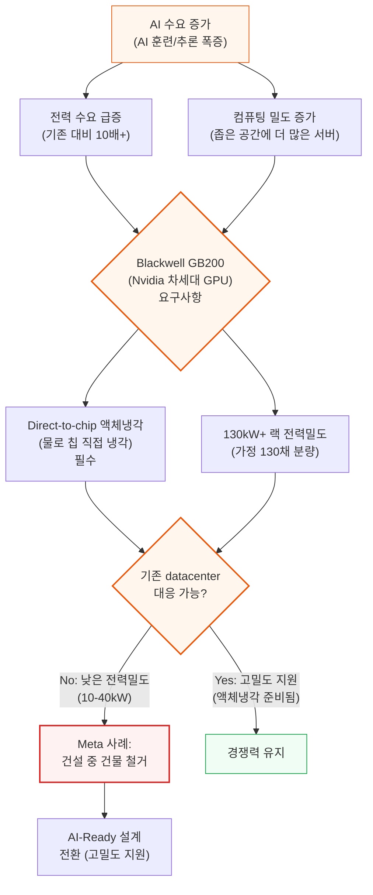
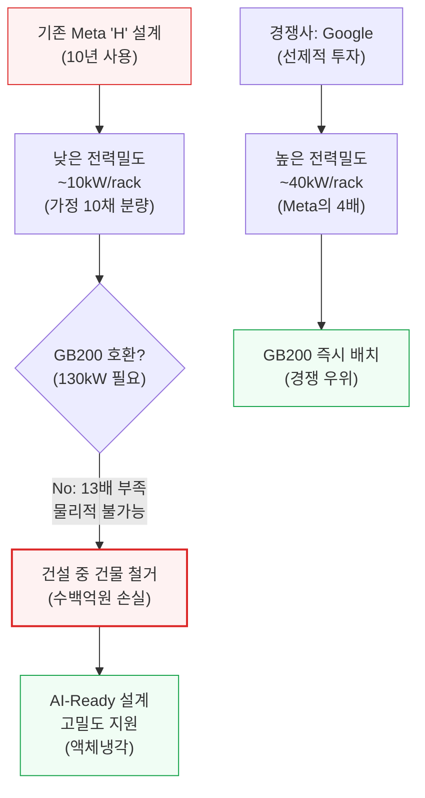
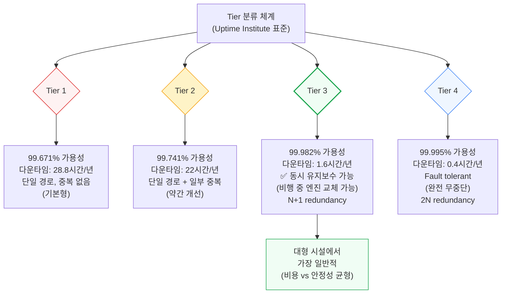
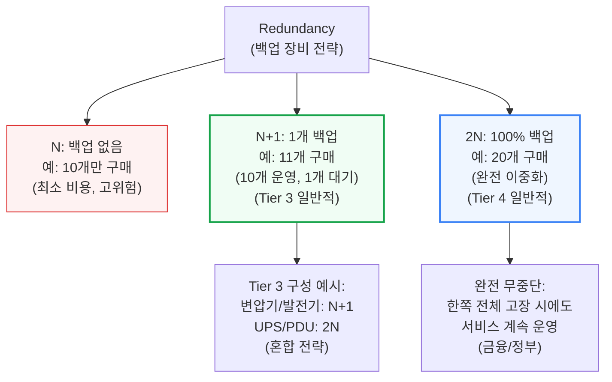
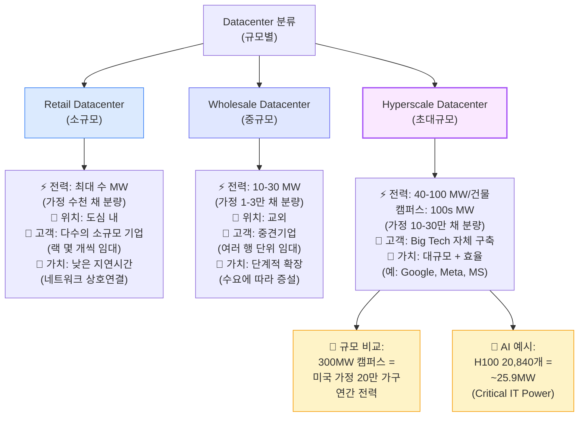
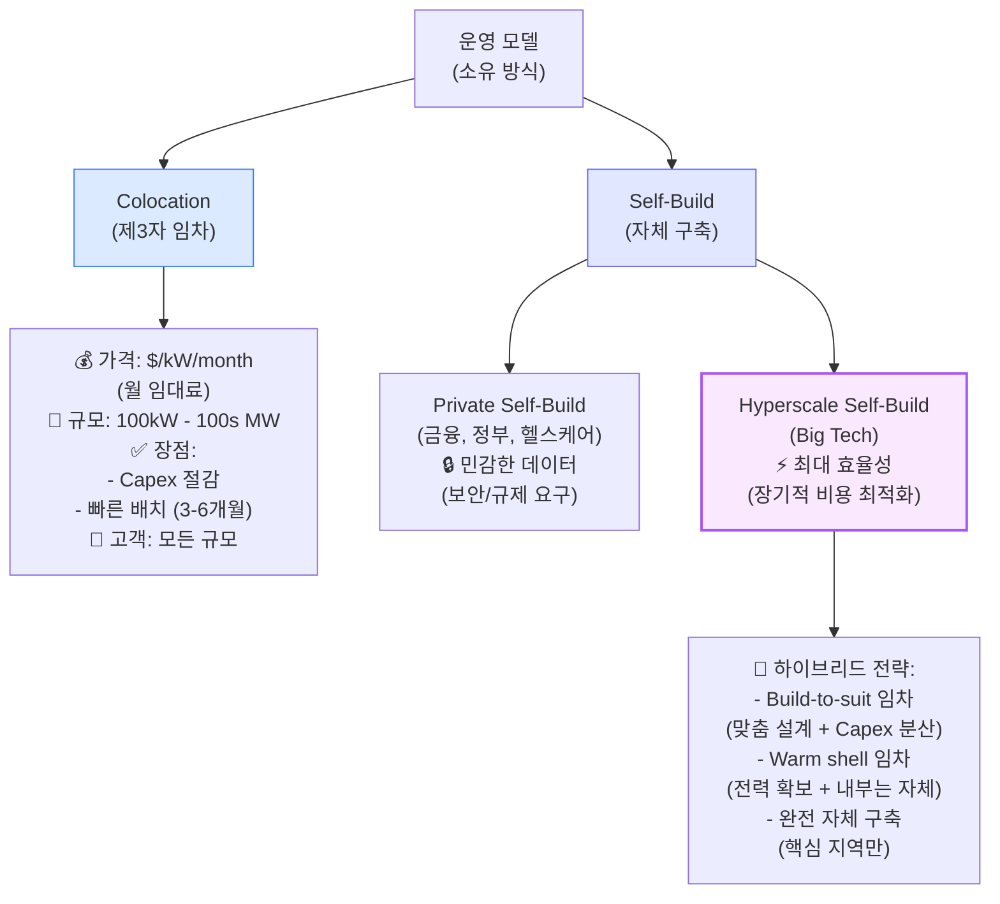
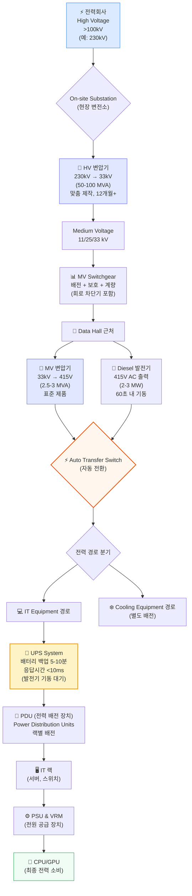
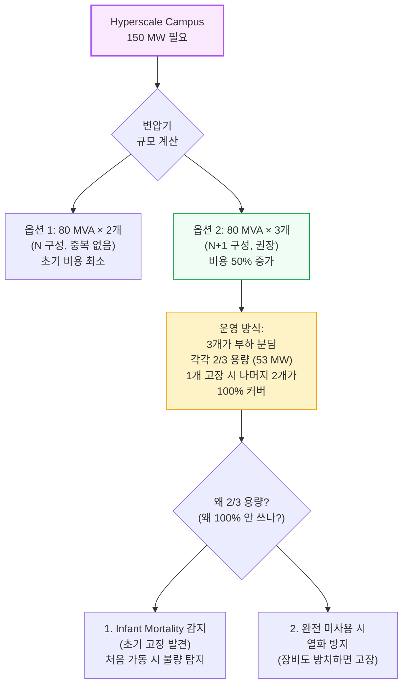
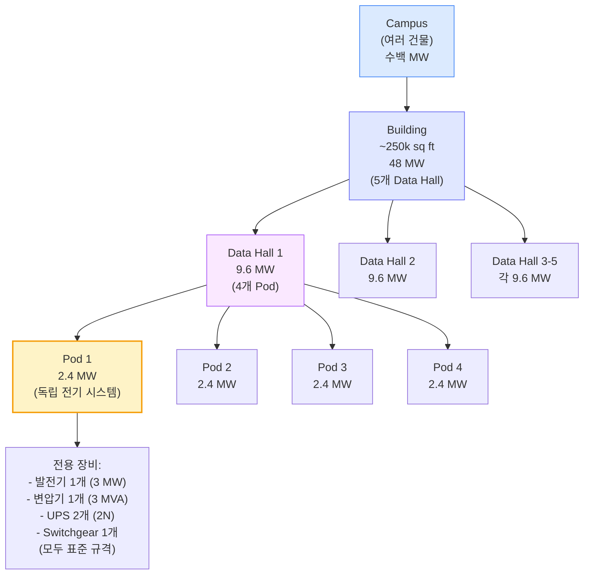
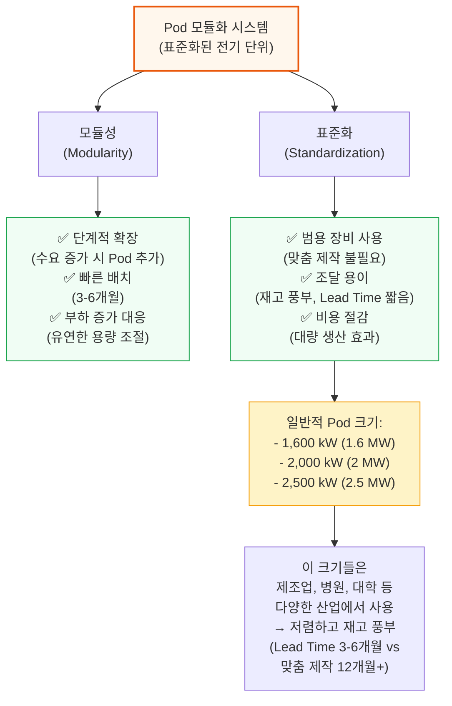

# 데이터센터 해부학 Part 1 - 전기 시스템

> **출처**: [SemiAnalysis Newsletter](https://newsletter.semianalysis.com/p/datacenter-anatomy-part-1-electrical)
> **저자**: Dylan Patel
> **발행일**: 2024-10-14

---

## 📑 목차

### 전체 섹션
 1. [서론: AI 시대의 데이터센터 변화](#1-서론-ai-시대의-데이터센터-변화)
 2. [데이터센터 기초](#2-데이터센터-기초)
 3. [데이터센터 종류별 비교](#3-데이터센터-종류별-비교)
 4. [데이터센터 전기 시스템](#4-데이터센터-전기-시스템)
 5. [고압 변압기](#5-고압-변압기)
 6. [데이터 홀과 Pod](#6-데이터-홀과-pod)
 7. [발전기, 중압 변압기, 전력 배전](#7-발전기-중압-변압기-전력-배전)
 8. [UPS (무정전 전원 공급 장치) 시스템](#8-ups-무정전-전원-공급-장치-시스템)
 9. [OCP 랙과 BBU (배터리 예비 전원)](#9-ocp-랙과-bbu-배터리-예비-전원)
10. [AI 영향: 전력 밀도 증가](#10-ai-영향-전력-밀도-증가)
11. [승자와 패자, 투자 전망](#11-승자와-패자-투자-전망)

---

## 🔑 용어 정리

본문을 순서대로 읽기 전에 알아두면 좋은 용어들입니다. 자세한 수치와 설명은 본문에서 처음 등장하는 위치에 나옵니다.

- **Critical IT Power**: IT 장비가 실제로 쓰는 전력. 냉각·조명 등을 뺀, 순수하게 서버가 소비하는 몫
- **Tier**: 데이터센터가 얼마나 안정적으로 운영되는지 나타내는 업계 표준 등급
- **Redundancy**: 장비가 하나 고장 나도 서비스가 끊기지 않도록 여분의 장비를 미리 갖춰두는 전략
- **Build-to-Suit / Warm Shell**: 임대업체가 데이터센터를 지어서 빌려주는 방식. Build-to-Suit는 맞춤 설계까지 다 지어주는 것, Warm Shell은 전력만 연결해두고 내부는 임차인이 직접 꾸미는 것
- **전압 레벨 (HV/MV/LV)**: 발전소에서 서버까지 오는 동안, 위험한 고전압을 안전한 저전압으로 단계적으로 낮추는 3단계 구분
- **변압기**: 전압을 높이거나 낮춰주는 장치. 발전소의 초고압 전기를 서버가 쓸 수 있는 저전압으로 단계마다 낮춰줌
- **MVA vs MW**: 변압기 용량을 나타내는 두 단위. MVA는 이론상 최대치("겉보기 전력"), MW는 실제로 쓸 수 있는 전력("실제 전력")
- **Data Hall**: 서버가 실제로 설치되는 건물 내부 공간
- **Pod**: Data Hall을 나누는 모듈 단위. 각자 독립된 전기 설비를 갖춘 구획
- **발전기**: 정전 시 자체적으로 전기를 만들어 공급하는 백업 설비
- **Switchgear (배전반)**: 전력을 나눠주고 보호하는 장비를 한데 모아놓은 함
- **UPS (무정전 전원 공급 장치)**: 정전 순간부터 발전기가 켜지기 전까지, 배터리로 전력을 끊기지 않게 이어주는 장치
- **BBU (배터리 예비 전원)**: UPS를 중앙 장비 대신 랙 안에 넣은 방식
- **OCP 랙**: Meta가 만든 서버·랙 설계 표준. 전력 변환을 서버마다 하지 않고 랙 중앙에서 한 번에 처리
- **Busbar**: 케이블 대신 굵은 금속 막대로 전기를 여러 곳에 나눠주는 방식
- **PDU (전력 배전 장치)**: UPS에서 온 전력을 랙·서버 단위로 나눠주는 배전함
- **ATS / STS**: 정전 시 예비 전원으로 자동 전환해주는 스위치. STS가 ATS보다 훨씬 빠른 전자식

---

## 1. 서론: AI 시대의 데이터센터 변화

**📌 핵심:**
- Blackwell GB200은 **일반 랙 대비 13배 많은 전력**(일반 랙 10kW → GB200 130kW, 가정 130채 분량)과 **물 냉각 시스템** 필요
- Meta 건물은 10kW만 지원 → GB200(130kW) 수용 불가 → 건설 중인데도 철거 결정 (수백억원 손실)
- Google은 40kW 지원 건물 보유 → 즉시 배치 가능 (4배 전력 차이가 승부처)
- 결론: 미리 대량 전력 + 물 냉각 준비한 기업만 AI 경쟁에서 살아남음

---

데이터센터 (Datacenter) 산업이 AI 훈련과 추론의 대규모 수요로 인해 전례 없는 가속화를 경험하고 있습니다. 특히 Nvidia의 Blackwell GB200 출시는 데이터센터 설계의 근본적 변화를 요구합니다.

- AI 수요 증가가 두 가지 핵심 요구사항(전력 급증 + 밀도 증가)을 만들어냄
- Blackwell GB200은 130kW+ 전력밀도와 액체냉각을 동시에 요구
- 기존 데이터센터(10-40kW)는 물리적으로 대응 불가능 → Meta처럼 건물 철거 또는 경쟁력 상실
- 핵심 메시지: 고밀도 전력과 액체냉각 준비가 AI 시대 경쟁력을 결정

### Meta 사례: 전력밀도가 경쟁력을 결정한다

Meta는 건설 중이던 데이터센터 건물을 철거했습니다. 이유는 단 하나: 전력밀도가 너무 낮아서 GB200을 수용할 수 없었기 때문입니다.

-Meta의 기존 설계(10kW/rack)와 Google의 설계(40kW/rack)는 4배 차이
- GB200은 130kW를 요구 → Meta는 13배 부족, Google은 3배 부족
- Meta: 건물 철거 + 재설계 (수백억원 손실)
- Google: 즉시 배치 가능 (경쟁 우위)
- 결론: 선제적인 고밀도 투자가 AI 시대 경쟁력을 결정

**핵심 인사이트:**
- 전력밀도 격차: Google 40kW vs Meta 10kW (4배 차이)
- GB200 130kW 요구사항을 충족하지 못하면 AI 경쟁에서 뒤처짐
- Meta는 수백억원을 들여 건물을 철거하고 재설계 중

---

## 2. 데이터센터 기초

**📌 핵심:**
- Tier 3 (연간 1.6시간 다운타임 허용)가 대형 시설 표준 → 비용과 안정성의 균형점
- 백업 장비 전략: 1개 예비 보유 (10% 비용 증가)로 안정성 대폭 향상
- Tier 4 (완전 무중단)는 비용 2배 → 금융/정부만 사용
- 결론: Tier 3 + 적절한 백업 장비 조합이 최적

---

### 데이터센터 (Datacenter)란?
IT 장비에 안전하고 효율적으로 전력을 공급하는 특수 목적 시설. 서버, 네트워크 스위치, 스토리지 장치가 랙에 배치되어 대량의 전력을 소비하고 열을 발생시킵니다.

**📌 용어 풀이: Critical IT Power**
> - IT 장비가 소비하는 최대 전력 (단위: kW 또는 MW)
> - 실제 전력망에서 공급되는 전력 > Critical IT Power (냉각, 조명 등 포함)
> - **Power Utilization Rate**:
>   - 클라우드 컴퓨팅: 50-60%
>   - AI 훈련: 80%+
>   - 엔터프라이즈: <50%

### 규모 비교: 데이터센터 vs 일반 건물

현대 데이터센터는 일반 사무실 대비 50배 이상의 전력 밀도를 가집니다. 30년 전 "사무실 + 강력한 에어컨" 수준에서, 이제는 전용 냉각 인프라를 갖춘 전문 시설로 진화했습니다.

### Tier 분류 체계 (Uptime Institute)

데이터센터의 안정성과 가용성을 평가하는 업계 표준 분류 체계입니다.

- Tier 1-4는 가용성(99.671% → 99.995%)과 다운타임(28.8시간 → 0.4시간/년)으로 구분
- Tier 3가 대형 시설에서 가장 일반적으로 사용됨
- 이유: 비용과 안정성의 균형점 (동시 유지보수 가능 + N+1 redundancy)
- Tier 4는 완전 무중단(fault tolerant)이지만 비용이 2배 → 금융/정부 등 미션 크리티컬만 사용
- 핵심: 1.6시간/년 다운타임(Tier 3)과 0.4시간/년(Tier 4) 차이에 2배 비용을 쓸 가치가 있는가?

**참고: CSP의 "Three Nines" vs 데이터센터 Tier**
- CSP (클라우드 서비스 제공자)의 99.9%/99.999% 가용성은 SLA (서비스 수준 계약)
- 여러 Availability Zone 포함 + 서버/네트워크 가동시간 포함
- 데이터센터 Tier는 단일 시설의 물리적 인프라 가용성만 측정

### Redundancy: 백업 장비 전략

- N, N+1, 2N은 백업 장비 수량 전략
- N+1(1개 백업)은 Tier 3의 표준 → 비용 10% 증가로 안정성 대폭 향상
- 2N(100% 백업)은 Tier 4의 표준 → 비용 2배, 완전 무중단
- Tier 3는 혼합 전략: 변압기/발전기는 N+1, UPS/PDU는 2N
- 핵심: 백업 전략은 비용과 다운타임 리스크의 트레이드오프

---

## 3. 데이터센터 종류별 비교

**📌 핵심:**
- 초대형 시설 (40-100 MW/건물)이 AI 시대 필수 → Big Tech만 가능한 규모
- 임대 vs 자체 구축: 초기 투자 vs 장기 통제권 선택의 문제
- AI 시대에는 빠른 확장이 중요 → 임대 수요 증가 (Meta, Microsoft도 사용)
- 결론: 300MW 캠퍼스 = 미국 가정 20만 채 전력 = 수조원 규모 투자 필요

---

데이터센터는 규모(전력 용량)에 따라 Retail, Wholesale, Hyperscale로 분류됩니다.

- 세 종류의 데이터센터는 전력 규모(수 MW → 10-30 MW → 40-100 MW)로 구분
- 각각 다른 비즈니스 모델: Retail(네트워크 생태계), Wholesale(확장성), Hyperscale(대규모 효율)
- Hyperscale 규모 비교: 300MW = 미국 가정 20만 채 = H100 클러스터 약 10개
- 핵심: AI 시대에는 Hyperscale 규모가 필수 → Meta, Google, Microsoft 등만 가능

### 규모별 특징 상세

| 특징 | Retail | Wholesale | Hyperscale |
|------|--------|-----------|------------|
| **Critical IT Power** | 수 MW | 10-30 MW | 40-100 MW/건물 |
| **위치** | 도심 내 | 교외 | 대규모 부지 |
| **임차 단위** | 수 kW (랙 몇 개) | 1-5 MW (여러 행) | >5 MW (건물 전체) |
| **고객 수** | 다수 (수십\~수백) | 중간 (수\~수십) | 단일 또는 소수 |
| **가치 제안** | 네트워크 상호연결 | 확장 가능성 | 대규모 + 맞춤 설계 |
| **비즈니스 모델** | 부동산 ("location³") | 용량 + 확장성 | 효율성 극대화 |

### 운영 모델 비교

- Colocation(임대) vs Self-Build(자체 구축)의 트레이드오프
- Colocation: Capex 절감, 빠른 배치 → 중소기업에 적합
- Self-Build: 초기 투자 크지만 장기적 비용 절감, 완전한 통제권 → Big Tech만 가능
- Hyperscaler는 하이브리드 전략: Build-to-suit, Warm shell, 완전 자체 구축 혼합
- 핵심: AI 시대에는 빠른 확장이 중요 → Colocation 수요 증가 (Meta, Microsoft도 사용)

**📌 용어 풀이: Build-to-Suit & Warm Shell**
> - **Build-to-Suit**: Colocation 업체가 hyperscaler 사양에 맞춰 건설 후 임대
>   - 장점: Capex 분산, 전문가 설계, 빠른 배치
>   - 규모: 100MW+ 임차 계약도 흔함
>   - 예: Equinix, Digital Realty가 Meta, Microsoft에게 제공
> - **Warm Shell**: 전력 연결은 완료, 내부 M&E(기계/전기) 인프라는 임차자가 구축
>   - 장점: 유연성 + 부분적 Capex 절감
>   - 전력 확보는 빠르게, 내부 설계는 자유롭게
> - **Capex vs Opex**:
>   - Capex (자본 지출): 건물, 장비 구매 (초기 투자 큼)
>   - Opex (운영 비용): 전기료, 임대료 (월 지출)

---

## 4. 데이터센터 전기 시스템

**📌 핵심:**
- 전력은 초고압 (230,000V) → 중압 (33,000V) → 저압 (415V) 3단계로 낮춤
- 이중 백업: 발전기 (1분 내 기동) + 배터리 (0.01초 이내) → 무중단 전력
- 대형 변압기는 맞춤 제작 (12-24개월 소요) → 미리 주문 필수
- 모듈화로 범용 장비 사용 → 빠른 조달 + 비용 절감
- 결론: 복잡한 전기 시스템이지만 표준화와 모듈화로 효율 극대화

---

### 핵심 원리: 왜 고전압으로 전달하나?

전력 손실은 전류의 제곱에 비례(P_loss = I² × R)하므로, 고전압을 사용하면 전류가 낮아져 손실이 급격히 감소합니다.

- 고전압 사용 시 전류↓ → 손실 = I² × R에서 I가 낮아져 손실 급감
- 예: 전류 1/2로 줄이면 손실은 1/4로 감소 (제곱 관계)
- 하지만 고전압은 위험 → 건물 근처에서는 MV(Medium Voltage)로 강압
- 핵심: 장거리 전송은 HV, 건물 내부는 MV/LV로 단계적 강압

**📌 용어 풀이: 전압 레벨**
> - **High Voltage (HV)**: >100kV (예: 138kV, 230kV, 345kV)
>   - 용도: 장거리 송전선, 수백 km 전송
> - **Medium Voltage (MV)**: 11kV, 25kV, 33kV
>   - 용도: 건물 간 배전, 수 km 전송
> - **Low Voltage (LV)**: 415V (미국 3상)
>   - 용도: IT 장비 근처 배전, 수십 m
> - **쉬운 비유**:
>   - HV = 고속도로 (빠르지만 위험)
>   - MV = 일반도로 (중간 속도, 안전)
>   - LV = 주택가 도로 (느리지만 매우 안전)

### 전력 전달 경로 (Outside-In)

-전력이 전력회사 → 최종 CPU/GPU까지 전달되는 전체 경로와 변환 과정
- 3단계 전압 변환: HV (230kV) → MV (33kV) → LV (415V)
- 이중 백업 시스템: 발전기 (1분 내 기동) + UPS (<10ms 응답)
- 전력 경로 분기: IT 장비용 vs 냉각 장비용 별도 경로
- 핵심: 각 단계마다 변압기와 백업 시스템이 필요 → 복잡하고 비용이 많이 듦

**핵심 포인트:**
1. **전압 변환**: HV (230kV) → MV (33kV) → LV (415V) 3단계 강압
2. **백업 시스템**: 발전기 (1분 내 기동) + UPS (<10ms 응답)
3. **이중 경로**: IT 장비용 + 냉각 장비용 별도 경로

---

## 5. 고압 변압기

### 변압기 작동 원리

변압기는 100년 이상 된 단순한 기술이지만, 데이터센터의 핵심 장비입니다. AC (교류, Alternating Current) 전류가 만드는 변화하는 자기장을 이용해 전압을 변환합니다.

**📌 용어 풀이: MVA vs MW**
> - **MVA (메가볼트암페어)**: "겉보기 전력" = 전압 × 전류
> - **MW (메가와트)**: "실제 전력" (유효 전력)
> - **관계**: MW = MVA × Power Factor
> - **Power Factor**: 일반적으로 \~0.95, 여유를 위해 0.9로 설계
> - **예시**: 80 MVA 변압기 ≈ 72 MW 실제 전력
> - **왜 다른가?**: AC 전력은 전압과 전류의 위상 차이로 인해 실제 전력이 겉보기 전력보다 낮음

### HV 변압기 사양 및 배치

-150 MW 캠퍼스에 80 MVA 변압기 2개 vs 3개 비교
- N+1 구성(3개)이 권장되는 이유: Infant Mortality 감지 + 열화 방지
- 3개를 각각 2/3 용량으로 운영 → 1개 고장 시에도 100% 커버
- 핵심: 초기 투자 50% 증가(2개→3개)로 안정성과 수명 크게 향상

**주요 구성 요소:**
- **Copper Coils**: 1차/2차 권선
- **변압기 Core**: GOES (Grain Oriented Electrical Steel)
  - **병목**: GOES 제조사가 제한적 → 변압기 공급 부족의 주요 원인
  - 주요 공급사: Nippon Steel, POSCO, ArcelorMittal 등

**📌 Lead Time 주의**
> HV 변압기는 맞춤 제작 (각 송전선마다 특성이 다름)
> - 일반적 Lead Time: **>12개월**
> - 해결책: Datacenter 계획 단계에서 사전 주문
> - AI 붐으로 인한 수요 급증 → 현재 18-24개월까지 증가

---

## 6. 데이터 홀과 Pod

**📌 핵심:**
- Pod 모듈화로 단계적 확장 + 빠른 배치 (3-6개월 vs 맞춤 제작 12개월+)
- 표준 크기(1.6/2/2.5 MW)는 다양한 산업에서 사용 → 재고 풍부 + 저렴
- 48 MW 건물 = 5개 Hall = 20개 Pod → 부분 고장 시에도 나머지 운영
- 결론: 모듈화와 표준화가 AI 시대 속도 경쟁의 핵심

---

### 모듈화 구조: Microsoft 데이터센터 예시

현대 Hyperscale (초대형) 데이터센터는 모듈화되어 있습니다. Campus → Building → Data Hall → Pod 계층 구조로, 빠른 확장과 유연성을 제공합니다.

-48 MW 건물은 5개 Data Hall(각 9.6 MW)로 분할
- 각 Data Hall은 4개 Pod(각 2.4 MW)로 분할
- 각 Pod는 독립적인 전기 장비 세트 보유 (발전기, 변압기, UPS, Switchgear)
- 핵심: 모듈화로 인해 부분적 고장 시에도 나머지 Pod는 정상 운영 + 단계적 확장 가능

**구조 계층:**
1. **Campus**: 여러 건물 (100s MW) - 예: Google 300MW 캠퍼스
2. **Building**: 단일 건물 (\~50 MW) - 일반적으로 6-12개월 건설
3. **Data Hall**: 건물 내 방 (\~10 MW) - 서버가 배치되는 실제 공간
4. **Pod**: Data Hall 내 모듈 (\~2-3 MW) - 독립적인 전기 시스템 단위

### Pod 시스템의 장점

- Pod 모듈화는 두 가지 핵심 장점: 모듈성 + 표준화
- 모듈성: 단계적 확장 가능 → 수요 예측 실패 리스크 감소
- 표준화: 범용 장비 사용 → 조달 용이 + 비용 절감
- 1.6kW, 2MW, 2.5MW는 다양한 산업에서 사용하는 표준 크기 → 재고 풍부
- 핵심: 맞춤 제작(12개월+) vs 표준 제품(3-6개월) 차이가 AI 시대 속도 경쟁에서 결정적

---

## 7. 발전기, 중압 변압기, 전력 배전

**📌 핵심:**
- 중압 변압기 (2.5-3 MVA)가 전압을 33kV → 415V로 낮춤 (Data Hall 근처 배치)
- 발전기 (2-3 MW, 4,000마력)가 60초 내 기동 → 정전 시 자동 전환
- 대형 datacenter는 발전기 20개 이상 보유 (기관차 엔진급)
- 결론: 이중 백업 (발전기 + 배터리)으로 무중단 전력 공급 보장

---

### 중압 변압기와 발전기 배치

고압 변압기에서 중압 (33kV, 22kV, 11kV)으로 낮춘 전력은 중압 배전반을 통해 각 Pod로 분배됩니다. Data Hall 바로 근처에서 다시 한번 전압을 낮춰야 합니다 - IT 장비는 11kV가 아닌 415V에서 작동하기 때문입니다.

- 각 Pod마다 중압 (MV) 변압기 1개 (2.5-3 MVA): 33kV/22kV/11kV → 415V 강압
- 각 Pod마다 디젤 발전기 1개 (2-3 MW): 변압기 고장 시 백업
- 자동 전환 스위치 (ATS): 0.1초 이내 발전기로 자동 전환
- 전력 경로 분기: IT 장비용 vs 냉각 장비용 별도 경로

### 중압 및 저압 배전반 (Switchgear)

중압 배전반은 금속 외함 안에 배전, 보호, 계량 장비를 모아둔 공장 조립 제품입니다.

**주요 구성 요소:**
- 차단기 (Circuit Breaker): 과전류 시 자동 차단으로 화재 방지
- 계량 장치 및 릴레이: 전력 사용량 측정
- 전류/전압 변압기: 차단기 및 계량 장비와 연동
- 스위치: 전원 on/off
- 중압 케이블

저압 (LV) 배전반도 동일한 역할을 하지만 415V에서 작동합니다. 전압은 낮지만 전류가 훨씬 높습니다 (4,000-5,000A).

### 발전기: 기관차급 엔진

각 저압 변압기 옆에는 같은 전력 용량의 발전기가 배치됩니다. 변압기나 상위 전력 공급이 끊기면 자동 전환 스위치 (ATS, 보통 LV 배전반의 일부)가 발전기를 주 전원으로 자동 전환합니다.

**발전기 사양:**
- 용량: 2-3 MW per unit (Hyperscale campus 기준)
- 마력: 4,000+ HP (기관차 엔진 수준)
- 기동 시간: 60초 이내 full capacity 도달
- 연료: 디젤 (주) 또는 천연가스
- 연료 저장: 24-48시간 full load 운영 가능
- 수량: 대형 datacenter는 20개+ 보유

**디젤 vs 천연가스:**
- 디젤: 운송/저장 용이, 에너지 효율 우수, 오염 多 → 규제로 인해 비용 ↑
- 천연가스: 오염 少, 저장/운송 어려움

**📌 용어 풀이: 발전기 규모**
> - **3 MW 발전기**: 마력 4,000+ (기관차 엔진급)
> - **Hyperscale datacenter**: 일반적으로 20개 이상 보유
> - **연료 소비**: Full load 기준 24-48시간 분량 항시 보유
> - **기동 시간**: 60초 (하지만 가끔 첫 시도에 실패하기도 함)
> - **비유**: 자동차 엔진처럼 가끔 시동이 안 걸릴 수 있음 → UPS 배터리가 그 공백을 메움

---

## 8. UPS (무정전 전원 공급 장치) 시스템

**📌 핵심:**
- 배터리 백업 5-10분 (발전기 기동 시간 60초보다 여유있게)
- 응답 시간 0.01초 이내 (발전기 60초보다 600배 빠름)
- 효율 손실 3-5% → 최신 제품은 99% 효율 (대기 모드)
- 모듈화 설계: 200-400kVA 코어를 10개까지 적층, 최대 27MW 지원
- 결론: UPS는 발전기가 켜질 때까지의 공백을 메우는 핵심 장비

---

### UPS 작동 원리

자동 전환 스위치 (ATS) 바로 다음에는 UPS (Uninterruptible Power Supply, 무정전 전원 공급 장치)가 있어 전력 공급이 절대 중단되지 않도록 보장합니다. 이 장치는 전력 전자 장치와 배터리를 통합하여 끊임없는 전력 흐름을 보장합니다.

발전기는 일반적으로 60초 만에 켜지고 full capacity에 도달하지만, 자동차 엔진처럼 가끔 첫 시도에 시동이 걸리지 않습니다. UPS의 역할은 그 공백을 메우는 것이며, 응답 시간은 일반적으로 10ms 미만입니다.

**UPS 주요 구성 요소:**
- 인버터 (Inverter): IGBT 반도체 기반, 배터리의 DC 전력을 AC로 변환
- 정류기 (Rectifier): AC를 DC로 변환하여 UPS가 배터리를 충전
- 배터리 뱅크: 납산 또는 리튬 (리튬이 납산을 대체 중, 하지만 엄격한 화재 규정 준수 필요)
- Static Bypass Switch: UPS 고장 시 부하를 자동으로 주 전원으로 전환

**효율 문제:**
- 기존 UPS: 3-5% 손실 (특히 저부하 시 악화)
- 최신 UPS: 대기 모드로 99% 효율 달성 (AC-DC-AC 변환 우회)
  - 하지만 전환 시간이 몇 ms 증가하여 짧은 전력 중단 위험

### 모듈화 UPS 시스템

최신 시스템은 모듈화되어 있습니다. 하나의 고정 크기 대형 장치 대신, 함께 적층하여 하나로 작동할 수 있는 작은 "코어"로 분해됩니다.

**Vertiv 최신 제품 사양:**
- 코어 크기: 200kVA 또는 400kVA per core
  - 참고: Tesla Model 3 인버터는 200kW AC 출력
- 적층: 한 유닛에 최대 10개 코어
- 병렬 운영: 최대 8개 유닛 병렬 작동 가능
- 최대 용량: 27MW

### UPS 이중화 전략

Tier 3 datacenter는 UPS 시스템에서 2N 이중화 ("2N Distribution")가 일반적입니다. PDU와 같은 하위 구성 요소도 2N이 되어 "동시 유지보수 가능" 시설을 만듭니다.

하지만 Hyperscaler는 4N3R (필요 3개 vs 사용 가능 4개) 또는 N+2C ("Catcher")와 같은 방식을 사용하여 UPS 부하 활용률을 높이고 (더 나은 효율) CapEx per MW를 줄입니다.

**Catcher 방식:**
- 2N 대신: full load를 처리할 수 있는 2개 UPS (각 3MW)
- N+1 + STS 사용: 작은 UPS 여러 개 (각 1MW × 3개) + 중복 유닛 1개
- Static Transfer Switch (STS)를 사용하여 고장 시 즉시 다른 UPS로 전환
- STS는 전력 전자 장치 기반이므로 ATS (기계식)보다 훨씬 빠름

**2N Distribution (가장 일반적):**
- A side와 B side로 불리는 2개의 독립 전력 분배 시스템
- UPS에서 whip까지 완전 독립
- 한쪽 전원 공급이 중단되어도 IT 랙은 다른 쪽 사용 가능
- Retail 및 Wholesale colocation operator가 Tier 3 datacenter에서 일반적으로 사용

---

## 9. OCP 랙과 BBU (배터리 예비 전원)

**📌 핵심:**
- Meta가 10년 전 도입한 OCP 랙: 중앙 Power Shelf에서 AC→DC 변환
- 각 서버의 정류기 제거 → 중앙에서 DC 전원을 busbar로 공급
- BBU를 랙 내부에 배치 → 중앙 UPS 불필요
- 효율 향상: 배터리 DC 전원을 IT 장비에 직접 공급 + 배터리 용량 절반으로 감소
- 하지만: 리튬 배터리 랙 내 배치 → 엄격한 화재 규정 준수 필요
- 결론: Hyperscaler는 효율 극대화를 위해 표준과 다른 맞춤 설계 사용

---

### OCP 랙 구조

위에서 설명한 것은 일반적인 데이터센터의 전력 흐름이지만, Hyperscaler는 효율성을 추구하며 일반적인 배치에서 벗어나는 경우가 많습니다. 좋은 예가 Meta가 10년 전에 도입한 OCP (Open Compute Project) 랙입니다.

**기존 방식:**
- 랙 내 수직 PDU가 각 서버에 AC 전원 공급
- 각 서버에 정류기가 있어 AC→DC 변환

**OCP 방식:**
- 중앙 Power Shelf가 전체 랙에 대해 AC→DC 변환
- Busbar를 통해 서버에 DC (직류, Direct Current) 전원 공급
- 맞춤 서버 설계 필요: DC busbar 연결용 bar clip 포함, 내부 정류기 없음
- Power Shelf는 모듈화: 일반적으로 유닛당 6개의 3kW 모듈

### BBU (배터리 예비 전원)

Power Shelf는 BBU (Battery Backup Unit)를 통합할 수도 있으며, 리튬이온 배터리로 몇 분간 부하를 지원하여 "랙 내 UPS" 역할을 하므로 중앙 UPS가 필요 없습니다.

**BBU 장점:**
- 중앙 UPS 우회 → 효율 향상 (배터리 DC 전원이 IT 장비에 직접 공급)
- 필요한 총 배터리 용량 절반 감소: 2N에서 A-side 및 B-side UPS 불필요, 랙 내 배터리 1개만 백업용으로 사용
- CapEx 절감

**BBU 단점:**
- 랙 내 리튬 배터리 배치 → 화재 규정 준수를 위한 고급 화재 진압 솔루션 필요
- 중앙 UPS 시스템에서는 모든 배터리를 방화실에 격리 가능

### Google 48V Busbar

효율성을 더욱 향상시키기 위해 Google은 48V busbar를 도입했습니다. 이는 \\[AI Accelerator용 VRM에 대한 보고서\\](https://semianalysis.com/energizing-ai-power-delivery-competition)에서 자세히 설명했습니다.

---

## 10. AI 영향: 전력 밀도 증가

**📌 핵심:**
- Blackwell GB200 NVL72: 랙당 130kW+ (기존 10-40kW의 3-13배)
- 네트워킹 비용 절감을 위해 GPU를 최대한 가깝게 배치 → 밀도 ↑
- Meta: 10kW/rack (최저) vs Google: 40kW/rack (최고) → 4배 차이
- Meta "H" 건물: 2년 건설, 저밀도 → GB200 수용 불가 → 건설 중 철거
- Google 건물: 6-7개월 건설, 고밀도 → GB200 즉시 배치
- 결론: 전력 밀도가 낮으면 AI 경쟁에서 뒤처짐 (Meta처럼 수백억원 손실)

---

### AI가 요구하는 두 가지 변화

생성형 AI (Generative AI)는 데이터센터 설계와 계획을 크게 변화시키는 새로운 컴퓨팅 요구 사항을 매우 큰 규모로 가져옵니다.

**첫 번째 변화: 전력 급증**
- AI 전력 요구 사항이 매우 빠르게 증가
- 50MW+ per facility로는 내년에 부족
- 100,000 H100 클러스터 및 Gigawatt 규모 multi-datacenter training 필요

**두 번째 변화: 컴퓨팅 밀도**
- 네트워킹은 클러스터 크기를 늘리는 핵심 요소
- CapEx 측면뿐만 아니라 GPU 활용률에도 영향
- 잘못 설계된 네트워크 → 비싼 GPU 활용률 크게 감소

**구리 케이블 vs 광섬유:**
- 구리 전기 케이블: 통신 비용 ↓, 전력 소비 ↓, 지연 시간 ↓
- 하지만 구리의 도달 범위: 초고속 전송 시 최대 몇 미터
- 따라서: GPU를 가능한 한 가깝게 유지해야 함 → 구리로 통신 가능

### Nvidia GB200: 밀도의 정점

AI가 컴퓨팅 밀도에 미치는 영향의 대표적인 예는 Nvidia의 최신 랙 규모 GPU 서버 GB200 제품군입니다.

**GB200 NVL72 사양:**
- 72개 GPU로 구성된 랙
- 총 130kW+ 전력
- 모든 GPU가 초고속 scale-up 네트워크 NVLink로 상호 연결
- 최대 언어 모델에 대해 H100 대비 추론 성능 처리량 9배 향상

**과거 랙 밀도 비교:**
- 과거 평균: 10kW 미만
- Omdia 2030년 예측: 14.8kW
- GB200: 130kW+
- 차이: 9-13배 증가

**Hyperscaler 간 차이:**
- Meta: 10s of kW (최저)
- Google: 40kW+ (최고)
- 차이: 4배

### Meta가 데이터센터를 철거한 이유

Meta는 건설 중이던 데이터센터 건물 전체를 철거했습니다. 이유는 단 하나: 전력 밀도가 너무 낮아서 GB200을 수용할 수 없었기 때문입니다.

**Meta "H" 설계 vs 경쟁사:**
- Meta "H" 건물: 10년간 사용한 저밀도 설계
- 건설 시간: 약 2년 (start to completion)
- 전력 밀도: \~10kW/rack (가정 10채 분량)
- GB200 요구사항: 130kW → Meta는 13배 부족

**Google 설계:**
- 건설 시간: 6-7개월
- 전력 밀도: \~40kW/rack (Meta의 4배)
- GB200 요구사항: 130kW → Google은 3배 부족 (하지만 즉시 배치 가능)

**발전기 수량 비교:**
- Meta "H": 최대 36개 발전기 units
- Google 건물: 34개 units
- 하지만: Google은 더 큰 발전기 사용 + 건물이 2배 작음
- 결과: Google은 kW per square foot 기준 3배 이상 밀도 높음

**Meta의 결정:**
- 수백억원을 들여 건설 중인 건물 철거
- AI-Ready 설계로 재설계 중
- "H" 건물의 장점 (에너지 효율)이 있었지만, GenAI 경쟁에서는 큰 경쟁 열세

---

## 11. 승자와 패자, 투자 전망

**📌 핵심:**
- 전력 장비는 데이터센터 CapEx (자본 지출)의 40-45% 차지
- 건설 비용: \~$8M USD per MW (미국 기준, colocation operator)
- Hyperscaler (초대형 클라우드 사업자)는 더 저렴 (맞춤 설계로 효율 향상)
- 주요 공급업체: Vertiv, Schneider Electric, Eaton (시스템 통합업체)
- AI 시대: 발전기는 감소 (허가 문제), 중앙 UPS는 부활 (BBU 대신)
- 결론: 전력 밀도 급증 → 공급망 tight, 가격 상승 예상

---

### 데이터센터 CapEx 구성

전력 장비는 일반적으로 총 CapEx (자본 지출)의 40-45%를 차지합니다.

**CapEx Breakdown (per MW):**
- 전력 장비 (Electrical): 40-45%
  - HV/MV 변압기s
  - 발전기s
  - UPS Systems
  - Switchgear (MV/LV)
  - Busway/PDU
- 냉각 장비 (Cooling): \~30%
- 건물 (Building): \~15-20%
- IT Infrastructure: \~5-10%
- 기타 (Other): \~5%

**지역별 비용 차이:**
- 미국 평균: $8M per MW (greenfield, colocation)
- Hyperscaler 자체 구축: 약간 낮음 (맞춤 설계로 효율 향상)
- 소형 retail datacenter: $16-24M per MW (2-3배)
  - 이유: meet-me room, 도심 위치, 다층 건물
- 비싼 지역 (도쿄, 싱가포르): $10M+ per MW
- 저렴한 지역 (말레이시아 조호르바루): $6M per MW

**추가 비용 요인:**
- 토지 및 전력 확보
- 전력망 연장 또는 현장 변전소 건설
- 지하 연료 탱크 건설

### 주요 공급업체

전기 장비는 모두 표준화되어 있어 datacenter 소유자가 공급업체를 상대적으로 쉽게 변경할 수 있습니다. 하지만 전기 분야에서 기업은 경쟁으로부터 보호하는 네트워크 효과를 가지는 경향이 있습니다 - 지역 설치업체, 전기 기사, 유틸리티와의 오랜 관계.

**주요 시스템 통합업체:**
- Schneider Electric: 설계, 설치, 유지보수, 소프트웨어
- Vertiv: 설계, 설치, 유지보수
- Eaton: 전력 관리, UPS, 배전

**구성 요소 공급업체:**
- 변압기s: ABB, Siemens, Schneider
- 발전기s: Caterpillar, Cummins, Kohler
- UPS: Vertiv, Schneider, Eaton
- Switchgear: Schneider, ABB, Siemens, Eaton
- Busway/PDU: Legrand, Delta, Lite-on (Taiwan ODM)

### AI 시대의 승자와 패자

**승자:**
- 중앙 UPS 시스템 공급업체 (Vertiv, Schneider, Eaton)
  - 이유: 초고밀도 랙에서 BBU 배치 어려움 → 중앙 UPS 복귀
- 시스템 통합업체 (Schneider, Vertiv)
  - 이유: 빠르게 변화하는 AI 설계 → datacenter operator는 시스템 업체 의존
  - Nvidia와 파트너십으로 AI-ready blueprint 구축
  - 더 강한 bargaining power → 시장 점유율 ↑, 마진 ↑

**패자:**
- "White space" 구성 요소에 과도하게 노출된 업체 (Legrand 등)
  - 이유: Hyperscaler는 대만 공급업체 (Delta, Lite-on) 선호
  - 대만 ODM: 대량 주문에 낮은 마진 수용 + 맞춤 제품

**불확실:**
- 발전기 공급업체 (Caterpillar, Cummins, Kohler)
  - 위험: 허가 프로세스 (소음, 대기 오염) → Hyperscaler가 우회
  - Meta: 발전기 완전 생략 가능성
  - Microsoft XXL datacenter: 발전기가 전체 부하의 일부만 커버
  - X.AI Memphis: 발전기를 현장 전원으로 사용, 백업은 배터리 저장 시스템
  - 하지만: 배터리 저장 시스템은 Demand Response 프로그램 참여 가능 (여름 피크 시 유틸리티 부담 완화)

### Datacenter CapEx 전망

SemiAnalysis의 건물별 datacenter 전망에 따르면, 글로벌 datacenter CapEx는 향후 몇 년간 크게 증가할 것으로 예상됩니다.

**성장 동인:**
- AI 훈련 및 추론 수요 급증
- 전력 밀도 증가 → 구성 요소 수요 폭발적 증가
- 공급망 tight → 평균 이상의 가격 인상 가능

**시장 역학:**
- 중복성 감소 추세: Hyperscaler는 낮은 redundancy 수준 수용
  - 이유: GPU 노드 고장률이 높음 → 훈련 프레임워크가 이미 노드 고장에 robust
  - 일부 구성 요소 (발전기)는 영향받을 수 있음

**다층 datacenter 추세:**
- 밀도 증가 + 네트워크 거리 단축을 위해 다층 건물 증가
- Applied Digital Ellendale: 3층, 2개의 50MW data hall
- Microsoft, QTS: 다층 방향으로 진행
- Google: 과거부터 사용했지만 최신 설계는 단층으로 복귀

---

*작성 진행률: 100% 완료*
*업데이트: 전체 11개 섹션 완료*
