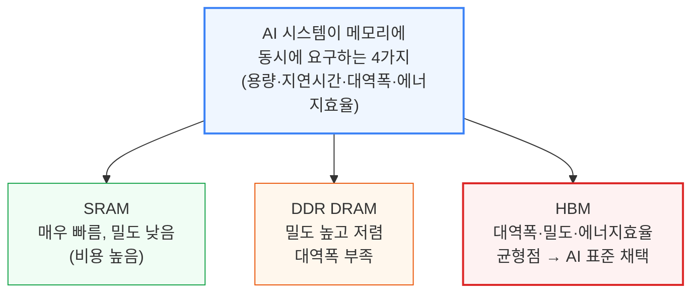
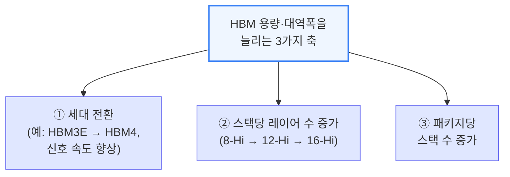
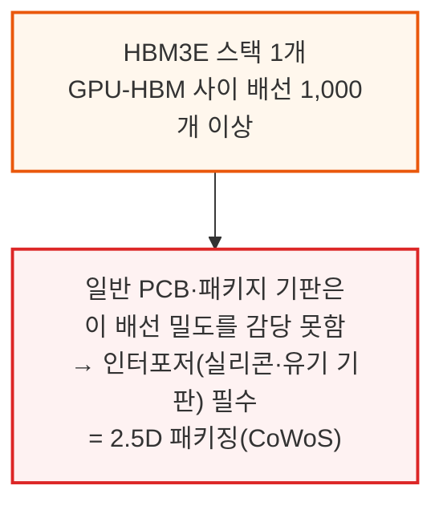
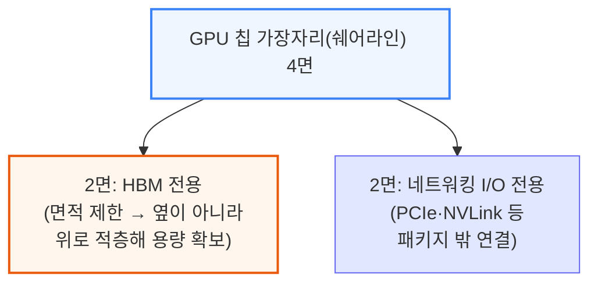
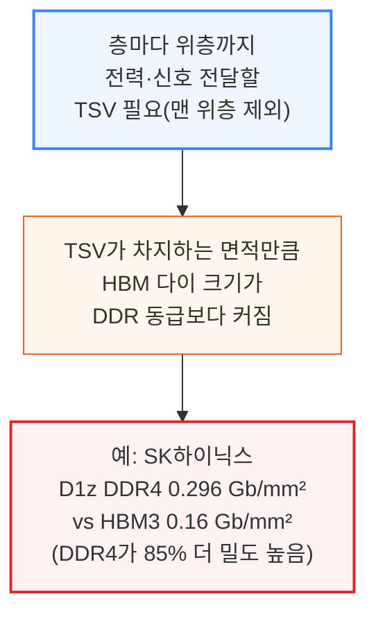
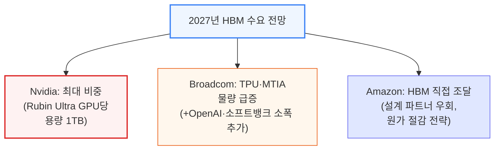
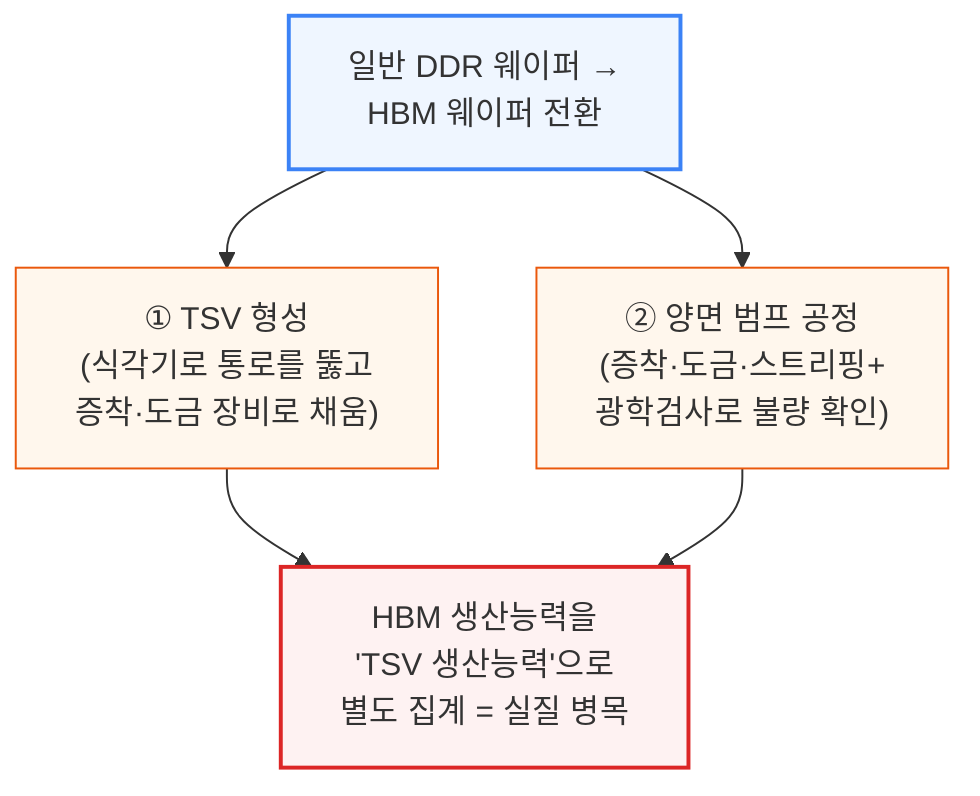

# Scaling the Memory Wall: The Rise and Roadmap of HBM

> **출처**: [SemiAnalysis Newsletter](https://newsletter.semianalysis.com/p/scaling-the-memory-wall-the-rise-and-roadmap-of-hbm)
> **저자**: Dylan Patel
> **발행일**: 2025-08-12

---

## 📑 목차

### 전체 섹션
 1. [서론: HBM이란 무엇이고 왜 필요한가](#1-서론-hbm이란-무엇이고-왜-필요한가)
 2. [HBM 구조 심화: 배선 밀도와 쉐어라인](#2-hbm-구조-심화-배선-밀도와-쉐어라인)
 3. [폭발하는 HBM 수요와 제조 공정 흐름](#3-폭발하는-hbm-수요와-제조-공정-흐름)
 4. [후공정 패키징 경쟁: MR-MUF vs TC-NCF](#4-후공정-패키징-경쟁-mr-muf-vs-tc-ncf)
 5. [수율의 진실: 전력배선망과 적층 수율](#5-수율의-진실-전력배선망과-적층-수율)
 6. [본딩 장비 전쟁: SK하이닉스와 한미반도체 갈등](#6-본딩-장비-전쟁-sk하이닉스와-한미반도체-갈등)
 7. [중국의 HBM 자립: CXMT와 화웨이](#7-중국의-hbm-자립-cxmt와-화웨이)
 8. [스택 높이 경쟁: 하이브리드 본딩을 할 것인가](#8-스택-높이-경쟁-하이브리드-본딩을-할-것인가)
 9. [AI 가속기가 메모리에 요구하는 것](#9-ai-가속기가-메모리에-요구하는-것)
10. [HBM의 실제 쓰임새: 추론, KV캐시 오프로드, 사전학습](#10-hbm의-실제-쓰임새-추론-kv캐시-오프로드-사전학습)
11. [대역폭이 용량을 이긴다: OpenAI의 역발상](#11-대역폭이-용량을-이긴다-openai의-역발상)
12. [쉐어라인 전쟁: 왜 메모리를 더 못 붙이는가](#12-쉐어라인-전쟁-왜-메모리를-더-못-붙이는가)
13. [HBM4의 혁명: 버스폭 2배와 커스텀 베이스 다이](#13-hbm4의-혁명-버스폭-2배와-커스텀-베이스-다이)
14. [베이스 다이 진화: 더 나은 PHY와 메모리 컨트롤러 오프로드](#14-베이스-다이-진화-더-나은-phy와-메모리-컨트롤러-오프로드)
15. [해안선 확장 전략: LPDDR·HBM 추가 적층과 I/O 확장](#15-해안선-확장-전략-lpddrhbm-추가-적층과-io-확장)
16. [베이스 다이의 미개척지: SRAM과 메모리 내 연산](#16-베이스-다이의-미개척지-sram과-메모리-내-연산)
17. [공급망 재편: 누가 설계하고 누가 마진을 가져가나](#17-공급망-재편-누가-설계하고-누가-마진을-가져가나)
18. [삼성의 분투와 HBM4 삼파전](#18-삼성의-분투와-hbm4-삼파전)

---

## 🔑 용어 정리

본문을 순서대로 읽기 전에 알아두면 좋은 용어들입니다. 자세한 수치와 설명은 본문에서 처음 등장하는 위치에 나옵니다.

- **HBM (고대역폭 메모리, High Bandwidth Memory)**: DRAM 칩을 여러 층으로 쌓아 GPU 바로 옆에 붙여, 좁은 면적에서 훨씬 넓은 통로로 데이터를 주고받게 만든 AI 전용 메모리
- **쉐어라인 (Shoreline)**: 칩 가장자리 중 데이터를 주고받는 배선(입출력)을 붙일 수 있는 면적 — 이 면적이 한정돼 있어 메모리와 다른 통신장치가 서로 자리를 다투게 됨
- **TSV (실리콘관통전극, Through-Silicon Via)**: HBM을 여러 층으로 쌓을 때, 아래층에서 위층으로 전력과 신호를 전달하기 위해 각 칩을 수직으로 뚫어 만드는 미세한 통로
- **베이스 다이 (Base Die)**: HBM 스택의 맨 아래에서 GPU와 DRAM 사이를 중계하는 역할을 하는 칩 — HBM4부터는 이 칩이 단순 중계용에서 첨단 로직 칩으로 격상되며 혁신의 무대가 됨
- **PHY (물리 계층 인터페이스, Physical Layer Interface)**: 칩과 칩 사이에서 실제로 전기 신호를 주고받는 회로 — 같은 배선 면적에서 얼마나 빠르고 효율적으로 신호를 보내는지를 좌우
- **MR-MUF (Mass Reflow Molded Underfill)**: SK하이닉스가 쓰는 HBM 적층 방식 — 여러 층을 한 번에 눌러 붙이고 틈새를 몰딩 재료로 채워, 발열을 더 잘 빼내고 생산 속도도 빠름
- **하이브리드 본딩 (Hybrid Bonding)**: 층과 층 사이에 범프(작은 금속 돌기) 없이 구리 면끼리 직접 붙이는 차세대 적층 기술 — 층을 더 얇고 촘촘하게 쌓을 수 있지만 수율 확보가 훨씬 어려움
- **KV캐시 (KVCache)**: AI 모델이 답변을 생성할 때, 이전 대화 맥락을 다시 계산하지 않도록 메모리에 저장해두는 중간 결과 — 대화가 길어질수록 이 저장량이 커져 메모리를 크게 압박함

---

## 1. 서론: HBM이란 무엇이고 왜 필요한가

**📌 핵심:**
- AI 시스템은 메모리에 **용량·지연시간·대역폭·에너지효율** 네 가지를 동시에 요구하는데, 메모리 종류마다 트레이드오프가 갈려 하나로 다 채우지 못함
- SRAM(초고속·저밀도·고비용), DDR DRAM(고밀도·저가·대역폭 부족) 사이에서 **HBM**이 대역폭·밀도·에너지효율의 균형점을 잡아 오늘날 학습·추론용 주요 AI 가속기 전부가 HBM을 채택
- HBM은 DDR5 대비 가격이 훨씬 비싸지만 수요는 여전히 강세이며, HBM 대신 다른 메모리로 대체를 시도한 아키텍처(Groq 등)는 실제로 성능이 확연히 떨어짐이 확인됨
- 결론: 세대마다 ① HBM 세대 전환 ② 스택당 레이어 수 ③ 패키지당 스택 수, 이 세 축으로 용량·대역폭을 동시에 늘리는 것이 업계 공통 전략이며, 이 리포트는 이 전략이 HBM4부터 어떻게 근본적으로 달라지는지와 삼성의 공급사 생존 가능성까지 추적

---

AI 모델이 복잡해질수록 AI 시스템은 더 큰 용량, 더 낮은 지연시간, 더 높은 대역폭, 더 나은 에너지효율을 가진 메모리를 요구합니다. 메모리마다 트레이드오프가 다릅니다.

HBM은 DRAM 칩을 수직으로 쌓고 매우 넓은 데이터 통로를 결합해, AI 워크로드에 최적인 대역폭·밀도·에너지효율의 균형을 제공합니다. 제조 원가가 훨씬 높아 DDR5 대비 가격 프리미엄이 붙지만 HBM 수요는 여전히 강합니다 — 학습·추론용으로 배치된 모든 주요 AI 가속기가 HBM을 사용하며, 다른 형태의 메모리에 의존하는 아키텍처는 [성능이 확연히 떨어짐이 이미 확인](https://semianalysis.com/2024/02/21/groq-inference-tokenomics-speed-but/)됐습니다.

가속기 로드맵 전반에서 공통으로 나타나는 흐름은 스택 수를 늘리고, 층수를 높이고, 더 빠른 세대의 HBM을 쓰는 세 가지 방법으로 칩당 메모리 용량·대역폭을 계속 확장하는 것입니다.

이 리포트에서는 HBM의 현재 상태, 공급망에서 벌어지는 일, 그리고 미래에 일어날 획기적인 변화를 살펴봅니다. AI 가속기 아키텍처에서 HBM이 맡는 결정적 역할, HBM이 DRAM 시장 전체에 미치는 영향, 그리고 왜 이것이 기존 메모리 시장 분석 방식 자체를 뒤엎고 있는지를 다룹니다. 아울러 삼성전자가 공급사로서 앞으로도 살아남을 수 있을지에 대한 핵심 질문과, HBM 용량 증가 추세를 되돌릴 수도 있는 한 가지 기술 변화도 짚습니다.

---

## 2. HBM 구조 심화: 배선 밀도와 쉐어라인

**📌 핵심:**
- HBM이 특별한 이유는 DRAM을 3D로 쌓은 것 이상으로, 일반 DRAM보다 **훨씬 넓은 데이터 통로(버스)**를 가졌다는 점 — 통로가 넓을수록 배선(핀) 수가 급증해 HBM3E 스택 하나만 해도 GPU와의 배선이 **1,000개 이상**
- 배선이 너무 촘촘해 일반 회로기판(PCB)에는 얹을 수 없어, 중간에 배선을 정리해주는 **인터포저**를 끼운 2.5D 패키징(CoWoS)이 필수
- HBM은 GPU 가장자리(**쉐어라인**) 중 딱 **2면**에만 붙을 수 있고 나머지 2면은 네트워킹 배선 몫이라 붙일 수 있는 면적이 제한적 → 그래서 용량은 옆이 아니라 **위로 쌓아서** 확보
- 결론: 위로 쌓으려면 층마다 전력·신호를 다음 층까지 전달하는 TSV(관통 전극)를 뚫어야 하는데, 이 통로가 차지하는 면적 때문에 HBM 칩은 같은 용량의 DDR 칩보다 더 큼(SK하이닉스 DDR4가 HBM3보다 단위면적당 용량 85% 더 높음) — 이 TSV 가공 장비가 일반 DRAM 웨이퍼를 HBM 웨이퍼로 "전환"하는 핵심 병목설비

---

HBM은 흔히 여러 DRAM 다이를 3DIC 방식으로 쌓은 것으로 알려져 있지만, 또 다른 핵심 특징은 평범한 신호 속도로도 대역폭을 끌어올리는 **훨씬 넓은 데이터 버스**입니다. 이 넓은 버스 때문에 HBM은 패키지당 대역폭에서 다른 어떤 메모리 형태보다도 압도적으로 우수합니다.

더 많은 입출력(I/O)을 갖는다는 것은 배선 밀도와 복잡성이 커진다는 뜻입니다. 입출력 하나마다 개별 배선이 필요하고, 전력·제어용 배선도 추가로 필요합니다.

데이터 전송의 지연시간과 에너지 소모를 줄이려면 HBM은 연산 엔진의 **쉐어라인**(칩 가장자리) 바로 옆에 붙어야 합니다. 이 때문에 쉐어라인의 가치가 높아지는데, HBM은 SoC의 2면에만 배치할 수 있고 나머지 2면은 패키지 밖으로 나가는 I/O용으로 남겨둬야 합니다.

이렇게 면적이 제한되니 충분한 용량을 확보하려면 메모리 다이를 수직으로 쌓아야 합니다. 3DIC 폼팩터를 구현하려면 스택의 각 층(맨 위층 제외)에 다음 층까지 전력과 신호를 전달할 수 있는 TSV가 있어야 합니다.

이 TSV 공정이 표준 DRAM과 HBM을 가르는 핵심 차이이며, 이 공정에 쓰이는 장비가 바로 일반 DDR DRAM 웨이퍼 생산능력을 HBM 생산능력으로 "전환"할 때의 주된 병목입니다. 후공정에서는 HBM을 총 9\~13층(로직 베이스 다이 위에 DRAM 8\~12층)까지 쌓아야 하는데, CoWoS와 함께 HBM은 첨단 패키징 기술을 업계 표준으로 끌어올렸고, MR-MUF 같은 한때 생소했던 패키징 기술도 이제는 업계 상식이 됐습니다.

**📌 용어 풀이: 인터포저와 CoWoS**
> - **인터포저**: 칩과 기판 사이에 끼워 넣는 얇은 중간판 — 너무 촘촘해서 기판에 직접 그릴 수 없는 배선을 대신 정리해주는 다리 역할
> - **CoWoS (Chip on Wafer on Substrate)**: TSMC의 2.5D 패키징 기술 — 로직 칩과 HBM을 인터포저 위에 나란히 얹어 하나의 패키지로 묶는 방식
> - **쉬운 비유**: 도로(배선)가 너무 많아 땅(기판)에 다 못 그릴 때, 입체 교차로(인터포저)를 하나 더 놓아 교통을 정리하는 것과 비슷

---

## 3. 폭발하는 HBM 수요와 제조 공정 흐름

**📌 핵심:**
- HBM 비트 수요는 AI 가속기 수요와 함께 폭발적으로 증가 중이며, 커스텀 ASIC이 급성장해도 2027년까지 HBM 수요의 최대 몫은 여전히 **Nvidia**(Rubin Ultra 한 칩만으로 GPU당 용량 1TB까지 확장)가 차지할 전망
- 그 뒤를 TPU·MTIA 물량이 급증하는 **Broadcom**이 잇고, OpenAI·소프트뱅크 프로젝트가 소폭 추가되며, **Amazon**은 설계 파트너를 거치지 않고 HBM을 직접 조달해 원가를 낮추는 전략으로 상위 구매자로 부상
- 일반 DDR 웨이퍼를 HBM 웨이퍼로 "전환"하는 것은 장비를 몇 가지 더 추가하는 문제 — ① TSV(관통 전극) 형성 장비(식각기·증착기·도금기), ② 양면 범프 공정(맨 위층 제외 모든 층에 필요)
- 결론: 그래서 업계는 HBM 생산능력을 아예 **"TSV 생산능력"**이라는 별도 단위로 집계하며, HBM 웨이퍼 공급을 늘리는 진짜 병목은 새 팹이 아니라 이 TSV·범프 전용 장비(식각·증착·도금·그라인더·임시본더 등) 확보 속도

---

AI 가속기 수요와 함께 HBM 비트 수요도 폭발적으로 성장해왔습니다. 커스텀 ASIC이 빠르게 부상하고 있음에도, 2027년까지 HBM 수요의 최대 비중은 여전히 공격적인 로드맵을 가진 Nvidia가 차지할 전망입니다(Rubin Ultra 한 칩만으로 GPU당 메모리 용량을 1TB까지 밀어붙임).

- **참고 자료**: 칩별 상세 비트 수요 전망은 SemiAnalysis **Accelerator Model**에서 확인 가능 — 메모리 공급사별 매출·비트 수요, 웨이퍼 투입량·TSV 생산능력, 세대별 HBM 가격까지 공급사별로 세분화해 추적

일반 DDR DRAM 생산능력이 HBM 생산능력으로 "전환"될 때 바뀌는 것은 주로 TSV 형성용 장비 추가와 범프 공정 확대(HBM 웨이퍼는 양면에 범프 처리, 3D 스택을 위한 것)입니다. 다만 맨 위층에 쓰이는 웨이퍼는 단면 범프만 필요하고 TSV 자체가 필요 없어 이 두 단계가 생략됩니다.

TSV를 만들려면 통로(비아)를 뚫는 식각기, 그 통로를 채우는 증착·도금 장비가 필요합니다. TSV를 겉으로 드러내려면 그라인더, 추가 식각 단계, 이 공정에 쓰이는 캐리어 웨이퍼를 붙이는 임시 본더도 필요합니다. 그래서 요즘 HBM 생산능력은 일반 웨이퍼 생산능력이 아니라 "TSV 생산능력"으로 따로 표현됩니다 — DDR 웨이퍼를 HBM 웨이퍼로 바꾸는 핵심 추가 공정이기 때문입니다. 범프 공정은 주로 증착·도금·스트리핑으로 이뤄지며, Camtek·Onto 같은 업체의 광학 검사 장비로 범프에 결함이 없는지, 형태가 올바른지 확인합니다.

---

*작성 진행률: 약 15% 완료*
*업데이트: 1\~3장(서론, HBM 구조 심화, 폭발하는 수요와 제조 공정) 작성 완료*

