# How AI Labs Are Solving the Power Crisis: The Onsite Gas Deep Dive

> **출처**: [SemiAnalysis Newsletter](https://newsletter.semianalysis.com/p/how-ai-labs-are-solving-the-power)
> **저자**: Ajey Pandey
> **발행일**: 2025-12-31

---

## 📑 목차

### 전체 섹션
 1. [서론: 전력망이 AI를 따라가지 못하는 이유](#1-서론-전력망이-ai를-따라가지-못하는-이유)
 2. [전력망이 구조적으로 느릴 수밖에 없는 이유](#2-전력망이-구조적으로-느릴-수밖에-없는-이유)
 3. [BYOG란 무엇인가: 옛 방식과 새 방식의 대결](#3-byog란-무엇인가-옛-방식과-새-방식의-대결)
 4. [발전 장비 지형도 개관](#4-발전-장비-지형도-개관)
 5. [항공유도 가스터빈(Aero)과 산업용 가스터빈(IGT)](#5-항공유도-가스터빈aero과-산업용-가스터빈igt)
 6. [왕복동 엔진(RICE)](#6-왕복동-엔진rice)
 7. [연료전지와 Bloom Energy의 부상](#7-연료전지와-bloom-energy의-부상)
 8. [대형 가스터빈과 복합화력(CCGT): 왜 너무 느린가](#8-대형-가스터빈과-복합화력ccgt-왜-너무-느린가)
 9. [배치 전략: 브릿지 전력, 이중화 설계, 부하 변동 대응](#9-배치-전략-브릿지-전력-이중화-설계-부하-변동-대응)
10. [가스터빈을 충분히 만들 수 있는가: 공급망 병목](#10-가스터빈을-충분히-만들-수-있는가-공급망-병목)
11. [새로운 진입자들: 제트기와 선박에서 온 발전기](#11-새로운-진입자들-제트기와-선박에서-온-발전기)
12. [온사이트 전력 TCO 분석과 그리드 재연결 후 활용 전략](#12-온사이트-전력-tco-분석과-그리드-재연결-후-활용-전략)
13. [승자는 누구인가: 제조사별 경쟁 구도](#13-승자는-누구인가-제조사별-경쟁-구도)
14. [다음 병목: 건설 지원 생태계](#14-다음-병목-건설-지원-생태계)

---

## 🔑 용어 정리

본문을 순서대로 읽기 전에 알아두면 좋은 용어들입니다. 자세한 수치와 설명은 본문에서 처음 등장하는 위치에 나옵니다.

- **BYOG (Bring Your Own Generation)**: 전력회사의 그리드 연결을 기다리지 않고, 데이터센터 부지에 직접 발전 설비를 지어 전력을 자체 조달하는 전략
- **항공유도 가스터빈 (Aeroderivative, "Aero")**: 여객기 제트엔진을 땅 위에 고정해 발전기로 개조한 것. 가볍고 빠르게 설치 가능
- **산업용 가스터빈 (Industrial Gas Turbine, IGT)**: 처음부터 지상 고정용으로 설계된 가스터빈. 항공유도보다 저렴하지만 기동이 느림
- **RICE (왕복동 엔진, Reciprocating Internal Combustion Engine)**: 자동차 엔진처럼 피스톤이 왕복 운동하며 전기를 만드는 엔진. 터빈보다 작고 유연하게 운영 가능
- **연료전지 (SOFC, Solid Oxide Fuel Cell)**: 연소 과정 없이 화학 반응만으로 천연가스에서 전기를 뽑아내는 방식. Bloom Energy의 핵심 기술
- **CCGT (복합화력발전, Combined-Cycle Gas Turbine)**: 가스터빈이 내뿜는 뜨거운 배기가스로 증기터빈을 한 번 더 돌려, 같은 연료로 전기를 두 번 뽑아내는 고효율 발전 방식
- **오버빌드 (Overbuild)**: 그리드 수준의 가동률(신뢰성)을 맞추기 위해, 실제 필요한 용량보다 더 많은 발전 설비를 지어두는 것
- **TCO (총소유비용, Total Cost of Ownership)**: 초기 설치비(자본 지출)와 운영비를 모두 합친 전체 비용

---

## 1. 서론: 전력망이 AI를 따라가지 못하는 이유

**📌 핵심:**
- 텍사스에서만 매달 수십 GW(기가와트)의 데이터센터 전력 신청이 몰리지만, 최근 1년간 승인된 용량은 1GW 남짓 → **그리드(전력망)가 사실상 매진**
- AI 클라우드는 1GW당 연 100~120억 달러 매출 → 데이터센터 가동을 6개월만 앞당겨도 수십억 달러 이득 → 그리드 연결을 기다릴 경제적 여유가 없음
- xAI는 그리드를 건너뛰고 트럭에 실린 이동식 가스터빈·엔진으로 100,000개 GPU 클러스터를 **4개월** 만에 가동 → 이미 500MW 넘는 터빈을 자체 배치
- 결론: "속도가 곧 해자(moat)"인 AI 시대에 전력망을 기다리지 않고 직접 발전하는 **BYOG(자가 발전, Bring Your Own Generation)** 전략이 업계 표준으로 확산 중

---

SemiAnalysis는 약 2년 전 이미 전력 부족을 예측했습니다. 미국 AI 전력 수요가 2023년 약 3GW에서 2026년 28GW 이상으로 늘어나 미국의 전력 공급망을 압도할 것이라는 예측이었고, 실제로 정확히 들어맞았습니다.

- 텍사스(ERCOT)만 봐도 매달 수십 GW 규모의 데이터센터 전력 신청이 쏟아지지만, 최근 12개월간 승인된 용량은 1GW를 겨우 넘는 수준 → 신청 대비 승인 비율이 극히 낮아 "그리드가 매진(sold out)"된 상태
- AI 인프라는 그리드의 다년간 송전 설비 증설을 기다릴 수 없음: AI 클라우드는 1GW당 연간 100~120억 달러의 매출을 냄 → 400MW 데이터센터를 6개월 일찍 가동하는 것만으로도 수십억 달러 가치가 있음
- 경제적 필요가 "과부하된 그리드" 같은 문제보다 훨씬 크기 때문에, 업계는 이미 새로운 해법을 찾고 있음

18개월 전, 일론 머스크는 10만 개 GPU 클러스터를 단 4개월 만에 지어 업계를 놀라게 했습니다. 여러 혁신이 있었지만, 가장 인상적인 부분은 에너지 전략이었습니다.

- xAI는 그리드를 완전히 건너뛰고, 트럭에 실을 수 있는 이동식 가스터빈·엔진으로 데이터센터 부지에서 직접 전력을 생산
- 이미 500MW 넘는 터빈을 자체 데이터센터 인근에 배치 완료
- "기가와트급 데이터센터를 가장 먼저 짓는 경쟁"에서는 속도 자체가 경쟁 우위(해자)가 됨

하이퍼스케일러와 AI 랩들이 하나둘씩 xAI를 따라 그리드를 일시적으로 포기하고 자체 발전소를 짓고 있습니다. 2025년 10월, OpenAI와 Oracle은 텍사스에 2.3GW 규모 발전 설비를 발주하며 역대 최대 규모의 온사이트 가스 발전 계약을 체결했습니다. 온사이트 가스 발전 시장은 이제 연간 세 자릿수(triple-digit) 성장률에 진입하고 있습니다.

수혜자는 기존 대형 터빈 제조사에 그치지 않습니다. GE Vernova와 Siemens Energy 주가가 급등한 것은 물론, 전례 없는 신규 진입자들이 몰려들고 있습니다.

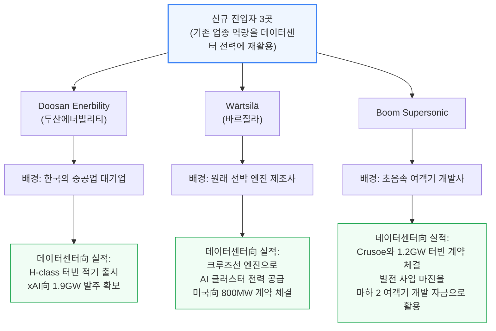
```mermaid
flowchart TD
    NewEntrants1["신규 진입자 3곳<br/>(기존 업종 역량을 데이터센터 전력에 재활용)"] --> Doosan["Doosan Enerbility<br/>(두산에너빌리티)"]
    NewEntrants1 --> Wartsila1["Wärtsilä<br/>(바르질라)"]
    NewEntrants1 --> Boom1["Boom Supersonic"]

    Doosan --> DoosanBg["배경: 한국의 중공업 대기업"]
    DoosanBg --> DoosanResult["데이터센터向 실적:<br/>H-class 터빈 적기 출시<br/>xAI向 1.9GW 발주 확보"]

    Wartsila1 --> WartsilaBg["배경: 원래 선박 엔진 제조사"]
    WartsilaBg --> WartsilaResult["데이터센터向 실적:<br/>크루즈선 엔진으로<br/>AI 클러스터 전력 공급<br/>미국向 800MW 계약 체결"]

    Boom1 --> BoomBg["배경: 초음속 여객기 개발사"]
    BoomBg --> BoomResult["데이터센터向 실적:<br/>Crusoe와 1.2GW 터빈 계약 체결<br/>발전 사업 마진을<br/>마하 2 여객기 개발 자금으로 활용"]

    style NewEntrants1 fill:#eff6ff,stroke:#3b82f6,stroke-width:2px
    style DoosanResult fill:#f0fdf4,stroke:#16a34a
    style WartsilaResult fill:#f0fdf4,stroke:#16a34a
    style BoomResult fill:#f0fdf4,stroke:#16a34a
```

SemiAnalysis의 Datacenter Industry Model로 건물 단위까지 추적한 결과, **미국에서만 12개 서로 다른 공급업체가 각각 400MW 이상의 데이터센터向 온사이트 가스 발전 수주**를 확보한 것으로 나타났습니다. 불과 2~3년 전만 해도 이 시장은 GE Vernova와 Siemens Energy 두 곳이 사실상 전부였습니다.

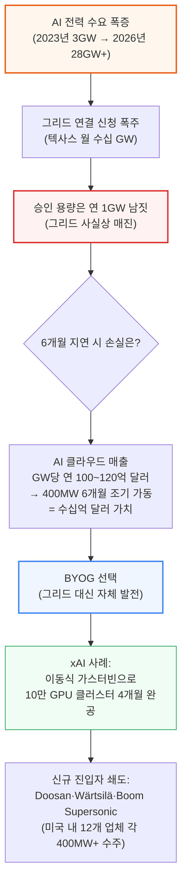
```mermaid
flowchart TD
    Demand["AI 전력 수요 폭증<br/>(2023년 3GW → 2026년 28GW+)"] --> Queue["그리드 연결 신청 폭주<br/>(텍사스 월 수십 GW)"]
    Queue --> Bottleneck["승인 용량은 연 1GW 남짓<br/>(그리드 사실상 매진)"]

    Bottleneck --> Cost{"6개월 지연 시 손실은?"}
    Cost --> Revenue["AI 클라우드 매출<br/>GW당 연 100~120억 달러<br/>→ 400MW 6개월 조기 가동<br/>= 수십억 달러 가치"]

    Revenue --> BYOG["BYOG 선택<br/>(그리드 대신 자체 발전)"]
    BYOG --> xAI["xAI 사례:<br/>이동식 가스터빈으로<br/>10만 GPU 클러스터 4개월 완공"]

    xAI --> NewPlayers["신규 진입자 쇄도:<br/>Doosan·Wärtsilä·Boom Supersonic<br/>(미국 내 12개 업체 각 400MW+ 수주)"]

    style Demand fill:#fff7ed,stroke:#ea580c,stroke-width:2px
    style Bottleneck fill:#fef2f2,stroke:#dc2626,stroke-width:2px
    style BYOG fill:#eff6ff,stroke:#3b82f6,stroke-width:2px
    style xAI fill:#f0fdf4,stroke:#16a34a
```

그러나 온사이트 발전에도 문제는 있습니다. 전력 비용은 그리드보다 (종종 훨씬) 비싸고, 인허가는 길고 복잡한 절차를 거쳐야 하며, 실제로 일부 데이터센터 일정이 지연되는 원인이 되고 있습니다. 대표적으로 Oracle/Stargate의 기가와트급 시설 하나가 인허가 문제로 지연되었는데, SemiAnalysis는 이를 언론 보도 3주 전에 이미 인허가 진행 상황 분석으로 예측한 바 있습니다.

xAI 같은 영리한 기업은 이런 문제에도 해법을 찾았습니다. 일론 머스크의 AI 랩은 두 개 주(州)의 경계에 부지를 선정하는 새로운 전략을 시도했습니다 — 인허가를 더 빨리 받을 수 있는 확률을 높이기 위해서입니다. 실제로 테네시주는 제때 인허가를 내주지 못했지만, 미시시피주는 기가와트급 발전소 건설을 흔쾌히 허가했습니다.

이 보고서는 BYOG(자가 발전)에 대한 심층 분석입니다. 왜 그리드가 AI 수요를 따라가지 못하는지부터 시작해, 데이터센터가 쓸 수 있는 모든 발전 기술 — GE Vernova의 항공유도 터빈, Siemens의 산업용 터빈, Jenbacher의 고속 엔진, Wärtsilä의 중속 엔진, Bloom Energy의 연료전지 등 — 을 기술적으로 분해합니다. 이어서 완전 독립형(islanded) 데이터센터, 가스+배터리 하이브리드, Energy-as-a-Service 모델 등 배치 방식과 운영상의 과제, 그리고 어떤 솔루션이 승리할지를 가르는 경제성을 살펴봅니다.

---

## 2. 전력망이 구조적으로 느릴 수밖에 없는 이유

**📌 핵심:**
- 전력망은 수요와 공급을 매초 거의 완벽하게 맞춰야 하는 시스템 → 큰 신규 부하(데이터센터) 하나가 들어올 때마다 안정성 검증을 위한 정밀 엔지니어링 연구가 필요
- 개발업체들이 여러 전력회사에 동시에 "일단 신청부터" 하는 투기적 신청 폭주 → 신청 큐가 막히고 이는 다시 투기적 신청을 부추기는 악순환 (예: AEP Ohio 신청량 35GW 중 68%가 부지 확보조차 안 된 상태)
- 신규 발전 설비가 신청부터 상업 가동까지 걸리는 기간은 평균 **5년** → AI 인프라는 5년은커녕 6개월도 기다릴 수 없음 (6개월 지연 = 수십억 달러 손실)
- 결론: 그리드가 느린 것은 관리 부실이 아니라 "실시간 안정성"이라는 물리적 요구사항 때문 → 이 구조적 한계가 BYOG를 선택지가 아닌 필수로 만듦

---

전력망이 왜 AI 수요를 따라가지 못하는지 이해하려면, 먼저 그리드가 느릴 수밖에 없는 두 가지 구조적 이유를 알아야 합니다.

1. **실시간 균형(Real-time balancing)**: 전기는 저장이 어려워 공급과 수요가 매초 거의 완벽히 일치해야 합니다. 이 균형이 무너지면 수백만 명이 정전을 겪을 수 있습니다 — 2025년 4월 이베리아 반도(스페인·포르투갈) 대정전이 그 사례입니다.
2. **시스템 연구(System studies)**: 새로운 대형 부하(데이터센터)나 공급(발전소)이 하나 들어올 때마다, 그리드를 불안정하게 만들지 않는지 확인하는 정밀 엔지니어링 연구가 필요합니다. 일부 지역에서는 그리드 구조가 너무 빨리 바뀌어 연구 결과가 완료되기도 전에 낡은 자료가 되어버립니다.

수백 개의 개발업체가 동시에 계통연계(interconnection) 신청을 낼 때, 시스템은 정체됩니다. 이는 일종의 "죄수의 딜레마"가 됩니다.

- 모두가 조율한다면 그리드는 더 많은 신청을 더 빨리 처리할 수 있음 → FERC(미국 연방에너지규제위원회) Order 2023이 이를 위해 **클러스터 스터디(cluster studies, 여러 신청을 묶어 한 번에 검토)** 방식을 도입하도록 밀어붙였지만, 이 개혁이 실제로 자리 잡은 것은 2025년부터
- 하지만 현실에서는 "골드러시" 행태가 나타남: 개발업체들이 여러 전력회사에 동시에 투기적으로 신청을 넣음 → 예를 들어 2024년 중반 기준 AEP Ohio에는 35GW의 신청이 쌓였는데, 이 중 68%는 부지 확보조차 되지 않은 상태였음
- 투기적 신청이 모두를 위한 큐를 막아버리면 → 다른 곳에서도 투기적 신청이 더 늘어남 → 악순환이 가속

공급 측면도 마찬가지로 제약이 큽니다. 계통연계 신청부터 상업 가동까지 걸리는 시간은 대부분의 발전 유형에서 이제 **5년**으로 늘어났습니다.

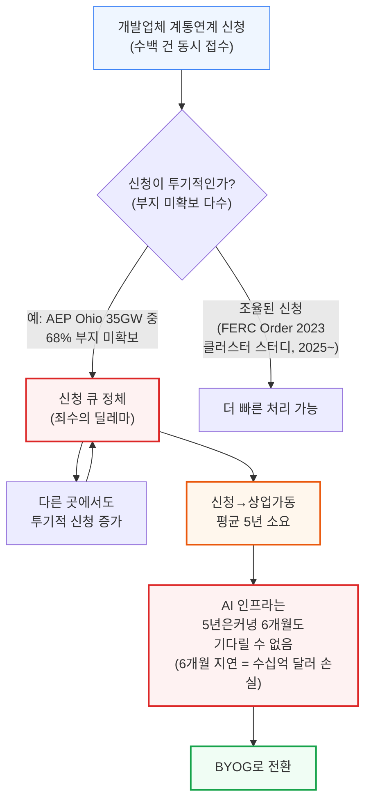
```mermaid
flowchart TD
    Request["개발업체 계통연계 신청<br/>(수백 건 동시 접수)"] --> Speculative{"신청이 투기적인가?<br/>(부지 미확보 다수)"}

    Speculative -->|"예: AEP Ohio 35GW 중<br/>68% 부지 미확보"| Clog["신청 큐 정체<br/>(죄수의 딜레마)"]
    Clog --> MoreSpeculative["다른 곳에서도<br/>투기적 신청 증가"]
    MoreSpeculative --> Clog

    Speculative -->|"조율된 신청<br/>(FERC Order 2023<br/>클러스터 스터디, 2025~)"| Faster["더 빠른 처리 가능"]

    Clog --> FiveYears["신청→상업가동<br/>평균 5년 소요"]
    FiveYears --> CantWait["AI 인프라는<br/>5년은커녕 6개월도<br/>기다릴 수 없음<br/>(6개월 지연 = 수십억 달러 손실)"]

    CantWait --> BYOG["BYOG로 전환"]

    style Request fill:#eff6ff,stroke:#3b82f6
    style Clog fill:#fef2f2,stroke:#dc2626,stroke-width:2px
    style FiveYears fill:#fff7ed,stroke:#ea580c,stroke-width:2px
    style CantWait fill:#fef2f2,stroke:#dc2626,stroke-width:2px
    style BYOG fill:#f0fdf4,stroke:#16a34a,stroke-width:2px
```

**📌 용어 풀이: 계통연계(Interconnection)와 클러스터 스터디**
> - **계통연계 신청**: 발전소나 대형 부하(데이터센터)를 그리드에 연결하기 전에 반드시 거쳐야 하는 공식 신청 및 심사 절차
> - **클러스터 스터디**: 개별 신청을 하나씩 따로 심사하는 대신, 여러 신청을 묶어서 한꺼번에 그리드 영향을 분석하는 방식 → 처리 속도를 높이기 위한 개혁
> - **쉬운 비유**: 놀이공원에서 사람들이 한 명씩 표를 사면 줄이 끝없이 늘어나지만, 단체로 묶어서 한 번에 처리하면 줄이 훨씬 빨리 줄어드는 것과 같음

### BYOG 등장: 그리드를 기다리지 않고 시작한다

BYOG(자가 발전)의 핵심 가치 제안은 단순합니다: **그리드를 기다리지 않고 가동을 시작한다.** 데이터센터는 자체 발전만으로 무기한 운영할 수 있고, 나중에 그리드 서비스가 들어오면 그 발전 설비를 백업 전원으로 전환하면 됩니다.

이것이 정확히 xAI의 전략이었습니다. 이들은 이동식 가스터빈으로 Colossus를 지어, 수년이 아닌 몇 개월 만에 시설을 가동했습니다. 이제 모든 기업이 이 방식을 따라 하고 있습니다. 다음 섹션에서 구체적인 방법을 살펴봅니다.

---

## 3. BYOG란 무엇인가: 옛 방식과 새 방식의 대결

**📌 핵심:**
- 기존 발전 방식(CCGT, 복합화력)은 연료 효율 60% 이상으로 우수하지만, 대형 터빈 발주부터 배송까지 수년 + 건설·시운전까지 약 2년 → **AI 시대에는 영겁의 시간**
- xAI는 트럭으로 운반 가능한 16MW급 소형 터빈(Solar Turbines)을 **구매 대신 임대**하여 소요 시간을 우회, 몇 주 만에 배치 완료
- Meta는 오하이오 공장에서 5종류나 되는 서로 다른 터빈·엔진을 뒤섞어 사용 → "제때 구할 수 있는 건 뭐든 쓴다"는 전략
- 결론: BYOG는 "큰 발전소 하나"가 아니라 "빨리 구할 수 있는 작은 발전기 여러 대"로 전력을 조달하는 완전히 다른 사고방식

---

BYOG는 발전소를 짓는 방식 자체를 완전히 재검토하는 작업입니다. 전통적으로 전력은 대형·중앙집중식 기가와트급 기저부하(baseload) 발전기가 공급하고, 그리드 전체의 부하 급증에 대응하는 소형 피커(peaker) 발전소가 이를 보조합니다. 복합화력(CCGT) 모드의 대형 가스터빈이 가장 흔한 현대적 방식이며, 60%가 넘는 뛰어난 연료 효율로 현대 문명의 근간을 지탱해 왔습니다.

하지만 이 방식의 가장 큰 문제는 **배치 속도**입니다.

- 대형 터빈은 일반적으로 발주부터 인도까지 수년이 걸리며, 현재 소요 시간은 역대 최고 수준
- 인도된 이후에도 대형 복합화력 발전소의 건설·시운전에는 **약 2년**이 걸림 — AI 시대에는 영겁(eternity)의 시간

AI 데이터센터의 BYOG 발전소는 이 공식을 완전히 뒤집었고, xAI가 업계에 그 방법을 보여주었습니다. 더 빠르게 배치하기 위해, 일론 머스크의 AI 랩은 CAT(Caterpillar) 자회사 Solar Turbines의 소형 모듈형 16MW 터빈을 사용했습니다.

- 이 터빈들은 일반 장거리 트럭으로 운반 가능할 만큼 작아서, 몇 주 만에 배치 완료
- 일론 머스크는 이 터빈을 **구매조차 하지 않고**, Solaris Energy Infrastructure로부터 **임대**해 장비 소요 시간(lead time) 자체를 우회
- 또한 VoltaGrid의 트럭 탑재형 이동식 가스 엔진 함대를 활용해 배치 속도를 더욱 높임

다른 하이퍼스케일러들도 빠르게 뒤를 따랐습니다. Meta가 Williams와 함께 오하이오에 구축한 발전소는 5가지 서로 다른 종류의 터빈·엔진으로 구성되어 있는데, 이는 명백히 "제때 구할 수 있는 건 뭐든 배치한다"는 설계 철학을 보여줍니다.

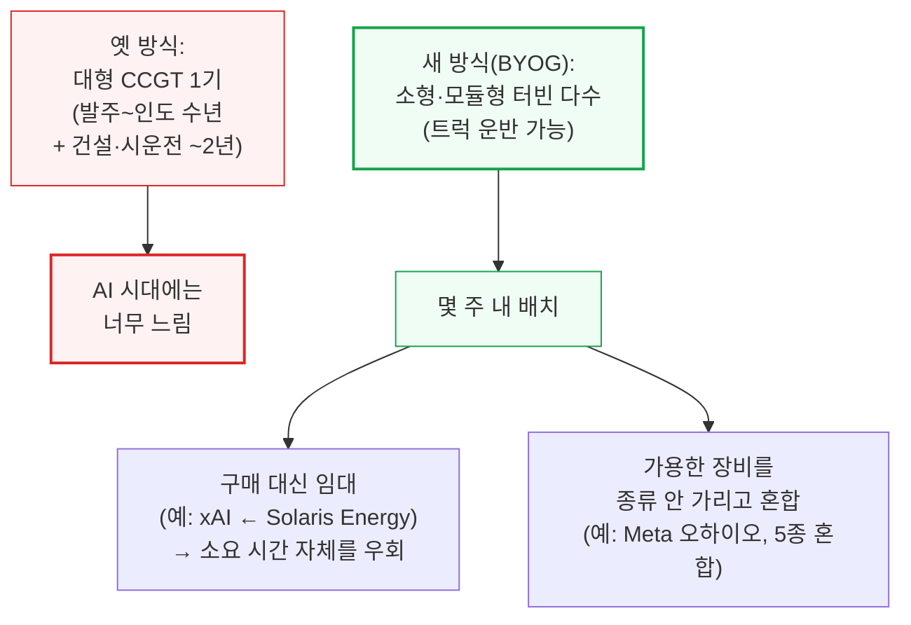
```mermaid
flowchart TD
    OldWay["옛 방식:<br/>대형 CCGT 1기<br/>(발주~인도 수년<br/>+ 건설·시운전 ~2년)"] --> Slow["AI 시대에는<br/>너무 느림"]

    NewWay["새 방식(BYOG):<br/>소형·모듈형 터빈 다수<br/>(트럭 운반 가능)"] --> Fast["몇 주 내 배치"]

    Fast --> Rent["구매 대신 임대<br/>(예: xAI ← Solaris Energy)<br/>→ 소요 시간 자체를 우회"]
    Fast --> Mix["가용한 장비를<br/>종류 안 가리고 혼합<br/>(예: Meta 오하이오, 5종 혼합)"]

    style OldWay fill:#fef2f2,stroke:#dc2626
    style Slow fill:#fef2f2,stroke:#dc2626,stroke-width:2px
    style NewWay fill:#f0fdf4,stroke:#16a34a,stroke-width:2px
    style Fast fill:#f0fdf4,stroke:#16a34a
```

---

## 4. 발전 장비 지형도 개관

**📌 핵심:**
- 데이터센터가 쓸 수 있는 발전 장비는 크게 **가스터빈(GT)**, **왕복동 엔진(RICE)**, **고체산화물 연료전지(SOFC)** 3가지로 나뉨
- 장비 선택 시 비교해야 할 6가지 기준: 비용, 소요 시간, 이중화(백업), 기동 속도(램프 속도), 부지 면적, 연료 효율
- 그리드 평균 가동률은 99.93%("3개의 9") → 온사이트 발전소가 이 수준을 맞추려면 백업 설비를 추가로 쌓아야 함(=비용 증가)
- 결론: 스펙보다 "누가 주문을 빨리 받아줄 수 있는가"가 실제 계약을 좌우하는 경우가 많음

---

데이터센터 개발업체가 쓸 수 있는 가스 발전기는 크게 세 범주로 나뉩니다. 이 밖에도 기존 원자력 발전소 부지 공유, 온사이트 SMR(소형 모듈 원자로), 지열 발전 등의 선택지가 있지만, 대부분 향후 약 3년간 순증 발전 용량에 큰 영향을 주지 못해 이 보고서에서는 다루지 않습니다.

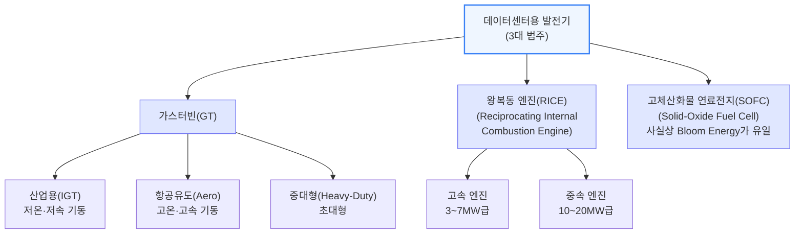
```mermaid
flowchart TD
    Options["데이터센터용 발전기<br/>(3대 범주)"] --> GT["가스터빈(GT)"]
    Options --> RICE["왕복동 엔진(RICE)<br/>(Reciprocating Internal<br/>Combustion Engine)"]
    Options --> SOFC["고체산화물 연료전지(SOFC)<br/>(Solid-Oxide Fuel Cell)<br/>사실상 Bloom Energy가 유일"]

    GT --> IGT["산업용(IGT)<br/>저온·저속 기동"]
    GT --> Aero["항공유도(Aero)<br/>고온·고속 기동"]
    GT --> Heavy["중대형(Heavy-Duty)<br/>초대형"]

    RICE --> HighSpeed["고속 엔진<br/>3~7MW급"]
    RICE --> MedSpeed["중속 엔진<br/>10~20MW급"]

    style Options fill:#eff6ff,stroke:#3b82f6,stroke-width:2px
    style GT fill:#e0e7ff,stroke:#6366f1
    style RICE fill:#e0e7ff,stroke:#6366f1
    style SOFC fill:#e0e7ff,stroke:#6366f1
```

어떤 솔루션이 어떤 상황에 맞는지 이해하려면, 6가지 핵심 비교 기준과 각 기준이 실제로 무엇을 의미하는지 파악해야 합니다.

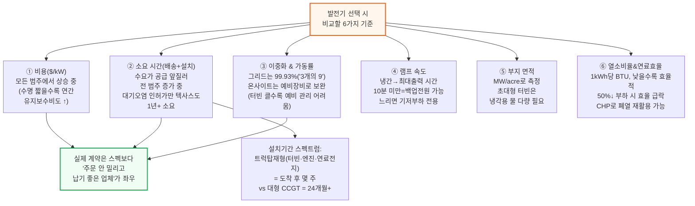
```mermaid
flowchart TD
    Criteria["발전기 선택 시<br/>비교할 6가지 기준"] --> Cost["① 비용($/kW)<br/>모든 범주에서 상승 중<br/>(수명 짧을수록 연간<br/>유지보수비도 ↑)"]
    Criteria --> LeadTime["② 소요 시간(배송+설치)<br/>수요가 공급 앞질러<br/>전 범주 증가 중<br/>대기오염 인허가만 텍사스도<br/>1년+ 소요"]
    Criteria --> Uptime["③ 이중화 & 가동률<br/>그리드는 99.93%('3개의 9')<br/>온사이트는 예비장비로 보완<br/>(터빈 클수록 예비 관리 어려움)"]
    Criteria --> Ramp["④ 램프 속도<br/>냉간→최대출력 시간<br/>10분 미만=백업전원 가능<br/>느리면 기저부하 전용"]
    Criteria --> Land["⑤ 부지 면적<br/>MW/acre로 측정<br/>초대형 터빈은<br/>냉각용 물 다량 필요"]
    Criteria --> HeatRate["⑥ 열소비율&연료효율<br/>1kWh당 BTU, 낮을수록 효율적<br/>50%↓ 부하 시 효율 급락<br/>CHP로 폐열 재활용 가능"]

    LeadTime --> Range["설치기간 스펙트럼:<br/>트럭탑재형(터빈·엔진·연료전지)<br/>= 도착 후 몇 주<br/>vs 대형 CCGT = 24개월+"]

    Cost --> Verdict["실제 계약은 스펙보다<br/>'주문 안 밀리고<br/>납기 좋은 업체'가 좌우"]
    LeadTime --> Verdict
    Uptime --> Verdict

    style Criteria fill:#fff7ed,stroke:#ea580c,stroke-width:2px
    style Verdict fill:#f0fdf4,stroke:#16a34a,stroke-width:2px
```

**📌 용어 풀이: 그리드의 "3개의 9(three nines)"**
> - 99.93% 가동률 = 1년(8,760시간) 중 정전 시간이 약 6시간 정도라는 뜻
> - "나인(nine)" 하나가 늘어날 때마다(99.9%→99.99%) 허용 정전 시간은 10분의 1로 줄어듦
> - 온사이트 발전소가 이 수준을 맞추려면, 발전기를 필요량보다 많이 지어두는 "오버빌드"가 필수 → 이것이 온사이트 발전 비용이 그리드보다 비싼 핵심 이유 (9번 섹션에서 자세히 다룸)

---

## 5. 항공유도 가스터빈(Aero)과 산업용 가스터빈(IGT)

**📌 핵심:**
- 항공유도 가스터빈(Aero)은 **여객기 제트엔진을 땅에 고정한 것**과 같음 → 가볍고 빠르게 배치 가능, 초기 투자 $1,700~2,000/kW, 소요 시간 18~36개월(상승 중)
- 산업용 가스터빈(IGT)은 처음부터 지상용으로 설계 → Aero보다 저렴($1,500~1,800/kW)하지만 기동은 더 느림, 소요 시간 12~36개월
- Aero·IGT 모두 "적당한 크기 + 빠른 기동 + 트럭 운반 가능"이라는 3박자를 갖춰 데이터센터에 가장 매력적인 선택지로 꼽힘
- 결론: 가장 큰 병목은 터빈 날개에 들어가는 희귀 합금(로듐·코발트·이트륨 등) 공급 부족 → 이트륨은 중국의 수출 통제 품목이라 지정학적 리스크까지 겹침

---

가스터빈은 **브레이턴 사이클(Brayton Cycle)**로 작동합니다: 공기를 압축하고, 그 안에서 연료를 태운 뒤, 뜨거운 가스를 터빈에 통과시켜 전기를 만드는 원리입니다. 터빈들은 **연소가스 입구 온도(inlet temperature)**로 서로 구분됩니다. 온도가 낮을수록 설치비·유지보수비는 낮지만, 최고 효율과 기동 속도도 함께 낮아집니다.

### 항공유도 가스터빈(Aeroderivative, "Aero")

항공유도 가스터빈은 말 그대로 **제트엔진을 땅에 볼트로 고정한 것**입니다. GE Vernova의 Aero는 GE 제트엔진에서, Mitsubishi Power는 Pratt & Whitney에서, Siemens Energy는 Rolls-Royce에서 파생되었습니다. 제트엔진은 원래 좁고 가벼운 기체 안에서 막대한 출력을 내도록 설계되었기 때문에, 지상 고정용으로 개조하기 비교적 쉽습니다 — 터빈 축을 늘리고, 끝에 발전기 코일을 붙이고, 흡기·배기 소음기를 추가하고, 탱크나 파이프라인에서 연료를 공급하면 됩니다. Boom Supersonic이 항공유도 가스터빈 사업에 그토록 빠르게 진출할 수 있었던 것도, 상당 부분의 설계·제조 역량을 그대로 가져올 수 있었기 때문입니다.

전력회사들은 이미 오래전부터 Aero를 "피커 발전소(peaker plant)"로 사용해 왔습니다 — 그리드에 갑자기 공급 부족이 생겼을 때 대응하는 용도입니다 (예: Martin Drake 발전소, GE Vernova LM2500XPRESS 6기 구성).

Aero의 핵심 제조사는 중대형 가스터빈과 마찬가지로 **GE Vernova, Mitsubishi Power, Siemens Energy**가 시장을 주도하며, 이들은 저온형 **산업용 가스터빈(IGT)**도 함께 판매합니다. 여기에 Caterpillar(Solar 브랜드)와 Everllence(구 MAN Energy Systems)도 IGT를 생산합니다.

GE Vernova의 두 모델이 Aero 시장을 장악하고 있습니다.
- **LM2500** — 약 34MW, 빠른 배치에 최적화(특히 LM2500XPRESS 버전)
- **LM6000** — 약 57MW, 빠른 배치용 LM6000VELOX 버전도 존재

Aero는 연료 효율은 준수하지만 공간·무게 효율이 매우 뛰어납니다. 좁은 부지에도 들어가고, 일부 구성은 트레일러 두 대로 운반 가능합니다. 단순 사이클 Aero는 보통 30~60MW급으로 나오며, 냉간 기동에서 최대 출력까지 5~10분이면 도달합니다. 다만 완전 부하 상태가 아니면 효율이 떨어집니다. Aero는 소형 복합화력(combined-cycle) 구성도 가능합니다.

- **1x1**: 가스터빈 1대가 증기터빈 1대를 구동
- **2x1**: 가스터빈 2대가 증기터빈 1대를 구동

이런 복합화력 구성은 효율과 출력을 높이는 대신 기동 속도를 희생합니다 — 기동 시간이 30~60분으로 늘어납니다.

현재 시세로 Aero는 자본 지출 기준 **$1,700~2,000/kW**이며, 최근 발주 기준 소요 시간은 **18~36개월로 상승 중**입니다. 소형 터빈은 12개월까지 짧아질 수 있고, 대형(~50MW) Aero는 36개월까지 걸릴 수 있습니다. 설치 자체는 빠르지만(보통 2~4주), 공장은 이미 주문이 꽉 차 있습니다. 하나의 대안은 트럭 탑재형 터빈을 임대하는 것 — xAI가 Solaris Energy Infrastructure와 손잡고 Colossus 1·2의 조달 시간을 줄인 바로 그 전략입니다.

### 산업용 가스터빈(Industrial Gas Turbines, IGT)

산업용 가스터빈은 Aero와 같은 사이클로 작동하며, 좁은 설치 면적·모듈화·상대적으로 빠른 소요 시간이라는 장점을 공유합니다. 하지만 항공기용을 개조한 것이 아니라 처음부터 지상 고정용으로 설계되었습니다. 대체로 더 낮은 입구 온도와 더 단순한 설계를 사용해 정비 비용은 낮추지만, 그 대가로 효율과 기동 속도를 희생합니다.

단순 사이클 IGT는 대략 5~50MW 범위이며, 냉간 기동에서 최대 출력까지 약 20분이 걸립니다. 이는 배터리나 디젤 유닛의 도움 없이는 피커 발전소나 비상 백업으로 쓰기엔 너무 느린 속도입니다. Aero와 마찬가지로 IGT도 복합화력으로 업그레이드할 수 있지만, 효율은 올라가는 대신 기동 속도는 더 느려집니다.

가장 흔한 전용 산업용 가스터빈은 **Siemens Energy SGT-800**과 **Solar Titan 시리즈**입니다. 다만 GE Vernova 6B 같은 소형 중대형 가스터빈도 비슷한 용도로 쓰이곤 합니다.

현재 시세로 IGT는 자본 지출 기준 **$1,500~1,800/kW**이며, 소요 시간은 Aero와 비슷한 **약 12~36개월**입니다. 다만 중고 또는 재조립(refurbished) IGT를 조달하면 소요 시간을 12개월 미만으로 줄일 수 있는데, Fermi America가 실제로 이 방식을 쓰고 있습니다.

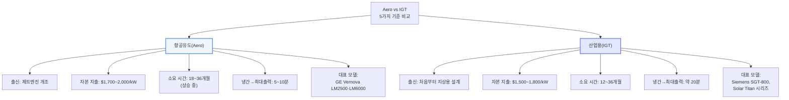
```mermaid
flowchart TD
    Compare5["Aero vs IGT<br/>5가지 기준 비교"] --> AeroBox["항공유도(Aero)"]
    Compare5 --> IGTBox["산업용(IGT)"]

    AeroBox --> AeroOrigin["출신: 제트엔진 개조"]
    AeroBox --> AeroCapex["자본 지출: $1,700~2,000/kW"]
    AeroBox --> AeroLead["소요 시간: 18~36개월<br/>(상승 중)"]
    AeroBox --> AeroRamp["냉간→최대출력: 5~10분"]
    AeroBox --> AeroModel["대표 모델:<br/>GE Vernova LM2500·LM6000"]

    IGTBox --> IGTOrigin["출신: 처음부터 지상용 설계"]
    IGTBox --> IGTCapex["자본 지출: $1,500~1,800/kW"]
    IGTBox --> IGTLead["소요 시간: 12~36개월"]
    IGTBox --> IGTRamp["냉간→최대출력: 약 20분"]
    IGTBox --> IGTModel["대표 모델:<br/>Siemens SGT-800,<br/>Solar Titan 시리즈"]

    style AeroBox fill:#eff6ff,stroke:#3b82f6,stroke-width:2px
    style IGTBox fill:#e0e7ff,stroke:#6366f1,stroke-width:2px
```

전반적으로 Aero와 IGT는 온사이트 발전에 매우 매력적인 선택지로 평가되지만, 유일한 약점인 "소요 시간"이 갈수록 늘어나고 있습니다.

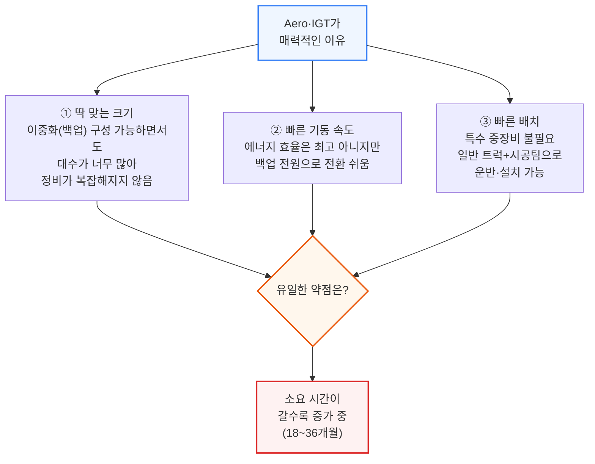
```mermaid
flowchart TD
    AeroIGT["Aero·IGT가<br/>매력적인 이유"] --> Size["① 딱 맞는 크기<br/>이중화(백업) 구성 가능하면서도<br/>대수가 너무 많아<br/>정비가 복잡해지지 않음"]
    AeroIGT --> Ramp["② 빠른 기동 속도<br/>에너지 효율은 최고 아니지만<br/>백업 전원으로 전환 쉬움"]
    AeroIGT --> Deploy["③ 빠른 배치<br/>특수 중장비 불필요<br/>일반 트럭+시공팀으로<br/>운반·설치 가능"]

    Size --> Weakness{"유일한 약점은?"}
    Ramp --> Weakness
    Deploy --> Weakness
    Weakness --> LeadTime["소요 시간이<br/>갈수록 증가 중<br/>(18~36개월)"]

    style AeroIGT fill:#eff6ff,stroke:#3b82f6,stroke-width:2px
    style Weakness fill:#fff7ed,stroke:#ea580c,stroke-width:2px
    style LeadTime fill:#fef2f2,stroke:#dc2626,stroke-width:2px
```

가스터빈에서 가장 공급이 빠듯한 부품은 터빈 날개(blade)와 코어입니다. 고온·고속을 견뎌야 하기 때문에, 로듐·코발트·탄탈럼·텅스텐·이트륨 같은 희토류가 포함된 특수 단결정 니켈 합금을 사용합니다. 특히 이트륨은 중국 정부의 수출 통제 대상 희토류 중 하나입니다. 코어 역시 공급이 부족한 고온 세라믹 소재가 필요합니다.

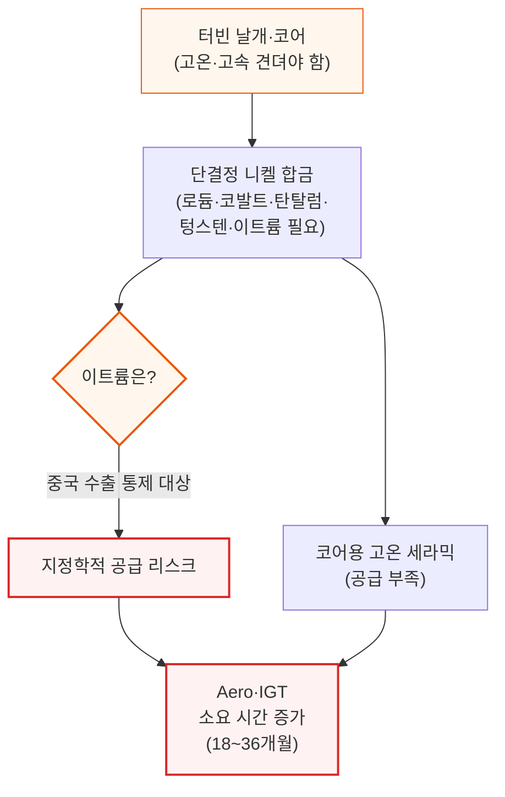
```mermaid
flowchart TD
    Blade["터빈 날개·코어<br/>(고온·고속 견뎌야 함)"] --> Alloy["단결정 니켈 합금<br/>(로듐·코발트·탄탈럼·<br/>텅스텐·이트륨 필요)"]
    Alloy --> Yttrium{"이트륨은?"}
    Yttrium -->|"중국 수출 통제 대상"| Risk["지정학적 공급 리스크"]
    Alloy --> Ceramic["코어용 고온 세라믹<br/>(공급 부족)"]

    Risk --> LeadTime["Aero·IGT<br/>소요 시간 증가<br/>(18~36개월)"]
    Ceramic --> LeadTime

    style Blade fill:#fff7ed,stroke:#ea580c
    style Yttrium fill:#fff7ed,stroke:#ea580c,stroke-width:2px
    style Risk fill:#fef2f2,stroke:#dc2626,stroke-width:2px
    style LeadTime fill:#fef2f2,stroke:#dc2626,stroke-width:2px
```

---

## 6. 왕복동 엔진(RICE)

**📌 핵심:**
- RICE(왕복동 엔진)는 **자동차 엔진과 같은 원리**를 훨씬 큰 규모로 구현한 것 → 11MW급 엔진 하나가 길이 14m(45피트)에 달함
- 터빈보다 낮은 온도(600~700°C)에서 작동 → 희귀 합금 의존도가 낮아 공급망 리스크가 상대적으로 적음, 초기 투자는 $1,700~2,000/kW로 Aero와 비슷
- 다만 5MW급 엔진으로 2GW 발전 시스템을 지으려면 **500대**가 필요 → 대수가 늘어날수록 정비 인력 부담이 기하급수적으로 증가 (2,000시간마다 점검 시 연간 2,000회 이상, 주당 40회꼴)
- 결론: RICE는 유연성과 낮은 자재 리스크가 강점이지만, 대수가 많아질수록 운영 복잡도가 커지는 트레이드오프가 있음

---

왕복동 엔진(Reciprocating Internal Combustion Engine, RICE)은 자동차 엔진처럼 작동하지만 훨씬 큰 규모입니다 — 11MW급 엔진 하나가 45피트(14m)에 달할 정도입니다. 4행정 연소 사이클을 사용하며, 회전 속도로 두 종류가 나뉩니다.

- **고속 엔진(High-speed engine)**: 분당 약 1,500회전, 크기와 출력이 작음
- **중속 엔진(Medium-speed engine)**: 분당 약 750회전, 기계적 스트레스가 낮아 유지보수 비용이 대체로 낮음

RICE는 냉간 기동에서 최대 출력까지 10분이면 도달할 수 있어, 실제로는 Aero와 비슷한 속도입니다. 이 덕분에 RICE는 피커 발전소나 백업 발전기로 사용할 수 있어 별도의 디젤 백업이 필요 없습니다. 서류상으로는 RICE의 유지보수 비용이 터빈보다 높아 보입니다(가동 부품이 더 많기 때문). 하지만 실제로는 연료 불순물, 먼지, 고온 환경을 터빈보다 더 잘 견디고, 더운 기후에서도 출력 저하(de-rating)가 덜합니다.

중속 엔진 제조는 비교적 소수 업체에 집중되어 있습니다: **Wärtsilä, Bergen Engines, Everllence(구 MAN Energy)**가 주요 제조사입니다. 반면 고속 엔진 제조는 터빈만큼 집중되어 있지 않습니다. **Jenbacher, CAT, Cummins**, Rolls-Royce 자회사 **MTU** 외에도 다양한 제조사가 있는데, 고속 가스엔진이 많은 데이터센터에서 이미 쓰이고 있는 디젤 백업 엔진과 기능적으로 거의 동일하기 때문입니다. 가장 주목할 만한 왕복동 엔진은 **Jenbacher J624**로, 4.5MW급 터보차저 가스엔진이며 컨테이너에 담을 수 있어 물류가 간편합니다. 이 시스템은 VoltaGrid의 에너지 통합 서비스가 선호하는 발전기이기도 합니다.

RICE는 일반적으로 동급 터빈보다 대당 출력이 낮습니다. 중속 엔진은 7~20MW(터보차징으로 더 높은 출력 가능), 고속 엔진은 대당 3~5MW로 더 작습니다. 다만 RICE는 50~80% 부분 부하로 운전할 때 터빈보다 더 효율적입니다.

왕복동 엔진은 가스터빈보다 훨씬 낮은 온도(약 600~700°C)에서 작동합니다. 이는 고성능 합금에 대한 의존도를 크게 줄여줍니다. 피스톤, 연소실, 터보차저 등 고온 부품만 니켈·코발트 합금이 필요하고, 나머지는 단순 주철·강철·알루미늄으로 제작할 수 있습니다. 그 결과 RICE는 전반적으로 핵심 광물 의존도가 낮으며, 특히 배출가스 규제가 완화된다면 그 의존도는 더 줄어듭니다.

현재 시세로 왕복동 엔진은 자본 지출 기준 **$1,700~2,000/kW**이며 소요 시간은 **15~24개월**입니다. 터빈 대비 제조 지연이 덜한 편으로(제조 기간 약 12~18개월에 가까움), 다만 중속 RICE는 터빈보다 훨씬 무거워 설치·시운전에 최대 약 10개월이 걸릴 수 있습니다.

고속 엔진은 훨씬 빠르게 배치할 수 있습니다. 예를 들어 xAI는 초기 Colossus 1 배치에서 Jenbacher 고속 엔진을 실은 VoltaGrid 트럭 탑재형 시스템 34대를 투입했습니다. 고속 엔진은 특히 (뒤에서 다룰) **에너지 조달 전문업체**들이 선호하는데, 폭넓은 가용성과 작은 유닛 크기 덕분에 더 빠른 전력화가 가능하기 때문입니다. 아래는 VoltaGrid가 산안토니오에 구축한 50MW 규모 배치로, 대당 약 3.36MW급 Jenbacher J620 20대로 구성되어 있습니다.

트레이드오프는 "규모"입니다. 5MW급 엔진으로 2GW 온사이트 가스 시스템을 지으려면 **500대**가 필요합니다! 이는 운영에 큰 부담을 줍니다. 각 엔진이 2,000시간마다 경정비가 필요하다면, 정비 인력은 연간 2,000회 이상 — 거의 매주 40회꼴로 서비스를 수행해야 합니다. 이런 비용은 터빈 오버홀(코어 전체 교체가 필요할 수 있는 작업)보다는 예측하기 쉽지만, 특히 소형 유닛이 많은 함대에서는 누적 비용이 상당합니다. 부지와 예비 부품 재고 역시 비슷하게 늘어나는데, 소형 발전기는 수직으로 쌓아 부지 문제를 완화할 수 있지만 중속 엔진에는 이 방법을 쓸 수 없습니다.

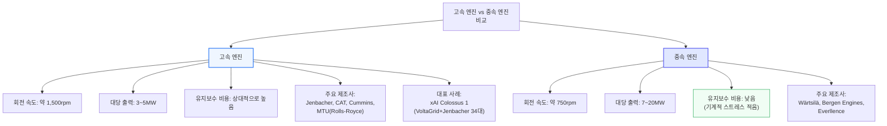
```mermaid
flowchart TD
    CompareRICE["고속 엔진 vs 중속 엔진<br/>비교"] --> HighSpeedBox["고속 엔진"]
    CompareRICE --> MedSpeedBox["중속 엔진"]

    HighSpeedBox --> HSRpm["회전 속도: 약 1,500rpm"]
    HighSpeedBox --> HSPower["대당 출력: 3~5MW"]
    HighSpeedBox --> HSMaint["유지보수 비용: 상대적으로 높음"]
    HighSpeedBox --> HSMaker["주요 제조사:<br/>Jenbacher, CAT, Cummins,<br/>MTU(Rolls-Royce)"]
    HighSpeedBox --> HSCase["대표 사례:<br/>xAI Colossus 1<br/>(VoltaGrid+Jenbacher 34대)"]

    MedSpeedBox --> MSRpm["회전 속도: 약 750rpm"]
    MedSpeedBox --> MSPower["대당 출력: 7~20MW"]
    MedSpeedBox --> MSMaint["유지보수 비용: 낮음<br/>(기계적 스트레스 적음)"]
    MedSpeedBox --> MSMaker["주요 제조사:<br/>Wärtsilä, Bergen Engines,<br/>Everllence"]

    style HighSpeedBox fill:#eff6ff,stroke:#3b82f6,stroke-width:2px
    style MedSpeedBox fill:#e0e7ff,stroke:#6366f1,stroke-width:2px
    style MSMaint fill:#f0fdf4,stroke:#16a34a
```

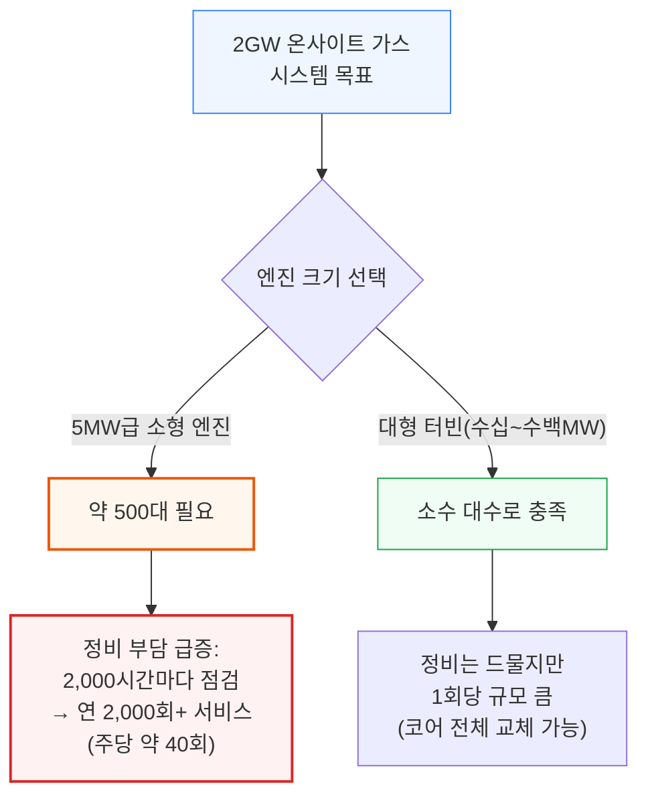
```mermaid
flowchart TD
    Target["2GW 온사이트 가스<br/>시스템 목표"] --> Choice{"엔진 크기 선택"}

    Choice -->|"5MW급 소형 엔진"| Many["약 500대 필요"]
    Many --> Maintenance["정비 부담 급증:<br/>2,000시간마다 점검<br/>→ 연 2,000회+ 서비스<br/>(주당 약 40회)"]

    Choice -->|"대형 터빈(수십~수백MW)"| Few["소수 대수로 충족"]
    Few --> Overhaul["정비는 드물지만<br/>1회당 규모 큼<br/>(코어 전체 교체 가능)"]

    style Target fill:#eff6ff,stroke:#3b82f6
    style Many fill:#fff7ed,stroke:#ea580c,stroke-width:2px
    style Maintenance fill:#fef2f2,stroke:#dc2626,stroke-width:2px
    style Few fill:#f0fdf4,stroke:#16a34a
```

---

## 7. 연료전지와 Bloom Energy의 부상

**📌 핵심:**
- Bloom Energy의 SOFC(고체산화물 연료전지)는 **연소 과정 자체가 없음** → 화학 반응만으로 천연가스에서 전기를 뽑아내 대기오염 물질을 거의 배출하지 않음 → 인허가가 훨씬 수월(사무실 인근에도 설치 가능)
- 설치·시운전 기간이 단 몇 주 → Aero·고속 RICE와 맞먹는 속도로, "속도가 해자"인 AI 시대에 그 자체로 핵심 경쟁력
- 하지만 초기 투자가 $3,000~4,000/kW로 터빈·RICE(약 $1,700~2,000/kW)의 **약 2배**, 연료전지 스택 자체는 5~6년마다 교체 필요 → 유지보수 비용도 높음
- 결론: 비용은 비싸지만 "가장 빠른 전력화"라는 장점 하나만으로 데이터센터 시장에서 확고한 입지 구축

---

다소 틈새 기술로 여겨지던 연료전지가 빠르게 시장 점유율을 넓히고 있습니다. 흔히 수소와 연관되지만, Bloom Energy의 SOFC(고체산화물 연료전지, Solid Oxide Fuel Cell)는 천연가스로도 작동하며 기저부하(baseload) 발전으로 판매되고 있습니다. SemiAnalysis는 2024년 Datacenter Industry Model에서 Bloom Energy를 유력한 수혜주로 처음 지목했으며, 이후 수주가 폭발적으로 늘었습니다.

Bloom의 "Energy Server"는 작은 스택을 계속 모아 쌓아 올리는 구조입니다.

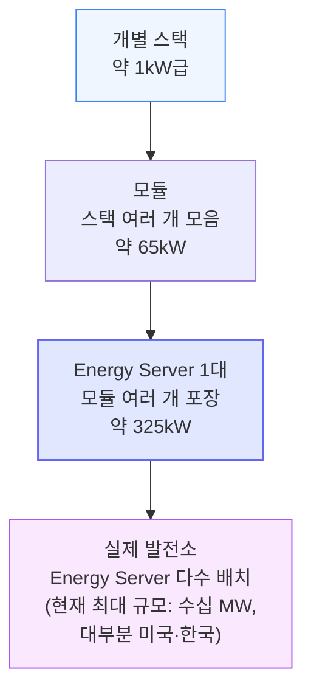
```mermaid
flowchart TD
    Stack["개별 스택<br/>약 1kW급"] --> Module["모듈<br/>스택 여러 개 모음<br/>약 65kW"]
    Module --> Generator["Energy Server 1대<br/>모듈 여러 개 포장<br/>약 325kW"]
    Generator --> Plant["실제 발전소<br/>Energy Server 다수 배치<br/>(현재 최대 규모: 수십 MW,<br/>대부분 미국·한국)"]

    style Stack fill:#eff6ff,stroke:#3b82f6
    style Generator fill:#e0e7ff,stroke:#6366f1,stroke-width:2px
    style Plant fill:#fae8ff,stroke:#a855f7
```

이 방식이 전기를 만드는 원리는 기존 발전기와 완전히 다릅니다 — **연소 과정이 전혀 없습니다.**

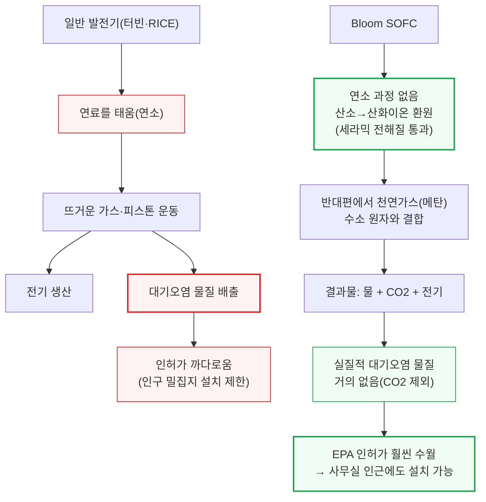
```mermaid
flowchart TD
    Normal["일반 발전기(터빈·RICE)"] --> Burn["연료를 태움(연소)"]
    Burn --> HotGas["뜨거운 가스·피스톤 운동"]
    HotGas --> Electricity1["전기 생산"]
    HotGas --> Pollution["대기오염 물질 배출"]
    Pollution --> HardPermit["인허가 까다로움<br/>(인구 밀집지 설치 제한)"]

    SOFC["Bloom SOFC"] --> NoCombustion["연소 과정 없음<br/>산소→산화이온 환원<br/>(세라믹 전해질 통과)"]
    NoCombustion --> Reaction["반대편에서 천연가스(메탄)<br/>수소 원자와 결합"]
    Reaction --> Products["결과물: 물 + CO2 + 전기"]
    Products --> NoPollution["실질적 대기오염 물질<br/>거의 없음(CO2 제외)"]
    NoPollution --> EasyPermit["EPA 인허가 훨씬 수월<br/>→ 사무실 인근에도 설치 가능"]

    style Burn fill:#fef2f2,stroke:#dc2626
    style Pollution fill:#fef2f2,stroke:#dc2626,stroke-width:2px
    style HardPermit fill:#fef2f2,stroke:#dc2626
    style NoCombustion fill:#f0fdf4,stroke:#16a34a,stroke-width:2px
    style NoPollution fill:#f0fdf4,stroke:#16a34a
    style EasyPermit fill:#f0fdf4,stroke:#16a34a,stroke-width:2px
```

Bloom의 킬러 기능은 배치 속도입니다. 사전 제작된 받침대(precast pad)와 모듈의 간단한 설치만 있으면 되고, 전기 작업까지 포함해도 설치·시운전은 몇 주 안에 끝납니다 — 항공유도 터빈과 고속 RICE의 속도에 필적합니다. "속도가 해자"인 AI 시대에는 이 장점 하나만으로도 Bloom을 지도 위에 올려놓기에 충분합니다.

하지만 이 속도에는 비용이라는 대가가 따릅니다.

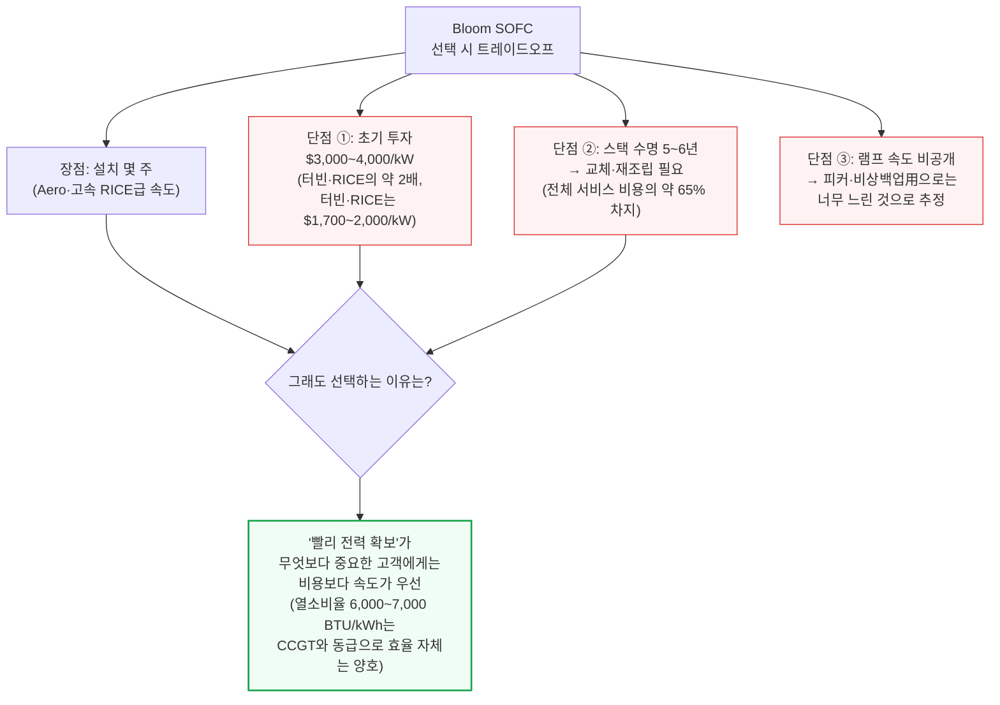
```mermaid
flowchart TD
    Bloom["Bloom SOFC<br/>선택 시 트레이드오프"] --> Pro["장점: 설치 몇 주<br/>(Aero·고속 RICE급 속도)"]
    Bloom --> Con1["단점 ①: 초기 투자<br/>$3,000~4,000/kW<br/>(터빈·RICE의 약 2배,<br/>터빈·RICE는 $1,700~2,000/kW)"]
    Bloom --> Con2["단점 ②: 스택 수명 5~6년<br/>→ 교체·재조립 필요<br/>(전체 서비스 비용의 약 65% 차지)"]
    Bloom --> Con3["단점 ③: 램프 속도 비공개<br/>→ 피커·비상백업用으로는<br/>너무 느린 것으로 추정"]

    Pro --> Verdict{"그래도 선택하는 이유는?"}
    Con1 --> Verdict
    Con2 --> Verdict
    Verdict --> Reason["'빨리 전력 확보'가<br/>무엇보다 중요한 고객에게는<br/>비용보다 속도가 우선<br/>(열소비율 6,000~7,000 BTU/kWh는<br/>CCGT와 동급으로 효율 자체는 양호)"]

    style Con1 fill:#fef2f2,stroke:#dc2626
    style Con2 fill:#fef2f2,stroke:#dc2626
    style Con3 fill:#fef2f2,stroke:#dc2626
    style Reason fill:#f0fdf4,stroke:#16a34a,stroke-width:2px
```

Bloom은 세라믹을 셀 핵심 소재로 쓴다는 것 외에 소재 정보를 거의 공개하지 않지만, 자사 연료전지는 중국 등 분쟁 지역에 대한 핵심 광물 의존도가 없다고 주장합니다.

---

## 8. 대형 가스터빈과 복합화력(CCGT): 왜 너무 느린가

**📌 핵심:**
- ChatGPT 등장 전까지는 전력회사·독립발전사업자(IPP)만 250MW 넘는 초대형 터빈을 살 이유가 있었음 → 산업용으로 쓰기엔 너무 크기 때문
- 최신 H-Class 터빈(GE Vernova HA, Siemens H/HL, 두산 DGT6 등)은 항공유도 터빈의 **약 10배** 출력을 냄 → 효율은 최고지만 설치·시운전에 오래 걸림
- CCGT(복합화력)는 배기가스 열까지 재활용해 단순 사이클보다 **50~80% 더 효율적**이지만, 증기터빈이 추가되며 기동 시간이 30분 이상으로 느려지고 설치 기간은 단순 사이클보다도 더 길어짐
- 결론: 효율은 가장 뛰어나지만 배치 속도가 AI 시대와 맞지 않아, 소형 장비로 "브릿지" 전력을 먼저 확보한 뒤 대형 CCGT를 나중에 기저부하로 돌리는 방식이 확산 중

---

ChatGPT가 등장하기 전까지는 전력회사와 독립발전사업자(Independent Power Producer, IPP)만 250MW를 넘는 가스터빈을 살 이유가 있었습니다. 이 문턱을 넘는 터빈은 대부분의 산업 용도로 쓰기엔 너무 크기 때문입니다. 앞서 설명했듯 배치 속도가 문제이지만, 최근에는 개발업체들이 소형 항공유도·RICE 장비로 먼저 "브릿지 전력"을 확보한 뒤, 대형 CCGT가 가동에 들어가면 그 소형 장비를 백업·이중화용으로 전환하는 방식이 점점 늘고 있습니다.

대형 터빈은 연소(터빈 입구) 온도와 기술 세대에 따라 등급이 나뉩니다.

**E-Class와 F-Class** — 더 오래되고, 온도가 낮고, 효율이 낮은 설계입니다. 일부 F-class 유닛은 여전히 판매되는데, 주로 개발도상국 시장向으로 낮은 자본 지출 대비 준수한 효율을 제공하기 때문입니다. "산업용" 터빈과 소형 E/F-class 프레임의 경계는 모호하며, 다음 유명 모델들이 그 경계에 걸쳐 있습니다.

- GE Vernova 6B
- GE Vernova 7E
- Siemens Energy SGT6-2000E

**H-Class 및 동급** — 현대적인 고온 설계입니다. 최신 항공유도 터빈·제트엔진과 맞먹는 연소 온도로 작동하면서도, 대당 출력은 약 **10배**에 달합니다. 대표 모델은 다음과 같습니다.

- **GE Vernova HA 시리즈** (예: HA.02)
- Siemens Energy **H/HL**
- Mitsubishi Heavy Industries **J 시리즈** (예: H510J)
- 최근에는 한국 기업 **두산에너빌리티**가 신형 H-class 터빈 **DGT6**의 생산을 시작 — 10년 넘게 신규 진입자가 없던 시장에 등장한 드문 사례. 두산은 증기터빈 생산에 오랜 경험이 있고, Mitsubishi가 설계한 F-class 터빈을 생산해온 이력도 있음

이런 시스템들은 크기와 무게가 모두 매우 커서, 설치·시운전 과정에 상당한 시간이 걸립니다.

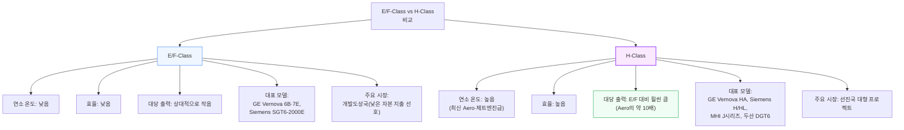
```mermaid
flowchart TD
    CompareClass["E/F-Class vs H-Class<br/>비교"] --> EFBox["E/F-Class"]
    CompareClass --> HBox["H-Class"]

    EFBox --> EFTemp["연소 온도: 낮음"]
    EFBox --> EFEff["효율: 낮음"]
    EFBox --> EFPower["대당 출력: 상대적으로 작음"]
    EFBox --> EFModel["대표 모델:<br/>GE Vernova 6B·7E,<br/>Siemens SGT6-2000E"]
    EFBox --> EFMarket["주요 시장:<br/>개발도상국(낮은 자본 지출 선호)"]

    HBox --> HTemp["연소 온도: 높음<br/>(최신 Aero·제트엔진급)"]
    HBox --> HEff["효율: 높음"]
    HBox --> HPower["대당 출력: E/F 대비 훨씬 큼<br/>(Aero의 약 10배)"]
    HBox --> HModel["대표 모델:<br/>GE Vernova HA, Siemens H/HL,<br/>MHI J시리즈, 두산 DGT6"]
    HBox --> HMarket["주요 시장: 선진국 대형 프로젝트"]

    style EFBox fill:#eff6ff,stroke:#3b82f6
    style HBox fill:#fae8ff,stroke:#a855f7,stroke-width:2px
    style HPower fill:#f0fdf4,stroke:#16a34a
```

### 복합화력(CCGT)이 효율적이지만 느린 이유

복합화력 가스터빈(CCGT)은 단순 사이클의 배기가스가 여전히 매우 뜨겁다는 사실 — 물을 끓여 증기로 만들 수 있을 정도로 뜨겁다는 사실을 활용합니다. 배기가스를 **HRSG(배열회수 보일러)**에 통과시키면 별도의 증기터빈·발전기를 위한 증기가 만들어집니다. 결과적으로 같은 연료에서 전력을 한 번 더 뽑아내는 셈입니다. 한 터빈의 "폐기물"을 다른 터빈의 "보물"로 바꾸는 방식으로, CCGT는 단순 사이클 터빈보다 **50~80% 더 효율적**으로 운전할 수 있습니다.

대형 부하에 가장 많이 쓰이는 CCGT는 기가와트급 출력까지 낼 수 있는 중대형 CCGT입니다. 하지만 소형 항공유도·산업용 터빈도 증기터빈을 통합해 판매할 수 있으며, 이 경우 거의 동일한 연료 투입으로 출력을 극적으로 늘릴 수 있습니다. 흔한 구성은 다음과 같습니다.

- **1x1**: 가스터빈 1대가 증기터빈 1대를 구동
- **2x1**: 가스터빈 2대가 증기터빈 1대를 구동

이론상으로는 더 많은 가스터빈이 증기터빈 1대를 함께 구동할 수도 있지만, 그럴수록 효율 증가분은 줄어듭니다. CCGT 시스템의 가장 큰 단점은 기동 속도입니다: 증기터빈이 추가되면서 냉간 기동부터 최대 출력까지의 시간이 **30분 이상**으로 늘어납니다.

또 다른 큰 단점은 소요 시간입니다. 설치·시운전 기간은 단순 사이클 배치보다도 더 깁니다.

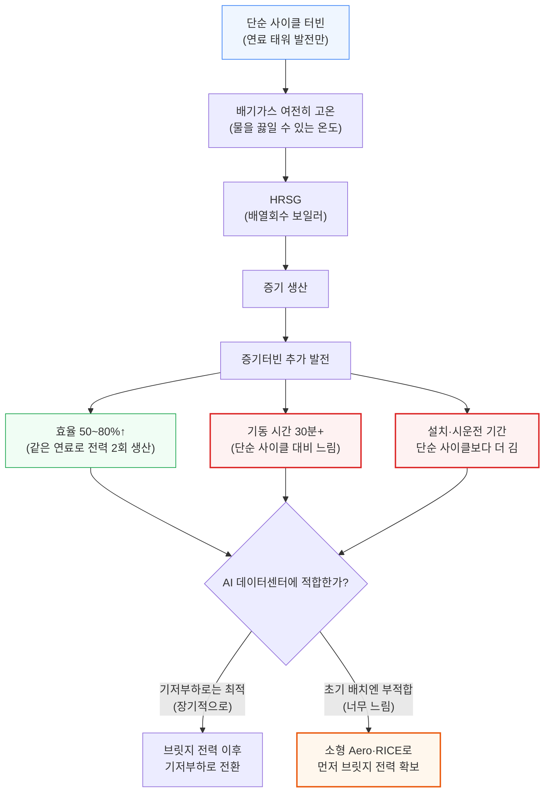
```mermaid
flowchart TD
    SimpleCycle["단순 사이클 터빈<br/>(연료 태워 발전만)"] --> Exhaust["배기가스 여전히 고온<br/>(물을 끓일 수 있는 온도)"]
    Exhaust --> HRSG["HRSG<br/>(배열회수 보일러)"]
    HRSG --> Steam["증기 생산"]
    Steam --> SteamTurbine["증기터빈 추가 발전"]

    SteamTurbine --> Efficiency["효율 50~80%↑<br/>(같은 연료로 전력 2회 생산)"]
    SteamTurbine --> SlowRamp["기동 시간 30분+<br/>(단순 사이클 대비 느림)"]
    SteamTurbine --> LongInstall["설치·시운전 기간<br/>단순 사이클보다 더 김"]

    Efficiency --> Verdict{"AI 데이터센터에 적합한가?"}
    SlowRamp --> Verdict
    LongInstall --> Verdict

    Verdict -->|"기저부하로는 최적<br/>(장기적으로)"| Later["브릿지 전력 이후<br/>기저부하로 전환"]
    Verdict -->|"초기 배치엔 부적합<br/>(너무 느림)"| Bridge["소형 Aero·RICE로<br/>먼저 브릿지 전력 확보"]

    style SimpleCycle fill:#eff6ff,stroke:#3b82f6
    style Efficiency fill:#f0fdf4,stroke:#16a34a
    style SlowRamp fill:#fef2f2,stroke:#dc2626,stroke-width:2px
    style LongInstall fill:#fef2f2,stroke:#dc2626,stroke-width:2px
    style Bridge fill:#fff7ed,stroke:#ea580c,stroke-width:2px
```

---

## 9. 배치 전략: 브릿지 전력, 이중화 설계, 부하 변동 대응

**📌 핵심:**
- "브릿지 전력" 전략: 그리드 연결을 기다리는 동안 온사이트 가스로 먼저 가동 → 200MW를 6개월 일찍 가동하면 10~12억 달러 매출 확보 가능
- AI 훈련 부하는 원래 GPU 클러스터 자체가 불안정 → **그리드 수준의 백업이 필요 없어** 디젤 백업 생략 가능 → 초기 투자 절감
- 이중화는 보통 N+1(예비 1대) 또는 N+1+1(예비 1대+정비용 1대) 구성 → 그리드의 "3개의 9" 가동률을 맞추려면 필요 용량보다 10~64%까지 "오버빌드"해야 함
- 결론: AI 데이터센터는 훈련 부하의 특수성 덕분에 그리드 연결 시설보다 낮은 이중화 수준을 감수할 수 있고, 이것이 온사이트 발전 경제성을 크게 좌우함

---

### 브릿지 전력: Crusoe와 xAI의 전략

가장 인기 있는 온사이트 가스 전략 중 하나가 "브릿지 전력(bridge power)"입니다. 데이터센터 캠퍼스가 그리드 측과 전력 공급 협의를 진행하는 동시에, 그 협의가 끝나기 전에 온사이트 발전으로 먼저 가동을 시작하는 방식입니다.

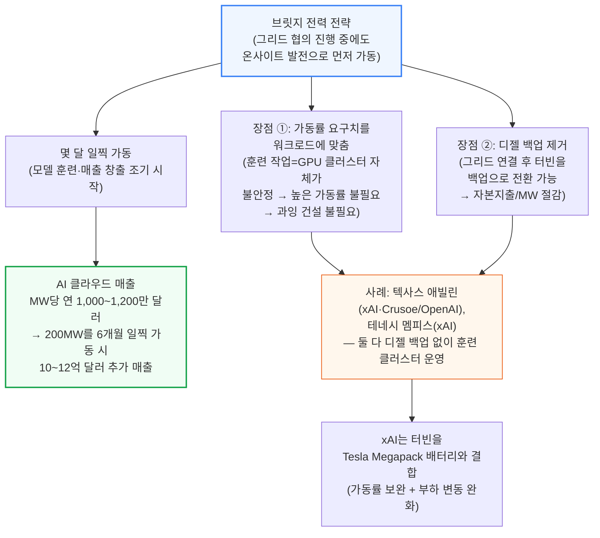
```mermaid
flowchart TD
    Bridge["브릿지 전력 전략<br/>(그리드 협의 진행 중에도<br/>온사이트 발전으로 먼저 가동)"] --> Speed["몇 달 일찍 가동<br/>(모델 훈련·매출 창출 조기 시작)"]

    Speed --> Value["AI 클라우드 매출<br/>MW당 연 1,000~1,200만 달러<br/>→ 200MW를 6개월 일찍 가동 시<br/>10~12억 달러 추가 매출"]

    Bridge --> Adv1["장점 ①: 가동률 요구치를<br/>워크로드에 맞춤<br/>(훈련 작업=GPU 클러스터 자체가<br/>불안정 → 높은 가동률 불필요<br/>→ 과잉 건설 불필요)"]
    Bridge --> Adv2["장점 ②: 디젤 백업 제거<br/>(그리드 연결 후 터빈을<br/>백업으로 전환 가능<br/>→ 자본지출/MW 절감)"]

    Adv1 --> Example["사례: 텍사스 애빌린(xAI·Crusoe/OpenAI),<br/>테네시 멤피스(xAI)<br/>— 둘 다 디젤 백업 없이 훈련 클러스터 운영"]
    Adv2 --> Example

    Example --> Battery["xAI는 터빈을<br/>Tesla Megapack 배터리와 결합<br/>(가동률 보완 + 부하 변동 완화)"]

    style Bridge fill:#eff6ff,stroke:#3b82f6,stroke-width:2px
    style Value fill:#f0fdf4,stroke:#16a34a,stroke-width:2px
    style Example fill:#fff7ed,stroke:#ea580c
```

### 그리드 없이 영원히: Energy-as-a-Service(EaaS)

많은 발전기 공급업체는 데이터센터 소유주가 굳이 광역 그리드와 연결할 필요가 없다고 제안합니다. VoltaGrid 같은 기업은 전력 서비스의 모든 측면을 관리하는 완전한 **"Energy-as-a-Service"** 패키지를 제공하며, 사실상 전력회사 역할을 합니다 — 장비 조달, 배치 설계, 자재 명세서(BoM) 조립, 발전소 운영까지 책임집니다.

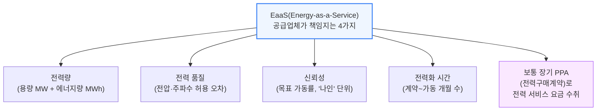
```mermaid
flowchart TD
    EaaS["EaaS(Energy-as-a-Service)<br/>공급업체가 책임지는 4가지"] --> Cap["전력량<br/>(용량 MW + 에너지량 MWh)"]
    EaaS --> Quality["전력 품질<br/>(전압·주파수 허용 오차)"]
    EaaS --> Reliability["신뢰성<br/>(목표 가동률, '나인' 단위)"]
    EaaS --> Time["전력화 시간<br/>(계약~가동 개월 수)"]

    EaaS --> Contract["보통 장기 PPA<br/>(전력구매계약)로<br/>전력 서비스 요금 수취"]

    style EaaS fill:#eff6ff,stroke:#3b82f6,stroke-width:2px
    style Contract fill:#fae8ff,stroke:#a855f7
```

오프그리드 발전을 배치할 때 핵심 과제는 **이중화 관리**입니다. 예를 들어 텍사스 섀클포드 카운티의 1.4GW급 Vantage 데이터센터 캠퍼스는 2.3GW 규모의 VoltaGrid 시스템을 배치할 예정입니다. 소형 시스템은 이중화를 짜기 쉽지만, 초대형 터빈으로 온사이트 발전을 한다면 이중화를 위해 아예 발전소를 두 곳(혹은 그 이상) 지어야 할 수도 있습니다.

발전 설비 공급업체들이 권장하는 이중화 구성은 N+1 또는 N+1+1입니다.

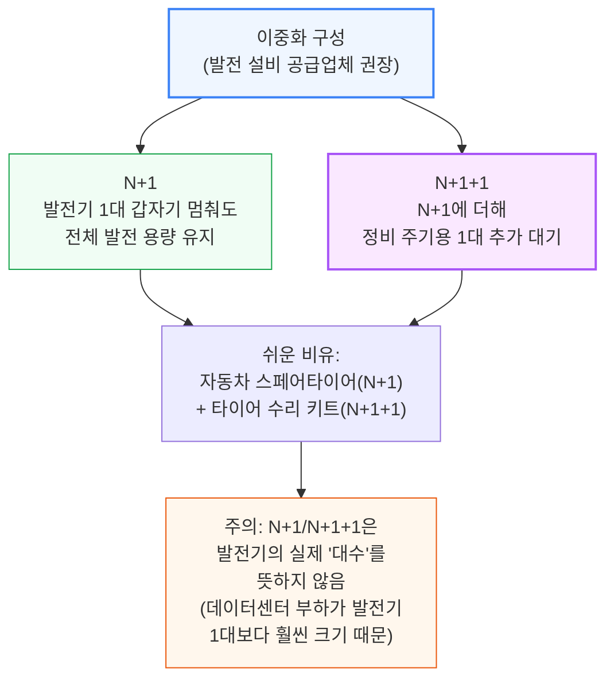
```mermaid
flowchart TD
    Redundancy["이중화 구성<br/>(발전 설비 공급업체 권장)"] --> N1["N+1<br/>발전기 1대 갑자기 멈춰도<br/>전체 발전 용량 유지"]
    Redundancy --> N11["N+1+1<br/>N+1에 더해<br/>정비 주기용 1대 추가 대기"]

    N1 --> Analogy["쉬운 비유:<br/>자동차 스페어타이어(N+1)<br/>+ 타이어 수리 키트(N+1+1)"]
    N11 --> Analogy

    Analogy --> Note["주의: N+1/N+1+1은<br/>발전기의 실제 '대수'를<br/>뜻하지 않음<br/>(데이터센터 부하가 발전기<br/>1대보다 훨씬 크기 때문)"]

    style Redundancy fill:#eff6ff,stroke:#3b82f6,stroke-width:2px
    style N1 fill:#f0fdf4,stroke:#16a34a
    style N11 fill:#fae8ff,stroke:#a855f7,stroke-width:2px
    style Note fill:#fff7ed,stroke:#ea580c
```

예를 들어 IT+비IT 전력 수요가 200MW인 데이터센터를 생각해 봅시다.

200MW 데이터센터를 어떻게 채우는지, 실제 배치 사례 3가지로 살펴보겠습니다.

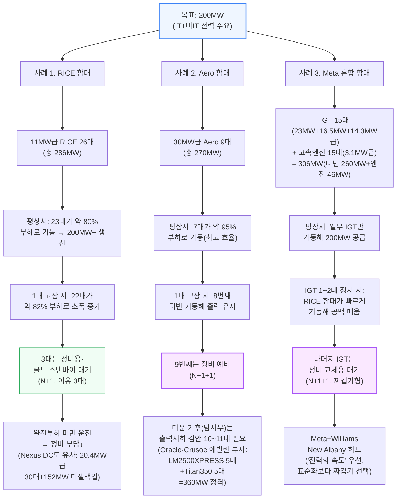
```mermaid
flowchart TD
    Target["목표: 200MW<br/>(IT+비IT 전력 수요)"] --> Case1["사례 1: RICE 함대"]
    Target --> Case2["사례 2: Aero 함대"]
    Target --> Case3["사례 3: Meta 혼합 함대"]

    Case1 --> C1Fleet["11MW급 RICE 26대<br/>(총 286MW)"]
    C1Fleet --> C1Normal["평상시: 23대가 약 80%<br/>부하로 가동 → 200MW+ 생산"]
    C1Normal --> C1Fail["1대 고장 시: 22대가<br/>약 82% 부하로 소폭 증가"]
    C1Fail --> C1Spare["3대는 정비용·<br/>콜드 스탠바이 대기<br/>(N+1, 여유 3대)"]
    C1Spare --> C1Note["완전부하 미만 운전<br/>→ 정비 부담↓<br/>(Nexus DC도 유사: 20.4MW급<br/>30대+152MW 디젤백업)"]

    Case2 --> C2Fleet["30MW급 Aero 9대<br/>(총 270MW)"]
    C2Fleet --> C2Normal["평상시: 7대가 약 95%<br/>부하로 가동(최고 효율)"]
    C2Normal --> C2Fail["1대 고장 시: 8번째<br/>터빈 기동해 출력 유지"]
    C2Fail --> C2Spare["9번째는 정비 예비<br/>(N+1+1)"]
    C2Spare --> C2Note["더운 기후(남서부)는<br/>출력저하 감안 10~11대 필요<br/>(Oracle·Crusoe 애빌린 부지:<br/>LM2500XPRESS 5대+Titan350 5대<br/>=360MW 정격)"]

    Case3 --> C3Fleet["IGT 15대(23MW+16.5MW+14.3MW급)<br/>+ 고속엔진 15대(3.1MW급)<br/>= 306MW(터빈 260MW+엔진 46MW)"]
    C3Fleet --> C3Normal["평상시: 일부 IGT만<br/>가동해 200MW 공급"]
    C3Normal --> C3Fail["IGT 1~2대 정지 시:<br/>RICE 함대가 빠르게<br/>기동해 공백 메움"]
    C3Fail --> C3Spare["나머지 IGT는<br/>정비 교체용 대기<br/>(N+1+1, 짜깁기형)"]
    C3Spare --> C3Note["Meta+Williams<br/>New Albany 허브<br/>('전력화 속도' 우선,<br/>표준화보다 짜깁기 선택)"]

    style Target fill:#eff6ff,stroke:#3b82f6,stroke-width:2px
    style C1Spare fill:#f0fdf4,stroke:#16a34a
    style C2Spare fill:#fae8ff,stroke:#a855f7,stroke-width:2px
    style C3Spare fill:#fae8ff,stroke:#a855f7,stroke-width:2px
```

```mermaid
flowchart TD
    Summary9["3가지 배치 사례<br/>요약 비교"] --> S1["1. RICE 함대"]
    Summary9 --> S2["2. Aero 함대"]
    Summary9 --> S3["3. Meta 혼합 함대"]

    S1 --> S1Detail["구성: 11MW급 26대<br/>총 정격 용량: 286MW<br/>이중화 수준: N+1(3대 여유)"]
    S2 --> S2Detail["구성: 30MW급 9대<br/>(더운 지역 10~11대)<br/>총 정격 용량: 270MW<br/>이중화 수준: N+1+1"]
    S3 --> S3Detail["구성: IGT 15대 + 엔진 15대<br/>총 정격 용량: 306MW<br/>이중화 수준: N+1+1(짜깁기형)"]

    style Summary9 fill:#eff6ff,stroke:#3b82f6,stroke-width:2px
    style S1Detail fill:#f0fdf4,stroke:#16a34a
    style S2Detail fill:#fae8ff,stroke:#a855f7,stroke-width:2px
    style S3Detail fill:#fae8ff,stroke:#a855f7,stroke-width:2px
```

터빈 오버홀은 엔진 정비보다 더 큰 지장을 주기 때문에, 일부 공급업체는 **핫스왑(hot-swap)** 프로그램을 제공합니다 — 주요 정비가 필요한 터빈을 교체용 코어로 통째로 바꿔주는 방식입니다.

### 그리드 수준 가동률 맞추기: 오버빌드, 그리드 백업, 배터리

그리드가 제공하는 "3개의 9" 가동률을 맞추려면, 온사이트 발전소는 이중화를 위해 반드시 "오버빌드(초과 건설)"되어야 합니다 — 그리드는 수천 개 발전기·수백 개 송전선이 서로 백업해 99.93% 가동률을 내지만, 온사이트 발전소는 훨씬 적은 수의 설비로 같은 신뢰성을 내야 하기 때문입니다. 이것이 온사이트 발전 비용이 그리드보다 비싼 핵심 이유입니다.

텍사스 섀클포드 카운티의 실제 사례로 오버빌드 구조를 뜯어보겠습니다: VoltaGrid는 1.4GW급 데이터센터(IT 용량)에 2.3GW 규모의 Jenbacher 시스템으로 전력을 공급합니다 — **64% 오버빌드**입니다.

```mermaid
flowchart TD
    ITLoad["IT 용량<br/>1.4GW"] --> PUE["① PUE 오버빌드<br/>냉각 등 비IT 부하 반영<br/>1.4~1.5배 초과 공급<br/>(텍사스 그리드 연결시설과 동일 수준)"]
    PUE --> Redundancy["② 이중화 오버빌드<br/>추가 10~17% 초과 건설<br/>(N+1/N+1+1 유지 목적)"]
    Redundancy --> Total["최종 발전 용량<br/>2.3GW<br/>(IT 용량 대비 64% 오버빌드)"]

    Total --> Cost["오버빌드 비율↑<br/>= 신뢰성↑ + 비용↑<br/>(초기투자·유지보수 모두 증가)"]

    style ITLoad fill:#eff6ff,stroke:#3b82f6
    style PUE fill:#fff7ed,stroke:#ea580c
    style Redundancy fill:#fff7ed,stroke:#ea580c,stroke-width:2px
    style Total fill:#fef2f2,stroke:#dc2626,stroke-width:2px
    style Cost fill:#fef2f2,stroke:#dc2626
```

이중화는 운영자에게 새로운 골칫거리를 안깁니다: 시스템 규모와 "오버빌드 비율" 사이에는 트레이드오프가 있습니다. H-class·F-class 터빈은 Aero보다 에너지 효율이 높지만, 이중화 요구 수준이 높아서 설계가 부실하면 대형 터빈 기반 독립형(islanded) 시스템이 오히려 Aero보다 전력 비용이 높아질 수 있습니다.

```mermaid
flowchart TD
    HFClass["H-class·F-class 터빈<br/>(에너지 효율은 Aero보다 높음)"] --> Problem{"이중화 요구 수준이<br/>높아 설계 부실하면?"}
    Problem -->|"단순 오버빌드만 사용"| Expensive["Aero보다 오히려<br/>전력 비용 높아질 수 있음"]

    Problem --> Alt1["대안 ①: 그리드를<br/>백업 전용으로 연결<br/>(단점: 계통연계 일정 문제,<br/>초고압 송전선 접근 필요)"]
    Problem --> Alt2["대안 ②: 대형 배터리<br/>(예: xAI Colossus 2)<br/>(단점: 비용多,<br/>저장시간 2~4시간 한계)"]
    Problem --> Alt3["대안 ③: 터빈·엔진 혼합<br/>(H-class 복합화력=기저부하,<br/>IGT·Aero·RICE=백업)<br/>(단점: 그리드·BESS보다 대체로 고비용)"]

    style Expensive fill:#fef2f2,stroke:#dc2626,stroke-width:2px
    style Alt1 fill:#fff7ed,stroke:#ea580c
    style Alt2 fill:#fff7ed,stroke:#ea580c
    style Alt3 fill:#fff7ed,stroke:#ea580c
```

### 부하 급변 관리

AI 컴퓨팅 부하, 특히 훈련(training) 작업은 변동성이 매우 커서, 1초도 안 되는 사이에 메가와트 단위로 전력이 치솟았다 떨어지는 일이 반복됩니다. 전력 시스템이 갖는 **관성(inertia)**이 클수록, 주파수를 유지하면서 이런 단기 변동을 더 잘 버틸 수 있습니다. 주파수가 기준값(50Hz 또는 60Hz)에서 너무 벗어나면 차단기가 작동하거나 오작동이 발생할 수 있습니다. 모든 열 발전기(터빈·엔진)는 회전하는 무거운 물체로 전기를 만들기 때문에 어느 정도 관성을 갖고 있지만, 개발업체는 보조 설비로 관성을 더 늘릴 수 있습니다.

- **동기조상기(Synchronous Condenser)**: 사실상 기계적 부하 없이 모터처럼 돌아가는 발전기입니다. 그리드에 동기화되면 아주 작은 손실만 발생시킵니다. 부하가 갑자기 바뀔 때 **무효전력(reactive power)**을 흡수·공급해 전압을 안정시키고, 짧은 시간 동안 관성을 더해줍니다. 에너지 용량 자체는 작아서, 수 초 단위로만 도움이 되고 수 분 단위로는 부족합니다.
- **플라이휠(Flywheel)**: 실제 회전 에너지를 저장하는 완충 장치입니다. 모터-발전기가 대형 플라이휠에 연결되어 발전과 부하 사이에 놓입니다. 플라이휠은 (무효전력뿐 아니라) **유효전력(real power)**을 5~30초 동안 주고받을 수 있어, 부하 급변·발전기 정지·전압 강하를 완화합니다. Bergen은 계열 공급업체를 통해 자사 엔진에 플라이휠을 함께 패키징해 판매합니다.
- **BESS(배터리 에너지 저장 장치)**: 부하가 바뀌는 만큼 빠르게 출력을 조절할 수 있어, 고속 제어를 통해 "인공 관성(synthetic inertia)"을 만들어냅니다. 주파수 조정에는 탁월하지만, 인버터가 전류 한계를 갖고 있어 무효전력이나 고장전류 대응 능력은 동기식 기계보다 떨어집니다.

VoltaGrid는 RICE 함대에 동기조상기를 결합해 사용합니다. Bergen Engines는 같은 모기업 산하 계열사의 플라이휠을 엔진과 함께 판매해왔습니다. 엔진 제조사 Wärtsilä는 배터리 에너지 저장 사업부를 보유하고 있어, 데이터센터 프로젝트에 함께 묶어 제공할 수 있습니다. Bloom은 자사 연료전지 시스템은 부하 변동 관리용 장비가 전혀 필요 없다고 주장합니다. 실제로 어떤 시스템을 쓸지는 현지 여건과 공급업체 선호에 따라 다소 달라집니다. xAI는 백업과 부하 변동 대응 모두에 Tesla의 **Megapack**을 선호합니다.

```mermaid
flowchart TD
    Aux["부하 급변 대응<br/>보조 장비 3종"] --> Sync2["동기조상기"]
    Aux --> Fly2["플라이휠"]
    Aux --> BESS2["BESS(배터리)"]

    Sync2 --> SyncDetail["대응 방식: 무효전력 흡수·공급<br/>(전압 안정)<br/>지속 시간: 수 초<br/>대표 사용처: VoltaGrid<br/>(RICE 함대와 결합)"]
    Fly2 --> FlyDetail["대응 방식: 유효전력 흡수·공급<br/>(실제 완충)<br/>지속 시간: 5~30초<br/>대표 사용처: Bergen Engines<br/>(계열사 제품)"]
    BESS2 --> BESSDetail["대응 방식: 인공 관성, 주파수 조정<br/>지속 시간: 수십 분~수 시간<br/>(2~4시간대)<br/>대표 사용처: xAI(Tesla Megapack),<br/>Wärtsilä"]

    style Aux fill:#eff6ff,stroke:#3b82f6,stroke-width:2px
    style SyncDetail fill:#f0fdf4,stroke:#16a34a
    style FlyDetail fill:#fff7ed,stroke:#ea580c
    style BESSDetail fill:#fae8ff,stroke:#a855f7,stroke-width:2px
```

```mermaid
flowchart TD
    Surge["AI 훈련 부하 급변<br/>(1초 미만 MW급 변동)"] --> Risk["주파수 이탈 위험<br/>(차단기 작동·오작동)"]

    Risk --> Inertia{"관성 보강 방법?"}
    Inertia -->|"수 초 단위"| SyncCond["동기조상기<br/>(무효전력으로 전압 안정)"]
    Inertia -->|"5~30초"| Flywheel["플라이휠<br/>(실제 회전 에너지 완충)"]
    Inertia -->|"수십 분 이상"| BESS["BESS 배터리<br/>(인공 관성, 주파수 조정)"]

    SyncCond --> Combine["실제로는 여러 방식을<br/>함께 조합해 사용<br/>(예: VoltaGrid = RICE+동기조상기,<br/>xAI = 터빈+Megapack)"]
    Flywheel --> Combine
    BESS --> Combine

    style Surge fill:#fff7ed,stroke:#ea580c,stroke-width:2px
    style Risk fill:#fef2f2,stroke:#dc2626,stroke-width:2px
    style Combine fill:#f0fdf4,stroke:#16a34a
```

---

## 10. 가스터빈을 충분히 만들 수 있는가: 공급망 병목

**📌 핵심:**
- 터빈 제조 "빅3"(GE Vernova, Siemens Energy, Mitsubishi Power)는 이미 **2028~2029년 물량까지 예약이 꽉 참** → 그런데도 대부분 공장을 늘리기보다 가격만 올리는 신중한 태도
- 이유는 지난 30년간 두 차례 겪은 "붐-버스트" 사이클의 트라우마: 2001년 GE는 60GW를 출하했지만 닷컴버블 붕괴로 이후 수년간 "제조업 겨울"을 겪음
- 가장 큰 병목은 터빈 날개용 특수 합금 공급 — 서방 생산이 단 4개 기업(Precision Castparts, Howmet Aerospace, CPP, Doncasters)에 집중, 이들은 고객사보다 훨씬 규모가 작아 수요 급변에 취약
- 결론: 대형 터빈(중대형·H-class)은 병목이 심각하지만, 항공유도·산업용 터빈·RICE는 상대적으로 제약이 덜함

---

### 공급 부족에도 신중한 제조사들

가스 발전 시스템의 소요 시간은 전례 없는 수준입니다. 역사적으로 가스터빈 제조사들은 평균적으로 공장 출하 **20개월 전**에 주문을 받아왔지만, 지금은 빅3 제조사(GE Vernova, Siemens Energy, Mitsubishi Power)가 **2028~2029년** 물량까지 주문을 받고 있으며, 그 이후 시점의 환불 불가 예약 슬롯까지 판매하고 있습니다. 가스 시스템을 만드는 모든 상장 제조사가 데이터센터發 수요 급증을 보고하고 있지만, 대부분은 전면적인 증설이 아니라 신중한 태도로 대응하고 있습니다.

```mermaid
flowchart TD
    Demand["데이터센터發<br/>수요 급증 확인"] --> Response{"제조사 대응 방식"}

    Response -->|"신중형: 가격↑, 공장 확장 없음"| GE["GE Vernova<br/>24GW/년 목표<br/>(2007~16년 수준 복귀일 뿐)<br/>인력·설비만 투자"]
    Response -->|"신중형"| Siemens["Siemens Energy<br/>20GW→30GW+/년(2028~30)<br/>공장 확장 없이<br/>가격 인상·서비스 매출 우선"]
    Response -->|"신중형(배치 논란)"| MHI["Mitsubishi Heavy Industries<br/>생산 30%↑ 발표<br/>(Bloomberg의 '2배 확대'설과 배치)"]
    Response -->|"관망형"| Wartsila["Wärtsilä<br/>점진적 증설만,<br/>'지켜보자' 태도<br/>(선박 고객 관계 보존 우선)"]
    Response -->|"공격형: 야심찬 증설"| Cat["Caterpillar<br/>엔진 2배·터빈 2.5배(2024~30)<br/>(단, Solar 터빈 과거실적<br/>연 600MW~1.2GW에 불과)"]
    Response -->|"공격형"| Bloom10["Bloom Energy<br/>2GW/년(2026년 말)"]
    Response -->|"공격형(신규진입)"| Boom10["Boom Supersonic<br/>2GW/년(2028년 말)"]

    GE --> Trauma["망설임의 원인:<br/>제조 한계도 있지만<br/>주로 붐-버스트 트라우마"]
    Siemens --> Trauma
    MHI --> Trauma
    Wartsila --> Trauma

    Trauma --> Focus["병목 집중 부위:<br/>중대형·H-class 터빈<br/>(Aero·IGT·RICE는 상대적으로 덜함)"]

    style Response fill:#fff7ed,stroke:#ea580c,stroke-width:2px
    style Trauma fill:#fef2f2,stroke:#dc2626,stroke-width:2px
    style Cat fill:#f0fdf4,stroke:#16a34a
    style Bloom10 fill:#f0fdf4,stroke:#16a34a
    style Boom10 fill:#f0fdf4,stroke:#16a34a
```

### 가스터빈 산업의 두 차례 붐-버스트 사이클

1990년대 중반 이후, 가스터빈 산업은 두 차례의 붐-버스트 사이클을 겪었습니다.

- **첫 번째 붐(1997~2002)**: 미국 일부 지역의 전력 규제 완화가 촉발한 붐으로, 새로운 독립발전사업자(IPP)들이 시장에 뛰어들었고, 여기에 닷컴버블이 부풀려놓은 전력 수요 급증 기대(Huber와 Mills의 논문 "The Internet Begins with Coal"로 대중화됨)까지 겹쳤습니다. Calpine, Duke, Williams, NRG 같은 대형 사업자들이 대규모 터빈 발주를 냈고, GE Vernova(당시 GE Power)와 Siemens Energy(당시 Siemens AG 전력 부문)는 천문학적인 수주량을 기록했습니다. GE는 2001년 **60GW** 넘는 가스터빈을 출하했고, Siemens는 2002년 **20GW+**로 정점을 찍었습니다.
- **급격한 붕괴**: 닷컴버블이 터지고 엔론 스캔들이 전력 거래 업계를 뒤흔들면서 주문이 말라붙었고, GE와 Siemens는 이후 수년간 "제조업 겨울"을 겪었습니다.
- **두 번째 "붐"(사실상 안정화)**: 2006~2016년 GE는 연평균 약 **20GW**, Siemens는 약 **15GW**를 출하하며 안정세를 찾았습니다. 이후 2017~2022년에는 다시 바닥을 쳐, 두 회사 모두 연 10GW 미만으로 떨어졌습니다.

GE와 Siemens는 Y2K 시절 붐의 기억과 최근의 역대급 저조한 판매 기억을 모두 갖고 있습니다. 반면 Mitsubishi Heavy Industries(MHI)는 이 붐-버스트 사이클을 대체로 피해갔습니다. 극히 최근까지도 MHI의 판매량은 GE Vernova·Siemens Energy의 일부 수준에 불과했습니다. MHI가 "빅3"에 들게 된 것은 다른 두 회사의 판매량이 MHI 수준까지 줄어들었고, Alstom Energy·Westinghouse 같은 다른 업체들이 문을 닫거나 인수되었기 때문입니다. 이는 MHI가 (아직 실적발표에서 확인되지 않은) 생산능력 2배 확대설에 관심을 보이는 이유를 어느 정도 설명해줍니다.

```mermaid
flowchart TD
    Boom1["1차 붐(1997~2002)<br/>전력 규제완화+닷컴버블 기대<br/>GE 60GW(2001), Siemens 20GW+(2002)"] --> Bust1["붕괴<br/>닷컴버블 붕괴+엔론 스캔들<br/>→ 수년간 '제조업 겨울'"]
    Bust1 --> Boom2["2차 '붐'(2006~2016)<br/>안정화 수준<br/>GE 약 20GW/년, Siemens 약 15GW/년"]
    Boom2 --> Bust2["2017~2022 재하락<br/>양사 모두 연 10GW 미만"]
    Bust2 --> Trauma["GE·Siemens에<br/>붐-버스트 트라우마 각인"]
    Trauma --> Cautious["2025년 AI 수요 급증에도<br/>공장 확장 대신<br/>가격 인상 위주 대응"]

    style Boom1 fill:#f0fdf4,stroke:#16a34a
    style Bust1 fill:#fef2f2,stroke:#dc2626,stroke-width:2px
    style Bust2 fill:#fef2f2,stroke:#dc2626,stroke-width:2px
    style Trauma fill:#fff7ed,stroke:#ea580c,stroke-width:2px
    style Cautious fill:#fff7ed,stroke:#ea580c
```

### 공급망 병목: 터빈 날개 소재

수요가 아무리 확실해도 공급 확대로 곧장 이어지지 않는 이유는, 가스터빈 코어 생산·물류상의 내부 병목 때문입니다.

가스터빈 날개(blade)와 베인(vane)은 인류 산업 기술력의 정점으로 꼽힐 만큼, 극도로 정밀한 금속공학과 가공 기술이 필요합니다. 그 결과 서방 진영의 생산은 단 4개 기업에 집중되어 있습니다.

- **Precision Castparts Corporation (PCC)**
- **Howmet Aerospace**
- **Consolidated Precision Products (CPP)**
- **Doncasters**

이 기업들은 산업용·발전용 가스터빈뿐 아니라 민간·군용 제트엔진에도 부품을 공급합니다. CPP를 제외한 모든 업체가 금속 소재 공급까지 수직 계열화되어 있지만, 고객사보다 규모가 훨씬 작아 시장 충격에 더 취약합니다. 두 번째 붕괴는 코로나19發 항공 수요 급감과 겹쳐, 이 기업들에 특히 큰 타격을 주었습니다. 수요 증가에 대응하려면 이들은 전문 인력을 더 고용해야 할 뿐 아니라, 이트륨·로듐·단결정 니켈·코발트 같은 소재의 공급망 문제도 함께 해결해야 합니다. 더 중요한 것은, 만약 AI 버블이 꺼진다면 가장 큰 손실을 입을 곳이 바로 이들이기 때문에, 대규모 투자에 소극적일 가능성이 높다는 점입니다.

또한 중대형 가스터빈 생산은 물류로도 제약을 받습니다. 터빈 코어 자체가 300~500톤급 시스템이라 특수 바지선·철도차량·트레일러가 필요합니다. 인허가가 끝난 뒤에도 중대형 가스터빈은 조립·설치·시험에 24~30개월이 걸립니다. 애프터마켓 OEM은 재조립한 코어를 활용해 새 발전소를 지을 수 있지만, 이 코어를 옮기고 통합하는 일 자체가 큰 과제로 남습니다. 이런 제약은 표준 컨테이너나 일반 트레일러로 실어나를 수 있는 항공유도·산업용 터빈에는 훨씬 덜 심각합니다.

```mermaid
flowchart TD
    Response25["제조사별 2025년<br/>증설 대응 요약"] --> GE10["GE Vernova"]
    Response25 --> Siemens10["Siemens Energy"]
    Response25 --> MHI10["Mitsubishi Heavy<br/>Industries"]
    Response25 --> Cat10["Caterpillar"]
    Response25 --> Wartsila10["Wärtsilä"]
    Response25 --> Bloom11["Bloom Energy"]
    Response25 --> Boom11["Boom Supersonic"]

    GE10 --> GE10Detail["2025년 대응: 24GW/년 목표<br/>(2007-16년 수준 복귀)<br/>주목할 점: 공장 확장 없음"]
    Siemens10 --> Siemens10Detail["2025년 대응:<br/>20GW→30GW+/년(2028-30)<br/>주목할 점: 가격 인상 우선,<br/>공장 확장 없음"]
    MHI10 --> MHI10Detail["2025년 대응: 생산 30% 확대<br/>주목할 점: Bloomberg의<br/>'2배 확대'설과 배치"]
    Cat10 --> Cat10Detail["2025년 대응:<br/>엔진 2배·터빈 2.5배(2024-30)<br/>주목할 점: Solar 터빈<br/>과거 실적은 연 600MW 수준"]
    Wartsila10 --> Wartsila10Detail["2025년 대응: 점진적 증설만<br/>주목할 점: 선박 고객<br/>관계 보존 우선"]
    Bloom11 --> Bloom11Detail["2025년 대응: 2GW/년(2026년 말)<br/>주목할 점: 야심찬 증설<br/>발표 3사 중 하나"]
    Boom11 --> Boom11Detail["2025년 대응: 2GW/년(2028년 말)<br/>주목할 점: 야심찬 증설<br/>발표 3사 중 하나"]

    style Response25 fill:#fff7ed,stroke:#ea580c,stroke-width:2px
    style GE10Detail fill:#eff6ff,stroke:#3b82f6
    style Siemens10Detail fill:#eff6ff,stroke:#3b82f6
    style MHI10Detail fill:#eff6ff,stroke:#3b82f6
    style Cat10Detail fill:#f0fdf4,stroke:#16a34a
    style Wartsila10Detail fill:#eff6ff,stroke:#3b82f6
    style Bloom11Detail fill:#f0fdf4,stroke:#16a34a
    style Boom11Detail fill:#f0fdf4,stroke:#16a34a
```

---

## 11. 새로운 진입자들: 제트기와 선박에서 온 발전기

**📌 핵심:**
- ProEnergy는 보잉 747에 쓰이던 CF6-80C2 엔진 코어를 재조립(retrofit)해, GE Vernova LM6000과 거의 동일한 사양의 항공유도 터빈을 만듦
- Boom Supersonic은 자사 초음속 여객기 엔진 설계를 응용한 "Superpower" 터빈을 개발 중 — 대당 42MW급, Crusoe向 1.2GW 이미 수주, 초기 하드웨어 원가는 $1,000/kW 수준(부대 설비·운송·시공 비용은 별도)
- 중속 엔진(Wärtsilä 등)은 선박 엔진과 사실상 같은 제품 → "낡은 선박 엔진을 데이터센터용으로 재조립"하는 흐름이 다음 파도가 될 가능성
- 결론: 기존 대형 3사 외에도, 항공·조선 산업의 유휴 설계·생산 역량을 재활용하는 신규 진입자들이 공급 부족을 메우는 중요한 축으로 떠오름

---

공급 제약이 있는 시기에는 늘 그렇듯, 많은 영리한 기업들이 항공·조선 산업의 유휴 설계·생산 역량을 재활용해 해법을 모색하고 있습니다.

```mermaid
flowchart TD
    Bottleneck["빅3 터빈 공급 부족"] --> NewEntrants["신규 진입자들<br/>(유휴 항공·조선 역량 재활용)"]

    NewEntrants --> ProEnergy["ProEnergy PE6000<br/>보잉 747용 CF6-80C2<br/>엔진 코어 재조립(retrofit)<br/>→ GE Vernova LM6000과<br/>거의 동일한 사양"]

    NewEntrants --> BoomS["Boom Supersonic 'Superpower'<br/>초음속 여객기 엔진 설계 응용<br/>→ GE Vernova LM2500과 유사<br/>대당 42MW(고온 환경)"]
    BoomS --> BoomDetail["Crusoe向 1.2GW 이미 수주<br/>(2027년 200MW→2028년 1GW<br/>→2029년 2GW 목표)<br/>하드웨어 원가 $1,000/kW<br/>(부대설비·운송·시공 별도,<br/>타사 '올인' 비용과 직접비교 불가)<br/>날개·베인은 수직계열화,<br/>금속공학은 외부의존(병목 우려)"]

    NewEntrants --> Marine["중속 엔진(Wärtsilä 등)<br/>= 선박 엔진과 사실상 동일 제품<br/>(같은 공장에서 제조 가능)"]
    Marine --> MarineNext["다음 파도 예상:<br/>'낡은 선박 엔진'을<br/>데이터센터용으로 재조립<br/>(아직 뛰어든 기업은 관측 안 됨)"]

    style Bottleneck fill:#fef2f2,stroke:#dc2626,stroke-width:2px
    style NewEntrants fill:#eff6ff,stroke:#3b82f6,stroke-width:2px
    style BoomDetail fill:#f0fdf4,stroke:#16a34a
    style MarineNext fill:#fff7ed,stroke:#ea580c
```

이제 여러 솔루션과 제조사를 비교하고, 온사이트 발전의 경제성과 총소유비용(TCO)을 미국 그리드와 비교해 보겠습니다.

---

## 12. 온사이트 전력 TCO 분석과 그리드 재연결 후 활용 전략

**📌 핵심:**
- 발전 자산의 총소유비용(TCO)은 초기 투자($/kW)와 운영비($/MWh) + 인허가 등 선행 고정비로 구성됨, Bloom 연료전지는 스택 수명(5~6년)을 반영해 15년 서비스 계약 기준으로 유지보수비를 더 높게 추정
- TCO 추정은 "이중 오버빌드"를 가정: ① PUE 오버빌드(IT 부하 → 전체 부하 환산, PUE 1.4 가정) ② N+1+1 이중화 오버빌드(99.9% 신뢰도 유지) → 이 오버빌드를 줄이면(피크 셰이빙, 캠퍼스 내 부하 분산) 비용도 함께 줄어듦
- 그리드 재연결 후에는 온사이트 발전 설비를 "백업 전용(연 100시간 미만)", "피커 발전(연 100~1,000시간)", "상시 발전(연 1,000~7,000시간)" 3단계로 재활용 가능 — 단계가 올라갈수록 행정 부담과 도매 시장 경쟁 부담도 커짐
- 결론: 온사이트 가스는 "일회성 브릿지 비용"이 아니라, 그리드 연결 이후에도 백업·피커 자산으로 계속 가치를 낼 수 있는 장기 자산

---

발전 자원의 소유 비용(TCO)은 자본 지출($/kW) + 운영 지출($/MWh) + 인허가 등 선행 고정비로 구성됩니다.

```mermaid
flowchart TD
    TCO["발전 자산 TCO<br/>(총소유비용)"] --> Capex["자본 지출($/kW)"]
    TCO --> Opex["운영 지출($/MWh)"]
    TCO --> Upfront["선행 고정비<br/>(인허가 등)"]

    Capex --> AeroC["Aero: $1,700~2,000/kW<br/>(18~36개월)"]
    Capex --> IGTC["IGT: $1,500~1,800/kW<br/>(12~36개월)"]
    Capex --> RICEC["RICE: $1,700~2,000/kW<br/>(15~24개월)"]
    Capex --> BloomC["Bloom SOFC: $3,000~4,000/kW<br/>(설치는 수 주,<br/>장비 소요시간은 별도)"]

    BloomC --> BloomNote["스택 수명 5~6년<br/>→ 15년 서비스계약 기준으로<br/>수명다한 셀 교체 반영<br/>→ 연간 유지보수비도<br/>더 높게 추정"]

    style TCO fill:#eff6ff,stroke:#3b82f6,stroke-width:2px
    style BloomC fill:#fef2f2,stroke:#dc2626,stroke-width:2px
    style BloomNote fill:#fff7ed,stroke:#ea580c
```

프로젝트마다 자본을 회수하는 방식은 다릅니다. 순수한 머천트(merchant) 발전소는 에너지 판매와 용량 대금으로 자본 지출을 회수해야 합니다. 반면 일부 온사이트 시스템은 **"전력이 딸린 땅(powered land)"**에 더 가깝게 비교하는 것이 맞습니다. 여러 데이터센터 핫스팟에서는 부지 가격이 면적보다는 사전 승인된 전력 서비스량과 전력화까지 걸리는 시간으로 매겨집니다. 극단적인 경우, 전력화까지 18개월 미만인 "전력 딸린 땅"은 가격이 너무 비싸서, 차라리 전력 없는 땅을 사서 온사이트 발전을 직접 짓는 편이 더 저렴할 정도입니다.

이 TCO 추정치들은 이중으로 "오버빌드"된 상태를 가정합니다.

```mermaid
flowchart TD
    ITLoad12["IT 부하"] --> PUE12["① PUE 오버빌드<br/>IT 부하→전체 데이터센터 부하 환산<br/>(본 보고서는 PUE 1.4 가정<br/>=140% 오버빌드)"]
    PUE12 --> N11_12["② N+1+1 이중화 오버빌드<br/>정비 주기 허용하면서도<br/>99.9% 신뢰도 유지"]
    N11_12 --> Estimate["TCO 추정치에 반영됨"]

    Estimate --> Reduce{"오버빌드를<br/>줄일 수 있는 방법?"}
    Reduce -->|"피크 셰이빙<br/>(연산량 줄여 전력 상한 설정)"| Lower1["PUE 오버빌드<br/>140%→120%까지 축소 가능<br/>(네트워크 잘 갖춘<br/>하이퍼스케일러 캠퍼스)"]
    Reduce -->|"캠퍼스 내 워크로드 이동<br/>(촘촘한 네트워크로<br/>DC간 부하 분산)"| Lower1

    Lower1 --> CostDown["오버빌드↓ = 비용↓<br/>(과감한 개발업체는<br/>여유폭 더 축소 가능)"]

    ITLoad12 -.->|"참고: 그리드도 동일 원리"| GridRef["그리드는 예비율(reserve margin)<br/>+ ELCC(유효부하부담능력) 할인으로<br/>필요 발전량 산정"]

    style PUE12 fill:#fff7ed,stroke:#ea580c
    style N11_12 fill:#fff7ed,stroke:#ea580c,stroke-width:2px
    style Estimate fill:#fef2f2,stroke:#dc2626,stroke-width:2px
    style CostDown fill:#f0fdf4,stroke:#16a34a,stroke-width:2px
```

다만 이 추정치들은 이러한 에너지 자원을 설치·운영하는 **비용**만을 다룹니다. 각 시스템의 비용 회수와 궁극적인 사업성은 단기·장기적으로 어떻게 배치되는지에 달려 있습니다.

### 그리드 재연결 이후 온사이트 발전 자산의 재활용

브릿지 전력은 (이론상) 일시적인 것에 불과합니다. 온사이트 발전에 투자하는 결정은, 데이터센터가 그리드 전력과 연결될 때(또는 연결된다면) 이 자산이 무엇을 하게 될지도 함께 고려해야 합니다 — 그리드 전력은 대체로 이용 가능할 때는 더 저렴하기 때문입니다. 재활용 단계가 올라갈수록 행정 부담과 도매 시장 경쟁 부담도 함께 커집니다.

```mermaid
flowchart TD
    Reconnect["그리드 재연결 후<br/>온사이트 발전 자산의 3단계 재활용"] --> Backup["1단계: 백업 전력<br/>(연 100시간 미만)"]
    Backup --> BackupDetail["비상시만 가동<br/>10분 내 완전출력이면<br/>운영비 비싸도 무방<br/>Aero·RICE 적합(빠른 기동)<br/>BESS는 저장용량 한계<br/>(4시간 설계로 5시간 정전 못버팀)<br/>→ 행정 장애물 거의 없음"]

    Reconnect --> Peaker["2단계: 피커 발전소<br/>(연 100~1,000시간)"]
    Peaker --> PeakerDetail["그리드 피크수요<br/>(냉난방+BTM태양광 감소)<br/>공백을 메움, 예측 가능<br/>RICE·Aero·BESS 적합<br/>(예: xAI Megapack<br/>= 저비용시간 충전→피크시 방전)"]

    Reconnect --> AlwaysOn["3단계: 상시 발전<br/>(연 1,000~7,000시간)"]
    AlwaysOn --> AlwaysDetail["'디스패처블 발전' =<br/>계통 지시 따라 가동<br/>계량기 앞단(FTM) 전환해<br/>도매 전력시장 판매 가능<br/>IGT·소형CCGT·SOFC도 활용 가능<br/>단, 기존 발전원 대비<br/>에너지당 비용 경쟁력 필요"]

    BackupDetail --> Burden["행정 부담·도매시장<br/>경쟁 부담 증가 →"]
    PeakerDetail --> Burden
    Burden --> AlwaysDetail

    style Backup fill:#f0fdf4,stroke:#16a34a
    style Peaker fill:#fff7ed,stroke:#ea580c
    style AlwaysOn fill:#fef2f2,stroke:#dc2626,stroke-width:2px
```

---

## 13. 승자는 누구인가: 제조사별 경쟁 구도

**📌 핵심:**
- GE Vernova·Siemens Energy는 이미 2029년까지 수주가 꽉 찬 "안전한 승자" — 물량 경쟁으로 가격을 올려 마진과 매출을 늘리는 전략
- **두산에너빌리티**가 저평가된 다크호스: 2025년 첫 H-class 터빈 출하 이후 주가 급등, xAI向 H-class 터빈 5기 계약 체결(2기는 2026년 말 출하 예정)
- Bloom Energy는 초기 투자·운영비가 비싼데도 계속 성장 궤도 — "가장 빠른 전력화"라는 장점 하나로 고객에게는 그것으로 충분하기 때문
- 결론: 대형 3사는 "안전한 승자", 두산·Bloom·Jenbacher 등은 "빠르게 치고 올라오는 승자", Wärtsilä·Bergen은 "기존 고객 관계와 신규 기회 사이의 줄타기"라는 세 갈래 구도

---

발전기 제조사 중에서는, 가장 빠르게 생산능력을 늘리고 가장 많은 신규 주문을 소화할 수 있는 곳이 승자가 됩니다.

```mermaid
flowchart TD
    Position["제조사별 포지션과 근거"] --> P1["GE Vernova /<br/>Siemens Energy"]
    Position --> P2["Mitsubishi Power"]
    Position --> P3["두산에너빌리티"]
    Position --> P4["Caterpillar"]
    Position --> P5["Everllence(비상장)"]
    Position --> P6["Wärtsilä(상장) /<br/>Bergen(비상장)"]
    Position --> P7["Cummins / Rolls-Royce /<br/>Jenbacher(비상장)"]
    Position --> P8["Bloom Energy"]

    P1 --> P1Pos["포지션: 안전한 승자"]
    P1Pos --> P1Reason["근거: 이미 2029년까지<br/>수주 완료, 입찰 전쟁이<br/>가격 인상 통해 마진·매출<br/>직접 끌어올림<br/>2027~28년 20~40MW급<br/>IGT·Aero 추가 매출 여지"]

    P2 --> P2Pos["포지션: 잠재적 승자"]
    P2Pos --> P2Reason["근거: 생산 확대는 빠르지만<br/>아직 데이터센터向 프로젝트<br/>미발표. 검증된 FT8·FT4000<br/>항공유도 터빈이<br/>여유 생산능력만 있다면<br/>시장 점유율 쉽게 확보 가능"]

    P3 --> P3Pos["포지션: 저평가된 다크호스"]
    P3Pos --> P3Reason["근거: 2025년 첫 H-class 터빈<br/>출하 이후 주가 급등<br/>2025년 12월 기준<br/>xAI向 H-class 터빈 5기 계약<br/>(첫 2기 2026년 말 출하 예정)<br/>기가와트급 증기터빈<br/>생산 경험 보유<br/>→ GE·Siemens가 주저하는 사이<br/>확보 가능한 '임자 없는 땅'"]

    P4 --> P4Pos["포지션: 지금 확장 중"]
    P4Pos --> P4Reason["근거: 터빈·왕복동 엔진<br/>모두 만드는 몇 안 되는 업체<br/>Solar 터빈은 Solaris Energy 선택,<br/>일부 개발업체는 직접 구매<br/>다만 포트폴리오 내 잠식 발생<br/>(백업 디젤 발전기가<br/>가스 엔진·터빈에 점유율 내줌)"]

    P5 --> P5Pos["포지션: 조용한 다크호스"]
    P5Pos --> P5Reason["근거: 터빈·엔진 모두 생산하지만<br/>지금까지 조용함<br/>최근 600MW 규모 엔진 계약 체결<br/>→ 데이터센터向 생산능력<br/>보유 시사"]

    P6 --> P6Pos["포지션: 줄타기 중"]
    P6Pos --> P6Reason["근거: 기회 인지 + 계약 준비 완료<br/>다만 선박 제조사와의<br/>오랜 관계 저버리면<br/>10년간 쌓은 고객 잃을 위험<br/>그럼에도 2026년은<br/>2025년 대비 큰 폭 성장 예상"]

    P7 --> P7Pos["포지션: 성장 여력 큼"]
    P7Pos --> P7Reason["근거: Cummins·Rolls-Royce는<br/>아직 데이터센터 계약 없음<br/>Jenbacher는 VoltaGrid向<br/>이미 대규모 계약 확보<br/>→ 서명 물량 규모 고려 시<br/>단기 상승 여력은<br/>상대적으로 제한적"]

    P8 --> P8Pos["포지션: 계속 성장 중"]
    P8Pos --> P8Reason["근거: 높은 초기 투자·운영비<br/>약점에도 불구하고<br/>압도적으로 빠른 전력화 속도<br/>하나만으로 많은 고객에게는<br/>그것이 전부이기 때문에<br/>계속 확장"]

    style Position fill:#fff7ed,stroke:#ea580c,stroke-width:2px
    style P1Pos fill:#eff6ff,stroke:#3b82f6,stroke-width:2px
    style P2Pos fill:#eff6ff,stroke:#3b82f6
    style P3Pos fill:#f0fdf4,stroke:#16a34a,stroke-width:2px
    style P4Pos fill:#f0fdf4,stroke:#16a34a
    style P5Pos fill:#f0fdf4,stroke:#16a34a
    style P6Pos fill:#fff7ed,stroke:#ea580c
    style P7Pos fill:#f0fdf4,stroke:#16a34a
    style P8Pos fill:#f0fdf4,stroke:#16a34a,stroke-width:2px
```

```mermaid
flowchart TD
    Winners["온사이트 가스 발전<br/>제조사 경쟁 구도"] --> Safe["안전한 승자<br/>(이미 수주 만석)"]
    Winners --> Rising["빠르게 치고 올라오는 승자"]
    Winners --> Balancing["기존 고객과<br/>신규 기회 사이 줄타기"]

    Safe --> SafeEx["GE Vernova, Siemens Energy<br/>(2029년까지 수주 완료)"]
    Rising --> RisingEx["두산에너빌리티(H-class),<br/>Bloom Energy(속도),<br/>Jenbacher(VoltaGrid 대량 계약)"]
    Balancing --> BalancingEx["Wärtsilä, Bergen Engines<br/>(선박 고객 vs 데이터센터 기회)"]

    style Safe fill:#eff6ff,stroke:#3b82f6,stroke-width:2px
    style Rising fill:#f0fdf4,stroke:#16a34a,stroke-width:2px
    style Balancing fill:#fff7ed,stroke:#ea580c
```

---

## 14. 다음 병목: 건설 지원 생태계

**📌 핵심:**
- 터빈·엔진 발주는 온사이트 발전의 "첫 단계"일 뿐 — 실제로 전기를 만들려면 배전 설비, 가스 공급망, 시공사(EPC)까지 모두 갖춰야 함
- EPC 건설 단가는 정상 수준 $1,000/kW에서 최근 프로젝트 기준 **$2,200~2,800/kW**로 급등
- 발전 설비를 빅테크나 개발업체가 직접 구매하고 EPC는 "그 설비를 둘러싼 시공"만 맡는 방식(OFE)이 확산 → EPC 매출 기반은 작아지지만, 보증 부담도 줄어 여러 프로젝트를 동시에 맡을 수 있게 됨
- 결론: 터빈 공급망 병목이 풀리더라도, 배전 설비·가스관·시공 인력이라는 "다음 병목"이 기다리고 있음

---

발전 제조사의 수주가 급증한 것을 확인했지만, 터빈·엔진은 첫 단계에 불과합니다. 온사이트 발전에는 전기 설비, EPC(설계·조달·시공), 가스 공급 계약까지 모두 필요합니다.

- **전기 설비**: 온사이트 가스 발전기를 데이터센터·시설 부하에 안전하고 안정적으로 연결하는 배전반, 전력 배전, 보호, 전력 품질 관련 하드웨어를 공급합니다. 대표 기업: **Powell Industries (POWL), Eaton, Siemens, Schneider Electric**, 그리고 비중은 다소 작지만 **Vertiv**
- **미드스트림 가스**: 온사이트 발전기에 필요한 압력·물량·안정성으로 천연가스를 공급하는 배관, 처리 시설, 압축 인프라를 소유·운영합니다. 대표 기업: **Energy Transfer (ET), Williams (WMB), Targa Resources (TRGP)**
- **EPC(설계·조달·시공)**: 엔진이나 터빈을 전기·가스·토목 인프라와 통합해, 온사이트 가스 발전 시스템을 설계·조달하고 완공된 시설을 넘겨줍니다. 대부분 비상장이거나 사업 영역이 매우 다각화된 기업입니다.

가장 근접한 "EPC 순수 플레이" 기업은 **Argan (AGX)**로 판단됩니다. 2025~26년에 발주된 CCGT 물량 중 2027~28년 계약을 확보하기 좋은 위치에 있습니다. 건설 단가는 정상화된 수준인 $1,000/kW에서 최근 프로젝트 기준 **$2,200~2,800/kW**까지 뛰었습니다.

AGX 같은 고정가 계약 하에서 일하는 EPC는 이런 단가 상승만큼의 매출 성장을 그대로 누리지는 못하는데, 이는 **발주처 직접 조달 장비(Owner-Furnished Equipment, OFE)** 방식으로 무게중심이 옮겨가고 있기 때문입니다. 경쟁 발전사업자(CPV)와 빅테크는 터빈 같은 핵심 자재를 직접 구매하고, EPC는 그 장비를 둘러싼 시공만 계약합니다. 이는 EPC가 수수료를 뗄 수 있는 매출 기반을 작게 만들지만, 대신 같은 이익을 내는 데 필요한 보증 여력(bonding capacity)도 줄어듭니다. 그 결과 EPC는 값비싼 장비 비용을 직접 떠안는 경우보다 **여러 프로젝트를 동시에** 맡을 수 있게 됩니다.

**📌 용어 풀이: OFE(발주처 직접 조달 장비)와 EPC 보증 여력**
> - **일반적 EPC 계약**: 시공사가 터빈까지 포함한 모든 자재를 조달하고, 그 비용 전체에 마진을 붙여 청구
> - **OFE 방식**: 빅테크·개발업체가 터빈 등 핵심 장비를 직접 구매하고, EPC는 "그 장비를 설치하는 공사"만 계약 → EPC 입장에서 매출은 줄지만, 비싼 장비 비용을 자기 자본으로 떠안을 필요가 없어 동시에 더 많은 프로젝트를 수주할 여력이 생김
> - **쉬운 비유**: 인테리어 시공사가 가전제품까지 사서 설치해주는 것과, 집주인이 가전을 직접 사 오고 시공사는 설치만 해주는 것의 차이

```mermaid
flowchart TD
    Order["터빈·엔진 발주"] --> Step1["1단계: 장비 확보"]
    Step1 --> Step2["2단계: 전기 설비<br/>(Powell, Eaton, Siemens,<br/>Schneider, Vertiv)"]
    Step2 --> Step3["3단계: 가스 공급망<br/>(Energy Transfer, Williams,<br/>Targa Resources)"]
    Step3 --> Step4["4단계: EPC 시공<br/>(Argan 등)"]
    Step4 --> Live["온사이트 발전소<br/>실제 가동"]

    Step4 --> OFE{"장비는 누가 조달?"}
    OFE -->|"EPC가 조달<br/>(전통적 방식)"| HighRevenue["EPC 매출 큼<br/>보증 부담도 큼"]
    OFE -->|"빅테크가 직접 조달(OFE)"| LowRevenue["EPC 매출은 작지만<br/>동시에 여러 프로젝트 수주 가능"]

    style Order fill:#eff6ff,stroke:#3b82f6
    style Step4 fill:#fff7ed,stroke:#ea580c,stroke-width:2px
    style Live fill:#f0fdf4,stroke:#16a34a,stroke-width:2px
```

---

*작성 진행률: 100% 완료*
*업데이트: 전체 14개 섹션 완료*
