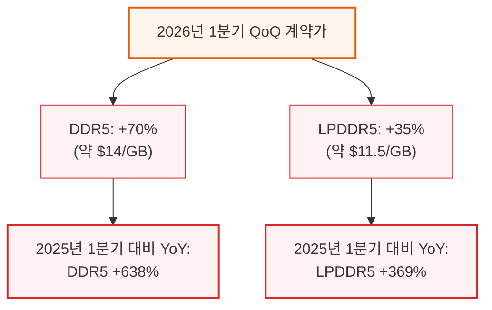
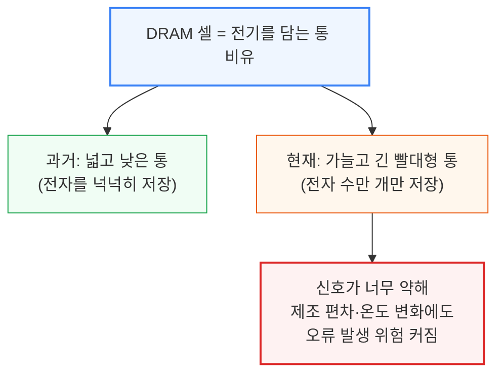
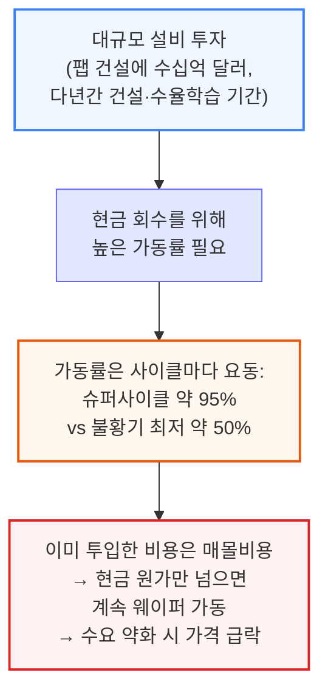
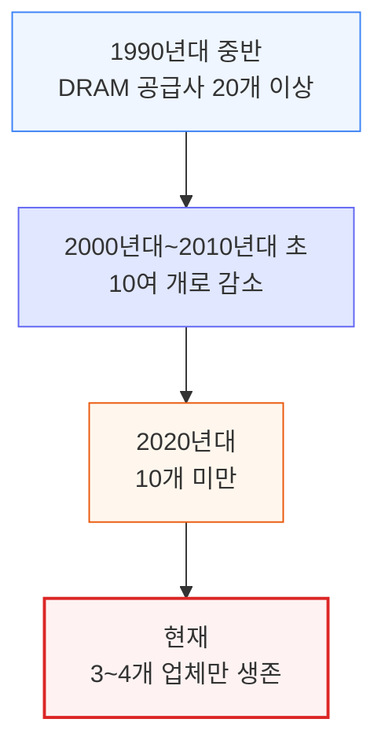

# Memory Mania: How a Once-in-Four-Decades Shortage Is Fueling a Memory Boom

> **출처**: [SemiAnalysis Newsletter](https://newsletter.semianalysis.com/p/memory-mania-how-a-once-in-four-decades)
> **저자**: Dylan Patel
> **발행일**: 2026-02-07

---

## 📑 목차

### 전체 섹션
 1. [서론: 40년 만의 공급 부족, 메모리 가격이 다시 폭등한다](#1-서론-40년-만의-공급-부족-메모리-가격이-다시-폭등한다)
 2. [DRAM 스케일링의 한계: 왜 밀도가 더는 안 늘어나는가](#2-dram-스케일링의-한계-왜-밀도가-더는-안-늘어나는가)
 3. [메모리 사이클은 왜 반복되는가: 자본집약 구조와 수요-공급 시차](#3-메모리-사이클은-왜-반복되는가-자본집약-구조와-수요-공급-시차)
 4. [과거 4번의 메모리 슈퍼사이클: 1993년부터 코로나까지](#4-과거-4번의-메모리-슈퍼사이클-1993년부터-코로나까지)
 5. [AI발 메모리 슈퍼사이클: "이중 공급부족"이 온다](#5-ai발-메모리-슈퍼사이클-이중-공급부족이-온다)
 6. [HBM이 커먼디티 DRAM을 잠식하는 구조](#6-hbm이-커먼디티-dram을-잠식하는-구조)
 7. [공급 확장의 한계: 클린룸 부족과 팹별 일정](#7-공급-확장의-한계-클린룸-부족과-팹별-일정)
 8. [가격 전망과 부작용: 스마트폰·PC 마진 압박](#8-가격-전망과-부작용-스마트폰pc-마진-압박)
 9. [HBM4 경쟁 구도와 HBM3E 가격](#9-hbm4-경쟁-구도와-hbm3e-가격)
10. [사이클은 어떻게 진화할까: 팹 조기가동과 WFE 투자 확대](#10-사이클은-어떻게-진화할까-팹-조기가동과-wfe-투자-확대)

---

## 🔑 용어 정리

본문을 순서대로 읽기 전에 알아두면 좋은 용어들입니다. 자세한 수치와 설명은 본문에서 처음 등장하는 위치에 나옵니다.

- **DRAM (동적 랜덤 액세스 메모리, Dynamic RAM)**: 컴퓨터가 지금 작업 중인 데이터를 임시로 저장하는 휘발성 메모리 — PC·서버의 "램(RAM)"이 바로 이것
- **HBM (고대역폭 메모리, High Bandwidth Memory)**: DRAM 칩을 여러 층으로 쌓아 GPU 바로 옆에 붙여, 좁은 공간에서 훨씬 빠르게 대량의 데이터를 주고받게 만든 AI 전용 메모리
- **커먼디티 DRAM (Commodity DRAM)**: HBM처럼 AI 전용으로 특화되지 않고 PC·서버·스마트폰에 두루 쓰이는 범용 DRAM — 규격이 표준화되어 있어 가격 경쟁이 특히 치열함
- **슈퍼사이클 (Supercycle)**: 메모리 가격이 통상적인 호황보다 훨씬 크고 오래 치솟는 국면 — 수요 급증과 공급 부족이 동시에 겹칠 때 발생
- **이중 공급부족 딜레마 (Dual-Shortage Dilemma)**: HBM 생산을 늘리려고 웨이퍼(반도체 원판)를 더 많이 돌릴수록 커먼디티 DRAM을 만들 여력이 줄어들어, 두 시장이 동시에 부족해지는 구조적 딜레마
- **클린룸 (Cleanroom)**: 먼지 한 톨도 회로 결함으로 이어지는 반도체 공정 특성상, 미세먼지를 극도로 제거해 지은 무균 생산 공간 — 클린룸 자체를 새로 짓는 데만 수년이 걸려 반도체 공급 확장의 병목이 됨
- **WFE (반도체 웨이퍼 제조장비 지출, Wafer Fab Equipment)**: 반도체 공장이 웨이퍼를 가공하는 데 쓰는 노광기·식각기 등 장비에 들이는 설비 투자 규모
- **EUV (극자외선 노광, Extreme Ultraviolet Lithography)**: 기존 장비로는 새기기 힘든 아주 미세한 회로 패턴을 그릴 수 있는 최신 노광 기술 — 장비 한 대 가격이 매우 비싸 공정 전환 비용을 좌우

---

## 1. 서론: 40년 만의 공급 부족, 메모리 가격이 다시 폭등한다

**📌 핵심:**
- SemiAnalysis는 2024년 말부터 1년 넘게 메모리 가격 급등을 경고해 왔는데, **아직 정점 근처에도 못 갔다**는 것이 이번 리포트의 결론
- 2026년 1분기 기준 DDR5 계약가는 전분기 대비 **70% 상승**(약 $14/GB), LPDDR5는 **35% 상승**(약 $11.5/GB) — 2025년 1분기 대비로는 각각 **638%, 369%** 폭등
- 2026년 DRAM 공급은 수요 대비 **약 7% 부족**, 그중 HBM(고대역폭 메모리) 부족률은 2025년 약 5%에서 2026년 약 6%, 2027년 약 9%까지 더 벌어질 전망
- 결론: 이번 부족은 2017\~2018년 슈퍼사이클(부족률 한 자릿수 중반)보다 더 심하고 더 오래갈 것으로 전망되며, 그 근본 원인은 AI가 촉발한 HBM 수요가 DRAM 생산 능력 자체를 구조적으로 잠식하고 있다는 데 있음

---

메모리 가격이 다시 미쳐 날뛰고 있습니다. SemiAnalysis는 2024년 말부터 1년 넘게 이 현상을 경고해 왔는데, 가장 무서운 사실은 우리가 정점 근처에도 가지 못했다는 것입니다. 이 리포트는 SemiAnalysis의 팹별(공장별) 생산량과 증설 계획을, 메모리 종류별 세부 수요 전망과 대조해 메모리 매출·가격·마진을 예측하는 **SemiAnalysis Memory Model**의 핵심 내용을 공개하는 것입니다.

이번 리포트에서 다루는 내용은 다음과 같습니다: ① 2027년까지의 DRAM·HBM 공급-수요 불일치 전망, ② HBM4 품질 인증 현황과 공급사별 시장 점유율 전망, ③ HBM을 따로 떼어낸 DRAM 웨이퍼(반도체 원판)·비트(용량 단위) 생산능력 데이터, ④ 공정 노드별 웨이퍼 생산능력 증설 트렌드와 팹별 상세 일정, ⑤ 2027년까지의 DRAM 가격 전망, ⑥ 이번 사이클이 언제·왜 끝날지에 대한 전망, ⑦ (보너스) DRAM의 EUV(극자외선 노광) 공정 적용 트렌드와 WFE(반도체 장비 지출) 전망까지.

핵심 수치는 다음과 같습니다: 2026년 DRAM 전체 공급은 수요 대비 **약 7% 부족**할 것으로 전망됩니다. 이 안에서 HBM 부족률은 올해(2025년) 약 5%에서 2026년 약 6%로, 2027년에는 약 9%까지 더 벌어질 전망입니다. 커먼디티 DRAM 역시 구조적으로 타이트한 상태가 이어져, 2026\~2027년 모두 약 7%의 공급 부족이 지속될 것으로 추정됩니다. 이 정도 규모의 부족은 메모리 산업 현대사에서 보기 드문 수준입니다. 2017\~2018년 슈퍼사이클 때조차 공급-수요 격차는 한 자릿수 중반에 그쳤던 것과 비교하면, 지금이 훨씬 더 타이트합니다. 게다가 이번 부족은 앞서 소개한 과거 상승 사이클들보다 훨씬 오래 지속될 가능성이 큽니다.

---

## 2. DRAM 스케일링의 한계: 왜 밀도가 더는 안 늘어나는가

**📌 핵심:**
- DRAM은 1970년대 상업화 이후 무어의 법칙(반도체 집적도가 주기적으로 2배씩 늘어난다는 법칙)에 힘입어 밀도가 **18개월마다 2배**(일반 반도체 로직의 24개월보다 빠름)로 늘어났지만, 최근 10년간은 **총 2배 증가**에 그침(전성기에는 10년마다 약 100배 증가)
- DRAM 셀은 전기를 담는 "통(bucket)"에 비유되는데, 이제 그 통이 극도로 가늘고 길어져(종횡비 100:1) 전자 수만 개만 저장 — 문손잡이를 만질 때 정전기 방전 한 번에 전자 수십억 개가 오가는 것과 비교하면 극히 적은 양
- 신호를 읽어내는 배선(비트라인)과 감지 회로(센스 앰프)가 이제 병목이 되어, 미세한 제조 편차·온도 변화에도 오류가 나기 쉬운 상태
- 결론: 기술 발전으로 비트당 원가를 낮추던 시대는 끝났고, 이제 DRAM 가격은 기술 혁신보다 **생산능력 증설과 수요-공급 사이클**에 훨씬 더 크게 좌우됨

---

DRAM은 1970년대 상업화된 이후, 반도체 산업을 정의해온 두 가지 스케일링 법칙 — 무어의 법칙과 데나드 스케일링(트랜지스터를 작게 만들수록 소비전력도 함께 줄어든다는 법칙) — 의 혜택을 오랫동안 누려왔습니다. 트랜지스터 1개와 커패시터(축전기) 1개로 이뤄진 "1T1C" 셀 구조가 수십 년간 그대로 작아지기만 하면서, 트랜지스터를 줄일수록 비트당 원가가 낮아지고, 정교한 커패시터 설계로 신호를 유지하기에 충분한 전하량도 지켜졌습니다.

산업 역사 대부분의 기간 동안 DRAM 밀도는 일반 반도체 로직보다 더 빠르게 늘었습니다 — 24개월이 아니라 **약 18개월마다 2배**로 늘며 원가를 극적으로 낮췄습니다. 상품화(commoditization)된 제품 특성상 제조사들은 경쟁력을 유지하려면 비트당 원가 하락을 계속 이어가야 했고, 원가 경쟁에서 뒤처진 공급사는 매출 부진 → 차세대 공정 투자 자금 부족 → 원가 경쟁력 추가 악화라는 악순환에 빠져 다수가 파산했습니다. 그 결과 오늘날 소수의 주요 업체로 산업이 통합되었습니다.

하지만 지난 수십 년간 DRAM 스케일링은 크게 둔화됐고, 시간이 갈수록 밀도 증가폭도 줄어들었습니다. 지난 10년간 DRAM 밀도는 총 **약 2배**만 늘었을 뿐인데, 이는 산업 전성기 10년당 약 100배 증가에 비하면 크게 뒤처진 수치입니다. 이제 커패시터는 종횡비가 100:1에 달하는 극단적인 3차원 구조로, 저장하는 전자 수도 겨우 수만 개에 불과합니다. 비교하자면 금속 손잡이를 만졌을 때 일어나는 작은 정전기 방전 한 번에도 전자 수십억 개가 오가고, 먼지 한 톨의 정전기 전하량조차 요즘 DRAM 셀 하나에 저장된 양의 1만 배에 달할 수 있습니다.

한때는 부차적인 문제였던 비트라인(셀을 잇는 배선)과 센스 앰프(그 신호를 읽어내는 감지 회로)가 이제는 스케일링을 가로막는 지배적인 제약 조건이 되었습니다. 공정을 미세화할 때마다 신호 여유가 줄고, 편차가 커지고, 원가가 오르는 구조입니다.

이런 제약들이 겹치면서 DRAM 밀도 증가가 정체되고 스케일링 속도가 크게 느려진 이유가 설명됩니다. DRAM 스케일링이 무너진 결과는 원가·아키텍처·산업 구조 전반에 광범위한 영향을 미칩니다. 밀도 증가가 둔화되면서 비트당 원가 하락도 함께 느려졌습니다. 이제 DRAM 가격은 기술 발전에 따른 원가 절감보다, **생산능력 증설과 주기적인 수요-공급 역학**에 훨씬 더 크게 좌우되는 구조로 바뀌었습니다 — 과거 DRAM 가격을 꾸준히 낮춰온 강력한 디플레이션 요인이 사라진 셈입니다.

---

## 3. 메모리 사이클은 왜 반복되는가: 자본집약 구조와 수요-공급 시차

**📌 핵심:**
- 메모리 산업은 상품화된 산업 특유의 경쟁 행태, 반복되는 자본 규율 실패, 앞서 설명한 DRAM 스케일링 한계가 겹쳐 **태생적으로 호황-불황을 반복**하는 구조
- DRAM 생산은 수요처럼 하루 단위로 바뀌지 않고 **증설에 수년**이 걸리는 반면, 수요는 매일 변동 — 이 시차가 사이클의 근본 원인
- 공장 가동률은 슈퍼사이클 때 약 95%, 불황기엔 50%까지 떨어질 정도로 요동치는데, 이미 투입한 설비 투자비는 회수해야 하니 공급사는 현금 원가 이상만 받으면 계속 웨이퍼(반도체 원판)를 돌림 → 수요가 약해지면 그대로 가격 폭락
- 결론: 1990년대 중반 **20개 이상**이던 DRAM 공급사는 반복된 불황을 거치며 2020년대 현재 **3\~4개**만 남았을 정도로, 메모리는 살아남기 매우 어려운 산업

---

메모리 산업은 상품화라는 특성 때문에 태생적으로 주기성을 갖습니다. 이는 산업 전반의 경쟁 행태, 반복적으로 나타나는 자본 규율의 실패, 그리고 앞서 설명한 DRAM 스케일링의 한계가 결합된 결과입니다.

근본적으로 메모리의 주기성은 수요 변화와 그에 대응하는 공급 반응 사이의 **시차**에서 비롯됩니다. 단기 재고라는 완충 장치를 빼면 DRAM 공급은 유연성이 매우 낮습니다. 의미 있는 규모의 신규 DRAM 공급을 시장에 내놓기까지 수년이 걸리는데, 정작 맞춰야 할 수요는 하루 단위로 바뀝니다.

메모리 제조는 반도체 로직과 마찬가지로 세계에서 가장 자본집약적인 산업 중 하나입니다. 최신 DRAM·NAND 팹을 짓는 데는 수십억 달러 규모의 투자(수십 년간 꾸준히 늘어옴), 다년간의 건설 기간, 공정 세대를 거듭할 때마다 이어지는 긴 수율 학습 곡선, 그리고 의미 있는 양산에 이르기까지의 긴 램프업 기간이 필요합니다.

이런 대규모 설비 투자 구조 때문에 공급사들은 투자금을 회수하려면 높은 가동률로 현금 이익을 내야 합니다. 하지만 가동률은 결국 거시경제·최종 수요 심리·제품 주기 등 다양한 외부 요인에 좌우되는 시장 수요에 달려 있습니다. 실제로 가동률은 사이클에 따라 슈퍼사이클 때 약 95%에서 심각한 불황기에는 50%까지 극단적으로 오르내립니다.

그럼에도 비용 대부분이 이미 매몰된 상태이기 때문에(팹은 이미 지어졌고 장비도 이미 구매한 상태), 공급사 입장에서는 비트를 현금 운영 원가 이상으로만 팔 수 있다면 웨이퍼를 계속 돌리는 편이 낫습니다. 수요가 비트 공급보다 약한 곳에서는 당연히 가격이 내려갑니다.

메모리 공급은 더 앞선 공정 노드로 전환하며 수율을 개선하는 방식으로도 늘어날 수 있는데, 이는 신규(그린필드) 웨이퍼 생산능력 추가 없이도 비트 공급을 늘리는 방법입니다. 예를 들어 삼성전자의 최신 1c DRAM 공정 노드는 이전 세대인 1a 노드 대비 웨이퍼 한 장당 비트 출력이 **약 70% 더 높습니다** — 같은 원자재로도 훨씬 많은 메모리 공급이 가능해진다는 뜻입니다. 다만 새 노드가 처음 도입될 때는 초기 수율이 낮아 효과적인 생산량이 제한되지만, 수율 학습이 진행되고 노드 전환이 확산될수록 웨이퍼당 비트 출력이 크게 늘어 웨이퍼 생산량이 그대로여도 비트 공급이 늘어납니다. 게다가 노드 전환은 수요가 약해진다고 멈추지 않기 때문에, 불황기에도 비트 공급 증가세가 견조하게 유지되어 공급과잉과 가격 하락 압력을 더욱 키웁니다.

불황기에는 가격 하락의 충격이 공급사에게 존폐를 가를 만큼 치명적입니다. 가격이 꺾일 무렵이면 제조사들은 이미 팹·장비에 수십억 달러 규모의 설비 투자를 집행해 놓은 상태라 경제적으로 유휴화할 수 없습니다. 수요가 약해지면 가동률이 떨어지고, 고정비를 감당하지 못하면서 현금 창출력이 급격히 악화됩니다. 그 결과 매출총이익률이 급격히 압축되고, 재무 부담이 커지는 바로 그 시점에 투자자본수익률(ROIC)을 적절히 내지 못하는 상황이 벌어집니다.

이런 "메모리 경제학" 특유의 위험은 매우 큽니다. 상품화되어 수요 탄력성은 높은데, 설비 투자 부담이 크고 회임 기간(투자부터 생산까지 걸리는 기간)이 길어 공급 탄력성은 낮은 구조가 만나 까다로운 경기순환형 시장을 만듭니다. 1990년대 초·중반 윈도우 PC 슈퍼사이클 당시에는 유의미한 DRAM 공급사가 약 20개에 달했습니다. 수요 호조와 강한 가격이 공격적인 설비 투자와 신규 진입자를 끌어들였지만, 이후 이어진 불황들이 약한 업체들을 체계적으로 도태시켰습니다. 1990년대 중반 20개 이상이던 업체 수는 2000년대\~2010년대 초반 10여 개로, 2020년대 들어서는 10개 미만으로 줄었고, 현재는 단 3\~4개의 유의미한 공급사만 남아 있습니다.

수요 측면에서 보면 메모리 소비는 항상 선형적이거나 예측 가능하지는 않습니다. 기존 제품 주기의 성숙기에는 수요 증가가 비교적 안정적으로, 주로 점진적인 대수 증가나 기기당 메모리 탑재량의 완만한 증가로 나타납니다. 하지만 새로운 컴퓨팅 플랫폼이나 아키텍처가 핵심 수요 동력으로 등장하는 "변곡점 시기"에는 메모리 수요가 갑작스럽게 바뀌며 비선형적, 때로는 폭발적으로 성장합니다. 지난 수십 년간 PC, 스마트폰, 클라우드 컴퓨팅, 그리고 이제 AI 가속기까지 여러 차례의 변곡점이 있었고, 이 시기마다 시스템 수와 기기당 메모리 탑재량이 동시에 급증했습니다. 다만 과거 사이클에서 이런 수요 변곡점은 종종 메모리 공급사들의 허를 찔렀습니다.

그러나 이런 변곡점발(發) 상승 사이클은 장기간 지속된 적이 없습니다. 과거 메모리 슈퍼사이클들은 대체로 1\~2년 안에 정점을 찍고 하강 사이클로 넘어갔는데, 이는 높아진 수익성이 공격적인 설비 투자와 생산능력 증설, 예상보다 빠른 비트 공급 증가를 유도했기 때문입니다. 이런 공급 반응이 경기순환적인 최종 수요와 맞물리면서 반복적으로 공급과잉과 시장 조정을 불러왔습니다. 금융시장 참여자들은 항상 선행적으로 움직이기 때문에, 투자자들은 공급사의 실적·마진이 실제로 정점을 찍기 훨씬 전부터 수급 균형의 변화를 미리 반영합니다 — 지난 30년간 거의 모든 메모리 사이클에서 이런 패턴이 관찰됩니다.

---

*작성 진행률: 약 30% 완료*
*업데이트: 1~3장(서론, DRAM 스케일링 한계, 메모리 사이클 반복 이유) 작성 완료*
