# Memory Mania: How a Once-in-Four-Decades Shortage Is Fueling a Memory Boom

> **출처**: [SemiAnalysis Newsletter](https://newsletter.semianalysis.com/p/memory-mania-how-a-once-in-four-decades)
> **저자**: Dylan Patel
> **발행일**: 2026-02-07

---

## 📑 목차

### 전체 섹션
 1. [서론: 40년 만의 공급 부족, 메모리 가격이 다시 폭등한다](#1-서론-40년-만의-공급-부족-메모리-가격이-다시-폭등한다)
 2. [DRAM 스케일링의 한계: 왜 밀도가 더는 안 늘어나는가](#2-dram-스케일링의-한계-왜-밀도가-더는-안-늘어나는가)
 3. [메모리 사이클은 왜 반복되는가: 자본집약 구조와 수요-공급 시차](#3-메모리-사이클은-왜-반복되는가-자본집약-구조와-수요-공급-시차)
 4. [과거 4번의 메모리 슈퍼사이클: 1993년부터 코로나까지](#4-과거-4번의-메모리-슈퍼사이클-1993년부터-코로나까지)
 5. [AI발 메모리 슈퍼사이클: "이중 공급부족"이 온다](#5-ai발-메모리-슈퍼사이클-이중-공급부족이-온다)
 6. [HBM이 커먼디티 DRAM을 잠식하는 구조](#6-hbm이-커먼디티-dram을-잠식하는-구조)
 7. [공급 확장의 한계: 클린룸 부족과 팹별 일정](#7-공급-확장의-한계-클린룸-부족과-팹별-일정)
 8. [가격 전망과 부작용: 스마트폰·PC 마진 압박](#8-가격-전망과-부작용-스마트폰pc-마진-압박)
 9. [HBM4 경쟁 구도와 HBM3E 가격](#9-hbm4-경쟁-구도와-hbm3e-가격)
10. [사이클은 어떻게 진화할까: 팹 조기가동과 WFE 투자 확대](#10-사이클은-어떻게-진화할까-팹-조기가동과-wfe-투자-확대)

---

## 🔑 용어 정리

본문을 순서대로 읽기 전에 알아두면 좋은 용어들입니다. 자세한 수치와 설명은 본문에서 처음 등장하는 위치에 나옵니다.

- **DRAM (동적 랜덤 액세스 메모리, Dynamic RAM)**: 컴퓨터가 지금 작업 중인 데이터를 임시로 저장하는 휘발성 메모리 — PC·서버의 "램(RAM)"이 바로 이것
- **HBM (고대역폭 메모리, High Bandwidth Memory)**: DRAM 칩을 여러 층으로 쌓아 GPU 바로 옆에 붙여, 좁은 공간에서 훨씬 빠르게 대량의 데이터를 주고받게 만든 AI 전용 메모리
- **커먼디티 DRAM (Commodity DRAM)**: HBM처럼 AI 전용으로 특화되지 않고 PC·서버·스마트폰에 두루 쓰이는 범용 DRAM — 규격이 표준화되어 있어 가격 경쟁이 특히 치열함
- **슈퍼사이클 (Supercycle)**: 메모리 가격이 통상적인 호황보다 훨씬 크고 오래 치솟는 국면 — 수요 급증과 공급 부족이 동시에 겹칠 때 발생
- **이중 공급부족 딜레마 (Dual-Shortage Dilemma)**: HBM 생산을 늘리려고 웨이퍼(반도체 원판)를 더 많이 돌릴수록 커먼디티 DRAM을 만들 여력이 줄어들어, 두 시장이 동시에 부족해지는 구조적 딜레마
- **클린룸 (Cleanroom)**: 먼지 한 톨도 회로 결함으로 이어지는 반도체 공정 특성상, 미세먼지를 극도로 제거해 지은 무균 생산 공간 — 클린룸 자체를 새로 짓는 데만 수년이 걸려 반도체 공급 확장의 병목이 됨
- **WFE (반도체 웨이퍼 제조장비 지출, Wafer Fab Equipment)**: 반도체 공장이 웨이퍼를 가공하는 데 쓰는 노광기·식각기 등 장비에 들이는 설비 투자 규모
- **EUV (극자외선 노광, Extreme Ultraviolet Lithography)**: 기존 장비로는 새기기 힘든 아주 미세한 회로 패턴을 그릴 수 있는 최신 노광 기술 — 장비 한 대 가격이 매우 비싸 공정 전환 비용을 좌우

---

## 1. 서론: 40년 만의 공급 부족, 메모리 가격이 다시 폭등한다

**📌 핵심:**
- SemiAnalysis는 2024년 말부터 1년 넘게 메모리 가격 급등을 경고해 왔는데, **아직 정점 근처에도 못 갔다**는 것이 이번 리포트의 결론
- 2026년 1분기 기준 DDR5 계약가는 전분기 대비 **70% 상승**(약 $14/GB), LPDDR5는 **35% 상승**(약 $11.5/GB) — 2025년 1분기 대비로는 각각 **638%, 369%** 폭등
- 2026년 DRAM 공급은 수요 대비 **약 7% 부족**, 그중 HBM(고대역폭 메모리) 부족률은 2025년 약 5%에서 2026년 약 6%, 2027년 약 9%까지 더 벌어질 전망
- 결론: 이번 부족은 2017\~2018년 슈퍼사이클(부족률 한 자릿수 중반)보다 더 심하고 더 오래갈 것으로 전망되며, 그 근본 원인은 AI가 촉발한 HBM 수요가 DRAM 생산 능력 자체를 구조적으로 잠식하고 있다는 데 있음

---

메모리 가격이 다시 미쳐 날뛰고 있습니다. SemiAnalysis는 2024년 말부터 이 현상을 경고해 왔지만, 아직 정점 근처에도 못 갔습니다. 아래는 **SemiAnalysis Memory Model**의 핵심 내용입니다.

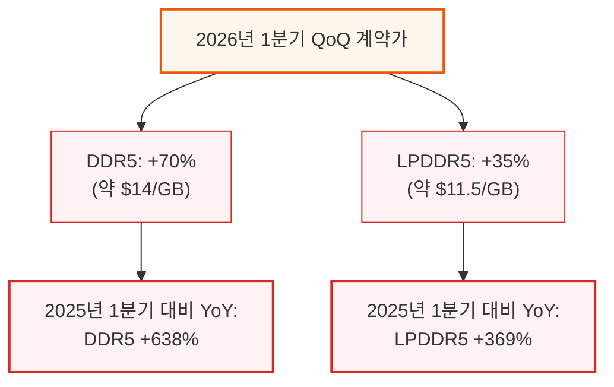
```mermaid
flowchart TD
    Price["2026년 1분기 QoQ 계약가"] --> DDR5["DDR5: +70%<br/>(약 $14/GB)"]
    Price --> LPDDR5["LPDDR5: +35%<br/>(약 $11.5/GB)"]
    DDR5 --> YoY1["2025년 1분기 대비 YoY:<br/>DDR5 +638%"]
    LPDDR5 --> YoY2["2025년 1분기 대비 YoY:<br/>LPDDR5 +369%"]

    style Price fill:#fff7ed,stroke:#ea580c,stroke-width:2px
    style DDR5 fill:#fef2f2,stroke:#dc2626
    style LPDDR5 fill:#fef2f2,stroke:#dc2626
    style YoY1 fill:#fef2f2,stroke:#dc2626,stroke-width:2px
    style YoY2 fill:#fef2f2,stroke:#dc2626,stroke-width:2px
```

이번 리포트에서 다루는 내용은 다음과 같습니다:
- ① 2027년까지의 DRAM·HBM 공급-수요 불일치 전망
- ② HBM4 품질 인증 현황과 공급사별 시장 점유율 전망
- ③ HBM을 따로 떼어낸 DRAM 웨이퍼(반도체 원판)·비트(용량 단위) 생산능력 데이터
- ④ 공정 노드별 웨이퍼 생산능력 증설 트렌드와 팹별 상세 일정
- ⑤ 2027년까지의 DRAM 가격 전망
- ⑥ 이번 사이클이 언제·왜 끝날지에 대한 전망
- ⑦ (보너스) DRAM의 EUV(극자외선 노광) 공정 적용 트렌드와 WFE(반도체 장비 지출) 전망까지

---

## 2. DRAM 스케일링의 한계: 왜 밀도가 더는 안 늘어나는가

**📌 핵심:**
- DRAM은 1970년대 상업화 이후 무어의 법칙(반도체 집적도가 주기적으로 2배씩 늘어난다는 법칙)에 힘입어 밀도가 **18개월마다 2배**(일반 반도체 로직의 24개월보다 빠름)로 늘어났지만, 최근 10년간은 **총 2배 증가**에 그침(전성기에는 10년마다 약 100배 증가)
- DRAM 셀은 전기를 담는 "통(bucket)"에 비유되는데, 이제 그 통이 극도로 가늘고 길어져(종횡비 100:1) 전자 수만 개만 저장 — 문손잡이를 만질 때 정전기 방전 한 번에 전자 수십억 개가 오가는 것과 비교하면 극히 적은 양
- 신호를 읽어내는 배선(비트라인)과 감지 회로(센스 앰프)가 이제 병목이 되어, 미세한 제조 편차·온도 변화에도 오류가 나기 쉬운 상태
- 결론: 기술 발전으로 비트당 원가를 낮추던 시대는 끝났고, 이제 DRAM 가격은 기술 혁신보다 **생산능력 증설과 수요-공급 사이클**에 훨씬 더 크게 좌우됨

---

DRAM은 1970년대 상업화된 이후, 반도체 산업을 정의해온 두 가지 스케일링 법칙(무어의 법칙, 데나드 스케일링)의 혜택을 오랫동안 누려왔습니다.

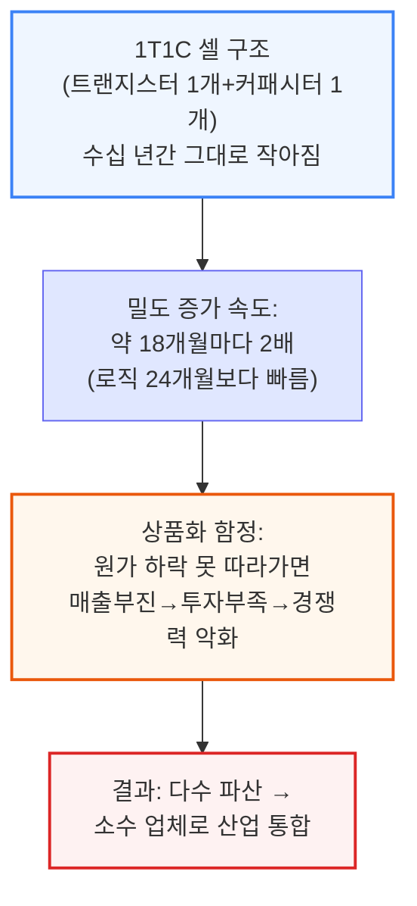
```mermaid
flowchart TD
    History["1T1C 셀 구조<br/>(트랜지스터 1개+커패시터 1개)<br/>수십 년간 그대로 작아짐"] --> Speed["밀도 증가 속도:<br/>약 18개월마다 2배<br/>(로직 24개월보다 빠름)"]
    Speed --> Trap["상품화 함정:<br/>원가 하락 못 따라가면<br/>매출부진→투자부족→경쟁력 악화"]
    Trap --> Result["결과: 다수 파산 →<br/>소수 업체로 산업 통합"]

    style History fill:#eff6ff,stroke:#3b82f6,stroke-width:2px
    style Speed fill:#e0e7ff,stroke:#6366f1
    style Trap fill:#fff7ed,stroke:#ea580c,stroke-width:2px
    style Result fill:#fef2f2,stroke:#dc2626,stroke-width:2px
```

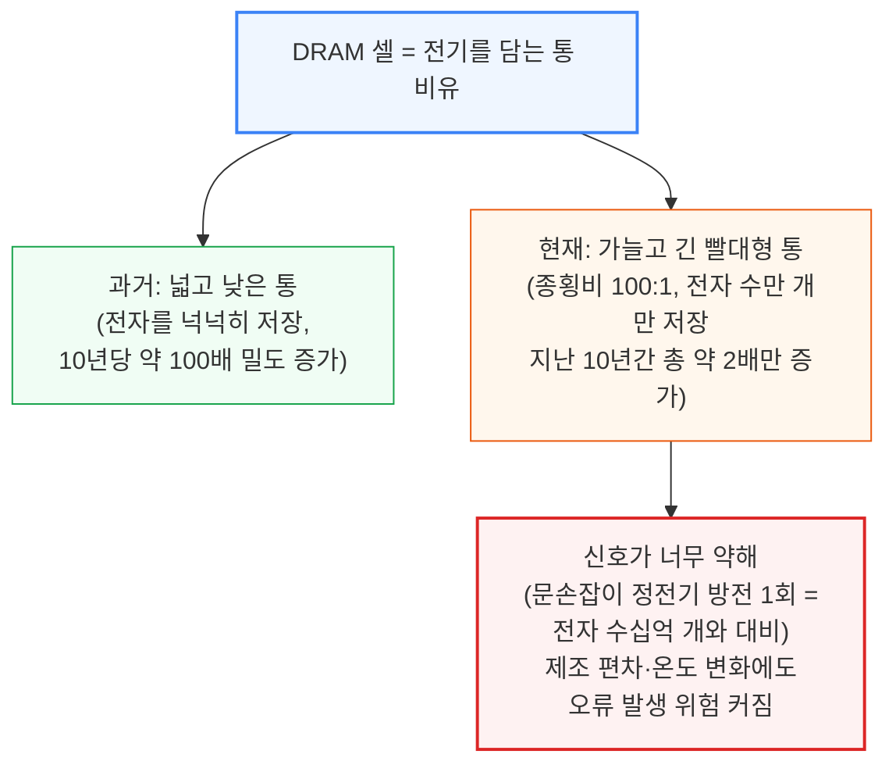
```mermaid
flowchart TD
    Bucket["DRAM 셀 = 전기를 담는 통 비유"] --> Old["과거: 넓고 낮은 통<br/>(전자를 넉넉히 저장,<br/>10년당 약 100배 밀도 증가)"]
    Bucket --> New["현재: 가늘고 긴 빨대형 통<br/>(종횡비 100:1, 전자 수만 개만 저장<br/>지난 10년간 총 약 2배만 증가)"]
    New --> Problem["신호가 너무 약해<br/>(문손잡이 정전기 방전 1회 =<br/>전자 수십억 개와 대비)<br/>제조 편차·온도 변화에도<br/>오류 발생 위험 커짐"]

    style Bucket fill:#eff6ff,stroke:#3b82f6,stroke-width:2px
    style Old fill:#f0fdf4,stroke:#16a34a
    style New fill:#fff7ed,stroke:#ea580c
    style Problem fill:#fef2f2,stroke:#dc2626,stroke-width:2px
```

그 결과 비트당 원가 하락도 느려졌고, DRAM 가격은 이제 기술 혁신보다 **생산능력 증설과 수요-공급 사이클**에 훨씬 더 크게 좌우됩니다.

---

## 3. 메모리 사이클은 왜 반복되는가: 자본집약 구조와 수요-공급 시차

**📌 핵심:**
- 메모리 산업은 상품화된 산업 특유의 경쟁 행태, 반복되는 자본 규율 실패, 앞서 설명한 DRAM 스케일링 한계가 겹쳐 **태생적으로 호황-불황을 반복**하는 구조
- DRAM 생산은 수요처럼 하루 단위로 바뀌지 않고 **증설에 수년**이 걸리는 반면, 수요는 매일 변동 — 이 시차가 사이클의 근본 원인
- 공장 가동률은 슈퍼사이클 때 약 95%, 불황기엔 50%까지 떨어질 정도로 요동치는데, 이미 투입한 설비 투자비는 회수해야 하니 공급사는 현금 원가 이상만 받으면 계속 웨이퍼(반도체 원판)를 돌림 → 수요가 약해지면 그대로 가격 폭락
- 결론: 1990년대 중반 **20개 이상**이던 DRAM 공급사는 반복된 불황을 거치며 2020년대 현재 **3\~4개**만 남았을 정도로, 메모리는 살아남기 매우 어려운 산업

---

메모리 산업은 상품화라는 특성 때문에 태생적으로 주기성을 갖습니다.

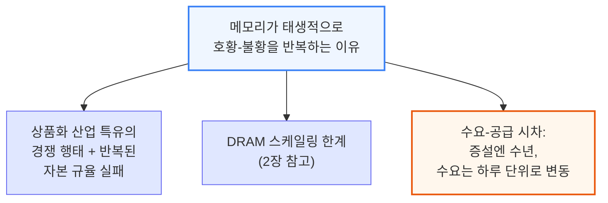
```mermaid
flowchart TD
    Cause["메모리가 태생적으로<br/>호황-불황을 반복하는 이유"] --> C1["상품화 산업 특유의<br/>경쟁 행태 + 반복된<br/>자본 규율 실패"]
    Cause --> C2["DRAM 스케일링 한계<br/>(2장 참고)"]
    Cause --> C3["수요-공급 시차:<br/>증설엔 수년,<br/>수요는 하루 단위로 변동"]

    style Cause fill:#eff6ff,stroke:#3b82f6,stroke-width:2px
    style C1 fill:#e0e7ff,stroke:#6366f1
    style C2 fill:#e0e7ff,stroke:#6366f1
    style C3 fill:#fff7ed,stroke:#ea580c,stroke-width:2px
```

메모리 제조는 반도체 로직처럼 세계 최고 수준의 자본집약적 산업으로, 팹 건설에 수십억 달러와 다년간의 건설·수율학습 기간이 필요합니다.

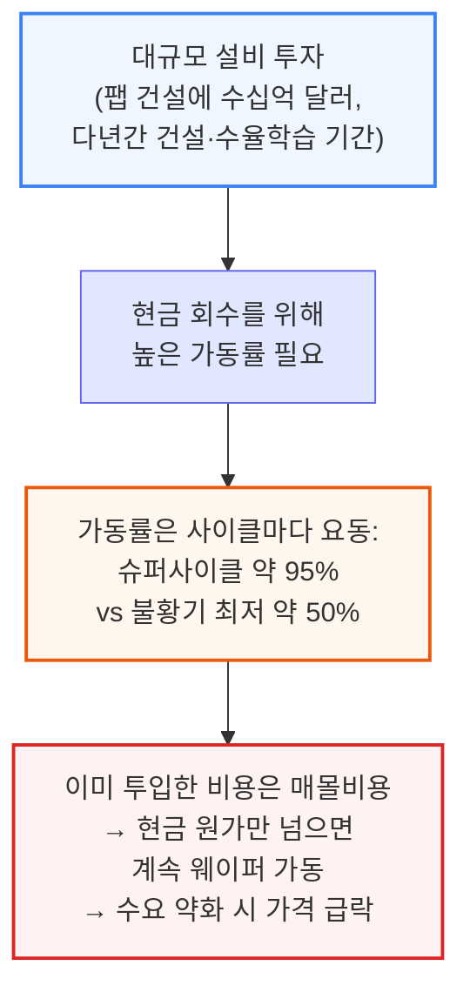
```mermaid
flowchart TD
    Capital["대규모 설비 투자<br/>(팹 건설에 수십억 달러,<br/>다년간 건설·수율학습 기간)"] --> Util["현금 회수를 위해<br/>높은 가동률 필요"]
    Util --> Swing["가동률은 사이클마다 요동:<br/>슈퍼사이클 약 95%<br/>vs 불황기 최저 약 50%"]
    Swing --> Behavior["이미 투입한 비용은 매몰비용<br/>→ 현금 원가만 넘으면<br/>계속 웨이퍼 가동<br/>→ 수요 약화 시 가격 급락"]

    style Capital fill:#eff6ff,stroke:#3b82f6,stroke-width:2px
    style Util fill:#e0e7ff,stroke:#6366f1
    style Swing fill:#fff7ed,stroke:#ea580c,stroke-width:2px
    style Behavior fill:#fef2f2,stroke:#dc2626,stroke-width:2px
```

공정 노드 전환도 신규 웨이퍼 없이 비트 공급을 늘리는 방법입니다.

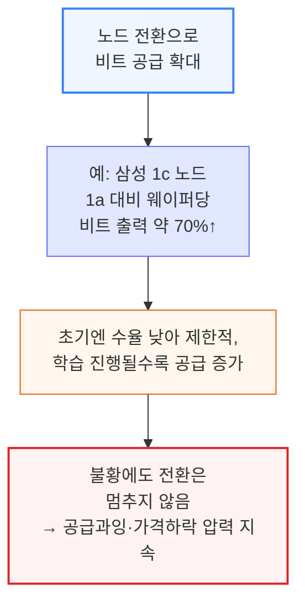
```mermaid
flowchart TD
    NodeM["노드 전환으로<br/>비트 공급 확대"] --> Ex["예: 삼성 1c 노드<br/>1a 대비 웨이퍼당<br/>비트 출력 약 70%↑"]
    Ex --> Ramp["초기엔 수율 낮아 제한적,<br/>학습 진행될수록 공급 증가"]
    Ramp --> Cycle["불황에도 전환은<br/>멈추지 않음<br/>→ 공급과잉·가격하락 압력 지속"]

    style NodeM fill:#eff6ff,stroke:#3b82f6,stroke-width:2px
    style Ex fill:#e0e7ff,stroke:#6366f1
    style Ramp fill:#fff7ed,stroke:#ea580c
    style Cycle fill:#fef2f2,stroke:#dc2626,stroke-width:2px
```

불황기엔 이미 집행한 설비투자가 매몰비용이 되어, 가동률 하락 시 매출총이익률이 급격히 압축됩니다. 이런 위험 속에 DRAM 공급사 수는 아래처럼 줄었습니다.

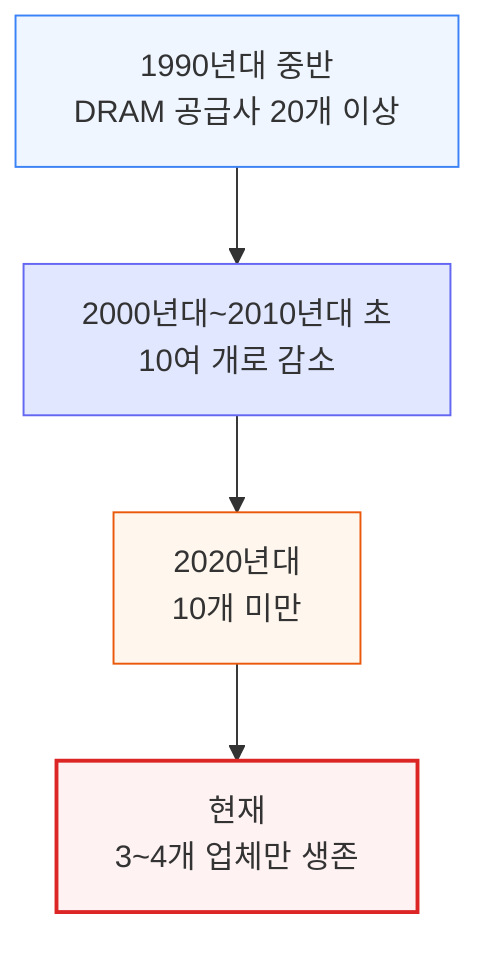
```mermaid
flowchart TD
    Y90["1990년대 중반<br/>DRAM 공급사 20개 이상"] --> Y00["2000년대~2010년대 초<br/>10여 개로 감소"]
    Y00 --> Y20["2020년대<br/>10개 미만"]
    Y20 --> Now["현재<br/>3~4개 업체만 생존"]

    style Y90 fill:#eff6ff,stroke:#3b82f6
    style Y00 fill:#e0e7ff,stroke:#6366f1
    style Y20 fill:#fff7ed,stroke:#ea580c
    style Now fill:#fef2f2,stroke:#dc2626,stroke-width:2px
```

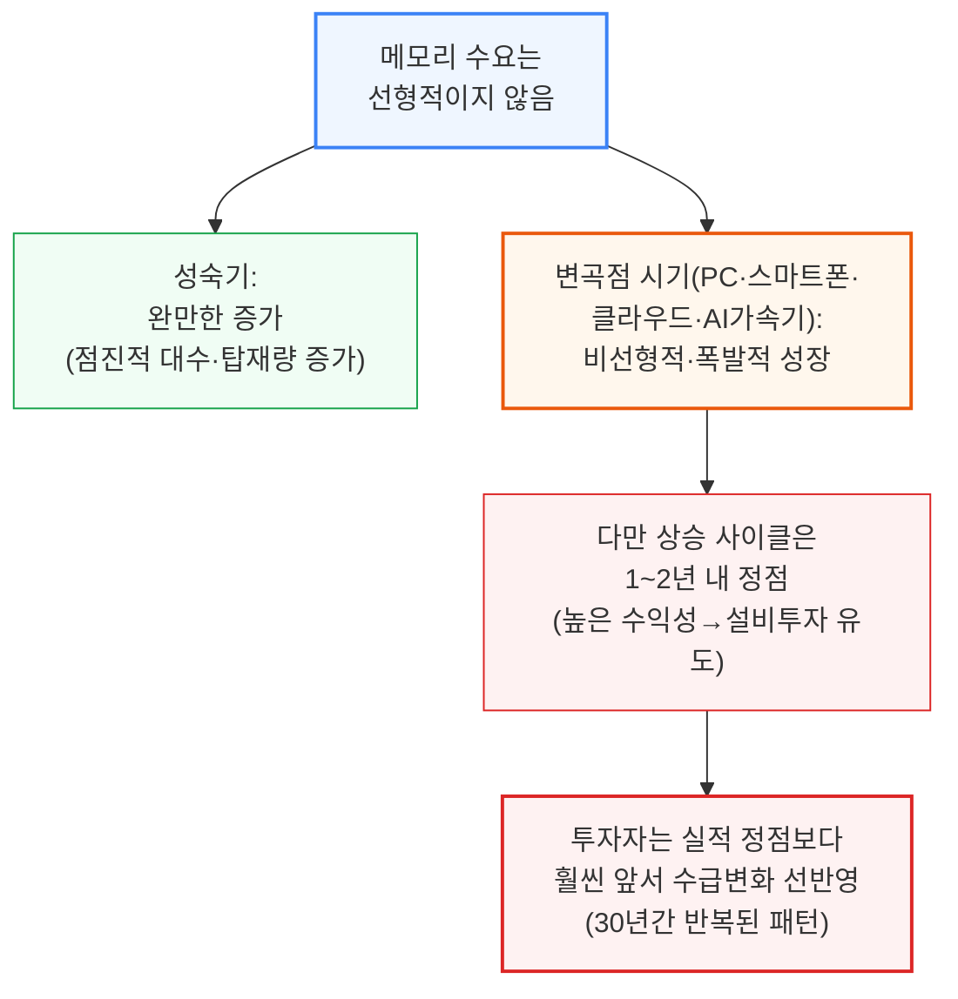
```mermaid
flowchart TD
    Demand["메모리 수요는<br/>선형적이지 않음"] --> Mature["성숙기:<br/>완만한 증가<br/>(점진적 대수·탑재량 증가)"]
    Demand --> Inflect["변곡점 시기(PC·스마트폰·<br/>클라우드·AI가속기):<br/>비선형적·폭발적 성장"]
    Inflect --> Short["다만 상승 사이클은<br/>1~2년 내 정점<br/>(높은 수익성→설비투자 유도)"]
    Short --> Forward["투자자는 실적 정점보다<br/>훨씬 앞서 수급변화 선반영<br/>(30년간 반복된 패턴)"]

    style Demand fill:#eff6ff,stroke:#3b82f6,stroke-width:2px
    style Mature fill:#f0fdf4,stroke:#16a34a
    style Inflect fill:#fff7ed,stroke:#ea580c,stroke-width:2px
    style Short fill:#fef2f2,stroke:#dc2626
    style Forward fill:#fef2f2,stroke:#dc2626,stroke-width:2px
```

---

## 4. 과거 4번의 메모리 슈퍼사이클: 1993년부터 코로나까지

**📌 핵심:**
- **1993년 윈도우 PC 사이클**: GUI(그래픽 인터페이스) 전환으로 PC 1대당 DRAM 탑재량이 1\~2MB에서 4\~8MB로 **약 4배** 급증 → 1995\~1996년 공급 과잉으로 전환되며 가격 **60% 이상 폭락**
- **2010년 스마트폰·클라우드 사이클**: 아이폰·안드로이드 확산과 초대형 클라우드 업체(구글·아마존·페이스북) 등장이 겹쳤지만, LPDDR 비중 확대로 가격 상승폭은 이전보다 완만 — DDR3 2Gb 계약가가 2010년 상반기 고점 대비 약 46% 하락
- **2017\~2018년 서버 사이클**: 서버 증설이 주도해 사상 최대 잉여현금흐름을 냈지만, 2018년 말부터 공급 재확대와 수요 정상화가 겹치며 다시 하강
- **코로나 사이클**: 재택근무 수요 폭증에 이중·삼중 발주까지 겹쳐 2021년 가격이 정점을 찍었지만, 공급사들이 이후 신중한 설비 투자 기조로 전환하며 오늘날 공급 타이트함의 토대를 만듦

---

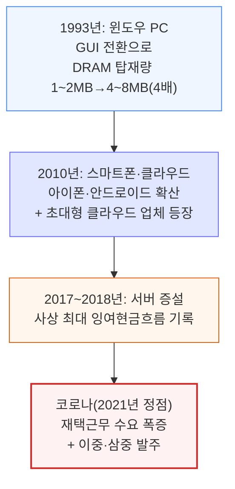
```mermaid
flowchart TD
    C1993["1993년: 윈도우 PC<br/>GUI 전환으로<br/>DRAM 탑재량 1~2MB→4~8MB(4배)"] --> C2010["2010년: 스마트폰·클라우드<br/>아이폰·안드로이드 확산<br/>+ 초대형 클라우드 업체 등장"]
    C2010 --> C2018["2017~2018년: 서버 증설<br/>사상 최대 잉여현금흐름 기록"]
    C2018 --> C2021["코로나(2021년 정점)<br/>재택근무 수요 폭증<br/>+ 이중·삼중 발주"]

    style C1993 fill:#eff6ff,stroke:#3b82f6
    style C2010 fill:#e0e7ff,stroke:#6366f1
    style C2018 fill:#fff7ed,stroke:#ea580c
    style C2021 fill:#fef2f2,stroke:#dc2626,stroke-width:2px
```

**1993년 윈도우 PC 슈퍼사이클**은 GUI(그래픽 인터페이스) 확산으로 PC당 DRAM 탑재량이 급증하며 시작됐습니다.

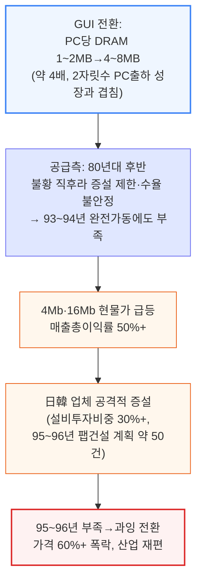
```mermaid
flowchart TD
    Y93Demand["GUI 전환:<br/>PC당 DRAM 1~2MB→4~8MB<br/>(약 4배, 2자릿수 PC출하 성장과 겹침)"] --> Y93Supply["공급측: 80년대 후반<br/>불황 직후라 증설 제한·수율 불안정<br/>→ 93~94년 완전가동에도 부족"]
    Y93Supply --> Y93Peak["4Mb·16Mb 현물가 급등<br/>매출총이익률 50%+"]
    Y93Peak --> Y93React["日韓 업체 공격적 증설<br/>(설비투자비중 30%+,<br/>95~96년 팹건설 계획 약 50건)"]
    Y93React --> Y93Bust["95~96년 부족→과잉 전환<br/>가격 60%+ 폭락, 산업 재편"]

    style Y93Demand fill:#eff6ff,stroke:#3b82f6,stroke-width:2px
    style Y93Supply fill:#e0e7ff,stroke:#6366f1
    style Y93Peak fill:#fff7ed,stroke:#ea580c
    style Y93React fill:#fff7ed,stroke:#ea580c
    style Y93Bust fill:#fef2f2,stroke:#dc2626,stroke-width:2px
```

**2010년 메모리 슈퍼사이클**은 2009년 하반기, 스마트폰 확산과 초기 하이퍼스케일러 구축이 겹치며 시작됐습니다.

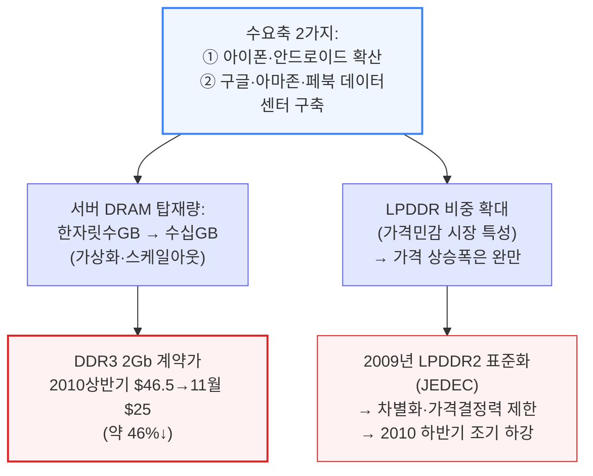
```mermaid
flowchart TD
    C2010Demand["수요축 2가지:<br/>① 아이폰·안드로이드 확산<br/>② 구글·아마존·페북 데이터센터 구축"] --> C2010Server["서버 DRAM 탑재량:<br/>한자릿수GB → 수십GB<br/>(가상화·스케일아웃)"]
    C2010Demand --> C2010LPDDR["LPDDR 비중 확대<br/>(가격민감 시장 특성)<br/>→ 가격 상승폭은 완만"]
    C2010Server --> C2010Price["DDR3 2Gb 계약가<br/>2010상반기 $46.5→11월 $25<br/>(약 46%↓)"]
    C2010LPDDR --> C2010Std["2009년 LPDDR2 표준화(JEDEC)<br/>→ 차별화·가격결정력 제한<br/>→ 2010 하반기 조기 하강"]

    style C2010Demand fill:#eff6ff,stroke:#3b82f6,stroke-width:2px
    style C2010Server fill:#e0e7ff,stroke:#6366f1
    style C2010LPDDR fill:#e0e7ff,stroke:#6366f1
    style C2010Price fill:#fef2f2,stroke:#dc2626,stroke-width:2px
    style C2010Std fill:#fef2f2,stroke:#dc2626
```

**2017\~2018년 사이클**은 서버 증설·가상화가 이끌었고, 서버 DRAM은 PC·모바일보다 마진이 높아 수익성이 좋았습니다.

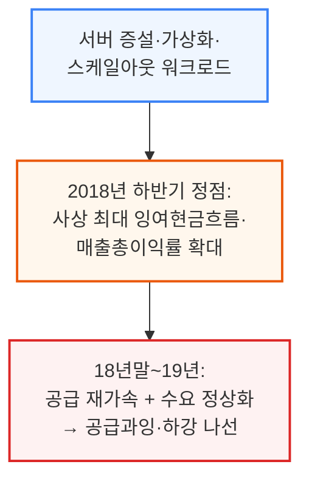
```mermaid
flowchart TD
    C2018Demand["서버 증설·가상화·<br/>스케일아웃 워크로드"] --> C2018Peak["2018년 하반기 정점:<br/>사상 최대 잉여현금흐름·<br/>매출총이익률 확대"]
    C2018Peak --> C2018Bust["18년말~19년:<br/>공급 재가속 + 수요 정상화<br/>→ 공급과잉·하강 나선"]

    style C2018Demand fill:#eff6ff,stroke:#3b82f6,stroke-width:2px
    style C2018Peak fill:#fff7ed,stroke:#ea580c,stroke-width:2px
    style C2018Bust fill:#fef2f2,stroke:#dc2626,stroke-width:2px
```

**가장 최근 사이클**은 코로나19 "칩 위기"로 촉발됐습니다 — 재택근무·원격교육·클라우드 수요가 동시에 급증했고, 팬데믹 이전 어떤 전망으로도 예상 못한 변화였습니다.

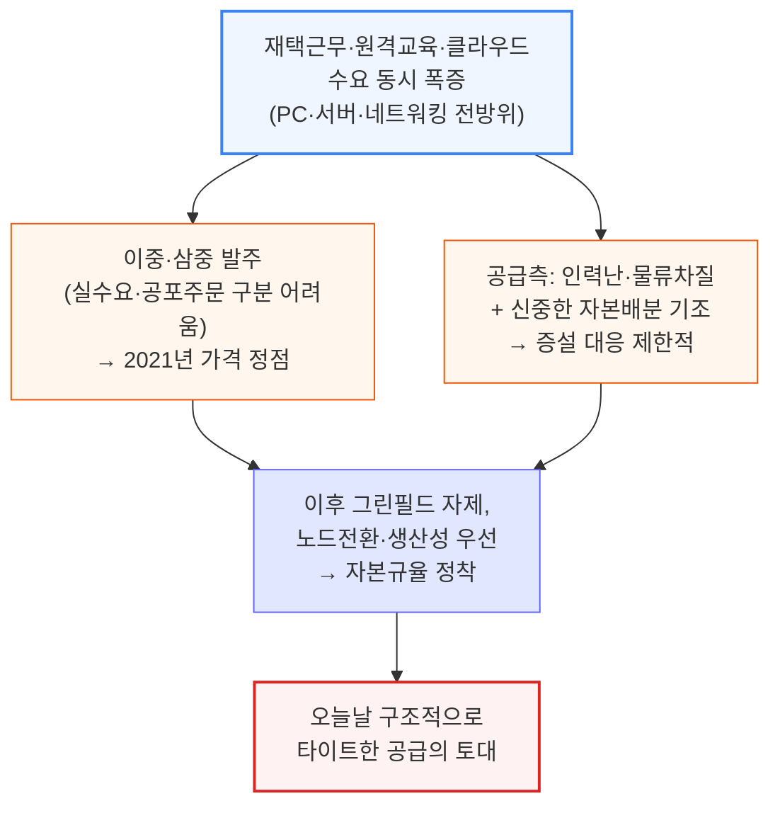
```mermaid
flowchart TD
    CovidDemand["재택근무·원격교육·클라우드<br/>수요 동시 폭증<br/>(PC·서버·네트워킹 전방위)"] --> CovidOrder["이중·삼중 발주<br/>(실수요·공포주문 구분 어려움)<br/>→ 2021년 가격 정점"]
    CovidDemand --> CovidSupply["공급측: 인력난·물류차질<br/>+ 신중한 자본배분 기조<br/>→ 증설 대응 제한적"]
    CovidOrder --> CovidLegacy["이후 그린필드 자제,<br/>노드전환·생산성 우선<br/>→ 자본규율 정착"]
    CovidSupply --> CovidLegacy
    CovidLegacy --> CovidToday["오늘날 구조적으로<br/>타이트한 공급의 토대"]

    style CovidDemand fill:#eff6ff,stroke:#3b82f6,stroke-width:2px
    style CovidOrder fill:#fff7ed,stroke:#ea580c
    style CovidSupply fill:#fff7ed,stroke:#ea580c
    style CovidLegacy fill:#e0e7ff,stroke:#6366f1
    style CovidToday fill:#fef2f2,stroke:#dc2626,stroke-width:2px
```

---

## 5. AI발 메모리 슈퍼사이클: "이중 공급부족"이 온다

**📌 핵심:**
- 지금 시점에서 가장 중요한 질문은 "언제 정점을 찍을까"인데, SemiAnalysis 판단은 이번 사이클이 과거 어떤 사이클보다 **더 크고 더 오래갈 것**이라는 것
- 2026년 DRAM 공급은 수요 대비 약 7% 부족하며, 이 부족은 정상화되는 게 아니라 오히려 **악화되는 추세** — 특히 HBM 부족률은 2025년 약 5% → 2026년 약 6% → 2027년 약 9%로 계속 벌어짐
- 커먼디티 DRAM도 2026\~2027년 내내 약 7%의 공급 부족이 지속돼, 두 시장이 동시에 부족한 **"이중 공급부족 딜레마"**에 직면
- 결론: 이 부족을 2027년, 심하면 2028년까지 지속시키는 세 가지 핵심 동인은 ① HBM 수요·생산능력 급확대, ② 클린룸 부족, ③ 1b\~1c 공정 전환 — 각각 다음 두 장에서 자세히 다룸

---

핵심 질문은 *"이 사이클은 언제 정점을 찍을까?"* — SemiAnalysis는 이번 사이클이 고유한 역학으로 **규모도 크고 기간도 길게** 전개되며, 수급 불균형이 정상화가 아니라 **악화**되고 있다고 봅니다.

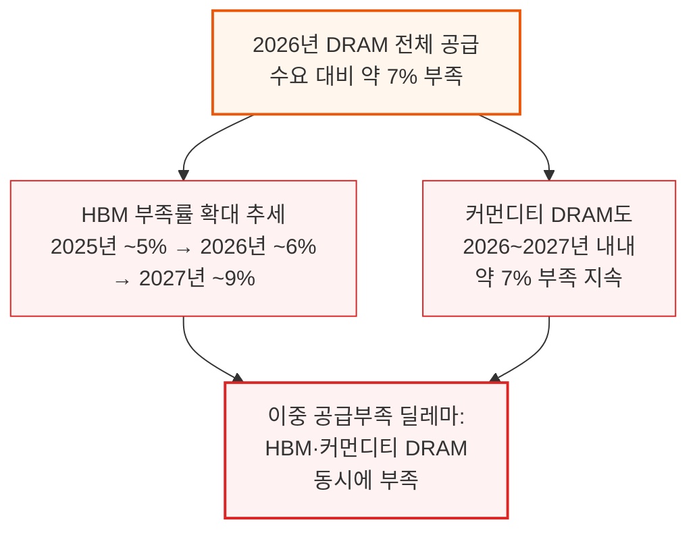
```mermaid
flowchart TD
    Total["2026년 DRAM 전체 공급<br/>수요 대비 약 7% 부족"] --> HBMGap["HBM 부족률 확대 추세<br/>2025년 ~5% → 2026년 ~6%<br/>→ 2027년 ~9%"]
    Total --> CommGap["커먼디티 DRAM도<br/>2026~2027년 내내<br/>약 7% 부족 지속"]
    HBMGap --> Dual["이중 공급부족 딜레마:<br/>HBM·커먼디티 DRAM<br/>동시에 부족"]
    CommGap --> Dual

    style Total fill:#fff7ed,stroke:#ea580c,stroke-width:2px
    style HBMGap fill:#fef2f2,stroke:#dc2626
    style CommGap fill:#fef2f2,stroke:#dc2626
    style Dual fill:#fef2f2,stroke:#dc2626,stroke-width:2px
```

SemiAnalysis가 보기에 이번 슈퍼사이클을 뒷받침하며 2027년, 잠재적으로는 2028년까지 공급 부족을 지속시킬 세 가지 핵심 동인이 있고, 각각은 사이클이 전개될수록 계속 중요한 역할을 할 것으로 보입니다:

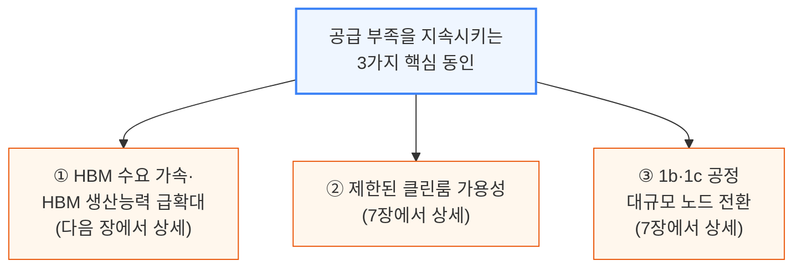
```mermaid
flowchart TD
    Drivers["공급 부족을 지속시키는<br/>3가지 핵심 동인"] --> D1["① HBM 수요 가속·<br/>HBM 생산능력 급확대<br/>(다음 장에서 상세)"]
    Drivers --> D2["② 제한된 클린룸 가용성<br/>(7장에서 상세)"]
    Drivers --> D3["③ 1b·1c 공정<br/>대규모 노드 전환<br/>(7장에서 상세)"]

    style Drivers fill:#eff6ff,stroke:#3b82f6,stroke-width:2px
    style D1 fill:#fff7ed,stroke:#ea580c
    style D2 fill:#fff7ed,stroke:#ea580c
    style D3 fill:#fff7ed,stroke:#ea580c
```

---

## 6. HBM이 커먼디티 DRAM을 잠식하는 구조

**📌 핵심:**
- 3대 메모리 공급사의 HBM 전용 웨이퍼 생산능력은 2023년 말 약 123kwspm(월간 웨이퍼 천 장 단위)에서 2025년 말 약 331kwspm으로 **2.7배 이상 확대**됐고, 2027년 말에는 약 668kwspm까지 늘어 4년 만에 **약 5배**로 커질 전망
- 전체 DRAM 웨이퍼 생산능력에서 HBM이 차지하는 비중도 2022년 5% 미만에서 2025년 말 약 20%, 2027년 말에는 **약 35%**까지 늘어 3사 합산 생산능력의 3분의 1 이상을 HBM이 가져갈 전망
- 문제는 웨이퍼 1장당 산출되는 비트(용량) 자체가 다르다는 점: HBM3E 12-Hi 기준 커먼디티 DRAM 웨이퍼가 HBM 웨이퍼보다 **약 3배** 많은 비트를 생산하며, HBM4로 전환하면 그 격차가 **약 4배**까지 벌어질 전망
- 결론: HBM 생산을 늘리려고 웨이퍼를 돌릴수록 ① 커먼디티 DRAM에 쓸 웨이퍼 수 자체가 줄고 ② 같은 웨이퍼로 만들 수 있는 비트양도 줄어드는 이중 타격이 발생 — 총 웨이퍼 생산능력이 늘어도 커먼디티 DRAM 공급은 오히려 더 타이트해지는 역설

---

2023년 무렵부터 HBM 수요는 뚜렷하고 꾸준히 가속하는 추세를 보였고, 이 급성장하는 컴퓨팅 수요를 잡기 위해 메모리 공급사들도 HBM 생산능력 확대와 투자에 갈수록 공격적으로 나섰습니다.

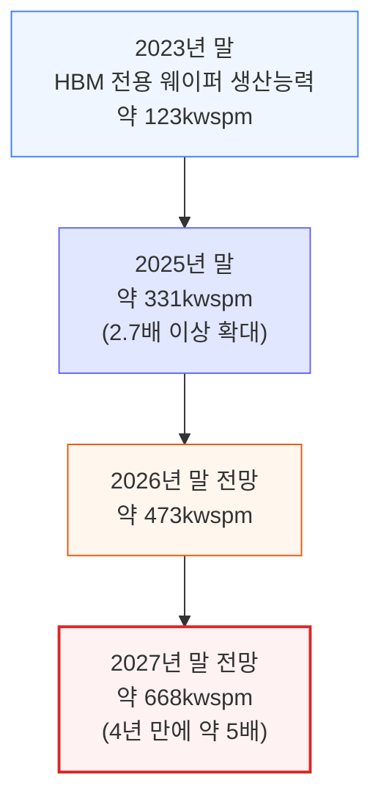
```mermaid
flowchart TD
    Y23["2023년 말<br/>HBM 전용 웨이퍼 생산능력<br/>약 123kwspm"] --> Y25["2025년 말<br/>약 331kwspm<br/>(2.7배 이상 확대)"]
    Y25 --> Y26["2026년 말 전망<br/>약 473kwspm"]
    Y26 --> Y27["2027년 말 전망<br/>약 668kwspm<br/>(4년 만에 약 5배)"]

    style Y23 fill:#eff6ff,stroke:#3b82f6
    style Y25 fill:#e0e7ff,stroke:#6366f1
    style Y26 fill:#fff7ed,stroke:#ea580c
    style Y27 fill:#fef2f2,stroke:#dc2626,stroke-width:2px
```

HBM 생산능력 확장은 여기서 끝나지 않습니다. 이미 추가 증설이 진행 중이며, 전체 DRAM 생산에서 HBM이 차지하는 웨이퍼 비중도 아래처럼 계속 커지고 있습니다.

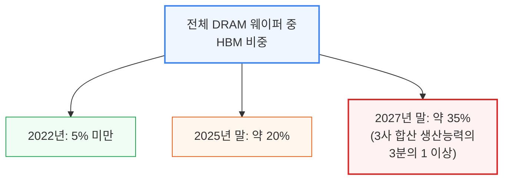
```mermaid
flowchart TD
    Share["전체 DRAM 웨이퍼 중<br/>HBM 비중"] --> S22["2022년: 5% 미만"]
    Share --> S25["2025년 말: 약 20%"]
    Share --> S27["2027년 말: 약 35%<br/>(3사 합산 생산능력의<br/>3분의 1 이상)"]

    style Share fill:#eff6ff,stroke:#3b82f6,stroke-width:2px
    style S22 fill:#f0fdf4,stroke:#16a34a
    style S25 fill:#fff7ed,stroke:#ea580c
    style S27 fill:#fef2f2,stroke:#dc2626,stroke-width:2px
```

메모리 제조사들이 이렇게까지 공격적으로 HBM에 베팅하는 이유와, 그 대가로 따르는 트레이드오프는 아래와 같습니다.

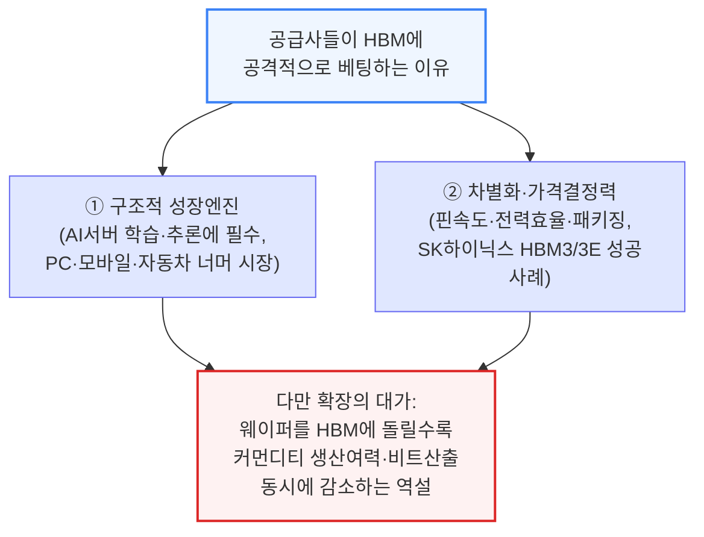
```mermaid
flowchart TD
    WhyHBM["공급사들이 HBM에<br/>공격적으로 베팅하는 이유"] --> R1["① 구조적 성장엔진<br/>(AI서버 학습·추론에 필수,<br/>PC·모바일·자동차 너머 시장)"]
    WhyHBM --> R2["② 차별화·가격결정력<br/>(핀속도·전력효율·패키징,<br/>SK하이닉스 HBM3/3E 성공사례)"]
    R1 --> Tradeoff["다만 확장의 대가:<br/>웨이퍼를 HBM에 돌릴수록<br/>커먼디티 생산여력·비트산출<br/>동시에 감소하는 역설"]
    R2 --> Tradeoff

    style WhyHBM fill:#eff6ff,stroke:#3b82f6,stroke-width:2px
    style R1 fill:#e0e7ff,stroke:#6366f1
    style R2 fill:#e0e7ff,stroke:#6366f1
    style Tradeoff fill:#fef2f2,stroke:#dc2626,stroke-width:2px
```

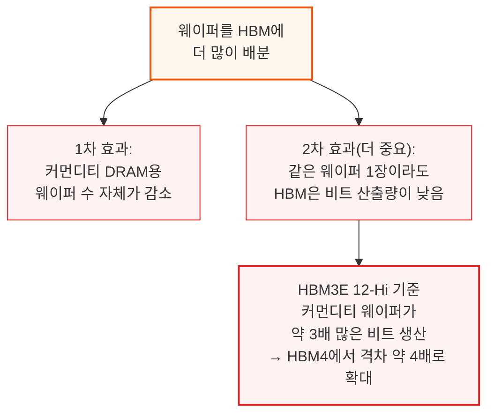
```mermaid
flowchart TD
    Reallocate["웨이퍼를 HBM에<br/>더 많이 배분"] --> First["1차 효과:<br/>커먼디티 DRAM용<br/>웨이퍼 수 자체가 감소"]
    Reallocate --> Second["2차 효과(더 중요):<br/>같은 웨이퍼 1장이라도<br/>HBM은 비트 산출량이 낮음"]
    Second --> Ratio["HBM3E 12-Hi 기준<br/>커먼디티 웨이퍼가<br/>약 3배 많은 비트 생산<br/>→ HBM4에서 격차 약 4배로 확대"]

    style Reallocate fill:#fff7ed,stroke:#ea580c,stroke-width:2px
    style First fill:#fef2f2,stroke:#dc2626
    style Second fill:#fef2f2,stroke:#dc2626
    style Ratio fill:#fef2f2,stroke:#dc2626,stroke-width:2px
```

HBM의 비트 산출이 불리한 구체적 이유는 다음과 같습니다.

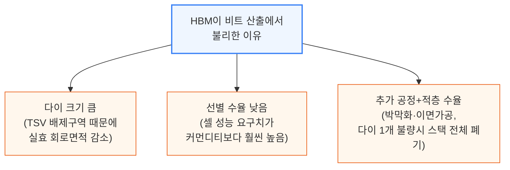
```mermaid
flowchart TD
    WhyLow["HBM이 비트 산출에서<br/>불리한 이유"] --> D1["다이 크기 큼<br/>(TSV 배제구역 때문에<br/>실효 회로면적 감소)"]
    WhyLow --> D2["선별 수율 낮음<br/>(셀 성능 요구치가<br/>커먼디티보다 훨씬 높음)"]
    WhyLow --> D3["추가 공정+적층 수율<br/>(박막화·이면가공,<br/>다이 1개 불량시 스택 전체 폐기)"]

    style WhyLow fill:#eff6ff,stroke:#3b82f6,stroke-width:2px
    style D1 fill:#fff7ed,stroke:#ea580c
    style D2 fill:#fff7ed,stroke:#ea580c
    style D3 fill:#fff7ed,stroke:#ea580c
```

시장 반응도 흥미롭습니다 — 커먼디티 DRAM 부족 심화가 가격에 미치는 영향이 예상보다 훨씬 컸습니다.

```mermaid
flowchart TD
    MarketReact["시장 반응(2025년 4분기~)"] --> M1["커먼디티 DRAM 마진이<br/>HBM 마진과 대등·상회<br/>(삼성전자 특히 두드러짐)"]
    MarketReact --> M2["일부 공급사, 2026년<br/>HBM 확장과 커먼디티 생산<br/>사이 균형 재조정 가능성"]

    style MarketReact fill:#fff7ed,stroke:#ea580c,stroke-width:2px
    style M1 fill:#fef2f2,stroke:#dc2626
    style M2 fill:#eff6ff,stroke:#3b82f6
```

---

## 7. 공급 확장의 한계: 클린룸 부족과 팹별 일정

**📌 핵심:**
- 코로나 사이클 이후 공급사들이 신중한 설비 투자 기조로 돌아서며 2025\~2026년 진입 시점에 **투자 부족**이 쌓였고, 그 결과 지금은 클린룸(반도체 무균 생산 공간) 자체가 부족해 공급을 늘리고 싶어도 못 늘리는 상황
- 2026년 신규 웨이퍼 생산능력은 사실상 **팹 단 3곳**(삼성 P4, SK하이닉스 M15X, 마이크론 A3)에 집중되는데, 이 중 M15X·A3는 대부분 HBM에 배정돼 커먼디티 DRAM 증가분은 제한적
- 신규 팹들의 실질 가동 시점은 대부분 **2027년**(SK하이닉스 용인 1기 2027년 2월 클린룸 가동, 3분기 웨이퍼 출하 / 마이크론 아이다호 1공장 2027년 중반 목표)으로 밀려 있어 당장의 공급 확대는 어려움
- 결론: 그래서 올해·내년 비트 공급 증가(각각 약 21%, 약 19%)의 주된 동력은 신규 팹이 아니라 **1b\~1c 공정 전환**이며, 이는 3사 합산 1b\~1c 생산능력을 2025년 4분기\~2027년 4분기 사이 약 80% 늘리는 방식으로 진행됨

---

제한된 클린룸 가용성도 부족의 원인입니다. 코로나 이후 보수적 투자 기조가 2025\~2026년 투자부족을 낳았고, 이제 클린룸 자체가 공급 확대의 병목입니다.

주요 공급사 전반의 DRAM 생산능력 증설을 추적한 결과, 2026년 신규 웨이퍼 생산능력의 사실상 전량이 단 세 곳의 팹에 집중될 것으로 추정합니다.

```mermaid
flowchart TD
    Y2026["2026년 신규 웨이퍼<br/>생산능력의 사실상 전량이<br/>팹 단 3곳에 집중"] --> Samsung["삼성 P4<br/>(Phase 1·3 중심,<br/>Phase 4는 연말 제한적 투입)"]
    Y2026 --> SKH["SK하이닉스 M15X<br/>(대부분 HBM 배정)"]
    Y2026 --> Micron["마이크론 A3<br/>(대부분 HBM 배정)"]

    style Y2026 fill:#fff7ed,stroke:#ea580c,stroke-width:2px
    style Samsung fill:#eff6ff,stroke:#3b82f6
    style SKH fill:#fef2f2,stroke:#dc2626
    style Micron fill:#fef2f2,stroke:#dc2626
```

```mermaid
flowchart TD
    P4Detail["삼성 P4 추가 일정"] --> P4P2["Phase 2: 원래 2027년 1분기<br/>목표, 앞당겨질 가능성<br/>(실질 기여는 2027 상반기)"]
    Tongluo["마이크론 P5 통뤄 팹<br/>(PSMC 인수)"] --> TongluoCap["2027년 하반기부터 산출<br/>완전가동시 월 약 4.5만 장<br/>(HBM용 구성시 실질산출 더 낮음)"]

    style P4Detail fill:#eff6ff,stroke:#3b82f6,stroke-width:2px
    style P4P2 fill:#f0fdf4,stroke:#16a34a
    style Tongluo fill:#eff6ff,stroke:#3b82f6,stroke-width:2px
    style TongluoCap fill:#fff7ed,stroke:#ea580c
```

```mermaid
flowchart TD
    Timeline["신규 팹의 실질 가동 시점"] --> P4["삼성 P4 Phase 4<br/>2026년 중 가동"]
    Timeline --> Yongin["SK하이닉스 용인 1기<br/>클린룸 2027년 2월,<br/>웨이퍼 산출 2027년 3분기"]
    Timeline --> Idaho["마이크론 아이다호 1공장<br/>2027년 중반 목표,<br/>웨이퍼 산출 2027년 3분기"]

    style Timeline fill:#eff6ff,stroke:#3b82f6,stroke-width:2px
    style P4 fill:#f0fdf4,stroke:#16a34a
    style Yongin fill:#fff7ed,stroke:#ea580c
    style Idaho fill:#fff7ed,stroke:#ea580c
```

이런 제약을 고려할 때 핵심 질문은 업계가 어떻게 비트 공급을 의미 있게 늘릴 수 있느냐입니다. 트레일링 노드보다 웨이퍼당 비트 출력이 훨씬 높은 1b·1c 노드로의 전환 속도를 높이는 것이 웨이퍼 생산능력이 제약된 환경에서 남아 있는 가장 효과적인 비트 확장 수단으로 보입니다.

```mermaid
flowchart TD
    Growth["비트 공급 증가율 전망"] --> ThisYear["올해(2026년): 약 21%"]
    Growth --> NextYear["내년(2027년): 약 19%"]
    ThisYear --> Node["주요 동력:<br/>3사 1b·1c 합산 생산능력<br/>2025년 4분기~2027년 4분기<br/>약 80% 증가"]
    NextYear --> Node
    Node --> Target["2026년 말까지<br/>삼성·SK하이닉스·마이크론<br/>각각 DRAM 생산의<br/>약 30%를 1c(1γ) 노드로 전환 목표"]

    style Growth fill:#fff7ed,stroke:#ea580c,stroke-width:2px
    style ThisYear fill:#eff6ff,stroke:#3b82f6
    style NextYear fill:#eff6ff,stroke:#3b82f6
    style Node fill:#e0e7ff,stroke:#6366f1
    style Target fill:#f0fdf4,stroke:#16a34a,stroke-width:2px
```

다만 DRAM 노드 전환에는 실행 마찰이 따릅니다.

```mermaid
flowchart TD
    Friction["노드 전환의 실행 마찰"] --> F1["신규 장비 설치·<br/>공정창 재최적화 필요"]
    F1 --> F2["초기 램프업 단계<br/>수율 통상 하락"]
    F2 --> F3["전환 팹은 몇 분기<br/>일시적 생산량 감소<br/>→ 장기적으로는 비트산출 이득"]

    style Friction fill:#eff6ff,stroke:#3b82f6,stroke-width:2px
    style F1 fill:#e0e7ff,stroke:#6366f1
    style F2 fill:#fff7ed,stroke:#ea580c
    style F3 fill:#f0fdf4,stroke:#16a34a,stroke-width:2px
```

---

## 8. 가격 전망과 부작용: 스마트폰·PC 마진 압박

**📌 핵심:**
- 슈퍼사이클의 첫 신호는 어김없이 가격 급등: 2026년 1분기 DDR5·LPDDR5 계약가가 전분기 대비 각각 **70%, 35%** 뛰었고, 구조적 부족이 계속될 경우 2025년 4분기 대비 2026년 4분기 기준 가격이 **또 한 번 약 2배** 오를 전망
- 애플 같은 1군 업체는 조달력과 강한 수요 덕분에 상대적으로 잘 버티지만(메모리 가격 상승 부담 약 15% vs 업계 평균 약 20%), 그마저도 2026년 하반기부터는 마진 압박이 본격화될 전망
- 중국계 등 2\~2.5군 스마트폰 업체는 원가 전가력이 약해 마진 압박이 훨씬 크고, 이미 저가·중가 모델 위주로 스펙 하향과 선별적 가격 인상이 시작됨 — PC도 4분기부터 비슷한 흐름
- 결론: 메모리·프로세서 가격이 동시에 오르는 "이중 인상"이 2026년 스마트폰·PC 출하량을 끌어내릴 위험이 있지만, 전체 DRAM 수요의 약 40%를 차지하는 서버 수요 확대가 이 소비자향 수요 둔화를 상쇄할 것으로 전망

---

메모리 슈퍼사이클에서 가장 먼저 나타나는 익숙한 패턴은 DRAM 제품 전반의 가격 상승세 가속입니다(앞서 1장에서 본 DDR5·LPDDR5 급등이 그 예). 구조적 부족이 개선되기 어렵고 공급 환경이 오히려 더 악화될 것으로 보는 만큼, DRAM 가격은 2025년 4분기 대비 2026년 4분기 기준으로 **또 한 번 약 2배** 오를 수 있다고 봅니다. 이는 선도 메모리 공급사들에게는 매우 우호적인 여건이지만, 모두에게 이롭지는 않습니다.

```mermaid
flowchart TD
    Rise["메모리 가격 상승"] --> Supplier["메모리 제조사:<br/>가격·마진 모두 우호적"]
    Rise --> Customer["고객사(OEM·최종 시장):<br/>BoM(부품원가명세) 중<br/>메모리 비중 급증 → 마진 압박"]
    Customer --> Tier1["1군(애플):<br/>조달력 우위, 상승 부담 약 15%<br/>(업계 평균 약 20%)"]
    Customer --> Tier2["1.5~2군(중국계 등):<br/>원가 전가 어려움<br/>→ 스펙 하향·가격 인상"]

    style Rise fill:#fff7ed,stroke:#ea580c,stroke-width:2px
    style Supplier fill:#f0fdf4,stroke:#16a34a
    style Customer fill:#fef2f2,stroke:#dc2626,stroke-width:2px
    style Tier1 fill:#eff6ff,stroke:#3b82f6
    style Tier2 fill:#fef2f2,stroke:#dc2626
```

메모리 가격 상승은 메모리 제조사에게는 분명히 이롭지만, 그 대가는 고객사와 더 넓은 최종 시장이 치릅니다. 부품원가명세(BoM)에서 메모리가 차지하는 비중이 커지면서 모바일·PC OEM 전반에 걸쳐 마진 압박이 생기고 있으며, 그 영향은 규모·가격 결정력·제품 믹스에 따라 달라집니다. 애플 같은 1군 업체는 우수한 조달력과 강한 아이폰17 수요 덕분에 부담이 약 **15%**로 업계 평균 약 **20%**보다 낮지만, 2026년 하반기부터는 애플조차 마진 압박을 피하기 어려울 전망입니다. 반면 원가 전가 능력이 제한적인 1.5군·2군 모바일 OEM(특히 중국계 업체)은 이미 저가·중가 기기 위주로 선별적 가격 인상과 스펙 하향을 겪고 있어, SemiAnalysis는 2026년 스마트폰 출하량 전망을 하향 조정해야 한다고 봅니다.

PC 시장에서도 비슷한 흐름이 나타나고 있습니다. OEM들은 2025년 4분기부터 이미 중저가 제품군에서 선별적 가격 인상을 단행했고, 메모리 원가 상승에 프로세서 가격 상승까지 겹친 "이중 인상"이 판매단가(ASP) 인플레이션, 수요 탄력성 약화, 2026년 출하량 감소, 반도체·ODM 업체들의 하류 실적 압박 위험을 크게 키웁니다. 이런 이유로 SemiAnalysis는 이 생태계 전반의 일부 종목에 대해 신중하거나 경우에 따라 약세 견해를 유지하고 있습니다. 전체 DRAM 최종 수요의 약 **30%**를 차지하는 PC·모바일의 출하 흐름을 면밀히 지켜보는 것이 중요하지만, 서버의 비중이 계속 커지는 점을 고려하면 이것이 소비자용 DRAM 수요 약화를 상쇄하고도 남을 것으로 봅니다. 모바일·PC를 넘어 "메모리플레이션"(memoryflation)이 AI 서버와 ODM에 미치는 영향도 업계가 점차 체감하게 될 것으로 봅니다.

---

## 9. HBM4 경쟁 구도와 HBM3E 가격

**📌 핵심:**
- HBM은 공급사에 장기 물량 계약과 높은 가시성을 주지만 연중 가격 인상 여력은 제한적 — 지금 같은 대형 슈퍼사이클에서는 가격이 훨씬 빠르게 "재산정"되는 커먼디티 DRAM 대비 상승 여력이 제한되는 구조적 약점
- 시장은 2026년 HBM3E 12-hi 판매단가가 15\~20% 하락할 것으로 예상했지만(2025년 4분기 초 컨센서스), SemiAnalysis 판단은 **오히려 보합 또는 삼성 기준 10\~15% 인상**
- HBM4 품질 인증 현황: 삼성·SK하이닉스 엔지니어링 샘플은 핀 속도 약 10Gbps 수준(목표치 미달), 마이크론은 그보다 훨씬 낮아 점유율·양산 일정에 타격 — Rubin용 R200급 HBM 공급 점유율은 SK하이닉스 약 60%, 삼성 약 30%, 마이크론 0%(첫 12개월)로 전망
- 결론: HBM4 기술 난도가 높아 수율 학습이 어려워지면서 2026년에는 HBM3E 비중이 예상보다 높게 유지되고, HBM4로의 본격 교차 전환은 **2026년 하반기**에나 이뤄질 전망

---

커먼디티 DRAM과 달리 HBM은 공급사에게 더 큰 가시성과 장기 물량 계약을 제공하지만, 그 대신 연중에 가격을 올릴 수 있는 여력은 제한됩니다. 이런 구조는 불황기나 완만한 상승기에는 유리하지만, 지금처럼 규모가 큰 슈퍼사이클에서는 가격이 훨씬 빠르게 "재산정"될 수 있는 커먼디티 DRAM 대비 상승 여력을 제한할 수 있습니다. 이런 비대칭성이 SemiAnalysis가 SK하이닉스에 대한 강세 시각을 유지하면서도, 경쟁사 대비 커먼디티 DRAM 노출 비중이 훨씬 큰 삼성전자로도 강세 전환한 핵심 이유입니다(11월 Core Research 노트). 실제로 커먼디티 DRAM 가격의 빠른 상승은 이제 HBM3E 12-hi, 그리고 아마도 올해 HBM4 가격 협상에까지 영향을 미치고 있습니다.

```mermaid
flowchart TD
    Consensus["2025년 4분기 초 컨센서스:<br/>2026년 HBM3E 12-hi 판매단가<br/>15~20% 하락 전망"] --> View["SemiAnalysis 판단:<br/>그렇지 않을 것"]
    View --> Flat["보합이 더 합리적 가정<br/>(HBM3E 비중 확대,<br/>H200 관련 추가 주문 가능성,<br/>HBM4 램프업에 따른<br/>HBM3E 공급 타이트화)"]
    View --> Samsung["삼성전자:<br/>2025년 경쟁사 대비<br/>낮은 가격 책정<br/>→ 올해 10~15% 인상 가능"]

    style Consensus fill:#eff6ff,stroke:#3b82f6
    style View fill:#fff7ed,stroke:#ea580c,stroke-width:2px
    style Flat fill:#f0fdf4,stroke:#16a34a
    style Samsung fill:#f0fdf4,stroke:#16a34a
```

HBM4 품질 인증 진행 상황도 짚어볼 필요가 있습니다. SemiAnalysis의 공급망 점검에 따르면 메모리 공급사들의 최신 HBM4 엔지니어링 샘플은 아직 핀 속도(pin speed) 목표 사양에 못 미치고 있습니다 — 삼성전자와 SK하이닉스의 샘플은 약 10Gbps 수준으로 작동하는 반면, 마이크론의 HBM4 샘플은 핀 속도가 훨씬 낮아 향후 점유율과 양산 일정에 영향을 줄 것으로 보입니다. 더 세부적으로 보면 삼성전자의 HBM4 전공정(1c)은 성능과 전력 효율에서 경쟁력이 있는 반면 SK하이닉스는 신호 무결성(지터가 더 낮아 패키지 실행력이 탄탄) 측면에서 우위를 보이며, 마이크론은 엔비디아가 요구하는 핀 속도를 맞추는 데 지속적인 어려움을 겪고 있어 SemiAnalysis는 실행력에 여전히 회의적입니다. 결국 HBM4 경쟁은 한국 메모리 공급사 2사가 주도하는 양강 구도로 좁혀질 가능성이 크다고 봅니다.

그럼에도 삼성전자가 HBM4에서 성능 격차를 좁혀가고 있지만, SK하이닉스의 검증된 실적과 신뢰성은 여전히 Rubin向 지배적인 HBM 공급사로서의 위치를 지켜줄 것으로 보이며, 그 결과 R200급 공급 점유율은 아래와 같이 전망됩니다.

```mermaid
flowchart TD
    R200["Rubin용 R200급<br/>HBM 공급 점유율 전망<br/>(첫 12개월)"] --> SKS["SK하이닉스<br/>약 60%"]
    R200 --> SamShare["삼성전자<br/>약 30%"]
    R200 --> MicronShare["마이크론<br/>0%"]

    style R200 fill:#fff7ed,stroke:#ea580c,stroke-width:2px
    style SKS fill:#f0fdf4,stroke:#16a34a,stroke-width:2px
    style SamShare fill:#eff6ff,stroke:#3b82f6
    style MicronShare fill:#fef2f2,stroke:#dc2626
```

올해 2분기로 접어들면서 HBM4 경쟁 구도에 대한 가시성이 더 좋아질 것으로 예상합니다. 메모리 공급사들은 HBM3E에서 HBM4로 전환하는 과정에서 계속 HBM4 품질·수율을 높이고 양산 준비 태세를 적극적으로 진전시켜야 할 것입니다. HBM4의 기술적 복잡성이 더 어려운 수율 학습 곡선을 요구해 공급사 마진을 압박하고, 제품 믹스 전환 속도도 이전 예상보다 늦출 수 있다고 봅니다. 그 결과 HBM3E는 애초 일부에서 전망했던 것보다 2026년 전체 HBM 포트폴리오에서 더 높은 비중을 차지할 가능성이 크며, HBM4로의 의미 있는 교차 전환은 **2026년 하반기**에나 이뤄질 것으로 봅니다.

---

## 10. 사이클은 어떻게 진화할까: 팹 조기가동과 WFE 투자 확대

**📌 핵심:**
- 역사적으로 아무리 큰 슈퍼사이클도 영원히 이어지지 않았고, 이번 사이클도 예외는 아니지만 SemiAnalysis는 **2027년까지 확장**되고 2027년 말\~2028년 들어 여건이 더 까다롭고 변동성 커질 것으로 전망(다소 공격적인 시각이나 다수 업계 관계자도 공감)
- 앞으로 벌어질 일 3가지: ① SK하이닉스·마이크론 등 **팹 일정 조기가동**(용인 1기, M15X, 아이다호 1공장 모두 앞당김), ② ASML·Lam Research도 실적 발표에서 확인한 **1b\~1c 대규모 노드 전환**, ③ 커먼디티보다 HBM을 계속 우선하는 **투자 배분 기조 지속**
- 이 세 가지를 관통하는 공통 테마는 **WFE(반도체 장비 지출) 수요 급증** — 2026년 DRAM WFE 자본투자는 삼성 약 26%, SK하이닉스 약 34%, 마이크론 약 20% 증가 전망
- 결론: EUV(극자외선 노광) 장비도 3사 모두 신규 공정에서 레이어 수를 늘리고 있어(SK하이닉스는 향후 1γ 공정에서 증가폭 둔화 예상하나 여전히 증가), ASML 등 장비업체에는 이번 사이클이 구조적 수혜로 이어질 전망

---

역사를 보면 아무리 큰 메모리 슈퍼사이클도 무한정 이어지지는 않았고, SemiAnalysis는 이번 사이클도 예외가 아닐 것으로 봅니다. 다만 앞서 계속 주장해 온 것처럼, 이번 사이클은 과거 사이클보다 더 크고 더 오래갈 수 있다고 봅니다. SemiAnalysis 시각으로는 이 슈퍼사이클이 **2027년까지 확장**될 수 있고, 2027년 말과 2028년으로 갈수록 여건이 더 까다롭고 변동성이 커질 것으로 봅니다 — 다소 공격적인 시각으로 볼 사람도 있겠지만, SemiAnalysis가 대화를 나눈 다수의 업계 관계자들도 (전부는 아니지만) 이런 시각에 공감했습니다. 앞으로 벌어질 일, 그리고 이미 벌어지고 있는 일은 다음과 같습니다:

```mermaid
flowchart TD
    Evolve["사이클 전개 전망<br/>(2027년까지 확장,<br/>2027년 말~2028년 변동성 확대)"] --> E1["① 팹 일정 조기가동·증설 가속<br/>(SK하이닉스·마이크론 모두<br/>일정 앞당김)"]
    Evolve --> E2["② 1b·1c 대규모 노드 전환<br/>(ASML·Lam Research도<br/>실적발표에서 확인)"]
    Evolve --> E3["③ HBM 우선·커먼디티 압박 지속<br/>(공급사 경영진의<br/>최우선 전략 과제)"]

    style Evolve fill:#fff7ed,stroke:#ea580c,stroke-width:2px
    style E1 fill:#eff6ff,stroke:#3b82f6
    style E2 fill:#eff6ff,stroke:#3b82f6
    style E3 fill:#eff6ff,stroke:#3b82f6
```

**① 팹 조기가동과 생산능력 확장 가속**: 3대 메모리 공급사 모두 증설 계획이 가속되면서 팹 일정이 추가로 앞당겨질 것으로 예상되며, 이미 초기 신호가 나타나고 있습니다. SK하이닉스는 M15X와 용인 1기 팹 일정을 모두 앞당겼습니다. 마이크론도 아이다호 1공장 램프업을 2027년 하반기에서 2027년 중반으로 앞당기며 생산능력 확대를 가속하고 있고, 최근 인수한 PSMC 팹은 최대 약 4만 5천 장/월의 잠재 생산능력을 추가하며 2027년 하반기부터 점진적으로 웨이퍼 산출에 기여할 것으로 예상됩니다. 생산능력 확장은 메모리 공급사들의 클린룸이 대부분 2027년 말까지 가동에 들어가면서 더 본격화될 것이고, 향후 증설 계획에 대한 추가 발표도 나올 수 있습니다.

**② 대규모 노드 전환**: 앞서 설명한 대로 업계는 앞으로 2년간 1b·1c로의 대규모 노드 전환을 거칠 것으로 보이며, 이는 ASML과 Lam Research(LRCX) 경영진이 최근 실적 발표에서 확인한 내용이기도 합니다. 이 전환은 ① 신규 웨이퍼 생산능력을 크게 늘리지 않고도 비트 산출량을 늘려야 하는 절실한 필요성, ② 2027년 1c 기반 HBM4E 도입이라는 두 가지 요인에 의해 진행됩니다.

**③ 지속되는 HBM 우선 전략과 커먼디티에 대한 지속적 압박**: 메모리 공급사들은 커먼디티 DRAM 대비 구조적으로 우수한 수익성과 장기 성장 잠재력을 고려해 HBM을 계속 최우선 전략 과제로 삼을 것으로 봅니다. 전통적인 DRAM도 매우 우호적인 가격 환경에 진입하고 있지만, HBM이 장기적으로 더 지속 가능하고 전략적으로 중요한 기회로 여겨집니다. 그 결과 HBM과 커먼디티 DRAM 사이의 생산능력 배분을 둘러싼 긴장은 메모리 기업 경영진들의 최우선 관심사로 계속 남을 것으로 예상됩니다.

이 세 가지 흐름 — 팹 조기가동, 노드 전환 가속, HBM 우선순위 강화 — 을 관통하는 공통 테마는 **WFE(반도체 웨이퍼 제조장비 지출) 수요 급증**입니다. TSMC의 2026년 설비 투자가 예상보다 훨씬 높게 나온 이후 시장은 이미 이번 사이클의 일부를 반영하기 시작했으며, 로직 분야에서는 향후 몇 년간 설비 투자 증가에 대한 확신이 더 강해지고 있습니다.

```mermaid
flowchart TD
    WFE["2026년 DRAM WFE<br/>(반도체 장비 지출)<br/>자본투자 증가율 전망"] --> Sam["삼성전자: 약 26%"]
    WFE --> SKH["SK하이닉스: 약 34%"]
    WFE --> Mic["마이크론: 약 20%"]

    style WFE fill:#fff7ed,stroke:#ea580c,stroke-width:2px
    style Sam fill:#eff6ff,stroke:#3b82f6
    style SKH fill:#eff6ff,stroke:#3b82f6
    style Mic fill:#eff6ff,stroke:#3b82f6
```

SemiAnalysis는 이런 흐름이 메모리 생태계 전반, 즉 전공정과 후공정 장비 공급사 모두에게 갈수록 확산될 것으로 예상합니다. 실제로 이번 주 ASML 경영진도 ① 강한 HBM 웨이퍼 생산능력 확장과 EUV(극자외선 노광) 레이어 수 요구 증가, ② 1b·1c 노드 전환에 대한 공급사들의 강한 수요라는 두 가지 이유로 EUV 부문에서 매우 강한 메모리 전망을 밝혔고, 3대 메모리 제조사 모두 신규 공정에서 EUV 레이어 수를 늘리고 있습니다. DRAM 공정에서 EUV가 기존 DUV(심자외선) 다중 패터닝을 대체할 수 있는 대표적인 영역은, 접근 트랜지스터(셀을 읽고 쓰게 해주는 소자)와 전하를 저장하는 커패시터가 맞닿는 혼잡한 구역입니다. 접근 트랜지스터의 소스와 저장 커패시터를 잇는 콘택트 등은 X·Y축 모두 치수가 작은 원통형 비아(via)로 좁은 선(line)보다 오히려 만들기가 더 까다로워 EUV를 가장 먼저 적용할 후보로 꼽히며, 그다음으로는 비트라인·워드라인·게이트 절단 공정이 후보입니다 — 이는 7나노 로직 공정에서 가장 촘촘한 피치의 비아 레이어가 EUV를 가장 먼저 도입했던 것과 비슷한 패턴입니다. DRAM EUV 강도는 단기적으로 크게 늘어날 전망이지만, SK하이닉스는 앞으로 나올 1γ 공정에서 MOR(다중 노광) 등의 채택으로 EUV 지출 증가세가 점차 둔화될 것으로 예상합니다 — 다만 증가세가 *느려진다* 해도 여전히 증가는 증가이며, ASML 입장에서는 여전히 좋은 소식입니다.

---

*작성 진행률: 100% 완료*
*업데이트: 10장(사이클 진화 전망: 팹 조기가동·노드 전환·WFE 투자 확대)까지 전체 10개 섹션 작성 완료*
