# Inside the 800VDC Revolution

> **출처**: [SemiAnalysis Newsletter](https://newsletter.semianalysis.com/p/inside-the-800vdc-revolution-part)
> **저자**: Dylan Patel
> **발행일**: 2026-05-26

---

## 📑 목차

### 전체 섹션
 1. [서론: 800VDC 혁명이 시작되다](#1-서론-800vdc-혁명이-시작되다)
 2. [800VDC란 무엇이고 왜 피할 수 없는가](#2-800vdc란-무엇이고-왜-피할-수-없는가)
 3. [HVDC 전환 4단계 로드맵과 도입 곡선](#3-hvdc-전환-4단계-로드맵과-도입-곡선)
 4. [Phase 1: 화이트 스페이스 레트로핏과 전력 랙의 등장](#4-phase-1-화이트-스페이스-레트로핏과-전력-랙의-등장)
 5. [전력 랙 규격의 진화: ORv3 HPR에서 Diablo 400까지](#5-전력-랙-규격의-진화-orv3-hpr에서-diablo-400까지)
 6. [Phase 1의 비용과 사이드카 시장 규모](#6-phase-1의-비용과-사이드카-시장-규모)
 7. [Phase 2: 800VDC 네이티브 컴퓨트가 만드는 전환점](#7-phase-2-800vdc-네이티브-컴퓨트가-만드는-전환점)
 8. [UPS와 배터리 저장장치의 운명](#8-ups와-배터리-저장장치의-운명)
 9. [Phase 3: 중앙 정류기로 전기 아키텍처 재설계](#9-phase-3-중앙-정류기로-전기-아키텍처-재설계)
10. [화이트 스페이스의 진화: 전력 랙에서 배터리 랙으로](#10-화이트-스페이스의-진화-전력-랙에서-배터리-랙으로)
11. [Phase 4: SST(고체상태 변압기), 최종 단계](#11-phase-4-sst고체상태-변압기-최종-단계)
12. [데이터센터 레이아웃 종합: 총비용 유지, 구성 이동, 효율 상승](#12-데이터센터-레이아웃-종합-총비용-유지-구성-이동-효율-상승)
13. [800VDC의 4가지 과제](#13-800vdc의-4가지-과제)
14. [물리 원리 심화: 저전압 배전이 무너지는 이유와 전압 토폴로지](#14-물리-원리-심화-저전압-배전이-무너지는-이유와-전압-토폴로지)
15. [공급사 영향 (1): 화이트 vs 그레이 스페이스, Delta·Lite-On·Vertiv](#15-공급사-영향-1-화이트-vs-그레이-스페이스-delta·lite-on·vertiv)
16. [공급사 영향 (2): 서구 종합 장비업체](#16-공급사-영향-2-서구-종합-장비업체)
17. [공급사 영향 (3): 백업 전원 공급망](#17-공급사-영향-3-백업-전원-공급망)

---

## 🔑 용어 정리

본문을 순서대로 읽기 전에 알아두면 좋은 용어들입니다. 자세한 수치와 설명은 본문에서 처음 등장하는 위치에 나옵니다.

- **HVDC (고전압 직류, High Voltage DC)**: 데이터센터 안에서 전기를 교류(AC) 대신 약 800V의 직류(DC)로 실어 나르는 방식 — 전선의 굵기·발열·변환 손실을 크게 줄이기 위한 배전 방식 전환
- **화이트 스페이스 vs 그레이 스페이스**: 화이트 스페이스는 GPU 서버가 실제로 늘어선 전산실 구역, 그레이 스페이스는 변압기·UPS 등 전력 설비가 들어선 후방 설비 구역 — 800VDC 전환은 이 두 구역 사이에서 "어느 쪽이 전력 변환을 맡느냐"를 두고 벌어지는 힘겨루기이기도 함
- **전력 랙 (Power Rack, 사이드카)**: GPU만 채운 서버 랙 옆에 별도로 세우는 전용 랙으로, AC를 DC로 바꾸고 배터리로 전력을 잠깐 buffer해주는 역할을 GPU 랙에서 떼어내 전담하는 장비
- **Diablo 400**: Google·Meta·Microsoft가 공동 저술해 OCP(오픈 컴퓨트 프로젝트)에 표준으로 등록한 HVDC 전력 랙 규격 — 서로 다른 제조사의 부품이 한 랙 안에서 호환되도록 정한 공통 규칙
- **배터리 랙 (Battery Rack)**: 전력 랙에서 AC→DC 변환 기능만 빠진 후속 버전 — 건물 단위로 이미 DC가 들어오는 단계에서는 배터리·커패시터로 순간 정전을 막아주는 역할만 남음
- **SST (고체상태 변압기, Solid-State Transformer)**: 철심을 감은 재래식 변압기 대신 반도체 스위칭 소자로 전압을 바꾸는 차세대 장비 — 부피는 훨씬 작으면서 중간 변환 단계를 통째로 없애줌
- **양극형(±400V) vs 단극형(800V)**: 같은 800V를 두 가닥의 +400V·-400V 전선으로 나눠 보낼지(양극형), 한 가닥의 800V로 통째로 보낼지(단극형)를 가르는 배선 설계 방식 차이
- **BBU와 슈퍼커패시터**: BBU(배터리 예비 전원)는 정전 발생 후 수초\~수분을 버텨주는 배터리, 슈퍼커패시터는 GPU 부하가 순간적으로 튀는 밀리초 단위 변동을 흡수하는 장치 — 역할과 반응 속도가 다름

---

## 1. 서론: 800VDC 혁명이 시작되다

**📌 핵심:**
- GPU 랙 하나의 전력이 **Kyber Ultra 기준 약 660kW**까지 치솟으면서, 지금까지 써온 저전압(48\~54V) 배전 방식이 물리적 한계에 부딪힘
- 800V 직류(HVDC)로 바꾸면 변환 단계가 줄고 전선 손실이 줄어 시설 전체 전력 소비를 **약 5% 절감** → 1GW급 시설 기준 상시 50MW 이상 절감, 연간 수백억 원대 전기요금 절감 또는 그만큼의 GPU를 더 돌릴 수 있는 여유 확보
- 2020년대 초 물 냉각 도입이 그랬듯, "이번에도 과할 것 같다"는 반응이 나오지만 물리와 반도체 경제성이 결국 몰아붙임
- 결론: 800VDC는 취향의 문제가 아니라 랙 전력이 계속 오르는 한 피할 수 없는 물리적 전환이며, 이번 딥다이브는 그 전환이 4단계에 걸쳐 어떻게 데이터센터 설비 구성표(BoM)를 바꾸는지, 어떤 장비가 살아남고 어떤 장비가 사라지는지를 추적

---

2026년 상반기 반도체·데이터센터 컨퍼런스마다 부스에 10\~15명씩 몰려 "800VDC가 데이터센터 전기 인프라를 바꾼다"는 설명을 듣는 광경이 반복되고 있습니다. 물 냉각이 그랬듯 처음엔 과해 보이지만, 토큰당 전력 효율이 걸린 문제라 물리와 경제성은 타협하지 않습니다.

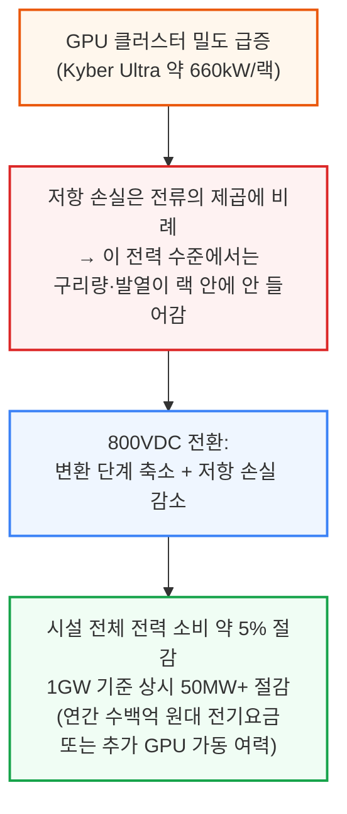

- **추적 방법론**: SemiAnalysis는 InferenceX·Industrials Model로 개별 가속기 아키텍처에서 출발해 800VDC 보급률과 전력 랙·SST 시장 규모까지 상향식 집계 — 700개 이상 데이터센터 설계, 70개 이상 장비 카테고리, 500개 이상 공급사 데이터베이스 기반
- **분석 범위**: 사이드카 레트로핏 → 시설 단위 DC 배전 → SST 최종 단계까지, 단계마다 설비 구성표의 생존·재설계·소멸을 추적해 공급사 매출 곡선의 승자와 (시장이 패자로 오판한) 기업을 미리 짚어냄

> **참고**: 이번 글은 800VDC 혁명 시리즈 Part 1로, 데이터센터 레이아웃과 장비 영향을 다룹니다. Part 2는 전력 전자·반도체 혁명을 다룰 예정입니다.

---

## 2. 800VDC란 무엇이고 왜 피할 수 없는가

**📌 핵심:**
- 800VDC는 전산실(화이트 스페이스)까지 약 800V 직류로 전력을 보낸 뒤, 컴퓨팅 장비 바로 앞에서 전압을 낮추는 방식 — 800이라는 숫자는 전류를 크게 줄이면서도 "저전압 DC"로 분류되는 규제 상한(EU 기준 DC 1,500V) 안에 들어가도록 고른 값
- 현재 표준인 48\~54V 배전은 랙 전력이 **600kW를 넘어서면 무너짐**: 1MW 랙에 필요한 구리 부스바만 약 200kg, 1GW 규모면 수백 톤 → 비용·무게·설치 공간 모두 감당 불가
- 600kW를 48\~54V로 공급하려면 전류가 약 12,500A 필요하지만, 800V로 공급하면 약 750A로 **16.7배 감소** → 저항손실(I²R)은 전류의 제곱에 비례하므로 이론상 최대 278배까지 줄어듦(실제로는 이 손실 여유분을 구리 절감으로 상당 부분 맞바꿈)
- 결론: 800VDC는 취향이 아니라 2,300W급 칩과 600kW 랙을 물리적으로 가능하게 하는 전제조건이며, 랙 하나에 GPU를 더 빽빽하게 채울수록(=토큰당 비용을 낮출수록) 더 필요해짐

---

800VDC는 데이터홀·로우 단위까지 약 800V 직류로 전력을 보낸 뒤 컴퓨팅 장비 바로 앞에서 전압을 낮추는 방식입니다. 800이라는 숫자는 임의가 아니라, 전류(구리 손실·발열 부담)를 크게 줄이면서도 여러 국가의 "저전압 DC" 규제 분류 안에 들어가도록 고른 값입니다 — EU 저전압지침(Low Voltage Directive)은 DC 기준 최대 1,500V(AC는 1,000V)까지를 규제 범위로 잡습니다.

지금 아키텍처는 시설 단위 3상 AC(415V/480V) → 재래식 UPS → 랙 안 48\~54V DC 순으로 배전합니다. 지금 랙 전력 수준에서는 문제없지만, 앞으로 2년 안에 랙 밀도가 **600kW+**로 다가서면 아래 세 가지 이유로 무너지기 시작합니다.

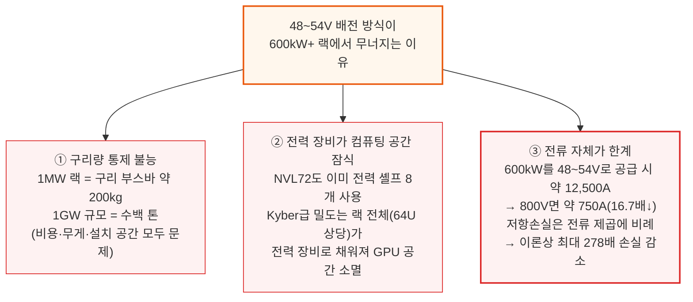

- **④ 다단 변환 손실**: AC-DC·DC-DC로 이어지는 다단 변환이 종단 간 효율을 갉아먹고 발열·고장 지점을 늘려 냉각 부하·다운타임 위험·유지보수 비용을 모두 끌어올림

왜 랙이 계속 더 밀도 높아지는지, 즉 800VDC가 왜 필요해지는지의 근본 원인은 토큰당 비용 경쟁입니다.

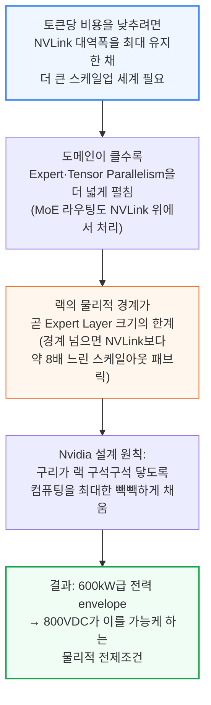

**📌 용어 풀이: 저항 손실과 I²R**
> - **저항 손실(Resistive Loss)**: 전선에 전류가 흐를 때 저항 때문에 열로 사라지는 에너지 — 전류가 커질수록 제곱으로 늘어남(I²R)
> - **왜 전압을 올리면 유리한가**: 같은 전력(P=V×I)을 옮길 때 전압을 올리면 전류(I)가 줄어들고, 손실은 전류의 제곱에 비례하므로 손실이 훨씬 큰 폭으로 줄어듦
> - **쉬운 비유**: 같은 양의 물을 옮길 때 굵은 호스(저전압·고전류)보다 가는 고압 호스(고전압·저전류)로 옮기면 마찰 손실이 훨씬 적은 것과 비슷한 원리

---

## 3. HVDC 전환 4단계 로드맵과 도입 곡선

**📌 핵심:**
- SemiAnalysis는 800VDC 전환을 **4단계**로 구분: Phase 1\~2(2026\~2028)는 기존 AC 인프라를 그대로 두고 랙 단위에서만 800VDC로 바꾸는 "레트로핏", Phase 3(2028\~2029)는 시설 전체를 DC로 재설계, Phase 4(2029년 이후)는 SST 중심의 최종 상태
- 2030년까지 800VDC로 공급되는 누적 신규 용량은 **약 39GW**로 전망 — Phase 1\~2 동안은 전량이 사이드카(전력 랙)로 처리되다가, 2029년부터 시설 단위 HVDC 배전이 가능해지며 변환 지점이 랙에서 SST·MV 정류기로 옮겨감
- Phase 1은 강제가 아니라 Google·Meta가 먼저 나선 "선제적 효율화"이고, Phase 2부터는 800VDC 네이티브 칩 때문에 사실상 필수가 됨
- 결론: 800VDC 전환은 한 번에 오지 않고, "랙만 바꾸는 레트로핏"에서 "건물 전체를 바꾸는 재설계"로 점진적으로 확산되는 다단계 과정

---

800VDC로의 전환은 전기 아키텍처 전체를 다시 쓰는 변태(metamorphosis) 과정으로, 새 안전 표준·규제 프레임워크와 함께 운영사가 기존 AC 배전을 언제 버릴지 판단해야 하는 전략적 선택을 강요합니다. 아래 4단계로 이 과정을 나눠 봅니다.

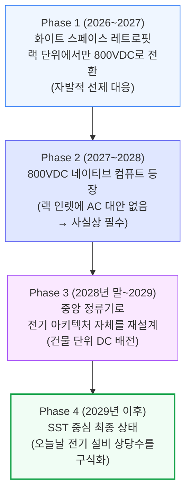

이 도입 곡선은 점진적입니다 — Phase 1\~2 동안은 시설 자체가 여전히 AC로 배전되고 변환이 전력 랙에서 일어나므로, 대응 가능한 용량 전량이 사이드카(전력 랙)로 처리됩니다.

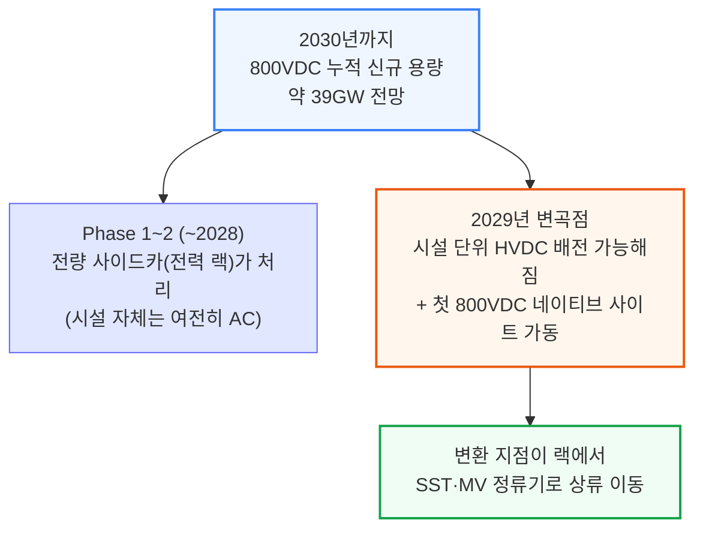

> **참고**: 배경 개념은 SemiAnalysis의 [데이터센터 해부학 Part 1(전기 시스템)](https://newsletter.semianalysis.com/p/datacenter-anatomy-part-1-electrical) 참고. 이후 섹션에서 데이터센터 레이아웃이 실제로 어떻게 바뀌는지 단계별로 살펴봅니다.

---

## 4. Phase 1: 화이트 스페이스 레트로핏과 전력 랙의 등장

**📌 핵심:**
- Phase 1의 주역은 **Google과 Meta** — 18개월 넘게 OCP 워킹그룹을 통해 800VDC 아키텍처(Mt. Diablo 레퍼런스 설계)를 밀어붙였으나, 아직 강제 사항은 아님(2026\~2027년 출시되는 Vera Rubin NVL72는 180\~220kW급이라 기존 3상 AC로도 충분)
- 변화는 랙 바로 앞에서 일어남: 기존 415/480V AC가 랙 인렛에 그대로 들어가는 대신, 로우(row) 단위의 42U 캐비닛인 **HVDC 전력 랙**에서 끊기고, 여기서 800VDC로 변환되어 옆 IT 랙들로 나감
- 전력 랙은 ① 415V AC → 800VDC 정류, ② 정전 대응용 BBU, ③ (옵션) GPU 부하 급증에 대응하는 커패시터 셸프까지 세 가지 역할을 한 랙 안에서 전담 — 그만큼 GPU 랙은 순수하게 GPU·네트워킹·냉각에만 쓸 수 있게 됨
- 결론: 발전소·변압기·UPS·스위치기어 등 건물의 전기 백본은 그대로 두고, 랙 바로 앞 단(前段)만 새 장비로 갈아 끼우는 것이 Phase 1의 본질

---

HVDC 여정은 Google·Meta에서 시작됩니다. 둘 다 18개월 넘게 OCP 워킹그룹을 통해 자체 800VDC 아키텍처를 밀어붙였고, 2024년 10월 처음 발표되어 2025년 5월 공개 표준으로 등록된 **Mt. Diablo 레퍼런스 설계**가 가장 잘 알려져 있습니다. 강제가 아니라, 나머지 시장이 따라오기 전에 기존 전력 체인에서 메가와트와 효율을 최대한 짜내려는 선제적 행보입니다.

새로운 HVDC 장비(주로 로우 단위 캐비닛인 HVDC 전력 랙)는 기존 화이트 스페이스 인프라를 교체하는 게 아니라 그 위에 얹힙니다 — 같은 변압기·UPS·스위치기어·ATS(자동 절체 스위치)가 그대로 유지되는 "화이트 스페이스 레트로핏"입니다.

### HVDC 전력 랙을 거치는 전력 흐름

시설 단위 중압(MV) AC → 변압기(415V/480V 3상 AC) → UPS(이중 변환 AC-DC-AC) → 버스웨이로 데이터홀 전역 배전까지는 기존과 동일한 흐름입니다. 변화는 IT 랙 직전에서 일어납니다: 415V가 랙 안 PSU로 곧장 들어가는 대신, 아래 그림처럼 로우 단위 HVDC 전력 랙에서 끊깁니다.

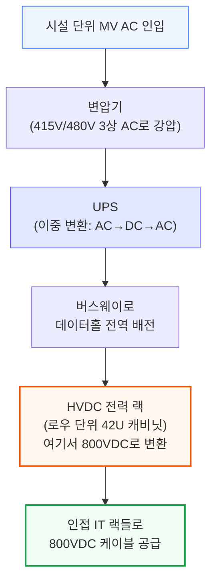

### 전력 랙이란 무엇인가

Phase 1\~2를 떠받치는 핵심 장비인 "분리형 전력 랙"은 AC-DC 정류, 에너지 저장(BBU·커패시터 뱅크), 전력 관리 기능을 하나의 유닛에 모아 컴퓨팅 랙을 온전히 GPU·네트워킹·냉각 전용으로 비워주는 전용 랙입니다. Microsoft의 Mt Diablo 프로젝트에서 시작되었고, Google·Meta·Microsoft가 공동 저술한 **OCP Diablo 400 규격**이 이를 표준화했습니다.

- **핵심 구성요소**: AC-DC 정류 모듈, BBU 셸프, (옵션) 커패시터 뱅크, 전력 관리·모니터링 보드, DC 출력 버스바·PDU
- **규격 진화 계보**: 12V 기반 ORv2 → 48V 기반 ORv3 → 물 냉각 부스바·72kW 전력 셸프로 약 190kW까지 올린 HPR V1/V2(이전 데이터센터 해부학 시리즈에서 다룸) → 이하에서는 전압 자체가 바뀌는 800VDC 분리형 사이드카 설계에 초점

---

## 5. 전력 랙 규격의 진화: ORv3 HPR에서 Diablo 400까지

**📌 핵심:**
- **HPR V3(50V 사이드카)**는 전력과 컴퓨팅을 별도 랙으로 처음 분리한 버전 — 다만 여전히 50V로 배전해 300kW에서 전류(6,000A)가 배선의 병목이 됨
- **HPR V4(±400V 사이드카)**는 전압을 50V→±400V로 올리고 부스바 대신 개별 케이블(16개, 각 50kW)을 써서 최대 800kW까지 확장 — 배터리 절반을 커패시터로 채우면 실질 용량은 400kW로 줄어듦
- **Diablo 400 규격**이 이 흐름을 표준화: Google·Meta·Microsoft 공동 저술, ±400V 양극형을 기본값·800V 단극형을 옵션으로 정의, 랙당 100kW\~1MW 범위, 여러 제조사 부품이 한 랙에서 섞여도 작동하도록 인터페이스 통일
- 결론: 400V를 고른 이유는 전기적 필요가 아니라 **경제성** — 전기차(EV) 산업이 이미 400V급 부품 공급망을 대량으로 구축해놓았기 때문에 그 생태계를 그대로 가져다 쓸 수 있음

---

### ORv3 HPR V3: 분리의 문턱 (50V 사이드카, 최대 300kW)

- **개념**: 전력과 컴퓨팅을 별도 랙으로 처음 분리한 "사이드카"의 원조 — PSU·BBU 셸프가 전용 50VDC 사이드 전력 랙으로, IT 랙과는 상하단 수평 부스바로 연결(둘 다 ORv3 HPR 표준 유지)
- **의의**: 전력 변환 장비를 컴퓨팅 랙에 욱여넣지 않고 냉각·안전·정비성을 갖춘 전용 랙에 분리해, 독립 정비와 고장 범위 축소가 가능해짐
- **한계**: 여전히 50VDC로 배전해 부스바 전류가 높고(300kW에서 6,000A), 수평 크로스링크·공랭 수직 부스바가 병목이 되어 300kW에서 막힘
- **지금도 남은 구조**: VR NVL72도 800VDC·±400VDC HVDC 전력 랙에 연결되지만 내부는 여전히 50V 부스바 — DC-DC 전력 셸프가 컴퓨팅 트레이 직전에 50VDC로, GPU 보드 VRM이 최종적으로 1V 미만까지 낮춤

### ORv3 HPR V4: ±400VDC HVDC 사이드카 (최대 800kW)

HPR V4는 OCP HPR 계보를 HVDC 시대로 연결하는 버전으로, 전압을 50VDC→±400VDC로 올리고 부스바 크로스링크를 개별 케이블로 대체합니다.

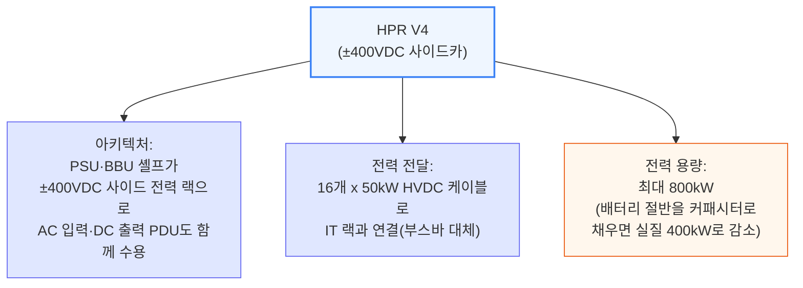

- **케이블 전환 이유**: V4의 목표 전력(400\~800kW)에서는 V3의 수평 부스바 크로스링크가 전류 한계에 부딪히기 때문 — 케이블은 독립 배선·퓨즈·관리가 가능해 단일 부스바의 열·기계적 제약을 없앰
- **위상**: 주로 Meta 랙·전력 팀이 개발한 "Diablo 이전" 단계의 사이드카 — 분리형 HVDC 전력 공급 개념은 증명했지만 아직 멀티벤더·멀티 하이퍼스케일러 규격은 아니었음

### Diablo 400 규격: HVDC 사이드카의 표준화

Diablo 400 규격(이름은 Microsoft 내부 프로젝트명 Mt Diablo에서 유래)은 HPR V4가 개척한 HVDC 사이드카 개념을 공식화·표준화합니다. 2025년 5월 초안(v0.5.2) 공개 후 업계 피드백을 반영한 v0.7.0 개정판이 뒤따랐습니다.

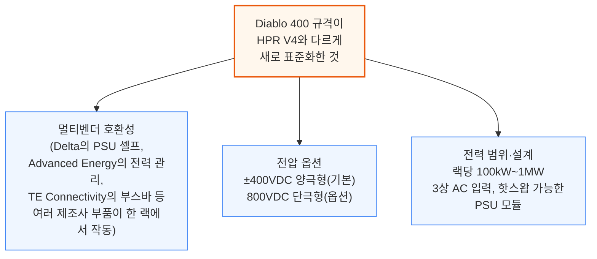

- **추가 표준화 범위(총 7개 영역)**: 케이블 규격(5m 기준 전압강하 0.1% 이내), 홀드업 시간(100% 부하·무저장 최소 20ms), 기계 설계(4OU BBU 슬라이딩 셸프, 블라인드 메이트 커넥터), 커넥티비티·랙 폼팩터·AC-DC PSU 토폴로지·DC-DC 모듈·이중화·안전 표준·전력관리 백플레인
- **왜 400V인가(경제성)**: Google이 OCP EMEA 2025에서 밝혔듯 "400VDC를 선택하면 EV 산업이 이미 구축한 공급망을 그대로 활용해 규모의 경제·제조 효율을 얻을 수 있다"가 핵심 논리 — 양극형은 각 레일이 중간점에서 400V만 떨어져 있어, 이미 성숙한 EV급 부품(650V급 GaN FET, 400V급 커패시터·커넥터·퓨즈)을 그대로 쓸 수 있음

### 모두에게 맞는 단일 규격은 없다

Diablo 400이 공통 기반 규격을 제공해도 실제 현장은 파편화되어 있습니다.

- **Nvidia**: Diablo 400 바깥에서 660kW급 단극형 800V 레퍼런스 설계 자체 개발(공랭 샘플 2026년 중반, 수랭 VR Ultra 2026년 말)
- **Meta**: 600\~800kW를 50kW급 HVDC 출력 케이블 + 200A AC 입력 whip 8개로 운용
- **Google**: BBU·슈퍼커패시터 공간을 PSU로 재배치해 900kW까지 확장, 100kW급 출력 케이블, 1.1MW 루프라인은 AC whip 12개 필요
- **Amazon**: ±400V에서 800kW로 귀결
- **Microsoft**: 규격 공동 저술자이나 진행 속도는 더 느림
- **대안 토폴로지**: DG Matrix의 Interport Cell Series처럼 재래식 정류기+PSU 스택 대신 LV 입력 SST를 쓰는 방식도 존재

---

## 6. Phase 1의 비용과 사이드카 시장 규모

**📌 핵심:**
- HVDC 전력 랙의 예상 판매단가(ASP)는 **대당 40\~50만 달러**로, 기존 표준 AC 전력 랙(대당 약 4만 달러)의 **약 10배** — MW당으로 환산하면 약 50만 달러/MW
- 사이드카(전력 랙) 시장 규모는 **2028년 약 110억 달러**로 정점을 찍은 뒤, Phase 3의 시설 단위 800VDC가 점유율을 가져가며 감소 전망
- Phase 1은 기존 장비를 지우는 게 아니라 새 장비를 얹기만 하므로, MW당 전기 설비 비용이 **약 40\~50만 달러 순증** — 이 증가분의 대부분은 HVDC 전력 랙이 차지
- 결론: Phase 1은 "효율을 사기 위해 비용을 먼저 낸다"는 단계 — 총비용이 늘어나는 대신 변환 손실이 줄어드는 트레이드오프

---

HVDC 전력 랙은 초기 레트로핏 단계에서 가장 눈에 띄는 신규 장비 비용입니다.

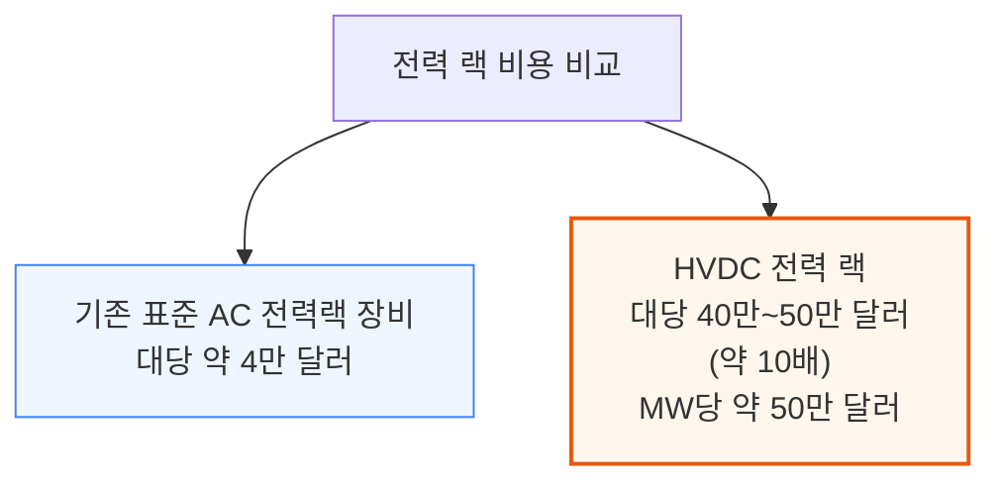

- **시장 규모 추정 방법**: Industrials Model이 단계별 도입 시점을 신규 데이터센터 증설 용량·칩 단위 SKU 계산에 적용해 사이드카·SST 각각의 TAM 추정(전력 랙 콘텐츠 MW당 50만 달러 가정) — 사이드카 시장은 **2028년 약 110억 달러**로 정점 후 Phase 3의 시설 단위 800VDC에 점유율을 내주며 감소
- **콘텐츠 순증 이유**: Phase 1은 기존 장비를 지우지 않고 새 장비만 얹으므로 전기 설비 콘텐츠/MW가 명확히 상승 — 증가분 약 **MW당 40만\~50만 달러**, 대부분 HVDC 전력 랙이 차지

---

## 7. Phase 2: 800VDC 네이티브 컴퓨트가 만드는 전환점

**📌 핵심:**
- Phase 2의 진짜 전환점은 **800VDC 네이티브 칩(Kyber Rack)**의 등장 — 랙 인렛에 AC로 되돌아갈 대안 자체가 없어지므로, 800VDC가 "미리 대비하는 선택"에서 "필수"로 바뀜
- 시설 단위 800VDC 배전은 아직 준비되지 않았기 때문에, Phase 2에서도 여전히 로우 단위 HVDC 전력 랙을 통한 레트로핏 구조가 이어짐
- Phase 1(Oberon 랙)은 전력 셸프가 IT 랙 안에서 800V→50V를 낮췄지만, Phase 2(Kyber 랙)는 800V 버스가 컴퓨팅 블레이드까지 직접 들어가고, 블레이드 위 전력 모듈이 최종 강압을 담당 — 변환 위치만 바뀌고 결국 50V까지 낮춰야 하는 것은 동일
- 결론: 초기 Kyber 설계는 랙 옆 DC-DC PSU 사이드카를 검토했으나, 공간 효율 때문에 결국 블레이드 자체에 전력 모듈을 내장하는 방식으로 굳어질 전망

---

Phase 1이 레트로핏 시대의 시작이었다면, 진짜 전환점은 800VDC 네이티브 시스템(Kyber Rack)의 등장입니다. 랙 인렛에 AC로 되돌아갈 방법이 없어, 이 구간에서 800VDC 보급률이 급격히 치솟을 것으로 예상합니다. 다만 시설 단위 배전보다 네이티브 실리콘이 먼저 나오므로 레트로핏 구조는 이 시점에도 이어집니다.

아키텍처상 Phase 2는 Phase 1과 비슷합니다 — 둘 다 HVDC 전력 랙으로 화이트 스페이스를 레트로핏하고 그레이 스페이스는 그대로 둡니다. 핵심 차이는 전압을 칩 수준까지 낮추는 위치뿐입니다.

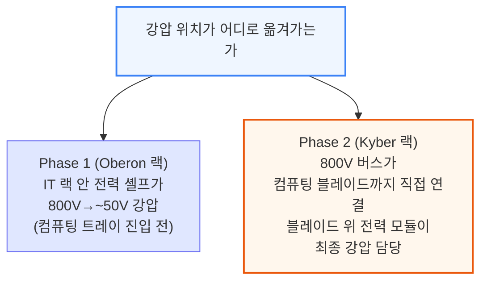

- **사이드카 방식은 채택 가능성 낮음**: OCP 공개 초기 Kyber 설계는 랙 옆 DC-DC PSU 사이드카를 검토했지만, 블레이드 내장형보다 바닥·랙 공간을 더 차지하고 전력 모듈이 트레이 부피 제약 안에서도 구현 가능함이 이미 증명되어 대규모 채택 가능성은 낮음
- **결국 둘 다 50V까지 낮춤**: 대부분 서버·트레이가 여전히 50V 입력을 쓰므로 두 아키텍처 모두 800V→약 50V DC-DC 변환을 유지 — 차이는 위치뿐. 800V→중간버스전압(IBV)→포인트오브로드로 가는 방식도 논의됐지만, Kyber 온-블레이드 모듈은 IBV 없이 곧장 50V로 변환(트레이 공간·안전 제약상 완전한 IBV 아키텍처는 여전히 어려운 과제)

---

## 8. UPS와 배터리 저장장치의 운명

**📌 핵심:**
- 800VDC 아키텍처에서 중앙집중형 저전압(LV) UPS는 점차 역할을 잃고 결국 **구식화**될 전망 — 레트로핏 단계에서는 전력 랙 자체가 BBU·슈퍼커패시터를 품고 있어 AC-DC-AC UPS 쌍의 2\~3% 변환 손실 없이 같은 역할(정전 대응·순간 변동 흡수)을 대신함
- Google·Meta는 이미 수년 전부터 중앙 UPS를 건너뛰는 "분산형 UPS" 구조를 써왔고, 이 방식은 A/B 이중 UPS가 필요 없어져 전체 배터리 용량을 절반으로 줄임
- 다만 분산형 UPS·배터리는 중앙 UPS보다 운영이 더 까다로워, Google·Meta처럼 수직 통합된 하이퍼스케일러가 아닌 사업자(특히 혼합 워크로드를 지원해야 하는 임대(colocation) 사업자)는 당분간 LV UPS를 그대로 유지할 전망
- 결론: 새로운 대안(MV UPS, 시설 단위 BESS)도 등장하고 있어, 백업 전원 전략은 운영사마다 다르게 갈라질 전망

---

기존 중앙집중형 UPS 시스템은 800VDC 전환에서 가장 논쟁적인 설비일 것입니다. 레트로핏 시대에는 전력 랙 자체가 800VDC 버스 위에서 BBU·슈퍼커패시터를 품고 있어, 아래처럼 UPS의 브릿지 기능을 대신합니다.

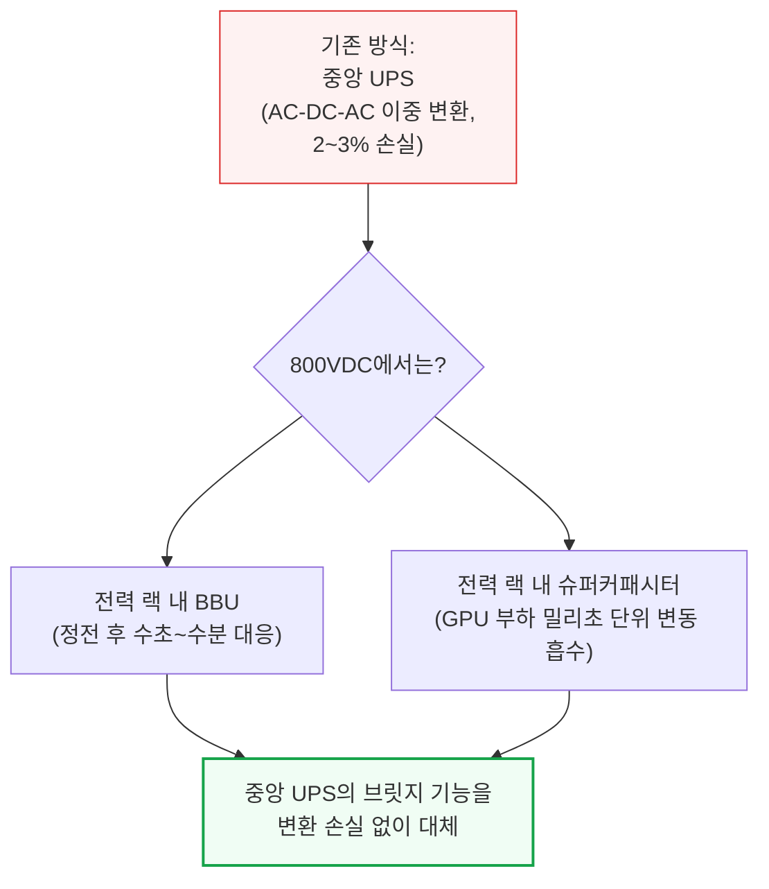

- **Google·Meta의 분산형 UPS**: 수년 전부터 중앙 UPS를 건너뛰는 구조 사용 — AC가 랙까지 직접 배전되고 랙 안 PSU가 AC-DC를, 랙 단위 리튬이온 BBU가 브릿지 전력을 담당. 중앙 UPS의 AC-DC-AC 변환 쌍이 사라져 효율↑, A/B 이중 UPS가 불필요해져 배터리 총용량도 절반으로 감소
- **다른 운영사는 LV UPS 유지 전망**: 분산형은 운영이 더 까다로워, 수직 통합이 아닌 사업자(특히 CPU·스토리지·네트워킹·구형 AC GPU 랙이 섞인 워크로드를 지원해야 하는 임대(colocation) 사업자)는 중기적으로 LV UPS 유지 — 그레이 스페이스 AC를 남겨두면 밀도 높은 AI 랙만 800VDC, 나머지는 표준 AC로 운영 가능
- **새로운 대안들**: 그리드 연결 지점에서 4.16\~34.5kV로 작동하는 MV UPS(ABB HiPerGuard, 98% 효율, Applied Digital 노스다코타 400MW 캠퍼스에 배치; ON.energy는 MV 이중 변환 UPS 특허 최근 획득), 그리고 1\~4시간 지속시간의 시설 단위 BESS(디젤 발전기를 점점 대체·축소)

---

## 9. Phase 3: 중앙 정류기로 전기 아키텍처 재설계

**📌 핵심:**
- Phase 1\~2는 AC-DC 변환이 랙 바로 앞에서 일어났지만, Phase 3는 데이터센터 레이아웃 자체를 바꿔 **800VDC를 건물의 전기 핵심**으로 만듦 — 그레이 스페이스나 실외에 자리한 중앙 정류기가 415V AC를 800VDC로 바꿔 홀 전체에 DC로 배전
- 그레이 스페이스는 둘로 쪼개짐: MV 변압기·스위치기어는 그대로(유틸리티 인입은 여전히 AC), 반면 480V AC 스위치기어와 AC 바닥 PDU는 **역할이 사라져 통째로 삭제**
- DC는 AC처럼 자연스럽게 소멸하는 아크가 없어(초당 100\~120회 영점교차 없음) 배전 중 통전 상태에서 회로를 끊는 탭오프가 훨씬 어려움 → 초기 배치는 탭오프 없는 피더 전용 버스웨이 위주, SiC/GaN 기반 고체상태 차단기(SSCB)가 대안으로 부상
- 결론: "AC-DC 변환 지점보다 위는 그대로 남고, 그 아래(AC 배전용으로 설계된 모든 것)는 사라진다"는 것이 Phase 3의 요약

---

Phase 1\~2에서는 AC-DC 변환이 랙 바로 앞에서 일어났지만, Phase 3는 데이터센터 레이아웃 자체를 바꿔 800VDC가 건물의 전기 핵심이 되는 진짜 변곡점입니다. 각 구역에서 무엇이 바뀌는지 하나씩 풀어봅니다.

### 그레이 스페이스: 전력 배전이 DC로 바뀐다

Phase 3에서는 그레이 스페이스·실외의 전용 상류 정류기(1,200\~1,700V급 실리콘 IGBT·사이리스터)가 415V AC를 800VDC로 바꿔 홀 전체에 DC로 배전합니다. MV 인프라(11\~34kV)는 유틸리티 인입이 여전히 AC라 그대로 남고, 시설이 기가와트급으로 커질수록 오히려 더 복잡해질 전망입니다.

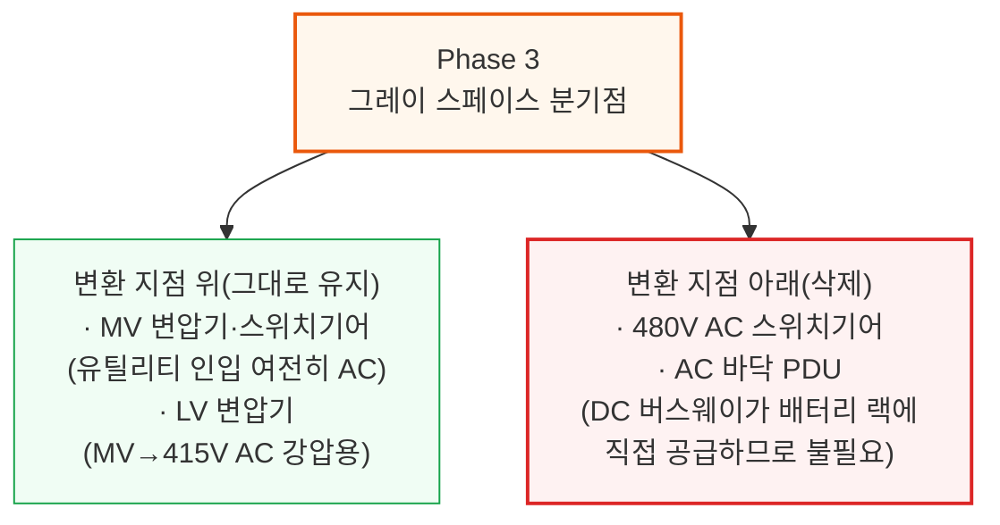

### DC 배전 이해하기: 스위치보드, 버스웨이, 보호 장치

Phase 3에서는 하나의 AC 피드를 여러 보호된 출력으로 나누던 AC 스위치보드의 기능이 옮겨가야 합니다.

- **흡수할 3개 제품 카테고리**: (i) 출력마다 SSCB 보호를 내장한 MW급 정류기(정류기가 배전 장치 겸용), (ii) 차단기 달린 탭오프 박스를 갖춘 DC 버스웨이, (iii) 정류기·스위치보드·버스웨이를 공장에서 묶은 조립식 그레이 스페이스 파드(하이퍼스케일러 조달용)
- **독립 스위치보드는 틈새시장**: Schneider·ABB·Eaton·Vertiv는 아직 독립 800VDC 스위치보드가 없음(ABB-Nvidia 협업도 자사 "모듈형 파워 블록" 내부 배전일 뿐) — EPEC Solutions만 800VDC LV 스위치보드를 실제 판매, 벤더 중립성을 원하는 레트로핏 현장에서 수요 예상
- **탭오프 vs 피더 전용 버스웨이**: 기존 AC는 통전 상태에서도 랙·로우별 전력을 분기하는 "탭오프"가 가능하지만, DC는 AC처럼 파형이 초당 100\~120회 영점을 지나며 아크가 자연 소멸하는 구조가 없어 부하 상태에서 전류를 끊으면 아크가 꺼지지 않음 — 초기 배치는 탭오프 없는 피더 전용 버스웨이 위주(Delta·ABB가 800VDC 버스웨이 프로그램 발표, Legrand·EAE도 2026년 중 합류 예상)
- **고체상태 차단기(SSCB)가 대안**: SiC·GaN으로 마이크로초 단위 고장 전류 차단 — 반도체 스위치는 접점을 뗄 필요 없이 전류만 안 흘리면 되므로 애초에 아크가 생기지 않음(ABB Emax 2·SACE Infinitus, LS Electric의 UL 인증 1500V DC 차단기 등 이미 상용화)

### LV SST를 이용한 대안 경로

중앙집중형 AC/DC 정류기의 신흥 대안은 **저압(LV) SST**입니다. 그레이 스페이스·실외에서 같은 415V AC→800VDC 변환을 더 컴팩트·프로그래밍 가능한 폼팩터로 수행하며, MV 입력 SST의 발목을 잡는 3,300V급 SiC 공급 제약을 우회해 더 먼저 시장에 나올 수 있습니다.

---

## 10. 화이트 스페이스의 진화: 전력 랙에서 배터리 랙으로

**📌 핵심:**
- Phase 3에서는 전력 랙이 800VDC 변환 작업을 더 이상 할 필요가 없어져, 정류 기능만 빠진 후속 장비인 **배터리 랙**으로 대체됨 — MW당 콘텐츠는 약 20만 달러로, 정류기가 빠진 만큼 낮지만 BBU·커패시터 비중은 오히려 높아짐
- BBU 모듈 용량도 커짐: 현재 약 5.5kW급에서 Rubin Ultra·800VDC 시대에는 **8\~12kW급**으로 상승(Delta는 110kW 전력 셸프에 80kW BBU를 내장해 6셸프 랙 전체 480kW 구성)
- 시설 단위에서는 냉각·조명·소화설비 등이 여전히 AC로 작동해 가장 변화가 적은 구역으로 남고, 발전기 의존도는 800VDC와 무관하게 이미 일부 하이퍼스케일러에서 줄어드는 추세
- 결론: 정류가 MV(중압) 단에서 직접 이뤄지지 않는 이유는 10kV 이상을 감당하는 반도체 소자가 상용화되지 않았기 때문이지만, Wolfspeed의 10kV SiC MOSFET 등장으로 그 간극이 좁혀지고 있어 다음 단계(Phase 4)로 이어짐

---

### 전력 랙에서 배터리 랙으로

Phase 3에서는 800VDC 변환을 수행하는 전력 랙이 더 이상 필요 없어, 새 장비인 **배터리 랙**이 그 자리를 대신합니다. 구성요소·기능 대부분은 공유하지만 그레이 스페이스에서 800VDC를 그대로 받아 AC-DC 정류를 하지 않는 점이 다릅니다.

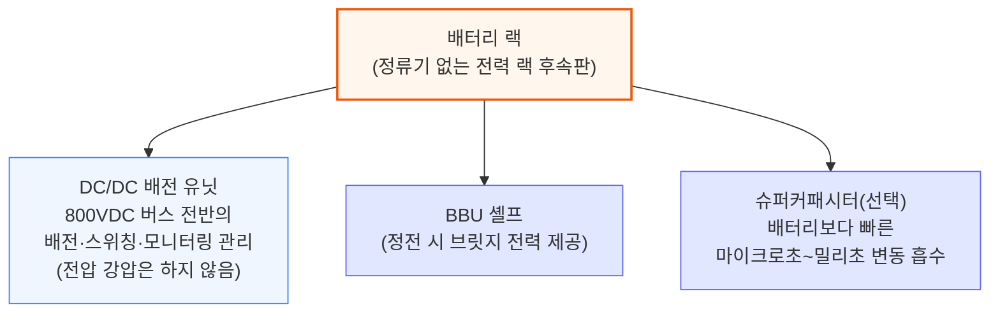

- **DC/DC 배전 유닛은 전압을 낮추지 않음**: 800VDC 전체가 배터리 랙에서 컴퓨팅 블레이드까지 그대로 이동 — 배치 위치는 기존 전력 랙과 같은 로우가 대부분이나 일부는 인접 그레이 스페이스·실외 인클로저 사용
- **트레이드오프**: 정류기는 사라지고 BBU·슈퍼커패시터 콘텐츠는 늘어남 — 배터리 랙의 MW당 콘텐츠는 약 20만 달러 예상

### BBU 모듈의 대형화

- **모듈 용량 상승**: 현재 약 5.5kW급 → Rubin Ultra·800VDC 시대 8\~12kW급(Infineon 로드맵: 4kW급 부분전력변환기 카드를 병렬로 묶어 유닛당 최대 12kW, 최대 99.5% 정점 효율)
- **셸프 단위 사례**: Delta는 GTC 2026에서 110kW급 전력 셸프에 80kW급 BBU를 내장해 6셸프 랙 전체 480kW 구성 — 랙 전력이 늘수록 필요 백업 에너지도 비례해 늘지만, 고용량 모듈은 더 적은 모듈 수로 같은 에너지를 공급해 랙 공간을 아낌

### 시설 단위에서 벌어지는 일

시설 단위는 변화가 가장 적은 구역입니다.

- **냉각은 여전히 AC**: 칠러·펌프·팬은 AC 모터+DC-AC 인버터 필요 — Delta의 GTC 2026 800VDC 지원 2.4MW급 In-Row CDU가 첫 네이티브 DC 냉각 부품이지만, 칠러·압축기·건물 제어를 아우르는 전체 스택을 파는 DC 네이티브 벤더는 아직 없음
- **발전기 의존도 하락은 800VDC와 무관하게 진행 중**: Meta는 신규 사이트에서 발전기를 건너뛰는 추세, Microsoft는 부분 커버리지만 적용 — 슈퍼커패시터·BBU·BESS의 계층화된 백업이 발전기 기능을 흡수하며 이 흐름을 가속할 수 있음

### 중압(MV) 정류기: 모두를 위한 자리가 있는가

정류를 LV 대신 MV(13.8\~34.5kV)에서 곧장 하지 못하는 이유는 반도체 소자 등급 — 10kV 이상을 감당하는 소자가 상용 형태로 거의 없기 때문입니다. 다만 Wolfspeed의 10kV급 SiC MOSFET이 2026년 3월부터 베어다이로 상용 공급되며 간극이 좁혀지고 있고, 이는 LV 장비마저 주전력 버스에서 빠지는 Phase 3의 두 번째 진화 단계로 가는 문을 엽니다. 이를 훨씬 더 효율적·컴팩트·빠르게 해내겠다고 약속하는 신기술이 다음 챕터의 주인공, **고체상태 변압기(SST)**입니다.

---

## 11. Phase 4: SST(고체상태 변압기), 최종 단계

**📌 핵심:**
- SST는 철심·구리로 된 재래식 변압기를 반도체 스위칭 소자로 대체한 신형 전력 전자 장비 — MV 정류기와 LV 변압기를 하나의 장치로 합쳐 **변환 단계 2개를 통째로 없앰**
- 벤더들은 최대 15%의 시스템 효율 개선을 목표(82\~85%에서 97%대로), 스위칭 주파수를 20,000Hz 이상으로 올려 철심 부피를 약 90% 줄임(Infineon 기준 무게 40분의 1, 크기 14분의 1)
- 다만 데이터센터급 SST의 실사용 신뢰성 데이터는 아직 없음(가장 오래된 배치 사례는 2011년부터 가동 중인 스위스 국철의 Hitachi-ABB PETT) → 30\~40년을 버티는 재래식 변압기 대비 검증 기간이 짧음
- 결론: 2030년까지 SST 시장 규모는 약 320억 달러로 전망되지만, 본격적인 상용 채택은 2029년 초 이전에는 어려울 전망 — UL 인증조차 2026년 5월 기준 아무 벤더도 완료하지 못한 상태

---

드디어 DC 배전의 최종 목표, **고체상태 변압기(Solid-State Transformer, SST)**에 도달합니다. 재래식 철심 변압기를 고주파 반도체 컨버터로 대체하는 신종 전력 전자 장비로, Phase 4 레이아웃은 Phase 3와 거의 같지만 SST가 LV AC-DC 정류기와 LV 변압기를 하나로 합쳐 MV에서 곧장 800VDC로 변환합니다.

### SST란 무엇인가

SST는 그레이 스페이스의 거대한 철심-구리 변압기와 같은 일(유틸리티 MV를 IT 장비용 전압까지 강압)을 반도체 스위칭으로 훨씬 작은 부피에서 해냅니다. 데이터센터용 SST는 3단 구조입니다: 입력단(위험 MV 13.8\~45kV, 3,300V+급 SiC MOSFET으로 AC→DC), 절연단(고주파 변압기가 강압+갈바닉 절연, 크기 축소가 일어나는 곳), 출력단(별도 인버터 없이 최종 800VDC 출력).

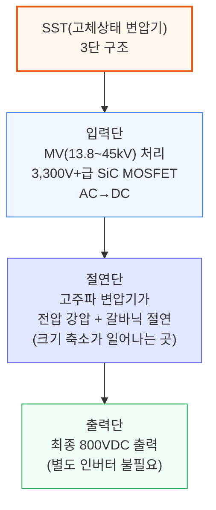

### SST의 장단점

SST의 핵심 가치는 에너지 효율(운영비 절감·추가 컴퓨팅 용량 확보로 직결)이며, MV 변압기와 정류기를 하나의 전력전자 단으로 합쳐 변환 단계 2개를 없앱니다.

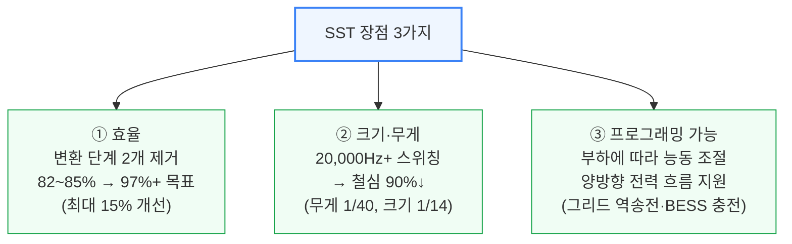

- **프로그래밍 가능**: 재래식 변압기는 고정 비율만 강압하지만 SST는 부하에 능동 대응하고 양방향 전력 흐름(수요반응 시 그리드 역송전, BESS 충전)도 지원 — 다만 이 경우 분산에너지자원(DER)으로 재분류돼 IEEE 1547/2800 준수가 요구될 수 있음
- **입력 유연성**: 일부는 멀티포트 토폴로지로 확장해 유틸리티 AC·온사이트 발전·DC 전원 등 여러 입력을 모아 여러 출력으로 소프트웨어 라우팅 — 구역 간 좌초 전력을 줄이고 부지 전체 전력 흐름 조율 가능

### 신뢰성

재래식 변압기는 수동 장치로 30\~40년을 버티지만, 데이터센터 규모 SST의 실사용 신뢰성 데이터는 아직 없습니다(가장 오래된 사례는 2011년부터 가동 중인 스위스 연방철도 Hitachi-ABB PETT). 반도체 접합부 발열 때문에 능동 냉각이 필요해 DG Matrix는 통합 수랭식을, Novos Power는 독자 절연 공랭식을 씁니다. ETH 취리히에 따르면 상용주파수 변압기+SiC 정류기 조합도 SST 효율에 맞먹을 수 있으며, 데이터센터급 SST는 여전히 생산량 제한적인 3,300V+급 SiC MOSFET에 의존합니다(GaN은 650V 상한이라 800VDC를 랙 전압으로 낮추는 하류 단계에서만 사용).

### 현재 효율 수준

- **최고 벤치마크**: ETH 취리히 INTELEC 2025 발표 13.2kVAC-800VDC 프로토타입이 400kW에서 98% 효율 — Johann Kolar는 98.0\~98.5%를 현재 최신 기술, 99%를 다음 목표로 규정
- **벤더 수렴**: DG Matrix Interport 최대 98.5%, Amperesand 3세대 98.5%+, Heron Power Heron Link MV-to-rack 98.5% 목표, Novos Power 98%+ — 다만 데이터센터는 3\~6MW급 유닛이 지속 부하에서 99%+를 유지해야 함
- **스케일업 증거**: 중국 China XD Electric이 "동수서산" 프로그램으로 2.4MW급 SST 배치, NC State FREEDM Systems Center(DG Matrix의 학문적 뿌리)는 3.3kV SiC 210kHz 스위칭 시연 + 모듈형 DC-DC SST 99% 효율 목표 제시

### 공급사 지형

- **DG Matrix**(ABB 후원, Infineon SiC 계약): 사전 인증 유닛 출하 중, 2026년 2분기 말 UL 인증 목표 — Nvidia MGX 레퍼런스에 포함된 유일한 SST
- **Amperesand**: 2026년 30MW 상업 배치 목표
- **Heron Power**: 4.2MW급 Heron Link용 40GW 규모 미국 제조 시설 건설 중
- **LV vs MV 입력 경로**: DG Matrix·Amperesand는 LV 입력 스키드(3.2\~4.8MW)로 먼저 배치 후 MV 유닛을 뒤따르게 함(더 짧은 배치 소요 시간), Heron Power·Novos Power는 직접 MV 입력 유닛에 집중 — 출력은 모두 800VDC로 수렴
- **Novos Power**: 직접 MV-800VDC 변환, 풋프린트 50% 작고 공랭식
- **Eaton**: 2025년 8월 Resilient Power Systems 인수로 SST 전문성 확보
- **투자**: 2026년 3월까지 12개월간 SST 스타트업에 3억 2천만 달러 이상 유입

### 데이터센터 레이아웃에 미치는 영향

- SST는 MW당 약 55만 달러 LV 장비 + 약 20만 달러 Phase 2 정류기를 없애지만, SST 자체 비용(MW당 100만\~150만 달러)을 고려하면 초기 도입은 Capex 프리미엄을 안고 시작
- Phase 3의 나머지 아키텍처(냉각·조명 480V AC 보조 버스 등)는 그대로 유지 — SST 배치 시점엔 컴퓨팅 트레이가 이미 800VDC 네이티브일 전망이나, 800V 마이크로그리드·DC-DC 전력 셸프 컨버터 IT 랙과 함께 배치되면 도입이 더 빨라질 수 있음
- 2029년 초 이전 본격 채택은 어려움 — 모든 주요 하이퍼스케일러가 파일럿·상업 계약을 진행 중이지만, 기술 개발뿐 아니라 규제·표준도 변수(2026년 5월 기준 UL 인증 완료 벤더 0곳)

### SST 시장 규모

2030년까지 SST 시장 규모는 약 320억 달러 전망(사이드카 계층 이전 수요 + 신규 MV-800VDC 변환 수요, MW당 콘텐츠 125만 달러 가정) — 일부는 MV 정류기와 경쟁하지만 SST가 대부분의 점유율을 가져갈 전망입니다.

---

## 12. 데이터센터 레이아웃 종합: 총비용 유지, 구성 이동, 효율 상승

**📌 핵심:**
- MW당 전기 설비 총비용은 4개 아키텍처(Phase 2\~4 및 기준 AC)에서 **360만\~480만 달러** 범위에 머묾 — 핵심은 총액이 늘어나는 게 아니라 **그레이 스페이스에서 화이트 스페이스로 콘텐츠가 옮겨간다**는 것
- 기준 AC 배전 경로의 누적 효율은 7단계 변환을 거쳐 **82.0%** — VRM(92%)과 PSU(94%)가 가장 큰 단일 손실 구간이며, 800VDC 전환이 없앨 수 있는 가장 큰 손실은 PSU 쪽
- 단계별 효율은 Phase 1 83.7% → Phase 2 86.5%(UPS 제거로 7단계→5단계) → Phase 3 86.9%(MW급 중앙 정류기 + 홀 단위 800VDC가 표피효과·무효전력 손실 제거) → Phase 4 87.4%(SST가 2단계를 1개 장치로 대체)로 상승
- 결론: 1GW 시설 기준으로 환산하면 Phase 2는 상시 58MW, Phase 3는 63MW, Phase 4는 69MW의 전력을 절감 — Nvidia가 밝힌 "최대 5% 효율 개선(약 50MW)"은 Phase 4 계산치와 일치

---

### 전기 설비 비용

MW당 전기 설비 총콘텐츠는 다섯 개 아키텍처 중 네 개에서 360만\~480만 달러 밴드 안에 머뭅니다. 핵심은 그레이 스페이스에서 화이트 스페이스로 옮겨가는 콘텐츠 이동입니다.

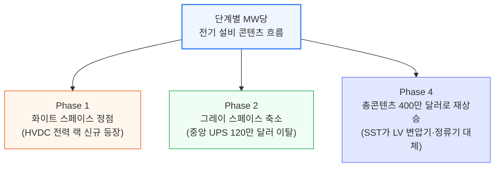

### 전기 설비 효율

기준 AC 전력 경로는 7단계 변환을 거쳐 누적 효율 **82.0%**입니다. VRM(92%)과 PSU(94%)가 가장 큰 단일 손실 구간이며, VRM은 모든 아키텍처에 남지만 PSU 손실이야말로 800VDC가 없앨 수 있는 최대 페널티입니다.

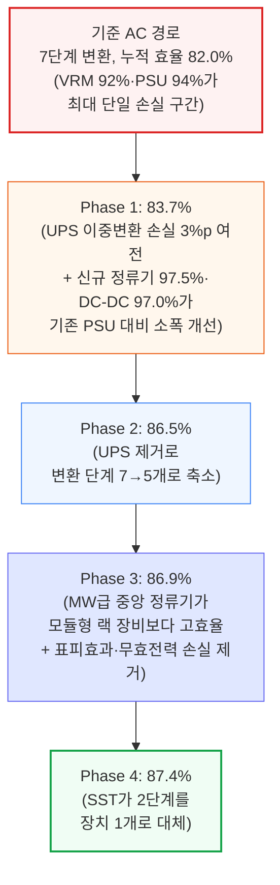

- **1GW급 IT 부하 환산**: Phase 2는 상시 약 58MW, Phase 3는 63MW, Phase 4는 69MW 그리드 전력 절감 — Nvidia가 밝힌 "최대 5% 효율 개선"(1GW 기준 약 50MW)은 Phase 4 계산치와 일치

---

## 13. 800VDC의 4가지 과제

**📌 핵심:**
- ① **규제·안전·접지**: 미국 전기 코드(NEC)의 완전한 800VDC 지원은 **2029년**을 목표로 하며, 그 전까지는 현장마다 개별 승인이 필요 — 아크 플래시 안전 기준(NFPA 70E)도 600\~1000VDC 구간에 PPE 표가 아예 없어 공백 상태
- ② **냉각·보조 AC 부하**: 냉각은 800VDC 시설에서 가장 큰 AC 부하로 남음 — DC 네이티브 냉각 생태계를 파는 벤더가 아직 없어, 칠러·조명·소화설비는 당분간 AC 보조 버스가 그대로 필요
- ③ **공급망 표준**: 혁신이 표준화보다 앞서 있어, 버스웨이 규격(UL 857)만 2025년 에디션에서 겨우 1000VDC까지 상한이 올라간 상태 — 그 외 장비는 인증 경로 자체가 없어 현장마다 개별 엔지니어링 프로젝트가 됨
- ④ **그리드 연계·규제 압력**: 800VDC는 그리드 대응 동작을 소프트웨어 정의 전력 전자(SST 제어 알고리즘 등)로 옮겨, 그리드 운영사가 기존에 쓰던 표준 부하 모델로는 예측이 안 되는 새로운 변수를 만듦

---

지금까지 유망한 경로를 그려봤지만, 늘 그렇듯 그 과정에서 여러 도전 과제가 나타날 것입니다. 800VDC가 소규모 파일럿에서 폭넓은 채택으로 얼마나 빠르게 넘어갈지를 좌우할 네 가지 주요 걸림돌을 풀어봅니다.

### 과제 1: 규제, 안전, 접지

**규제**: NFPA가 3년 주기로 발간하는 미국 전기 코드(NEC)는 미국 거의 모든 주·지자체가 법적 구속력을 갖는 기준으로 채택 — 표준 설계로 지을지 현지 관할당국(AHJ)과 현장별 협상이 필요한지를 결정합니다. 완전한 800VDC 지원은 **NEC 2029** 목표로, 그 전까지는 현장마다 AHJ 승인·OEM UL 인증이 필요해 하이퍼스케일러는 감당 가능하지만 임대·소규모 사업자에는 장벽입니다.

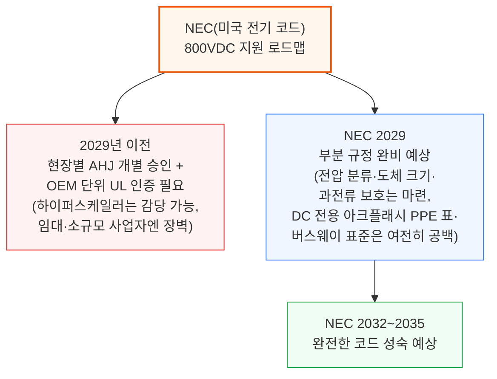

- **EV 산업 선례**: 업계 표준이 없던 시기 Tesla가 자체 안전 프레임워크를 직접 설계·승인한 것처럼, 2029년 이전 배치 하이퍼스케일러도 비슷한 위치 — 5개 하이퍼스케일러+Nvidia의 집중된 구매력과 EV용 800V 부품 공급망 덕에 NEC 2029도 앞당겨질 수 있음
- **안전(아크 플래시가 최대 위험)**: IEEE 1584는 DC를 다루지 않고 NFPA 70E엔 600\~1000VDC 구간 PPE 표가 없음(UL Solutions가 Direct Current Safety Research Consortium 출범) — 48V에서 일상적이던 랙 근처 작업이 800V에서는 아크 등급 의류·1000V급 절연 장갑이 필요한 자격자 전용 작업이 될 가능성, 커패시터·BBU의 잔류 전하는 기존 AC 잠금-표찰 절차로 커버 안 됨(Flex가 위험 교육 강화를 공개 촉구)
- **접지(초기 설계에서 가장 중요한 선택)**: Siemens/Nvidia 논문은 4가지 선택지 제시 — ±400V는 고저항 접지(HRG, 비용↑) 또는 고체 접지(보호 장치 수↓, 갈바닉 절연 포기), 800V 단극형은 부동(float) 방식 또는 고체 접지 리턴. OCP Diablo 400은 둘 다 허용해 운영사에게 선택을 맡기며, 벤더마다 접지 가정이 달라 업계 합의는 아직 없음

### 과제 2: 냉각과 보조 AC 부하

냉각은 800VDC 데이터센터에서 가장 큰 AC 부하이며 DC 네이티브 생태계를 파는 벤더는 아직 없습니다.

- **부분 진전**: Danfoss Turbocor 압축기(내부 700\~813V DC), VACON NXP 드라이브(640\~1200VDC 입력, 800V 포함), DCAirco의 4\~8kW급 800V DC 칠러(데이터센터 규모의 100\~1,000배 작지만 이 전압에서 냉동 사이클 작동 증명)
- **여전히 AC**: 스위치기어 구동, 조명, 소화설비 펌프, 건물 관리·보안 시스템 — Nvidia 800VDC 레퍼런스도 AC 보조 버스를 나란히 유지(OCP 글로벌 서밋 2025)
- **공급망 유인**: 데이터센터 설비투자 2026년 4,000억 달러 돌파(전기 설비 30\~35%)로 DC 네이티브 제품 개발 유인 확대 중, Delta CDU가 선봉

### 과제 3: 공급망 표준

DC 배전 혁신이 표준화보다 앞서 있어 대부분 장비 카테고리의 표준이 뒤처져 있습니다.

- **버스웨이가 그나마 진전**: UL 857(원래 600V·RMS 기준)의 2025년 14판이 1000VDC로 상향, 개발 중인 15판은 1500VDC 목표 — 그 외 장비는 인증 경로 자체가 없어 설치마다 개별 엔지니어링 프로젝트
- **표준화 움직임**: OCP 워킹그룹이 2026년 말 초기 표준 목표(규제·인증기관과 협력), Delta는 OCP 2025에서 800VDC 공랭식 버스웨이 시연, LS Electric은 DistribuTECH 2026에서 DC 전력 장비 전시

### 과제 4: 그리드 연계와 규제 압력

그리드 교란 시 데이터센터 부하 손실은 이미 그리드 운영사의 우려 사항이며, 800VDC는 그리드 대응 동작을 소프트웨어 정의 전력 전자(SST 제어 알고리즘 등)로 옮겨 이를 더 날카롭게 만듭니다. NERC는 2026년 5월 최고 등급(Level 3) Essential Actions Alert를 발령해 8월 3일까지 의무 대응을 요구했고, 60kV 이상·20MW 이상 집합 규모에서 1MW 이상 소비 데이터센터의 Computational Load Entity 등록제를 제안했습니다. ERCOT NOGRR282는 모든 대형 부하에 전압·주파수 라이드스루 요건과 전자기 과도 모델(PSS/E·PSCAD)을 의무화합니다.

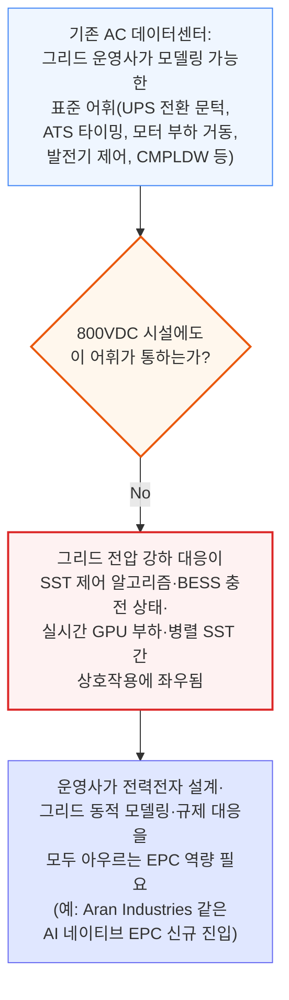

- **계층 붕괴**: AC 시설은 유틸리티가 계통연계를 연구하는 동안 운영사가 UPS·스위치기어·랙 배전을 독립 설계하지만, SST 기반 800VDC 시설은 같은 컨버터 제어가 DC 버스 안정성·고장 라이드스루·전류 제한·고조파·부하 회복까지 모두 결정 — 계통연계가 전력전자 설계·그리드 동적 모델링·규제 대응을 아우르는 EPC 역량 필요 "엔지니어링 제품"이 되며, Aran Industries 같은 AI 네이티브 EPC 신규 진입을 낳는 중

---

## 14. 물리 원리 심화: 저전압 배전이 무너지는 이유와 전압 토폴로지

**📌 핵심:**
- 랙 전력이 고정된 상태에서 전압을 54V→800V로 올리면 전류는 약 15배 줄고, 저항 손실은 전류의 제곱에 비례해 약 220배 줄어듦 — 이것이 800VDC를 구리량·발열·배전 비용의 단계적 변화로 만드는 핵심 방정식
- 600kW급 랙(Kyber급, Vera Rubin Ultra NVL576) 실측 예시: 54V에서는 전류 약 11,111A, 800V에서는 750A로 **14.8배 감소** → 같은 도체 저항 기준 손실은 약 219배 감소(48V 기준으로 계산하면 278배)
- '800VDC'는 하나의 800V 레일로 보내는 **단극형**과, 접지된 중간점 기준 ±400V 두 레일로 나누는 **양극형** 두 가지 배선 방식을 모두 가리킬 수 있음 — 단극형은 단순하고 전류가 낮지만, 양극형은 전기차 산업의 400V급 성숙한 부품 공급망을 그대로 쓸 수 있다는 경제적 이점이 있음
- 결론: 전압을 올리는 것은 순수한 물리 이득이지만, 단극형 vs 양극형은 물리가 아니라 부품 공급망 성숙도와 설치 복잡도 사이의 트레이드오프

---

### 왜 초고밀도가 저전압 배전을 무너뜨리는가: 발열과 무게

랙 전력이 고정된 상태에서 전압을 54V→800V로 올리면 전류는 약 15배 줄고 저항 손실은 약 220배 줄어듭니다. 아래 방정식이 800VDC를 피할 수 없게 만드는 이유입니다.

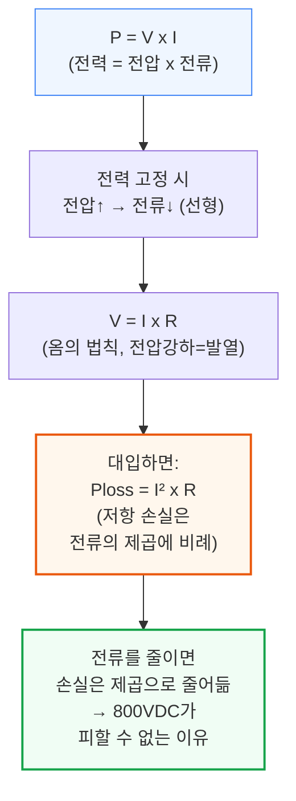

- **실측 예시(600kW급 랙, Kyber급/VR Ultra NVL576)**: 54VDC에서 전류 약 11,111A, 800VDC에서 750A로 **14.8배 감소** → 같은 도체 저항 기준 손실 약 **219배** 감소(48V 기준 계산 시 278배)
- **구리는 그대로 안 둠**: 운영사는 이 손실 절감분을 통째로 챙기지 않고 구리를 줄여 무게·비용·배선 공간 절감으로 맞바꿈 — 도체 크기를 재최적화해도 효율 개선 효과는 여전히 압도적

### 800VDC vs ±400VDC: 어떤 토폴로지를 쓸 것인가

'800VDC'는 단일 800V 레일(단극형)과 접지된 중간점 기준 ±400V 두 레일(양극형) 중 어느 쪽도 가리킬 수 있으며, 이 구분은 배치 전략·안전 설계·하류 반도체 선정에 영향을 미칩니다.

- **단극형 800V**: 800V 레일 1개+리턴+보호접지(PE), 1MW 기준 전류 1,250A — 도체·커넥터가 작고 I²R 손실도 낮으며, 중간점 감지·제어가 없어 구조가 단순
- **양극형 ±400V**: +400V/중간점/-400V 3전력도체+PE, 각 레일은 접지에서 400V만 떨어짐 — 핵심 논거는 전기가 아니라 경제성: EV 산업이 이미 구축한 400V급 부품 공급망을 그대로 활용 가능(Google, OCP EMEA 2025). OCP Diablo 400은 ±400V를 기본, 800V 단극형을 옵션으로 포함

```mermaid
flowchart TD
    Topology["800VDC 토폴로지<br/>2가지 방식"] --> Mono["단극형 800V<br/>· 구성: 800V 레일 1개 + 리턴 + PE<br/>· 1MW 기준 전류: 1,250A<br/>· 장점: 구조 단순,<br/>중간점 제어 불필요"]
    Topology --> Bipolar["양극형 ±400V<br/>· 구성: +400V/중간점/-400V + PE<br/>(3전력도체)<br/>· 장점: EV 산업의<br/>성숙한 400V급 부품 활용<br/>· 단점: 추가 도체로<br/>구리·커넥터·시공 인건비 증가"]

    style Topology fill:#eff6ff,stroke:#3b82f6,stroke-width:2px
    style Mono fill:#e0e7ff,stroke:#6366f1
    style Bipolar fill:#fff7ed,stroke:#ea580c,stroke-width:2px
```

트레이드오프도 있습니다: 세 번째 도체(중간점)는 전력 경로 모든 지점에서 배선·종단·보호가 필요해 수천 개 랙 전체로 보면 구리·커넥터·시공 인건비가 늘고, 과도 전압 스파이크를 피하려 접점을 통제된 순서로 붙였다 떼야 해 핫스왑 커넥터 설계도 복잡해집니다.

---

## 15. 공급사 영향 (1): 화이트 vs 그레이 스페이스, Delta·Lite-On·Vertiv

**📌 핵심:**
- HVDC 전환은 전기 설비 총콘텐츠(MW당 약 370만\~400만 달러)를 크게 늘리는 게 아니라 **그레이 스페이스에서 화이트 스페이스로 콘텐츠를 옮기는 "점유율 이동" 게임**에 가까움 → 화이트 스페이스 벤더가 구조적으로 유리
- **Delta Electronics**는 전력 셸프·BBU·PCS·수랭까지 "그리드-투-칩" 전 구간을 한 회사가 검증된 패키지로 공급하는 유일한 벤더 — 전력 랙 ASP가 대당 4만 달러에서 40만 달러로 10배 뛰는 국면의 최대 수혜주
- **Lite-On**은 화이트 스페이스 2위 업체지만, 시스템 통합 실적에서 Delta에 밀리고 AWS CDU 지출까지 Delta로 쏠리는 흐름이 나타나며 인접 전력 콘텐츠까지 잠식당할 위험
- **Vertiv**는 그레이 스페이스의 UPS 최강자이면서 Meta의 HVDC 전력 랙 프로그램까지 Delta와 함께 따내며 화이트 스페이스로 영역을 넓히는 중 — 다만 서버 사이드 전력 전자(PSU·BBU)에는 아직 발을 들이지 못함
- 결론: 콘텐츠가 랙 안으로 들어갈수록, "전력+열을 함께 설계하고 A/S까지 책임지는" 수직 통합 벤더가 유리해지는 구도

---

### 화이트 스페이스 vs 그레이 스페이스 벤더: 누가 이기는가

HVDC로의 전환 자체를 놓고 보면, 그레이 스페이스보다 화이트 스페이스 노출이 큰 벤더를 더 유리하게 봅니다. 표준 AC/DC에서 HVDC로의 전환은 주로 "점유율 이동" 이야기이지, MW당 전기 설비 총콘텐츠가 의미 있게 늘어나는 이야기가 아닙니다 — HVDC 화이트 스페이스 레트로핏 케이스(MW당 480만 달러)를 제외하면, 대부분의 아키텍처에서 총콘텐츠는 MW당 370만\~400만 달러 수준으로 대체로 평평합니다.

```mermaid
flowchart TD
    Shift["HVDC 전환의 본질:<br/>총콘텐츠 증가가 아니라<br/>그레이→화이트 점유율 이동"] --> Reason1["① 콘텐츠 상승폭이<br/>크고 즉각적<br/>(전력 셸프 판매→<br/>HVDC 전력 랙 통째로 판매)"]
    Shift --> Reason2["② 출하 시점이 빠름<br/>화이트 스페이스는<br/>2025~2026년 배치 진행 중<br/>그레이 스페이스는<br/>대부분 2028년 이후"]
    Shift --> Reason3["③ 수요 주기가 짧음<br/>화이트: 가속기 출하 +<br/>3~4년 랙 교체 주기<br/>그레이: 10~15년<br/>시설 주기(뭉텅이로 발생)"]

    style Shift fill:#fff7ed,stroke:#ea580c,stroke-width:2px
    style Reason1 fill:#f0fdf4,stroke:#16a34a
    style Reason2 fill:#f0fdf4,stroke:#16a34a
    style Reason3 fill:#f0fdf4,stroke:#16a34a
```

그레이 스페이스 기존 강자들의 앞날은 더 불확실합니다. HVDC 아키텍처는 중앙집중형 UPS, 저전압 스위치기어, 저전압 변압기를 없애는데, 이를 대체할 콘텐츠(SST)는 아직 초기 단계이고 확실한 승자도 없습니다. 게다가 화이트 스페이스 벤더들도 바로 그 미래 콘텐츠를 놓고 경쟁하고 있어, 그레이 스페이스 기존 강자가 이를 그대로 지킬 수 있다고 장담할 수 없습니다. Legrand와 Hammond Power처럼 그레이 스페이스 노출로 데이터센터 서사를 쌓아온 기업들에게는 리스크입니다. Vertiv는 Meta에서 화이트 스페이스 실적까지 입증한 눈에 띄는 그레이 스페이스 벤더이고, Eaton과 Schneider는 전력 랙 분야에서 Nvidia 레퍼런스 아키텍처 위치를 확보했지만 상업적 물량은 아직 제한적으로 보입니다.

### Delta Electronics(2308 TT): 구조적 승자

Delta의 핵심 경쟁력은 종단 간 통합입니다 — 전력 셸프, BBU, PCS(단기 에너지 버퍼링용 슈퍼커패시터 포함), 수랭 시스템까지 하나의 검증된 패키지로 공급할 수 있습니다. 랙 전력이 수백 kW를 넘어 MW급으로 확장될수록 조달은 점점 더 엔지니어링 중심·신뢰성 중심이 됩니다. 단일 벤더가 시스템 단위로 공급하면 통합·검증 부담이 줄고 배치 일정이 짧아지며, 랙당 약 600kW 수준에서 뭔가 고장 났을 때 책임 소재를 따지는 문제도 줄어듭니다. 전력 셸프 ASP는 표준 AC-DC 구성에서 대당 약 4만 달러였다가 HVDC 전력 랙에서는 대당 약 40만 달러로 뛰는데, 이는 범위 확장에 따른 10배 증가입니다. 그래서 개별 부품만 파는 벤더 대비 800V 전환에서 Delta의 랙당 ASP 상승 여력이 훨씬 큽니다.

Delta는 AI 서버 랙 PSU와 GB200용 사이드카 CDU 냉각 시스템 모두에서 높은 점유율을 갖고 있습니다. Delta의 해자는 전력 체인 전체를 아우르는 수직 통합, 즉 "그리드-투-칩"입니다. 유틸리티 연계 지점부터 GPU 보드 위의 VRM까지 전 구간을 신뢰성 있게 공급할 수 있는 유일한 업체입니다. 게다가 Delta는 ODM 채널(Foxconn, Wiwynn, Wistron)을 통해 MSFT·META·ORCL에도 CDU 시스템을 공급합니다. 800V HVDC 랙이 전력 하드웨어를 IT 랙 밖 로우 단위 전력 랙으로 옮기면서 열 프로파일과 발열 분포가 바뀌는데, Delta는 순수 전력·순수 냉각 벤더가 할 수 없는 방식으로 전력과 열을 함께 최적화할 수 있습니다.

CSP·Nvidia 플랫폼과 관련된 초기 배치를 포함해 대부분의 초기 전력 랙 설계는 AC-DC 방식일 것으로 예상하며(AC-DC 콘텐츠는 대개 하류 DC-DC 콘텐츠보다 고부가가치), Nvidia·Meta·Google이 800VDC와 전력 랙의 초기 도입자로서 2026년 말까지 물량 출하에 들어가는 국면에서 Delta가 주요 공급사가 될 것으로 예상합니다. 전력 셸프에서 HVDC 전력 랙으로 아키텍처가 옮겨가면서 Delta의 콘텐츠 상승 여력이 상당합니다. 만약 전용 Kyber 800V-50V 사이드카가 아예 없어지는 시나리오라면, 기존 인랙 PSU 전문성 덕분에 Delta가 이 시장의 90%까지 지배할 수도 있습니다.

Delta의 약세 요인은 그레이 스페이스에서의 제한적인 존재감입니다. UPS와 PDU는 역사적으로 Vertiv·Schneider Electric·Eaton·ABB 같은 서구 기존 강자들이 탄탄한 관계와 큰 설치 기반을 바탕으로 지배해 왔습니다. Delta의 아메리카 지역 UPS 점유율은 미미합니다. 800VDC 아키텍처에서도 UPS·PDU는 보호·스위칭·백업 전원을 위해 여전히 상류에 남을 수 있습니다. 더 큰 그레이 스페이스 신규 기회는 SST일 가능성이 높지만, 이는 더 먼 미래입니다. Delta는 SST를 미래 방향으로 언급했고 초기 준비에 나서고 있는 것으로 보입니다.

### Lite-On(2301 TT)

Lite-On은 화이트 스페이스 2위 업체입니다. NVDA GPU 서버(주로 Oracle 고객)에서 PSU 점유율은 낮지만, AWS Trainium 서버에는 PSU·BBU 점유율을 확보했습니다. Trainium 3가 강하게 램프업하더라도 근시일 내 매출 기여는 많아야 한 자릿수 후반(HSD%) 수준일 것으로 예상합니다. Lite-On의 전력 공급 콘텐츠는 PSU와 BBU에 걸쳐 있습니다. 800V 포트폴리오(전력 셸프, BBU, PCS, 모듈형 PDU 아키텍처)에 대해 목소리를 내왔지만, 현재까지 채택은 더 제한적으로 보입니다. ON Semiconductor는 2025년 4분기 실적에서 Delta와 Lite-On 양쪽 모두와 랙 단위 BBU·PSU 설계를 확보했다고 확인했는데, 이는 Lite-On이 차세대 전력 아키텍처에서도 한 자리를 유지하고 있다는 뜻입니다.

이는 전환의 복잡성 때문으로 해석됩니다. 안전 표준이 진화하고 랙이 전력-냉각 공동 설계가 긴밀히 필요한 새 아키텍처로 옮겨가면서, 고객들은 검증된 시스템 단위 통합력과 확실한 하이퍼스케일러 검증 실적, 랙 단위 전체 공급에 대한 명확한 책임 소재를 갖춘 공급사를 선호하는 경향이 있습니다. 라인업이 넓어도 비교할 만한 종단 간 배치 실적이 없는 벤더는 채택 속도가 느린 경우가 많습니다.

Lite-On은 화이트 스페이스 부품 전반에 걸쳐 의미 있는 수직 통합을 갖고 있습니다. Delta처럼 PDU, 전력 제어, 섀시, 캐비닛 등 전력 랙 구성요소 상당수를 자체 제조합니다. 이는 통합 시스템에서 더 높은 마진을 뒷받침할 수 있는데, 경영진은 AI 서버 전력 사업 매출총이익률을 약 30%로, 회사 전체 수준(약 22\~24%)보다 높다고 밝혔습니다. 800V 전력 랙은 독립형 서버 전력 모듈 대비 상당한 ASP 상승도 제공합니다.

Lite-On은 대만(가오슝), 베트남(2억 달러 자본 투입 포함), 미국(텍사스)에 걸쳐 생산능력을 확장하고 있습니다. 다만 경영진은 2026년 생산능력 증설을 시장이 기대하는 BBU 수요 성장률(약 50%)보다 낮은 약 30% 수준으로 보수적으로 접근하고 있습니다. 이는 Delta의 더 공격적인 증설 태도와 대조적으로, 공격적인 점유율 확대보다 마진 방어를 우선시하는 태도로 읽힙니다.

고객 집중도와 액체 냉각이 핵심 관찰 포인트입니다. Delta는 AWS에서 Lite-On의 BBU 점유율을 공격적으로 가져가고 있습니다. Lite-On의 CDU 사업은 아직 초기 단계로, 시험·초기 생산 단계 제품이 대부분이며 상업 출하는 2026년 1분기경 시작됩니다. Amazon이 CDU 지출을 Delta 쪽으로 몰아주는 것으로 보이는데, 위험은 인접한 전력 콘텐츠(PSU, BBU)도 시간이 지나며 같은 흐름을 따라가, Lite-On의 가장 중요한 고객사에서 점유율이 더 좁아질 수 있다는 점입니다. Delta의 더 강한 설계 역량과 액체 냉각에서의 더 이른 규모화(GB200 사이드카 CDU에서의 의미 있는 점유율 포함)를 볼 때, Lite-On은 이 축에서 뒤처져 있고 고마진 액체 냉각 콘텐츠에서 더딘 램프업을 겪을 수 있습니다.

### Vertiv(VRT US): 화이트 스페이스로 밀고 들어오는 그레이 스페이스 리더

Vertiv는 계속 기록적인 수주 물량을 낼 것으로 봅니다. 고객 구성을 보면 임대(colo) 리스에 과도하게 쏠려 있고 하이퍼스케일러 자체 건설(self-build)에서는 상대적으로 대표성이 낮습니다. 대형 데이터센터(하이퍼스케일+콜로) 노출 약 50%, 콜로 MW당 약 300만 달러, 자체 건설 MW당 약 100만 달러, 콜로 데이터센터 점유율 약 20%로 가정합니다. Vertiv는 대부분의 주요 데이터센터 운영사에서 1위 UPS 공급사이며, AWS와 MSFT를 비롯한 전통적 콜로 사업자들도 Vertiv 인프라에 크게 의존합니다. 이 설치 기반은 운영사들이 더 높은 랙 밀도를 지원하려 전력 아키텍처를 업그레이드할 때 추가 매출로 이어질 것으로 보입니다.

800V 하이퍼스케일러 협업 측면에서 Vertiv는 META, GOOGL, MSFT와 적극적으로 협업하고 있으며, 벤더 선정은 여전히 유동적입니다. Vertiv는 META·GOOGL에서 역사적으로 낮았던 콘텐츠(BBU 중심 아키텍처가 중앙 UPS를 자주 우회해 왔음)에도 불구하고 Delta와 함께 META의 800V HVDC 전력 랙 프로그램을 따냈습니다. 이는 화이트 스페이스에서 거의 0에 가까웠던 Vertiv의 콘텐츠가 MW당 약 100만 달러 수준으로 의미 있게 뛰어오르는 계기입니다. Vertiv의 기존 UPS 사업은 HVDC 전환으로 근시일 내에 잠식되지도 않습니다 — 오히려 앞서 다룬 화이트 스페이스 레트로핏 사례에서처럼, 기존 UPS는 그대로 남고(그레이 스페이스 MW당 약 100만 달러) 새 전력 랙(화이트 스페이스 MW당 약 100만 달러)이 그 위에 얹히는 추가 콘텐츠 구조여서 단기적으로는 순풍입니다.

Vertiv는 액체 냉각을 포함한 데이터센터 열관리 분야에서도 선두 자리의 수혜를 봅니다. CDU에서는 커스텀 설계보다는 브랜드 CDU를 주로 판매한다는 점에서 차별화됩니다. 주로 MSFT·AWS와 협업 중입니다. 근시일 내 기여도는 낮지만 장기 목표는 실질적인 규모 확대입니다. 폭넓은 열관리 포트폴리오는 후면도어 열교환기, 칩 직접 냉각, CoolPhase Flex 하이브리드 시스템까지 아우릅니다. 800V HVDC가 더 많은 변환 하드웨어를 전용 전력 랙으로 밀어 넣으면서 로우 단위에서 "전력+냉각"을 함께 설계해야 할 필요성이 커지는데, Vertiv는 개별 제품이 아니라 통합 솔루션을 팔 수 있는 위치에 있습니다.

Vertiv의 서비스 사업(매출의 20% 이상)은 HVDC 아키텍처가 확장될수록 구조적 강점이 됩니다. 800V HVDC 랙은 더 복잡하고 안전·가동률 리스크도 더 크기 때문에 커미셔닝·유지보수·수명주기 지원의 가치가 올라갑니다. 이 영역은 부품·시스템 공급사에 가까운 Delta가 시간이 갈수록 전체 매출 파이 중 상대적으로 적게 가져가는 영역입니다. 이는 아키텍처가 운영상 더 까다로워질수록 Vertiv가 프리미엄 포지셔닝을 방어할 수 있는 근거가 됩니다. 네오클라우드 고객은 대체로 서비스 수요가 있는 반면, 하이퍼스케일러는 더 커스터마이즈된 아키텍처 때문에 대체로 자체 서비스를 합니다.

가장 큰 한계는 Vertiv가 서버 사이드 화이트 스페이스 전력 전자에는 참여하지 않는다는 점입니다. IT 랙용 PSU·BBU·DC-DC 컨버터 모듈을 만들지 않아, 현재 GB200 랙에서 사실상 화이트 스페이스 전력 콘텐츠 점유율이 0입니다. 업계가 그레이·화이트 기능을 섞은 전력 랙 쪽으로 옮겨간다면, Vertiv는 새로운 이익 풀을 놓치지 않기 위해 랙 단위 변환 역량을 자체 구축하거나 제휴하거나 인수해야 할 수도 있습니다. Vertiv의 그레이 스페이스 아성도 아래로부터의 경쟁에 직면해 있습니다 — 신규 진입자들이 전력 인프라로 밀고 들어오고, 특히 META·GOOGL에서는 하이퍼스케일러들이 점점 더 스스로 설계하면서 커스텀 BBU 아키텍처가 역사적으로 UPS 중심 공급사의 역할을 줄여왔습니다.

---

## 16. 공급사 영향 (2): 서구 종합 장비업체

**📌 핵심:**
- Schneider·Eaton·ABB 같은 서구 종합 장비업체들은 800VDC 레퍼런스 아키텍처를 발표하며 목소리는 내고 있지만, 실제 물량은 대부분 **2028년 이후**로 잡혀 있어 근시일 내 단계적 매출 상승을 기대하기 어려움
- **Eaton**은 Resilient Power Systems 인수로 SST 기술을 이미 사내에 확보했고, Jonesville 3억 4천만 달러 변압기 공장까지 더해 Phase 3\~4 표준이 SST로 굳어질 경우 여러 해에 걸친 옵션가치를 쥐고 있음
- **AEIS**는 다중 벤더 전력 셸프를 조율하는 소프트웨어 역할로 자리를 지키고 있지만, Delta 같은 수직 통합 벤더가 사이드카 전체를 자사 펌웨어로 묶어버리면 이 조율 계층 자체가 사라질 위험
- **Legrand**는 사이드카 제품·개발 일정·파트너십이 전혀 없다고 스스로 인정한 상태 — 매출의 약 55%가 Phase 3\~4 노출 구간에 있는데도 준비가 가장 뒤처진 벤더로 평가
- 결론: "그리드-투-칩"을 표방하는 종합업체들 사이에서도 실제 800VDC 준비도는 크게 갈리며, 준비 안 된 벤더에게는 인수·합병이 유일한 추격 경로

---

Schneider Electric과 Vertiv를 필두로 한 소수의 서구 "종합 솔루션" 벤더들이 800VDC에 목소리를 내왔습니다. 둘 다 레퍼런스 아키텍처와 설계 가이드를 발표해 생태계가 레이아웃·부품 선택을 표준화하는 데 도움을 주고 있습니다. 다만 Delta가 여전히 초기 물량 노출의 가장 뚜렷한 증거를 갖고 있다고 보는데, 패키지형 종단 솔루션을 콜로·네오클라우드에 파는 것보다 하이퍼스케일러 공급망에 더 직접적으로 박혀 있기 때문입니다. 실제로는 많은 레퍼런스 설계가 네오클라우드·콜로 개발사에 팔리고, 하이퍼스케일러는 아키텍처를 자체 내재화하고 여러 공급사에서 블록을 조달하는 경우가 많습니다.

그 결과 대형 전기설비 벤더들이 800VDC에서 콘텐츠를 얻는 것에는 다소 중립적인 입장입니다. 이들은 조립 단계에 더 가깝게 있고, 근시일 내 800VDC 수요는 여전히 좁은 범위의 초기 배치에 집중되어 있습니다. 서구 종합업체들이 당장 폭넓게 계단식으로 상승할 것으로 기대하지는 않습니다.

### Schneider Electric(SU FP)

Schneider Electric은 800V HVDC 경쟁에서 Delta·Vertiv보다 구조적으로 뒤처진 것으로 보입니다. OCP 2025에서 랙당 최대 1.2MW급 800VDC 사이드카를 선보이긴 했습니다. 출하 시점에 대한 경영진 코멘트는 모호했지만, 사이드카가 Rubin Ultra의 2027년 일정보다 "훨씬 앞서" 출하될 것이라는 언급은 있었습니다. 이는 Kyber보다는 Oberon 플랫폼을 겨냥한 것으로 보입니다.

2025년 12월 자본시장의 날(Capital Markets Day)에서 Schneider는 2025\~30년 한 자릿수 후반 유기적 매출 성장(CAGR)을 가이던스로 제시했습니다. 이는 시장 대비 6\~7%의 초과 성장률(그중 데이터센터는 연 12\~14%)을 계속 유지한다는 가정으로, 800V 메시지가 불분명하더라도 Schneider의 폭넓은 데이터센터 노출을 고려하면 무리한 가정은 아닙니다. 별도로 Schneider는 중압(MV) 스위치기어·배전 분야의 글로벌 리더인데, 시설이 기가와트급 클러스터로 확장되면서 상류 MV 인프라(11\~33kV)가 더 복잡해질 것을 고려하면 이 지위는 800V 전환을 거쳐도 안전하게 유지될 것으로 보입니다.

### Eaton(ETN US)

Eaton은 UPS, 스위치기어, 전력 배전, 정적 절체 스위치, 조립식/모듈형 시스템까지 아우르는 전통적 데이터센터 그레이 스페이스 전력 인프라 분야의 글로벌 선두 공급사 중 하나입니다. Eaton의 데이터센터 전략은 점점 더 "그리드-투-칩"으로 프레이밍되고 있으며, 이 수요를 뒷받침하기 위해 제조 능력을 확장해 왔습니다. 최근 투자로는 정적 절체 스위치·PDU·RPP용 버지니아 신규 시설과, 텍사스 나코그도치스·사우스캐롤라이나 존스빌의 미국 변압기 생산능력 확장이 있습니다.

800VDC 관련해서는 2025년 10월 Nvidia의 800VDC AI 팩토리 아키텍처를 지원하는 레퍼런스 아키텍처를 공개했습니다. 이 아키텍처는 Eaton의 XLHV 모듈(144V, 62.5F, 모듈당 최대 420kW, 20년 수명·수백만 회 충방전 주기 설계)을 이용한 슈퍼커패시터 기반 피크 버퍼링, Open Rack V3(ORV3) 표준과의 부스바 통합, 고전류 응용에 최적화된 DC 커넥터를 특징으로 합니다.

Eaton은 화이트 스페이스 서버 전력 사업이 거의 없습니다. PSU도, BBU도, DC-DC 컨버터도 없습니다. 현재 GB200 랙에서 Eaton은 화이트 스페이스 콘텐츠를 전혀 확보하지 못하고 있습니다. 800VDC 전환은 지출을 그레이 스페이스(Eaton이 지배하는 영역)에서 화이트 스페이스(Eaton이 부재한 영역)로 옮깁니다. Nvidia 레퍼런스 설계 지위와 SST 옵션을 갖고 있어도, 새로운 고부가가치 콘텐츠가 랙 바깥이 아니라 랙 안쪽에 있기 때문에 Eaton의 근시일 내 800VDC 수익화 경로는 Delta나 Vertiv보다 좁습니다.

Eaton의 Resilient Power Systems 인수(5,500만 달러 + 언아웃 9,500만 달러)는 진짜 고체상태 변압기(SST) 지적재산을 사내로 들여왔습니다. Resilient의 SST는 전압 변환, 전력 조정, 그리드 지원 기능을 초소형 단일 장치 하나에 결합해 중압(MV) 배전 그리드에 직접 연결하며, 재래식 강압 변압기를 아예 없앨 잠재력을 갖고 있습니다. 만약 SST가 Phase 3의 시설 단위 전력 공급 표준이 된다면, Eaton은 기술 개발에서 앞선 출발과 함께 생산을 확대할 수 있는 글로벌 제조 기반(사우스캐롤라이나 존스빌의 3번째 변압기 제조 시설에 3억 4천만 달러 투자, 2027년 생산 예정 포함)을 갖춰 경쟁사보다 유리한 위치에 있습니다. 이는 시장이 저평가하고 있을 수 있는 다년간의 옵션 가치입니다.

### ABB(ABB SS)

ABB의 데이터센터 사업은 전력화(Electrification) 부문에 속하며, 경영진은 2025년 11월 자본시장의 날에서 이를 1순위 성장 동력으로 꼽았습니다. 제품 포트폴리오는 Eaton·Vertiv보다 좁습니다: LV·MV 스위치기어, 차단기, 전력 배전, MV UPS(자사 DC 제품 라인 중 가장 빠르게 성장 중), 발전기, 조립식 eHouse 솔루션입니다. ABB는 더 이상 변압기를 팔지 않습니다 — 그 사업은 이제 Hitachi Energy 소속입니다. ABB는 자사의 유효시장(SAM)을 MW당 약 200만 달러(전체 데이터센터 투자의 약 7%)로 제시했는데, 이는 Eaton(MW당 290만 달러, Boyd 인수 후 340만 달러)이나 Vertiv(MW당 300만\~350만 달러)보다 의미 있게 낮습니다. ABB의 전략은 "종합 원스톱숍"이 아니라 "개별 패키지 최고 공급사"가 되는 것인데, 이는 하이퍼스케일러들이 실제로 구매하는 방식에는 맞는 프레이밍이지만 시설당 콘텐츠 확보량은 그만큼 적다는 뜻이기도 합니다.

2025 회계연도는 "ABB 역사상 최고의 해"였습니다 — 사상 최대 46억 달러 잉여현금흐름, 19% EBITA 마진(사상 최고), 4분기 비교가능 수주 +32%를 기록했습니다. 전력화 부문 마진 목표는 자본시장의 날에서 22\~26%로 상향되었습니다. 데이터센터 수주는 1억 달러 이상 규모 티켓으로, 12\~24개월 리드타임과 함께 들어오고 있습니다(Applied Digital의 300MW Polaris Forge 2가 4분기에 2026\~2027년 인도 조건으로 수주). 회사는 납기 신뢰도를 지키기 위해 일부 수주를 거절하기까지 했습니다. 가장 눈에 띄는 근시일 스토리는 MV 스위치기어입니다 — 리드타임 30\~35주(데이터센터 건설의 실질적인 전기 설비 제약 요인)이며, ABB는 3교대·24시간 체제로 운영 중입니다. 백로그 커버리지는 약 5개월로, Vertiv(10\~12개월)나 Eaton(7\~9개월)보다 짧은데, 이는 단주기 LV와 장주기 MV가 섞인 포트폴리오 특성을 반영합니다.

800VDC에 대해서는 ABB가 명확히 밝혔습니다: "현재 강한 수주는 기존 AC 전력 아키텍처용이며, Nvidia와 함께하는 새로운 800V DC 아키텍처는 2028년 이후의 기회다." 2030년까지 DC 기술이 데이터센터 용량의 40\~50%를 차지할 것으로 예상하지만, 현재 실적 수치 어디에도 800VDC 램프업은 반영되어 있지 않습니다. ABB는 2025년 10월 Nvidia와의 800V DC 아키텍처 협업을 발표했지만, 이는 매출이 아니라 포지셔닝이며, Vertiv가 Nvidia와 직접 공동 개발 중인 전력 랙 협업보다 더 모호해 보입니다.

### Advanced Energy Industries(AEIS US)

AEIS는 800VDC 전환에서 뚜렷한 승자와 예상되는 패자 사이 어딘가에 위치합니다. AEIS는 AI 데이터센터용 고도로 엔지니어링된 전력 변환·관리 시스템을 공급하며, 유틸리티 전력을 서버·스토리지가 필요로 하는 정밀 제어된 전력으로 바꿔줍니다. 2020년 Artesyn 인수를 통해 데이터센터 시장에 진입했고, 현재 AC-DC·DC-DC 솔루션, PDU, 전력 셸프를 하이퍼스케일·엔터프라이즈 고객에 판매합니다. 2025 회계연도 기준 데이터센터는 매출의 약 30%를 차지합니다.

AEIS는 랙 내 여러 벤더의 전력 셸프 배치를 조율하는 OCP ORv3 규격 준수 전력 셸프와 전력 관리 컨트롤러·모듈도 공급합니다. 이 회사는 OCP Diablo 400 v0.7.0 규격에 구체적으로 이름이 명시되어 있으며, 여기서 AEIS의 펌웨어가 서로 다른 셸프 공급사들 사이의 전력 할당·부하 분산·고장 보호를 관리합니다. 기존 48V AC/DC 아키텍처에서는 이 조율이 비교적 단순하지만, 800VDC 아키텍처에서는 훨씬 복잡해집니다. 이것이 핵심 쟁점입니다 — 이 복잡성이 AEIS의 데이터센터 입지를 강화할지, 아니면 그 역할이 상품화될지를 가릅니다.

OCP 2025에서 AEIS와 Delta는 공동 발표를 했는데, 여기서 AEIS는 HPR V4용 100kW 셸프(18kW급 HVDC-to-DC PSU, 97.5% 이상 효율)를 선보이며 사이드카 아키텍처 안에서 HVDC를 컴퓨팅 트레이용 50V로 변환하는 모습을 보여줬습니다. AEIS는 OCP에서 2027년 3분기까지 HVDC가 서버에 직접 연결되면서 "전력 셸프가 대체될 것"이라고 밝혔는데, 이는 현재 형태의 셸프에게 약 2년의 유효 기간을 준 뒤 AEIS가 HVDC 네이티브 제품으로 전환해야 한다는 뜻입니다. 2024년 Airity Technologies(GaN 고전압 전력 변환) 인수는 이 전환을 위한 전력 전자 역량을 제공하며, 800V가 서버까지 네이티브로 흐르는 Phase 3 아키텍처를 대비한 포지셔닝입니다.

AEIS의 리스크는 제품 자체의 구식화가 아니라 수직 통합입니다. Delta는 자체 PSU 셸프, BBU, 커패시터 셸프, DC-DC 컨버터, 800VDC 버스웨이를 모두 만들며, AI 서버 랙 PSU에서 약 75% 점유율을 갖고 있어 사이드카 전체를 독점 관리 펌웨어를 갖춘 단일 벤더 어플라이언스로 통합할 유인이 있습니다. Vertiv도 비슷한 방식으로 Meta에 통합 HVDC 전력 랙을 공급했습니다. 이런 시나리오에서는 조율 기능 자체는 남지만, 여러 공급사를 조율하는 독립 제품이 아니라 한 벤더의 하드웨어에 최적화된 독점 소프트웨어가 됩니다. AEIS는 Nvidia의 800VDC 생태계 파트너 목록에도 보이지 않습니다. AEIS의 방어 논리는 Diablo 400 규격입니다 — 어느 벤더의 셸프와 어느 컨트롤러 사이의 인터페이스도 표준화하기 때문에, 하이퍼스케일러들이 (역사적으로 그래왔듯) 전력 랙 안에서 멀티벤더 조달을 계속 강제하는 한 독립 오케스트레이션 계층이 필요하고, AEIS가 그 레퍼런스 구현체입니다. 800VDC 전환은 랙당 콘텐츠가 늘고 밀도가 높아질수록 오케스트레이션 문제가 커진다는 점에서 조건부로 AEIS에 긍정적이지만, 두 결과 모두 사이드카가 계속 멀티벤더 시스템으로 남는다는 전제에 달려 있습니다.

### Legrand(LR FP)

Legrand는 부스바·버스웨이·랙 PDU·IT 랙 전반에 걸친 주요 화이트 스페이스 장비 벤더입니다. 데이터센터는 2025 회계연도 Legrand 매출의 약 26%를 차지합니다. OCP 2025 이후 경영진은 기존 AC 마진 방어와 DC 제품 개발 사이에서 엇갈린 신호를 보내왔습니다. Phase 1 아키텍처는 화이트 스페이스 사이드카(HVDC 전력 랙)를 도입해 AC rPDU와 로우 단위 버스웨이를 대체합니다. Legrand도 최근 첫 DC 부스바를 출시했고, 800VDC PDU 개발 중임을 공개했으며, 아키텍처가 사이드카 방향으로 옮겨가고 있음을 인정했습니다.

경영진은 2025 하반기 실적 콜에서 DC 세그먼트 매출의 약 20%에 불과한 PDU·UPS만 800VDC 대체 위험에 노출되어 있고, 그 손실은 포트폴리오 다른 곳에서 상쇄될 것이라고 주장했습니다. 하지만 이는 리스크를 상당히 과소평가한 것으로 판단합니다. Phase 3\~4에 이르면 rPDU와 버스웨이(Legrand의 최고 마진 제품군)를 포함해 DC 매출의 약 55%가 노출된 것으로 추정합니다. 아키텍처가 사이드카와 그리드-투-칩 DC로 옮겨가면서, Legrand의 기존 AC 배전은 설계에서 아예 빠지고 경쟁사 플랫폼 하류의 더 낮은 가치의 DC 배전으로 대체될 위험에 놓여 있습니다.

경영진은 그리드-투-칩을 2030년 이후의 이슈로 프레이밍하지만, 방향은 분명합니다 — 일단 SST가 그리드 가장자리에서 AC를 DC로 바꾸면, 전력은 칩까지 DC로 유지되어 그 사이의 비효율적인 AC-DC-AC 변환이 사라집니다. Legrand의 문제는 아직 그 아키텍처에 걸맞은 완전한 형태의 800VDC 제품 포트폴리오를 갖추지 못한 것으로 보이고, 경쟁에서 뒤처져 있는 것으로 보인다는 점입니다. 다만 인접 카테고리에 인수를 통해 진입해 온 이력(참고로 Legrand는 2015년 Raritan, 2017년 Server Technology 인수를 통해 데이터센터 분야에 진입했고, 지난 8년간 약 30건의 데이터센터 관련 인수를 진행)을 고려하면 M&A가 그럴듯한 추격 경로로 남아 있습니다.

Legrand의 제품군별 리스크는 서로 다릅니다. DC 부스바/버스웨이 제품은 2026년 말까지 출하할 것으로 예상되며, 이는 ABB의 2027년 일정보다 앞서지만 ABB는 Nvidia와 직접 DC 버스웨이를 개발 중인 반면 Legrand는 그렇지 않습니다. AC에서 DC 버스웨이로의 전환은 주로 마진 압축 이야기입니다 — DC 버스웨이는 MW당 가치가 AC 대응품보다 낮습니다. PDU는 더 직접적인 도전에 직면해 있습니다. Phase 1 사이드카는 이미 rPDU를 하류의 부속품으로 격하시켰고, Phase 2에서는 Kyber의 온-블레이드 전력 모듈이 인랙 DC-DC 변환 자체를 없애버립니다. 사이드카가 가장 깊은 공백으로, Phase 1\~2에 걸친 아키텍처적 가치를 Legrand가 참여할 수 없는 형태로 포착하고 있습니다. 경영진은 Legrand에 사이드카 제품도, 개발 일정도, 이를 메울 파트너십·인수도 없다고 확인했으며, 마진이 매력적으로 보이면 참여를 검토하겠다고만 밝혔습니다. Delta·Vertiv·Schneider와 달리 Legrand는 Nvidia의 800VDC 생태계에 속해 있지 않습니다.

### Forgent Power Solutions(FPS US)

Forgent Power Solutions는 변압기, 스위치기어, PDU, 데이터센터·유틸리티 그리드 고객용 조립식 인클로저를 공급하는 순수 그레이 스페이스 전기 배전 벤더입니다. 2026년 1월 상장한 Neos Partners의 4개 legacy 사업(MGM Transformers, PwrQ, States Manufacturing, VanTran) 롤업 기업입니다. 데이터센터가 매출의 약 42%를 차지하며, 콜로·네오클라우드 사업자 쪽으로 크게 치우쳐 있습니다.

Forgent는 2026 회계연도를 약 35억 달러의 여유 그레이 스페이스 제조 능력(주요 업체들의 15\~25% 대비 약 75%의 여유분)으로 마무리하는데, 이는 그레이 스페이스 변압기·스위치기어 리드타임을 Eaton·Schneider·ABB의 40주 이상 대비 8\~20주로 단축시킵니다. 설비 가용성(건설 속도가 아니라)이 신규 데이터센터 용량의 결정적 제약이 된 시장에서, Forgent는 중요한 그레이 스페이스 MV 장비를 6\~12개월씩 기다릴 수 없는 콜로·네오클라우드 사업자들에게 가장 빠른 전력 확보 경로가 되었습니다.

다만 800VDC 측면에서는 상당히 뒤처져 있다고 판단합니다. Forgent 데이터센터 매출의 약 35%가 UPS eHouse, LV 스위치기어, ATS, LV 변압기 등 성숙한 800VDC 아키텍처가 없앨 수 있는 그레이 스페이스 제품에서 나오는 것으로 추정합니다. Forgent는 화이트 스페이스 UPS 시스템을 제조하지 않고, 그저 그 시스템을 담는 그레이 스페이스 인클로저만 공급합니다. 반면 그레이 스페이스 MV 스위치기어·변전소 변압기는 계속 필수적일 것으로 예상됩니다(DC 변환 지점 상류의 MV 배전은 여전히 필요하고, 시간이 갈수록 오히려 더 복잡해질 수 있음). PDU·RPP·패널보드 같은 그레이 스페이스 LV 배전 제품도 AC-DC 재설계와 함께 계속 존속할 것으로 예상되는데, Forgent는 연료전지 배치에 쓰이는 DC 등급 장비를 통해 이미 이 역량을 갖추고 있습니다.

---

## 17. 공급사 영향 (3): 백업 전원 공급망

**📌 핵심:**
- 800V HVDC 전환의 마지막 단계는 랙 근처의 단시간 저장장치와 상류의 장시간 저장장치가 층층이 쌓인 **계층화된 백업 전원 구조**를 만듦 — 어떤 아키텍처든 "정전과 발전기 기동(디젤 기준 10\~30초) 사이를 메운다"는 근본 필요는 동일하고, 그 에너지를 어디에 저장하고 어떻게 전달하는지만 달라짐
- **Panasonic**은 데이터센터 BBU 시장에서 약 80% 점유율을 가진 압도적 1위 — FY25 매출 2,000억 엔대 후반에서 FY29 목표 8,000억 엔(ROIC 20%+)까지 가파르게 성장 중이며, 유휴 EV 배터리 라인 전환이라는 자본 효율적인 방식으로 생산능력을 늘리는 중
- **Musashi Seimitsu**는 슈퍼커패시터 분야에서 사실상 독점적 지위 — 혼다 협력사였던 자동차 부품 회사가 AI 데이터센터 에너지 저장으로 고확신 피벗을 감행한 사례
- 결론: 800VDC 전환이 배터리·커패시터 수요를 늘리면서, 기존 전력 반도체·자동차 부품 회사들에게도 새로운 성장 축이 열리고 있음

---

앞서 살펴봤듯, 800V HVDC 전환의 마지막 단계는 랙 근처에 분산된 단시간 에너지 저장과 상류의 장시간 저장이 층층이 쌓인 계층화된 백업 전원 구조를 만듭니다. 어떤 데이터센터 아키텍처든(기존 방식이든 800V HVDC든) 근본적인 필요는 동일합니다 — 정전과 발전기 기동(디젤 기준 약 10\~30초, 가스터빈은 더 오래 걸림) 사이의 공백을 메우는 것입니다. 바뀌는 것은 그 브릿지 에너지를 어디에 저장하고 어떻게 전달하느냐입니다.

### Panasonic(6752 JT): 800VDC 전환에 올라탄 BBU 지배적 공급사

Panasonic Energy(6752.T)는 FY25 기준 데이터센터 BBU(배터리 예비 전원) 시장에서 약 80%의 점유율을 확보하고 있다고 밝히며, 6억 개 이상의 리튬이온 셀을 데이터센터 용도로 출하하면서도 중대한 안전사고가 없었습니다. BBU 개발은 OCP 아키텍처를 따라 33kW(HPR V1)에서 72kW(V2)까지 진화했고, 차세대 셸프는 102kW를 목표로 하며 셀 출력도 80W에서 120W급 "더블 타입" 셀을 거쳐 200W 이상을 목표로 하고 있습니다.

매출도 빠르게 커지고 있습니다. FY25 매출은 "2,000억 엔대 후반"으로 예상되며, FY29 목표는 ROIC 20% 이상을 유지하면서 8,000억 엔에 이릅니다. 이 중 FY29 매출의 80% 이상이 이미 고객사 설계 확정으로 확보된 상태입니다. BBU 수요는 계속 상향 조정되고 있으며, 2025년 12월 가이던스 대비로도 "일정보다 앞서" 확장하고 있어, Panasonic이 설비투자 배분을 재검토하도록 만들고 있습니다. 생산 확대는 눈에 띄게 자본 효율적입니다 — 활용도가 낮은 국내 EV 배터리 라인을 전환하는 방식으로(FY2029까지 일본 셀 생산능력을 3배로) 추가 투자는 "많아야 두 자릿수 억 엔" 수준만 필요할 것으로 보고 있으며, 캔자스 자동차 공장 부지 재활용도 검토 중입니다.

Panasonic은 800VDC 전환에 직접 연결된 두 가지 차세대 제품군을 개발 중입니다. 첫째는 CBU(Capacitor Backup Unit)로, 업계의 화학·커패시터 기술과 Panasonic Energy의 배터리 조립 노하우를 결합해 자체 개발한 슈퍼커패시터를 씁니다. CBU는 기존 BBU 셸프와 폼팩터가 호환되도록 설계되어, 운영사가 BBU·CBU 모듈을 섞어 백업 지속시간과 변동 흡수 성능을 유연하게 조합할 수 있습니다. 이는 Panasonic이 Musashi Seimitsu의 잠재적 도전자로 자리매김하는 지점이기도 합니다. 둘째는 800V 전력 랙 전용 고전압 BBU입니다. Panasonic은 데이터센터용으로 계속 NCA 화학을 LFP 대신 채택하고 있는데, 데이터센터가 요구하는 셸프 크기에서 LFP의 낮은 체적 밀도로는 필요한 에너지 밀도를 감당할 수 없다는 이유를 들고 있습니다.

### Musashi Seimitsu와 슈퍼커패시터

Musashi Seimitsu(7220 TYO)는 자회사 Musashi Energy Solutions(MES)를 통해 슈퍼커패시터 분야에서 사실상 독점 지위를 갖고 있습니다. 역사적으로는 소형주 일본 자동차 부품 회사였지만, AI 데이터센터 에너지 저장으로 고확신 피벗을 감행하고 있습니다.

Musashi는 원래 혼다 계열 협력사로 변속기 기어, 크랭크샤프트, 서스펜션·조향 부품을 만들어 왔습니다. Musashi의 HSC(하이브리드 슈퍼커패시터) 사업은 800VDC 배치와 함께 본격적으로 확대될 전망이지만, 내년 전까지는 큰 트랙션을 보이지는 않을 것으로 예상됩니다. Musashi는 HSC 매출이 FY26 기준 약 100억 엔(연간 이익의 한 자릿수 초반 %) 수준일 것으로 밝혔습니다.

Musashi의 HSC는 표준 EDLC(전기이중층 커패시터)가 아닙니다. EDLC 양극(활성탄)과 리튬이온으로 프리도핑된 음극을 결합한 하이브리드 장치로, 다른 업체들이 만드는 표준 EDLC 옵션보다 훨씬 높은 정전용량·에너지 밀도를 제공합니다.

파트너십 측면에서 Musashi Seimitsu는 이미 두 개 전력 공급 업체(미국의 Flex, 대만의 Delta)와 계약을 체결했습니다. 또한 PowerGen 2026에서 Bloom Energy도 자사의 "Bloom Energy Stamp" 아키텍처에서 슈퍼커패시터의 역할을 강조했습니다 — 데이터센터 배치에서 약 3MW급 연료전지가 약 2MW급 슈퍼커패시터와 짝을 이뤄 고빈도 부하 추종을 가능하게 한다고 밝혔는데, 이는 슈퍼커패시터 콘텐츠가 그레이 스페이스에도 존재함을 시사합니다.

---

*작성 진행률: 100% 완료*
*업데이트: 전체 17개 섹션 완료 (Part 1 전 구간 번역 완료)*
