# Inside the 800VDC Revolution

> **출처**: [SemiAnalysis Newsletter](https://newsletter.semianalysis.com/p/inside-the-800vdc-revolution-part)
> **저자**: Dylan Patel
> **발행일**: 2026-05-26

---

## 📑 목차

### 전체 섹션
 1. [서론: 800VDC 혁명이 시작되다](#1-서론-800vdc-혁명이-시작되다)
 2. [800VDC란 무엇이고 왜 피할 수 없는가](#2-800vdc란-무엇이고-왜-피할-수-없는가)
 3. [HVDC 전환 4단계 로드맵과 도입 곡선](#3-hvdc-전환-4단계-로드맵과-도입-곡선)
 4. [Phase 1: 화이트 스페이스 레트로핏과 전력 랙의 등장](#4-phase-1-화이트-스페이스-레트로핏과-전력-랙의-등장)
 5. [전력 랙 규격의 진화: ORv3 HPR에서 Diablo 400까지](#5-전력-랙-규격의-진화-orv3-hpr에서-diablo-400까지)
 6. [Phase 1의 비용과 사이드카 시장 규모](#6-phase-1의-비용과-사이드카-시장-규모)
 7. [Phase 2: 800VDC 네이티브 컴퓨트가 만드는 전환점](#7-phase-2-800vdc-네이티브-컴퓨트가-만드는-전환점)
 8. [UPS와 배터리 저장장치의 운명](#8-ups와-배터리-저장장치의-운명)
 9. [Phase 3: 중앙 정류기로 전기 아키텍처 재설계](#9-phase-3-중앙-정류기로-전기-아키텍처-재설계)
10. [화이트 스페이스의 진화: 전력 랙에서 배터리 랙으로](#10-화이트-스페이스의-진화-전력-랙에서-배터리-랙으로)
11. [Phase 4: SST(고체상태 변압기), 최종 단계](#11-phase-4-sst고체상태-변압기-최종-단계)
12. [데이터센터 레이아웃 종합: 총비용 유지, 구성 이동, 효율 상승](#12-데이터센터-레이아웃-종합-총비용-유지-구성-이동-효율-상승)
13. [800VDC의 4가지 과제](#13-800vdc의-4가지-과제)
14. [물리 원리 심화: 저전압 배전이 무너지는 이유와 전압 토폴로지](#14-물리-원리-심화-저전압-배전이-무너지는-이유와-전압-토폴로지)
15. [공급사 영향 (1): 화이트 vs 그레이 스페이스, Delta·Lite-On·Vertiv](#15-공급사-영향-1-화이트-vs-그레이-스페이스-delta·lite-on·vertiv)
16. [공급사 영향 (2): 서구 종합 장비업체](#16-공급사-영향-2-서구-종합-장비업체)
17. [공급사 영향 (3): 백업 전원 공급망](#17-공급사-영향-3-백업-전원-공급망)

---

## 🔑 용어 정리

본문을 순서대로 읽기 전에 알아두면 좋은 용어들입니다. 자세한 수치와 설명은 본문에서 처음 등장하는 위치에 나옵니다.

- **HVDC (고전압 직류, High Voltage DC)**: 데이터센터 안에서 전기를 교류(AC) 대신 약 800V의 직류(DC)로 실어 나르는 방식 — 전선의 굵기·발열·변환 손실을 크게 줄이기 위한 배전 방식 전환
- **화이트 스페이스 vs 그레이 스페이스**: 화이트 스페이스는 GPU 서버가 실제로 늘어선 전산실 구역, 그레이 스페이스는 변압기·UPS 등 전력 설비가 들어선 후방 설비 구역 — 800VDC 전환은 이 두 구역 사이에서 "어느 쪽이 전력 변환을 맡느냐"를 두고 벌어지는 힘겨루기이기도 함
- **전력 랙 (Power Rack, 사이드카)**: GPU만 채운 서버 랙 옆에 별도로 세우는 전용 랙으로, AC를 DC로 바꾸고 배터리로 전력을 잠깐 buffer해주는 역할을 GPU 랙에서 떼어내 전담하는 장비
- **Diablo 400**: Google·Meta·Microsoft가 공동 저술해 OCP(오픈 컴퓨트 프로젝트)에 표준으로 등록한 HVDC 전력 랙 규격 — 서로 다른 제조사의 부품이 한 랙 안에서 호환되도록 정한 공통 규칙
- **배터리 랙 (Battery Rack)**: 전력 랙에서 AC→DC 변환 기능만 빠진 후속 버전 — 건물 단위로 이미 DC가 들어오는 단계에서는 배터리·커패시터로 순간 정전을 막아주는 역할만 남음
- **SST (고체상태 변압기, Solid-State Transformer)**: 철심을 감은 재래식 변압기 대신 반도체 스위칭 소자로 전압을 바꾸는 차세대 장비 — 부피는 훨씬 작으면서 중간 변환 단계를 통째로 없애줌
- **양극형(±400V) vs 단극형(800V)**: 같은 800V를 두 가닥의 +400V·-400V 전선으로 나눠 보낼지(양극형), 한 가닥의 800V로 통째로 보낼지(단극형)를 가르는 배선 설계 방식 차이
- **BBU와 슈퍼커패시터**: BBU(배터리 예비 전원)는 정전 발생 후 수초\~수분을 버텨주는 배터리, 슈퍼커패시터는 GPU 부하가 순간적으로 튀는 밀리초 단위 변동을 흡수하는 장치 — 역할과 반응 속도가 다름

---

## 1. 서론: 800VDC 혁명이 시작되다

**📌 핵심:**
- GPU 랙 하나의 전력이 **Kyber Ultra 기준 약 660kW**까지 치솟으면서, 지금까지 써온 저전압(48\~54V) 배전 방식이 물리적 한계에 부딪힘
- 800V 직류(HVDC)로 바꾸면 변환 단계가 줄고 전선 손실이 줄어 시설 전체 전력 소비를 **약 5% 절감** → 1GW급 시설 기준 상시 50MW 이상 절감, 연간 수백억 원대 전기요금 절감 또는 그만큼의 GPU를 더 돌릴 수 있는 여유 확보
- 2020년대 초 물 냉각 도입이 그랬듯, "이번에도 과할 것 같다"는 반응이 나오지만 물리와 반도체 경제성이 결국 몰아붙임
- 결론: 800VDC는 취향의 문제가 아니라 랙 전력이 계속 오르는 한 피할 수 없는 물리적 전환이며, 이번 딥다이브는 그 전환이 4단계에 걸쳐 어떻게 데이터센터 설비 구성표(BoM)를 바꾸는지, 어떤 장비가 살아남고 어떤 장비가 사라지는지를 추적

---

2026년 상반기 주요 반도체·데이터센터 컨퍼런스마다 똑같은 광경이 반복되고 있습니다. 부스마다 10\~15명이 몰려들어 "800VDC가 데이터센터 전기 인프라를 바꾼다"는 설명을 듣습니다. 물 냉각이 그랬던 것처럼, 이번 전환도 처음엔 과해 보이지만 물리와 컴퓨팅 경제성은 타협하지 않습니다. 결국 데이터센터 운영사들은 수십 년간 전산실에 물이 들어가지 못하게 막다가, GPU 발열이 감당 안 되자 결국 칩 바로 옆까지 냉각수를 들이는 쪽으로 넘어갔습니다. 800VDC도 같은 논리를 따릅니다 — 토큰당 전력 효율이 핵심이기 때문입니다.

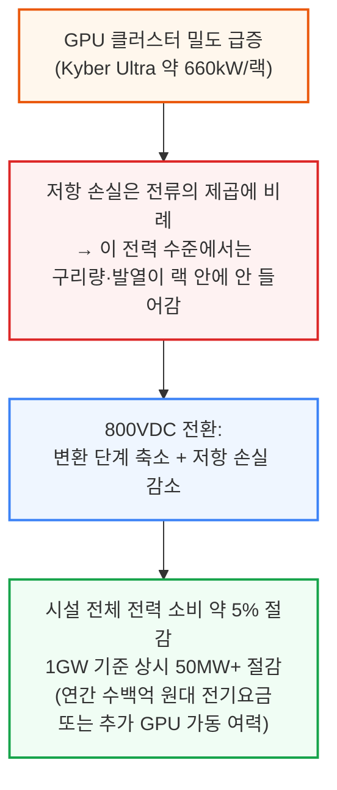

SemiAnalysis는 InferenceX와 Industrials Model을 통해 이 전환을 추적해 왔으며, 개별 가속기 아키텍처에서 출발해 800VDC 보급률과 전력 랙·SST(고체상태 변압기) 등 장비의 시장 규모까지 상향식으로 집계하고 있습니다. 이 리포트는 그 전환을 사이드카 레트로핏 단계부터, 시설 단위 DC 배전, 그리고 SST 최종 단계까지 단계별로 추적하며, 각 단계마다 설비 구성표가 어떻게 바뀌는지, 무엇이 살아남고, 무엇이 재설계되고, 무엇이 사라지는지를 분석합니다.

이 전환은 특정 공급사들의 매출 곡선을 극적으로 바꿔놓을 전망입니다. 700개 이상의 데이터센터 설계와 70개 이상의 장비 카테고리, 500개 이상 공급사를 다루는 Industrials Model을 기반으로, SemiAnalysis는 시장이 미처 알아채기 전에 승자와 (시장이 패자로 잘못 짚은) 기업들을 먼저 짚어낸 바 있습니다.

> **참고**: 이번 글은 800VDC 혁명 시리즈 Part 1로, 데이터센터 레이아웃과 장비 영향을 다룹니다. Part 2는 전력 전자·반도체 혁명을 다룰 예정입니다.

---

## 2. 800VDC란 무엇이고 왜 피할 수 없는가

**📌 핵심:**
- 800VDC는 전산실(화이트 스페이스)까지 약 800V 직류로 전력을 보낸 뒤, 컴퓨팅 장비 바로 앞에서 전압을 낮추는 방식 — 800이라는 숫자는 전류를 크게 줄이면서도 "저전압 DC"로 분류되는 규제 상한(EU 기준 DC 1,500V) 안에 들어가도록 고른 값
- 현재 표준인 48\~54V 배전은 랙 전력이 **600kW를 넘어서면 무너짐**: 1MW 랙에 필요한 구리 부스바만 약 200kg, 1GW 규모면 수백 톤 → 비용·무게·설치 공간 모두 감당 불가
- 600kW를 48\~54V로 공급하려면 전류가 약 12,500A 필요하지만, 800V로 공급하면 약 750A로 **16.7배 감소** → 저항손실(I²R)은 전류의 제곱에 비례하므로 이론상 최대 278배까지 줄어듦(실제로는 이 손실 여유분을 구리 절감으로 상당 부분 맞바꿈)
- 결론: 800VDC는 취향이 아니라 2,300W급 칩과 600kW 랙을 물리적으로 가능하게 하는 전제조건이며, 랙 하나에 GPU를 더 빽빽하게 채울수록(=토큰당 비용을 낮출수록) 더 필요해짐

---

800VDC는 간단히 말해, 데이터홀이나 로우 단위까지 약 800V 직류로 전력을 보낸 뒤 컴퓨팅 장비 바로 앞에서 전압을 낮추는 방식입니다. 800이라는 숫자가 임의로 정해진 것은 아닙니다 — 전류(따라서 구리 손실과 발열 부담)를 크게 줄이면서도, 여러 국가의 규제상 "저전압 DC" 분류 안에 들어가도록 고른 값입니다. 참고로 EU의 저전압지침(Low Voltage Directive)은 DC 기준 최대 1,500V(AC는 최대 1,000V)까지를 규제 범위로 잡고 있습니다.

지금의 데이터센터 전기 아키텍처는 시설 단위에서 3상 교류(415V 또는 480V)로 배전하고, 재래식 UPS 구조를 거친 뒤 랙 안에서 48\~54V DC로 낮추는 방식입니다. 이 방식은 지금의 랙 전력 수준에서는 문제가 없지만, 앞으로 2년 안에 랙 밀도가 **600kW+**에 다가서면 여러 이유로 무너지기 시작합니다.

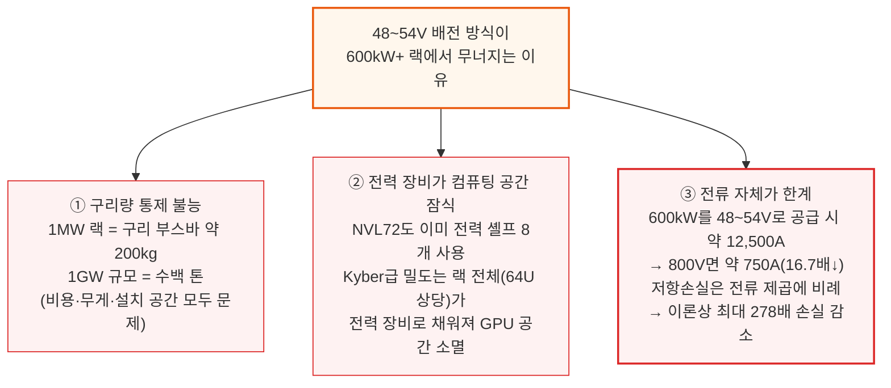

여기에 네 번째 이유가 더해집니다. AC-DC, DC-DC로 이어지는 다단 변환은 종단 간 효율을 갉아먹고, 발열을 늘리고, 고장 지점을 늘려 냉각 부하·다운타임 위험·유지보수 비용을 모두 끌어올립니다.

결국 800VDC는 2,300W급 칩과 600kW 랙을 가능하게 하는 물리적 전제조건이고, 그 600kW 랙 자체는 "토큰당 비용을 낮추기 위한 밀도 경쟁"의 직접적인 결과물입니다. 토큰당 비용은 NVLink 대역폭을 최대로 유지한 채로 얼마나 큰 스케일업 세계를 지을 수 있는지에 달려 있습니다 — 도메인이 클수록 Expert Parallelism·Tensor Parallelism을 더 넓게 펼칠 수 있고, MoE 라우팅도 스케일아웃 대신 NVLink 위에서 처리할 수 있어 디코드 과정의 직렬화가 줄어듭니다. Nvidia의 설계 원칙은 구리가 랙 안 구석구석까지 닿을 만큼 컴퓨팅을 빽빽하게 채우는 것이며, 랙 하나의 물리적 경계가 곧 만들 수 있는 Expert Layer의 크기를 결정합니다 — all-to-all 통신이 랙 경계를 넘어가는 순간, NVLink보다 약 8배 느린 스케일아웃 패브릭으로 떨어지기 때문입니다.

즉, 더 큰 스케일업 세계 → 더 밀도 높은 랙 → 600kW급 전력 envelope → 그리고 800VDC는 바로 그 envelope을 가능하게 만드는 전제조건이라는 인과관계로 이어집니다.

**📌 용어 풀이: 저항 손실과 I²R**
> - **저항 손실(Resistive Loss)**: 전선에 전류가 흐를 때 저항 때문에 열로 사라지는 에너지 — 전류가 커질수록 제곱으로 늘어남(I²R)
> - **왜 전압을 올리면 유리한가**: 같은 전력(P=V×I)을 옮길 때 전압을 올리면 전류(I)가 줄어들고, 손실은 전류의 제곱에 비례하므로 손실이 훨씬 큰 폭으로 줄어듦
> - **쉬운 비유**: 같은 양의 물을 옮길 때 굵은 호스(저전압·고전류)보다 가는 고압 호스(고전압·저전류)로 옮기면 마찰 손실이 훨씬 적은 것과 비슷한 원리

---

## 3. HVDC 전환 4단계 로드맵과 도입 곡선

**📌 핵심:**
- SemiAnalysis는 800VDC 전환을 **4단계**로 구분: Phase 1\~2(2026\~2028)는 기존 AC 인프라를 그대로 두고 랙 단위에서만 800VDC로 바꾸는 "레트로핏", Phase 3(2028\~2029)는 시설 전체를 DC로 재설계, Phase 4(2029년 이후)는 SST 중심의 최종 상태
- 2030년까지 800VDC로 공급되는 누적 신규 용량은 **약 39GW**로 전망 — Phase 1\~2 동안은 전량이 사이드카(전력 랙)로 처리되다가, 2029년부터 시설 단위 HVDC 배전이 가능해지며 변환 지점이 랙에서 SST·MV 정류기로 옮겨감
- Phase 1은 강제가 아니라 Google·Meta가 먼저 나선 "선제적 효율화"이고, Phase 2부터는 800VDC 네이티브 칩 때문에 사실상 필수가 됨
- 결론: 800VDC 전환은 한 번에 오지 않고, "랙만 바꾸는 레트로핏"에서 "건물 전체를 바꾸는 재설계"로 점진적으로 확산되는 다단계 과정

---

800VDC로의 전환은 전기 아키텍처 전체를 다시 쓰는 복잡한 변태(metamorphosis) 과정입니다. 새로운 안전 표준, 새로운 규제 프레임워크가 필요하고, 무엇보다 운영사들이 언제 기존 AC 배전을 버릴지 판단해야 하는 중요한 전략적 선택을 강요합니다.

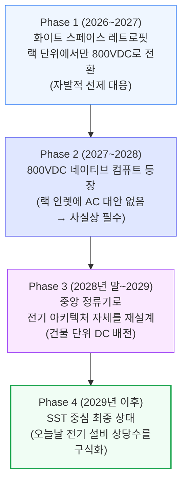

Phase 1\~2는 2026년 말\~2027년 초부터 기존 AC 배전을 랙 단위에서 전력 랙(Power Rack)을 통해 800VDC로 레트로핏하는 단계입니다. Phase 1은 하이퍼스케일러들이 미래 대비와 효율 개선을 위해 먼저 비용을 치르는 초기 도입 단계이고, Phase 2는 800VDC 네이티브 시스템이 대량으로 출하되기 시작하면서 열립니다. Phase 3는 전기 아키텍처 자체를 시설 전체 단위로 다시 쓰는 단계이고, Phase 4는 오늘날 전기 설비 상당 부분을 구식화할 새로운 장비들을 중심으로 한 최종 상태입니다.

그 결과 800VDC는 점진적인 도입 곡선을 그립니다. 2030년까지 800VDC로 공급되는 누적 신규 용량은 **약 39GW**에 이를 전망입니다. Phase 1\~2 동안은 시설 자체가 여전히 AC로 배전되고 변환이 전력 랙에서 일어나기 때문에, 대응 가능한 용량 전량이 사이드카(전력 랙)로 처리됩니다. 이 구성비는 2029년에 뒤집히는데, 시설 단위 HVDC 배전이 현실화되고 첫 800VDC 네이티브 사이트가 가동되면서 변환 단계가 랙에서 SST 또는 MV 정류기로 위쪽으로 옮겨가기 때문입니다.

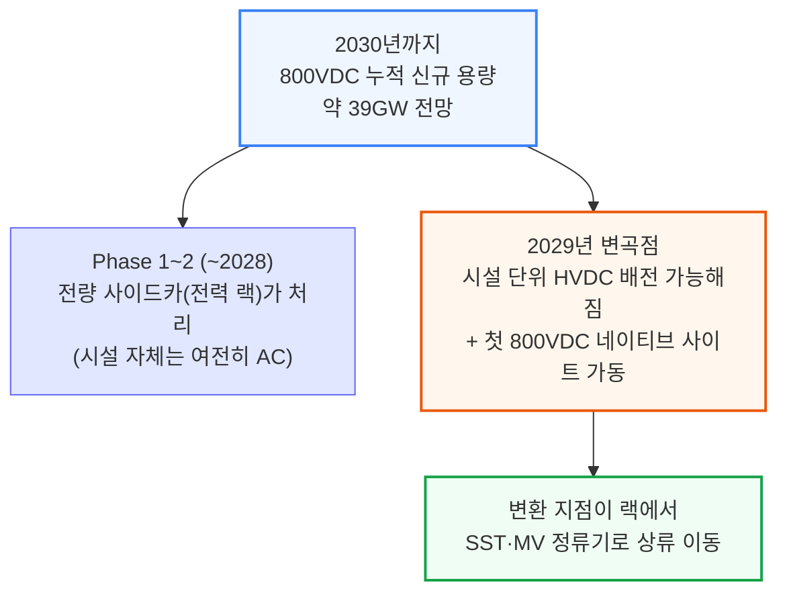

이후 섹션에서 데이터센터 레이아웃이 실제로 어떻게 바뀌는지 단계별로 살펴봅니다. (참고로 SemiAnalysis의 [데이터센터 해부학 Part 1(전기 시스템)](https://newsletter.semianalysis.com/p/datacenter-anatomy-part-1-electrical)이 이 글의 배경 개념들을 다루고 있습니다.)

---

## 4. Phase 1: 화이트 스페이스 레트로핏과 전력 랙의 등장

**📌 핵심:**
- Phase 1의 주역은 **Google과 Meta** — 18개월 넘게 OCP 워킹그룹을 통해 800VDC 아키텍처(Mt. Diablo 레퍼런스 설계)를 밀어붙였으나, 아직 강제 사항은 아님(2026\~2027년 출시되는 Vera Rubin NVL72는 180\~220kW급이라 기존 3상 AC로도 충분)
- 변화는 랙 바로 앞에서 일어남: 기존 415/480V AC가 랙 인렛에 그대로 들어가는 대신, 로우(row) 단위의 42U 캐비닛인 **HVDC 전력 랙**에서 끊기고, 여기서 800VDC로 변환되어 옆 IT 랙들로 나감
- 전력 랙은 ① 415V AC → 800VDC 정류, ② 정전 대응용 BBU, ③ (옵션) GPU 부하 급증에 대응하는 커패시터 셸프까지 세 가지 역할을 한 랙 안에서 전담 — 그만큼 GPU 랙은 순수하게 GPU·네트워킹·냉각에만 쓸 수 있게 됨
- 결론: 발전소·변압기·UPS·스위치기어 등 건물의 전기 백본은 그대로 두고, 랙 바로 앞 단(前段)만 새 장비로 갈아 끼우는 것이 Phase 1의 본질

---

HVDC 여정은 주로 두 운영사, Google과 Meta에서 시작됩니다. 둘 다 18개월 넘게 OCP 워킹그룹을 통해 자체 800VDC 아키텍처를 밀어붙여 왔고, 2024년 10월 처음 발표되어 2025년 5월 공개 표준으로 등록된 **Mt. Diablo 레퍼런스 설계**가 가장 잘 알려져 있습니다. 둘 다 강제로 떠밀린 게 아니라, 향후 전환에서 앞서 나가는 위치를 차지하고 나머지 시장이 따라오기 전에 기존 전력 체인에서 메가와트와 효율을 최대한 짜내기 위해 선제적으로 나선 것입니다.

이 점이 중요한 이유는, 800VDC가 아직 "하드 요구사항"이 아니기 때문입니다. 2026년 말\~2027년에 출시되는 Vera Rubin NVL72 같은 칩 세대는 랙 밀도가 180\~220kW 수준에 그쳐, 3상 AC로도 도체 크기나 배전 손실의 물리적 한계에 부딪히지 않고 감당할 수 있습니다. 즉 Phase 1은 하드웨어 제약에 대한 강제 대응이 아니라 **자발적인 미래 대비**입니다.

이 초기 단계가 "화이트 스페이스 레트로핏" 시대를 엽니다. 새로운 HVDC 장비, 주로 로우 단위 캐비닛인 HVDC 전력 랙이 기존 화이트 스페이스 인프라를 교체하는 게 아니라 그 위에 얹히는 방식입니다. 데이터센터의 전기 백본은 그대로입니다 — 같은 변압기, 같은 UPS, 같은 스위치기어, 같은 ATS(자동 절체 스위치).

### HVDC 전력 랙을 거치는 전력 흐름

시설 단위에서는 중압(MV) AC가 그레이 스페이스로 들어와 변압기를 거쳐 415V 또는 480V 3상 AC로 낮아집니다. 이것이 UPS로 들어가 이중 변환(AC-DC-AC)을 거친 뒤 415V AC로 출력되고, 버스웨이를 통해 데이터홀 전역으로 배전됩니다. 여기까지는 기존에 다뤄온 전통적인 전력 흐름과 동일합니다.

변화는 IT 랙에 가까워지는 지점에서 일어납니다. 415V가 랙 안 전원공급장치(PSU)로 곧장 들어가는 대신, AC 피드가 로우 단위에 배치된 **42U 규격의 독립 캐비닛, HVDC 전력 랙**에서 끝납니다.

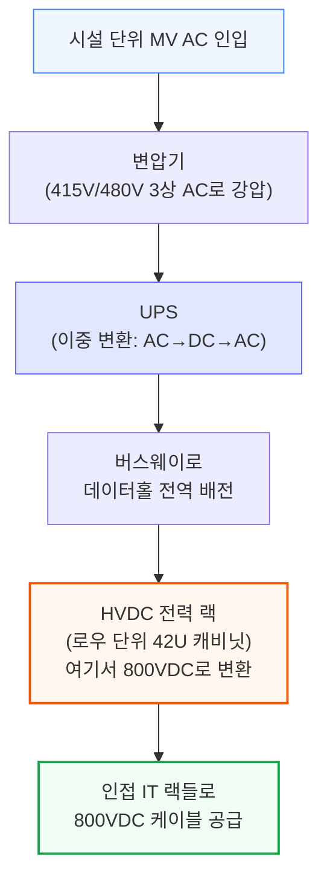

랙 내부에서는 세 가지 일을 수행합니다: ① 415V AC를 800VDC로 정류, ② 정전 시 버텨주는 BBU 모듈, ③ (선택 사항) GPU 부하 급증 시 순간 전력을 흡수하는 커패시터 셸프.

### 전력 랙이란 무엇인가

Phase 1\~2를 떠받치는 핵심 장비인 "분리형 전력 랙"을 좀 더 자세히 볼 필요가 있습니다. AC-DC 정류, 에너지 저장(BBU·커패시터 뱅크), 전력 관리 기능을 하나의 유닛에 모아, 컴퓨팅 랙을 온전히 GPU·네트워킹·냉각 전용으로 비워주는 전용 랙입니다. 이 개념은 Microsoft의 Mt Diablo 프로젝트에서 시작되었고, Google·Meta·Microsoft가 공동 저술한 **OCP Diablo 400 규격**이 이를 표준화했습니다.

전력 랙에 흔히 들어가는 핵심 구성요소는 AC-DC 정류 모듈, BBU 셸프, (옵션) 커패시터 뱅크, 전력 관리·모니터링 보드, DC 출력 버스바·PDU입니다.

하지만 이 사이드카 개념이 처음부터 완성된 형태로 등장한 것은 아닙니다. 여러 OCP 랙·전력 규격 버전을 거치며 진화해 왔습니다. 12V 기반의 ORv2, 48V 기반의 ORv3, 그리고 단일 랙 48V 설계를 물 냉각 부스바와 업그레이드된 72kW 전력 셸프로 약 190kW까지 끌어올린 HPR V1/V2는 이전 데이터센터 해부학 시리즈에서 다뤘습니다. 여기서는 800VDC와 직접 관련된 버전, 즉 전압 자체가 바뀌는 분리형 사이드카 설계에 초점을 맞춥니다.

---

## 5. 전력 랙 규격의 진화: ORv3 HPR에서 Diablo 400까지

**📌 핵심:**
- **HPR V3(50V 사이드카)**는 전력과 컴퓨팅을 별도 랙으로 처음 분리한 버전 — 다만 여전히 50V로 배전해 300kW에서 전류(6,000A)가 배선의 병목이 됨
- **HPR V4(±400V 사이드카)**는 전압을 50V→±400V로 올리고 부스바 대신 개별 케이블(16개, 각 50kW)을 써서 최대 800kW까지 확장 — 배터리 절반을 커패시터로 채우면 실질 용량은 400kW로 줄어듦
- **Diablo 400 규격**이 이 흐름을 표준화: Google·Meta·Microsoft 공동 저술, ±400V 양극형을 기본값·800V 단극형을 옵션으로 정의, 랙당 100kW\~1MW 범위, 여러 제조사 부품이 한 랙에서 섞여도 작동하도록 인터페이스 통일
- 결론: 400V를 고른 이유는 전기적 필요가 아니라 **경제성** — 전기차(EV) 산업이 이미 400V급 부품 공급망을 대량으로 구축해놓았기 때문에 그 생태계를 그대로 가져다 쓸 수 있음

---

### ORv3 HPR V3: 분리의 문턱 (50V 사이드카, 최대 300kW)

HPR V3는 전력과 컴퓨팅이 실제로 별도 랙으로 나뉜, "사이드카" 개념의 원조입니다. PSU·BBU 셸프가 전용 50VDC 사이드 전력 랙으로 옮겨가고, IT 랙과는 상하단 수평 부스바로 연결됩니다. 둘 다 ORv3 HPR 표준 규격을 유지하며, 전력 용량은 수평 크로스링크와 공랭식 수직 부스바의 한계로 300kW에 머무릅니다.

이 버전의 통찰은 전력 변환 장비를, 컴퓨팅에 최적화된 랙에 억지로 욱여넣는 대신 냉각·안전·정비성을 갖춘 전용 랙에 담는다는 것입니다. V3 전력 랙은 독립적으로 정비할 수 있어 전력 쪽 고장의 피해 범위도 줄어듭니다. 하지만 V3는 여전히 50VDC로 배전하기 때문에 부스바 전류가 높고(300kW에서 6,000A), 크로스링크가 병목이 됩니다.

이 구조는 지금도 남아 있습니다. VR NVL72 랙도 800VDC(Nvidia 규격) 또는 ±400VDC(OCP 규격)를 공급받는 HVDC 전력 랙에 연결되어도, 내부적으로는 여전히 50V 부스바로 배전합니다. 컴퓨팅 트레이 직전에 DC-DC 전력 셸프가 고전압 DC를 50VDC로 낮추고, 최종적으로 GPU 보드의 VRM이 50V를 1V 미만으로 낮춥니다.

### ORv3 HPR V4: ±400VDC HVDC 사이드카 (최대 800kW)

HPR V4는 OCP HPR 계보를 HVDC 시대로 연결하는 버전으로, 두 가지 핵심 변화를 담고 있습니다: 전압이 50VDC에서 ±400VDC(총 800V)로 올라가고, 부스바 기반 크로스링크가 개별 전력 케이블로 대체됩니다.

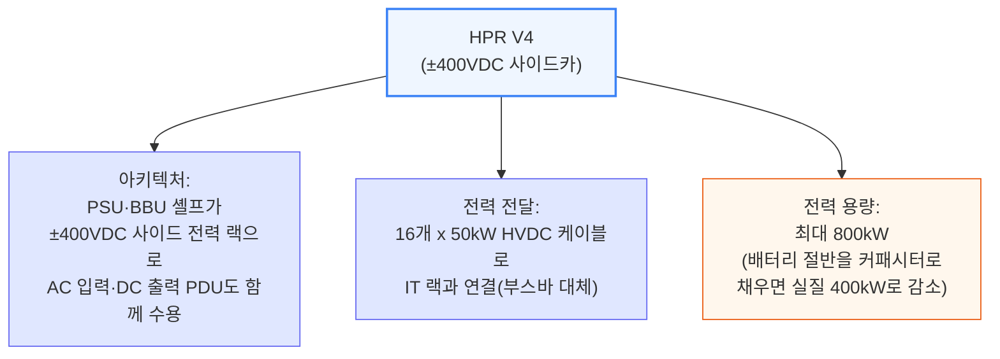

부스바 대신 케이블을 쓰는 이유는, V4가 목표로 하는 전력 수준(400\~800kW)에서는 V3의 수평 부스바 크로스링크가 전류 한계에 부딪히기 때문입니다. 케이블로 바꾸면 각 케이블을 독립적으로 배선·퓨즈 처리·관리할 수 있고, 단일 부스바가 열·기계적 제약이 되는 문제를 없앨 수 있습니다.

V4는 사실상 "Diablo 이전" 상태의 HVDC 사이드카 설계로, 주로 Meta의 랙·전력 팀이 개발했습니다. 분리형 HVDC 전력 공급 개념을 증명했지만, 아직 여러 제조사·여러 하이퍼스케일러가 함께 쓸 수 있는 규격은 아니었습니다.

### Diablo 400 규격: HVDC 사이드카의 표준화

Diablo 400 규격(Microsoft의 원래 내부 프로젝트명 Mt Diablo에서 이름을 땀)은 HPR V4가 개척한 HVDC 사이드카 개념을 공식화·표준화합니다. Google·Meta·Microsoft가 공동 저술했으며, 2025년 5월 초안(v0.5.2)으로 공개된 뒤 업계 피드백을 반영한 v0.7.0 개정판이 뒤따랐습니다.

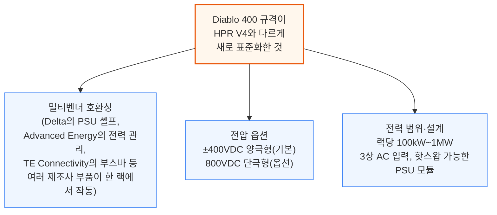

이 밖에도 Diablo 400은 케이블 규격(5m 케이블 기준 전압강하 0.1% 이내), 홀드업 시간(100% 부하에서 에너지 저장 없이 최소 20ms), 기계 설계(4OU BBU 등 대형 블록을 밀어 넣고 빼는 슬라이딩 셸프, 블라인드 메이트 커넥터), 그리고 커넥티비티·랙 폼팩터·AC-DC PSU 토폴로지·DC-DC 모듈·이중화 아키텍처·안전 표준·데이터/전력 관리 백플레인까지 총 일곱 개 영역을 표준화합니다.

명목 전압으로 400VDC를 고른 것은 의도적인 선택이었습니다. Google 엔지니어들이 OCP EMEA 2025에서 밝혔듯, "400VDC를 명목 전압으로 선택하면 전기차 산업이 이미 구축해놓은 공급망을 그대로 활용할 수 있어, 규모의 경제와 더 효율적인 제조, 품질·규모 개선을 얻을 수 있다"는 것이 핵심 논리입니다. 양극형 구성에서는 각 레일이 접지된 중간점으로부터 400V만 떨어져 있기 때문에, 이미 성숙한 EV급 전력 전자 부품(650V급 GaN FET, 400V급 커패시터·커넥터·퓨즈)을 그대로 쓸 수 있는 전압 범위 안에 머무릅니다.

### 모두에게 맞는 단일 규격은 없다

Diablo 400이 공통 기반 규격을 제공하긴 하지만, 실제 현장은 파편화되어 있습니다. Nvidia는 아예 이 규격 바깥에서 660kW급 단극형 800V 레퍼런스 설계를 자체 개발 중이며, 공랭 샘플은 2026년 중반, 수랭식 VR Ultra 버전은 2026년 말 샘플링을 목표로 합니다.

Diablo 400 안에서도 세 공동 저자 사이에 실질적인 차이가 있습니다. Meta는 600\~800kW를 50kW급 HVDC 출력 케이블과 200A AC 입력 whip 8개로 운용합니다. Google은 랙 공간을 BBU·슈퍼커패시터에서 PSU로 재배치해 900kW까지 밀어붙이고, 100kW급 출력 케이블을 쓰며 1.1MW 루프라인에서는 AC whip 12개가 필요합니다. Amazon의 설계는 ±400V에서 800kW로 귀결됩니다. Microsoft는 규격을 공동 저술했지만 진행 속도는 더 느린 것으로 판단됩니다.

이 밖에도 DG Matrix의 Interport Cell Series처럼, 재래식 정류기+PSU 스택 대신 저압(LV) 입력 SST를 쓰는 대안적 사이드카 토폴로지도 있습니다.

---

## 6. Phase 1의 비용과 사이드카 시장 규모

**📌 핵심:**
- HVDC 전력 랙의 예상 판매단가(ASP)는 **대당 40\~50만 달러**로, 기존 표준 AC 전력 랙(대당 약 4만 달러)의 **약 10배** — MW당으로 환산하면 약 50만 달러/MW
- 사이드카(전력 랙) 시장 규모는 **2028년 약 110억 달러**로 정점을 찍은 뒤, Phase 3의 시설 단위 800VDC가 점유율을 가져가며 감소 전망
- Phase 1은 기존 장비를 지우는 게 아니라 새 장비를 얹기만 하므로, MW당 전기 설비 비용이 **약 40\~50만 달러 순증** — 이 증가분의 대부분은 HVDC 전력 랙이 차지
- 결론: Phase 1은 "효율을 사기 위해 비용을 먼저 낸다"는 단계 — 총비용이 늘어나는 대신 변환 손실이 줄어드는 트레이드오프

---

HVDC 전력 랙은 초기 레트로핏 단계에서 가장 눈에 띄는 신규 장비 비용입니다. 전력 랙의 예상 판매단가(ASP)는 대당 40만\~50만 달러 수준으로, 기존 표준 AC 전력 랙 장비의 ASP(약 4만 달러)의 약 10배에 이릅니다. 배치된 MW 기준으로 환산하면 약 50만 달러/MW에 해당합니다.

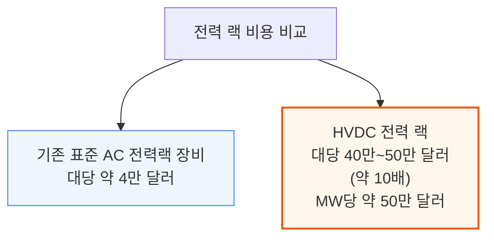

Industrials Model에서는 이 단계별 도입 시점을 신규 데이터센터 증설 용량에 적용하고 칩 단위 SKU 계산을 거쳐, 사이드카(전력 랙)와 SST 각각의 시장 규모(TAM)를 추정합니다. 사이드카 시장은 **2028년 약 110억 달러**로 정점을 찍은 뒤, Phase 3에서 시설 단위 800VDC가 점유율을 가져가면서 감소할 것으로 전망합니다. 이 추정은 전력 랙 콘텐츠를 MW당 50만 달러로 가정한 결과입니다.

화이트 스페이스 레트로핏은 기존 아키텍처 대비 전기 설비 콘텐츠/MW를 명확히 끌어올립니다. Phase 1은 사실상 아무것도 지우지 않고 새 장비만 얹기 때문입니다. 이 증가분은 대략 **MW당 40만\~50만 달러**로 추정되며, 그 대부분을 HVDC 전력 랙이 차지합니다.

---

## 7. Phase 2: 800VDC 네이티브 컴퓨트가 만드는 전환점

**📌 핵심:**
- Phase 2의 진짜 전환점은 **800VDC 네이티브 칩(Kyber Rack)**의 등장 — 랙 인렛에 AC로 되돌아갈 대안 자체가 없어지므로, 800VDC가 "미리 대비하는 선택"에서 "필수"로 바뀜
- 시설 단위 800VDC 배전은 아직 준비되지 않았기 때문에, Phase 2에서도 여전히 로우 단위 HVDC 전력 랙을 통한 레트로핏 구조가 이어짐
- Phase 1(Oberon 랙)은 전력 셸프가 IT 랙 안에서 800V→50V를 낮췄지만, Phase 2(Kyber 랙)는 800V 버스가 컴퓨팅 블레이드까지 직접 들어가고, 블레이드 위 전력 모듈이 최종 강압을 담당 — 변환 위치만 바뀌고 결국 50V까지 낮춰야 하는 것은 동일
- 결론: 초기 Kyber 설계는 랙 옆 DC-DC PSU 사이드카를 검토했으나, 공간 효율 때문에 결국 블레이드 자체에 전력 모듈을 내장하는 방식으로 굳어질 전망

---

Phase 1이 레트로핏 시대의 시작이었다면, 진짜 전환점은 800VDC 네이티브 시스템의 등장과 함께 옵니다. 이 시점부터 800VDC는 미래 대비용 파일럿이 아니라, 물리와 랙 밀도가 강제하는 필수 전환이 됩니다. Kyber Rack으로 전력을 공급받는 운영사들은 랙 인렛에 AC로 되돌아갈 방법이 없고, 이 구간에서 800VDC 보급률이 급격히 치솟을 것으로 예상합니다. 800VDC 네이티브 실리콘이 시설 단위 800VDC 배전보다 먼저 나오기 때문에, 레트로핏 단계는 이 시점에도 계속 이어집니다.

아키텍처 관점에서 Phase 2는 Phase 1과 매우 비슷해 보입니다. 둘 다 HVDC 전력 랙으로 화이트 스페이스를 레트로핏하고, 둘 다 그레이 스페이스는 그대로 두며, 둘 다 AC를 로우 단위 전력 랙에서 DC로 정류합니다. 핵심 차이는 전압이 칩이 쓸 수 있는 수준까지 낮아지는 위치입니다. Phase 1(Oberon 랙)에서는 IT 랙 안의 전력 셸프가 800VDC를 컴퓨팅 트레이에 닿기 전에 약 50VDC로 낮춥니다. Phase 2(Kyber 랙)에서는 800VDC 버스가 컴퓨팅 블레이드까지 직접 이어지고, 블레이드 위의 전력 모듈이 최종 강압을 담당합니다.

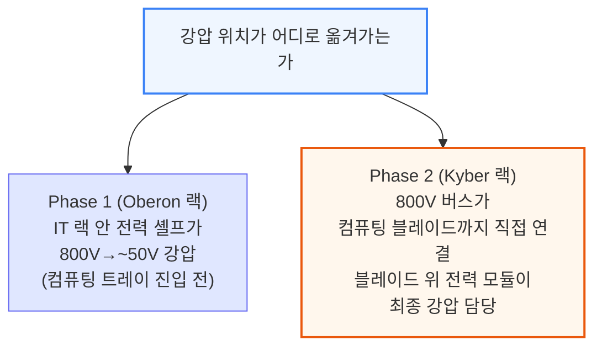

OCP에서 공개된 초기 Kyber 설계는 컴퓨팅 랙 옆에 DC-DC PSU 사이드카를 두는 방식을 보여줬지만, 이 방식이 대규모로 채택될 가능성은 낮다고 판단합니다. 별도 사이드카는 블레이드 자체에 변환 단계를 내장하는 것보다 전체 바닥·랙 공간을 더 많이 차지하며, 전력 모듈 폼팩터가 컴퓨팅 트레이의 부피 제약 안에서도 구현 가능하다는 게 이미 증명되었기 때문입니다.

대부분의 서버·트레이가 여전히 약 50V 입력을 쓰기 때문에, 두 아키텍처 모두 고전력 800V→약 50V DC-DC 변환 단계를 유지합니다. 차이는 그 변환이 "어디서" 일어나느냐일 뿐입니다. 800VDC를 컴퓨팅 트레이에 직접 넣고 중간 버스 전압(IBV)으로 낮춘 뒤 다시 포인트오브로드 레일로 변환하는 방식도 논의된 바 있지만, Kyber의 온-블레이드 전력 모듈은 800V 입력을 받아도 IBV 방식이 아니라 기존의 약 50V 버스 레벨로 곧장 변환합니다. 트레이 내부의 제한된 공간과 안전 제약을 고려하면, 800V→IBV→PoL로 이어지는 완전한 아키텍처는 여전히 매우 어려운 과제로 남아 있습니다.

---

## 8. UPS와 배터리 저장장치의 운명

**📌 핵심:**
- 800VDC 아키텍처에서 중앙집중형 저전압(LV) UPS는 점차 역할을 잃고 결국 **구식화**될 전망 — 레트로핏 단계에서는 전력 랙 자체가 BBU·슈퍼커패시터를 품고 있어 AC-DC-AC UPS 쌍의 2\~3% 변환 손실 없이 같은 역할(정전 대응·순간 변동 흡수)을 대신함
- Google·Meta는 이미 수년 전부터 중앙 UPS를 건너뛰는 "분산형 UPS" 구조를 써왔고, 이 방식은 A/B 이중 UPS가 필요 없어져 전체 배터리 용량을 절반으로 줄임
- 다만 분산형 UPS·배터리는 중앙 UPS보다 운영이 더 까다로워, Google·Meta처럼 수직 통합된 하이퍼스케일러가 아닌 사업자(특히 혼합 워크로드를 지원해야 하는 임대(colocation) 사업자)는 당분간 LV UPS를 그대로 유지할 전망
- 결론: 새로운 대안(MV UPS, 시설 단위 BESS)도 등장하고 있어, 백업 전원 전략은 운영사마다 다르게 갈라질 전망

---

기존 중앙집중형 UPS 시스템은 800VDC 전환에서 가장 논쟁적인 설비일 것입니다. 800VDC 아키텍처에서는 중앙집중형 저전압(LV) UPS가 점차 역할을 잃고 결국 구식화될 것으로 예상합니다. 레트로핏 시대에는 전력 랙 자체가 800VDC 버스 위에 앉아 BBU 모듈과 슈퍼커패시터를 품고 있습니다. 둘 다 네이티브로 DC와 결합되어 있어, BBU는 정전 발생 후 수초\~수분을 버텨주고 슈퍼커패시터는 GPU 부하의 밀리초 단위 급변동을 흡수합니다. 두 장치가 함께, AC-DC-AC UPS 쌍의 2\~3% 변환 손실 없이 중앙집중형 단기 배터리 저장·UPS 브릿지 기능을 대신합니다.

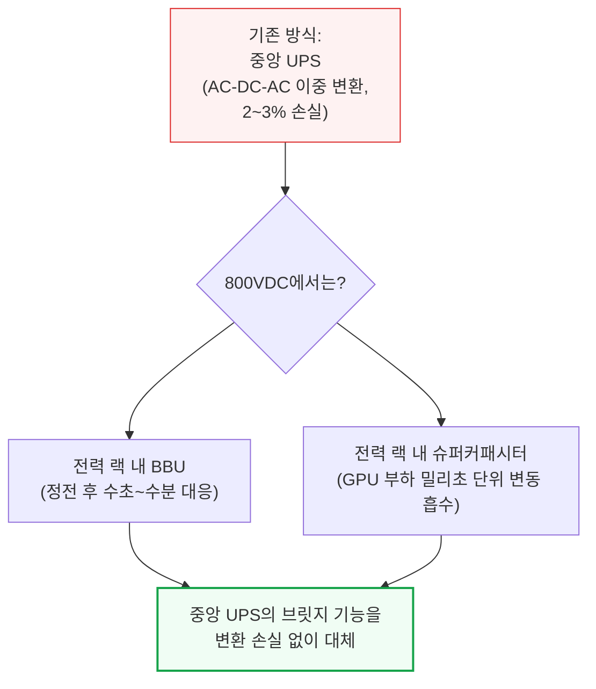

Google과 Meta는 이미 수년 전부터 이런 공격적인 접근을 택해, 중앙집중형 UPS를 건너뛰는 "분산형 UPS" 아키텍처를 써왔습니다. 이 구조에서는 AC 전력이 랙까지 직접 배전되고, 랙 안 PSU가 AC-DC 변환을 담당하며, 랙 단위 리튬이온 BBU가 짧은 시간의 브릿지 전력을 제공합니다. 이렇게 하면 중앙 UPS의 AC-DC-AC 변환 쌍이 사라져 효율이 좋아지고, A사이드·B사이드 UPS를 둘 다 둘 필요가 없어져 데이터센터 전체에 필요한 배터리 총용량도 절반으로 줄어듭니다.

다만 분산형 UPS나 배터리 백업을 관리하는 것은 전통적인 중앙 UPS를 운영하는 것보다 운영상 더 까다롭습니다. Google·Meta 같은 수직 통합 하이퍼스케일러가 아닌 다른 운영사들은, 적어도 중기적으로는 이중화·부하 변동 대응을 위해 LV UPS를 그대로 유지할 것으로 예상합니다. 이는 특히 임대(colocation) 사업자에게 해당하는데, 이들은 유연성을 우선시하고 CPU 랙, 스토리지 어레이, 네트워킹 장비, 아직 AC로 운영되는 구형 GPU 랙까지 섞인 워크로드를 지원해야 합니다. 그레이 스페이스 AC 인프라를 그대로 유지하면, 밀도가 가장 높은 AI 랙에는 800VDC를 쓰면서 나머지에는 표준 AC 배전을 그대로 돌릴 수 있습니다.

운영사마다 백업 아키텍처에 대한 접근이 다르게 갈릴 것으로 예상되며, 새로운 대안들도 등장하고 있습니다. 그리드 연결 지점에서 직접 4.16\~34.5kV로 작동하는 **MV UPS**는, 랙 단위 배터리 랙과 기능적으로 유사하지만 데이터홀 전역에 분산되는 대신 그리드 인터페이스에 집중된 형태입니다. ABB의 HiPerGuard는 98% 효율로 작동하며 이미 Applied Digital의 노스다코타 400MW AI 캠퍼스에 배치되어 있습니다. ON.energy는 몇 주 전 자사의 MV 이중 변환 UPS 아키텍처를 보호하는 미국 특허를 획득했습니다. 두 번째 대안은 시설 단위 BESS로, 수 메가와트\~수백 메가와트 규모에서 작동하고 1\~4시간 지속시간의 백업을 제공하며 디젤 발전기를 점점 더 대체하거나 축소시키고 있습니다.

---

## 9. Phase 3: 중앙 정류기로 전기 아키텍처 재설계

**📌 핵심:**
- Phase 1\~2는 AC-DC 변환이 랙 바로 앞에서 일어났지만, Phase 3는 데이터센터 레이아웃 자체를 바꿔 **800VDC를 건물의 전기 핵심**으로 만듦 — 그레이 스페이스나 실외에 자리한 중앙 정류기가 415V AC를 800VDC로 바꿔 홀 전체에 DC로 배전
- 그레이 스페이스는 둘로 쪼개짐: MV 변압기·스위치기어는 그대로(유틸리티 인입은 여전히 AC), 반면 480V AC 스위치기어와 AC 바닥 PDU는 **역할이 사라져 통째로 삭제**
- DC는 AC처럼 자연스럽게 소멸하는 아크가 없어(초당 100\~120회 영점교차 없음) 배전 중 통전 상태에서 회로를 끊는 탭오프가 훨씬 어려움 → 초기 배치는 탭오프 없는 피더 전용 버스웨이 위주, SiC/GaN 기반 고체상태 차단기(SSCB)가 대안으로 부상
- 결론: "AC-DC 변환 지점보다 위는 그대로 남고, 그 아래(AC 배전용으로 설계된 모든 것)는 사라진다"는 것이 Phase 3의 요약

---

Phase 1\~2에서는 AC-DC 변환이 랙 바로 앞, 로우 단위 HVDC 전력 랙 안에서 일어났습니다. Phase 3는 데이터센터 레이아웃 자체를 바꾸고, 800VDC가 건물의 전기 핵심이 됩니다. 진짜 변곡점이 바로 여기입니다. 데이터센터의 각 구역에서 무엇이 바뀌는지 하나씩 풀어보겠습니다.

### 그레이 스페이스: 전력 배전이 DC로 바뀐다

Phase 3에서는 그레이 스페이스나 실외에 자리한 전용 상류 정류기가 415V AC를 800VDC로 바꿔 홀 전체에 DC로 배전합니다. 이들은 1,200\~1,700V급 실리콘 IGBT나 사이리스터를 쓰는 성숙한 장비입니다.

그레이 스페이스는 이 지점을 기준으로 둘로 쪼개집니다. 데이터센터를 그리드에 연결하는 MV 변압기는 그대로 남습니다. MV 스위치기어도 유틸리티 인입 자체가 여전히 AC이기 때문에 그대로 남고, 상류의 MV 인프라(11\~34kV)는 시설이 기가와트급 클러스터로 커질수록 오히려 더 복잡해질 전망입니다. LV 변압기도 남아 MV를 상류 정류기용 415V AC로 낮추는 역할을 계속합니다. 반면 LV 변압기와 PDU 사이의 480V AC 스위치기어는 800VDC가 버스웨이를 통해 흐르는 순간 역할이 사라지고, AC 바닥 PDU도 함께 삭제됩니다 — DC 버스웨이가 별도의 AC 배전 PDU 없이 배터리 랙에 곧장 전력을 공급하기 때문입니다. 요약하면, AC-DC 변환 지점보다 위는 그대로 남고, 그 아래(AC 배전용으로 설계된 모든 것)는 사라집니다.

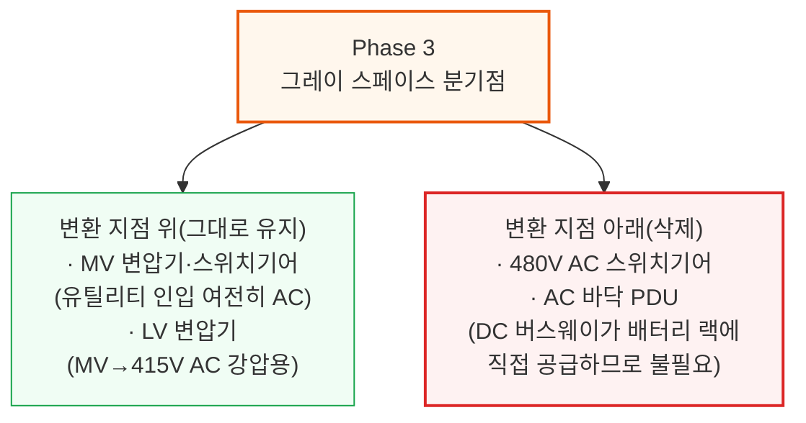

### DC 배전 이해하기: 스위치보드, 버스웨이, 보호 장치

Phase 3에서는 하나의 AC 피드를 여러 개의 보호된 출력으로 나누던 AC 스위치보드의 기능이 어딘가로 옮겨가야 합니다. 세 가지 제품 카테고리가 이를 흡수할 것으로 예상됩니다: (i) 출력마다 SSCB 보호를 내장한 MW급 정류기(정류기 자체가 배전 장치를 겸함), (ii) 차단기가 달린 탭오프 박스를 갖춘 DC 버스웨이(DC 등급 탭오프의 아크 차단 기술이 성숙하면), (iii) 정류기·스위치보드·버스웨이를 공장에서 하나의 스키드로 묶은 조립식 그레이 스페이스 파드(특히 하이퍼스케일러 조달용).

주요 AC 스위치보드 기존 강자(Schneider Electric, ABB, Eaton, Vertiv)는 아직 독립된 800VDC 스위치보드 제품을 내놓지 않았습니다. ABB의 2025년 10월 Nvidia 파트너십은 독립 스위치보드가 아니라 자사 "모듈형 파워 블록" 내부의 배전을 다룹니다. EPEC Solutions는 고차단용량 DC 차단기를 갖춘 800VDC LV 스위치보드를 실제로 판매하고 있습니다. 기존 단일 출력 정류기를 쓰는 레트로핏 현장이나, 정류기·보호 계층 사이에서 벤더 중립성을 원하는 운영사에게는 독립형 스위치보드가 틈새시장으로 남을 전망입니다.

정류가 끝나면 DC 버스웨이가 홀 단위 800VDC 배전용 AC 버스웨이를 대체합니다. 기존 AC 데이터센터의 버스웨이 시스템에는 콘센트처럼 개별 랙·로우에 전력을 분기하는 모듈식 플러그인 연결부인 "탭오프"가 있고, 통전 상태에서도 추가·제거가 가능합니다. 반면 피더 전용 버스웨이는 중간에 개구부나 탭오프가 없이, 전력이 한쪽 끝으로 들어가 다른 쪽 끝이나 미리 정한 종단점으로만 나갑니다.

초기 800VDC 배치는 탭오프가 훨씬 더 복잡해지기 때문에 피더 전용 버스웨이를 주로 쓸 것으로 예상합니다. 800VDC에서는 부하 상태에서 전류를 끊으면 지속적인 아크(플라스마 방전으로 극심한 열을 내는 현상)가 발생하는데, DC는 AC처럼 파형이 영점을 교차하는 순간이 없어 아크가 스스로 꺼지지 않습니다(AC는 초당 100\~120회 파형이 영점을 지나며 아크가 자연 소멸). 게다가 적절한 아크 차단 성능을 갖춘 DC 등급 탭오프 유닛은 물리적으로 훨씬 커서 현재로서는 실용적이지 않습니다. Delta와 ABB는 800VDC 버스웨이 프로그램을 공개적으로 발표했고, Legrand·EAE 같은 주요 버스웨이 업체들도 2026년 중 뒤따를 것으로 예상됩니다.

이 문제를 해결하기 위해 인접 산업에서 검증된 여러 보호 방식이 이 전압 등급에 이미 존재합니다. 가장 유력한 구현은 여러 방식을 조합하는 것으로, 그중 하나가 새로운 세대의 차단기입니다. SST(고체상태 변압기)에서 이미 진행 중인 것과 같은 흐름을 따라, **고체상태 차단기(SSCB)**가 도입되고 있습니다. SSCB는 SiC나 GaN을 이용해 마이크로초 단위로 고장 전류를 끊습니다. 반도체 스위치는 물리적으로 접점을 떼어낼 필요 없이 그냥 전류를 흘리지 않으면 되기 때문에, 애초에 꺼야 할 아크 자체가 생기지 않습니다.

새 세대 차단기는 이미 상용화되어 있습니다. ABB는 태양광·에너지 저장·해양용 Emax 2(1500V DC)와, 2025년 10월 Nvidia와 함께 발표한 데이터센터용 고체상태 SACE Infinitus(1000V/2500A)를 보유하고 있습니다. LS Electric은 데이터센터 용도로 등재된, UL 인증을 받은 최초의 1500V DC 몰드케이스 차단기를 보유하고 있습니다.

### LV SST를 이용한 대안 경로

중앙집중형 AC/DC 정류기의 신흥 대안은 **저압(LV) SST**를 쓰는 것입니다. 그레이 스페이스나 실외에서 415V AC를 800VDC로 바꾸는 동일한 변환을 수행하지만, 더 컴팩트하고 프로그래밍 가능한 폼팩터로 구현합니다. LV-SST는 MV 입력 SST의 발목을 잡는 3,300V급 SiC 공급 제약을 우회하기 때문에 더 먼저 시장에 나올 수 있는 SST 변형입니다.

---

## 10. 화이트 스페이스의 진화: 전력 랙에서 배터리 랙으로

**📌 핵심:**
- Phase 3에서는 전력 랙이 800VDC 변환 작업을 더 이상 할 필요가 없어져, 정류 기능만 빠진 후속 장비인 **배터리 랙**으로 대체됨 — MW당 콘텐츠는 약 20만 달러로, 정류기가 빠진 만큼 낮지만 BBU·커패시터 비중은 오히려 높아짐
- BBU 모듈 용량도 커짐: 현재 약 5.5kW급에서 Rubin Ultra·800VDC 시대에는 **8\~12kW급**으로 상승(Delta는 110kW 전력 셸프에 80kW BBU를 내장해 6셸프 랙 전체 480kW 구성)
- 시설 단위에서는 냉각·조명·소화설비 등이 여전히 AC로 작동해 가장 변화가 적은 구역으로 남고, 발전기 의존도는 800VDC와 무관하게 이미 일부 하이퍼스케일러에서 줄어드는 추세
- 결론: 정류가 MV(중압) 단에서 직접 이뤄지지 않는 이유는 10kV 이상을 감당하는 반도체 소자가 상용화되지 않았기 때문이지만, Wolfspeed의 10kV SiC MOSFET 등장으로 그 간극이 좁혀지고 있어 다음 단계(Phase 4)로 이어짐

---

앞서 살펴본 그레이 스페이스와 화이트 스페이스의 완전한 전환을 종합하면, 시설 단위에서 가장 변화가 적은 구역이 남습니다. 먼저 화이트 스페이스부터 보겠습니다.

### 전력 랙에서 배터리 랙으로

이제 Phase 3에서는 800VDC 변환을 수행하는 전력 랙이 더 이상 필요 없습니다. 대신 새로운 이름의 장비, **배터리 랙**이 그 자리를 대신합니다.

배터리 랙은 전력 랙의 구성요소·기능 대부분을 공유합니다. 가장 큰 차이는 더 이상 AC-DC 정류를 하지 않는다는 점인데, 그레이 스페이스에서 800VDC를 그대로 받기 때문입니다. 세 가지 핵심 구성요소가 남습니다.

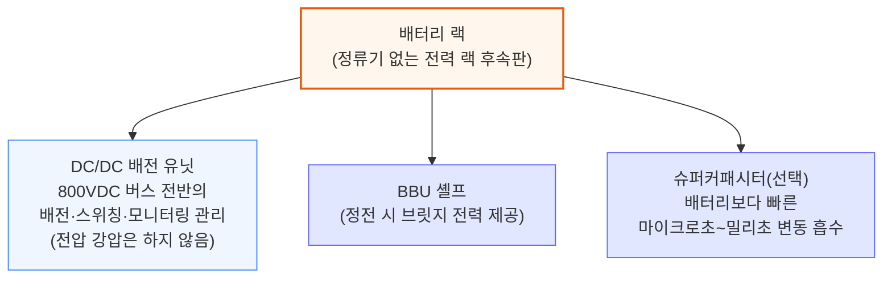

DC/DC 배전 유닛은 전압을 낮추지 않습니다 — 800VDC 전체가 배터리 랙에서 컴퓨팅 블레이드까지 그대로 이동합니다. 배터리 랙은 대체로 기존 전력 랙과 같은 로우 위치에 자리하지만, 일부 운영사는 인접 그레이 스페이스나 실외 인클로저에 배치하기도 합니다. 트레이드오프는 단순합니다: 정류기는 사라지고, BBU·슈퍼커패시터 콘텐츠는 늘어납니다. 배터리 랙의 MW당 콘텐츠는 약 20만 달러 수준에 이를 것으로 예상합니다.

### BBU 모듈의 대형화

현재 모듈은 약 5.5kW급으로 나옵니다. Rubin Ultra와 800VDC 아키텍처가 도입되면서 개별 모듈 용량은 8\~12kW급으로 올라갑니다. 2025년 3월 발표된 Infineon의 BBU 로드맵은, 모듈형 4kW급 부분전력변환기(Partial Power Converter) 카드를 병렬로 묶어 유닛당 최대 12kW, 최대 99.5%의 정점 효율을 내는 방식을 씁니다.

Delta는 GTC 2026에서 셸프 단위로 한 걸음 더 나아가, 새 110kW급 전력 셸프에 각각 80kW급 BBU 용량을 내장해 6셸프 랙 전체에서 480kW를 구성했습니다. 랙 전력이 늘어날수록 랙당 필요한 백업 에너지도 비례해 늘어나는데, 고용량 모듈을 쓰면 더 적은 물리적 모듈 수로 그만큼의 에너지를 공급할 수 있어 전력 랙 안 공간을 아낄 수 있습니다.

### 시설 단위에서 벌어지는 일

그레이 스페이스와 화이트 스페이스의 완전한 전환을 다 살펴본 뒤 보면, 시설 단위는 변화가 가장 적은 구역입니다. 냉각은 여전히 AC입니다. 칠러·펌프·팬은 여전히 AC 모터로 돌아가며 DC-AC 인버터가 필요합니다. Delta는 GTC 2026에서 800VDC를 지원하는 2.4MW급 In-Row CDU를 공개했는데, 네이티브 DC용으로 설계된 첫 주요 냉각 부품입니다. 하지만 칠러·압축기·펌프·건물 제어 시스템을 아우르는 전체 스택은 여전히 AC에 의존하며, DC 네이티브 냉각 시스템 전체를 파는 벤더는 아직 없습니다.

발전기 아키텍처는 이미 800VDC와 무관하게 일부 하이퍼스케일러에서 느슨해지고 있습니다. Meta는 신규 사이트에서 발전기 자체를 아예 건너뛰는 것으로 보이고, Microsoft의 신규 설계는 부분적인 발전기 커버리지만 씁니다. 800VDC는 이 방향을 가속할 수 있는데, 슈퍼커패시터·BBU·BESS가 계층화된 백업 구조를 이루며 과거 발전기가 담당하던 기능을 흡수하기 때문입니다.

### 중압(MV) 정류기: 모두를 위한 자리가 있는가

한 가지 자연스러운 질문은, 전력을 왜 LV 단에서 정류하고 MV에서 곧장 정류하지 않느냐는 것입니다. 답은 반도체 소자 등급에 있습니다. 13.8kV나 34.5kV에서 곧장 정류하려면 10kV 이상을 감당하는 소자가 필요한데, 상용 형태로는 거의 존재하지 않습니다. 다만 그 간극은 좁혀지고 있고, Wolfspeed의 10kV급 SiC MOSFET은 2026년 3월부터 베어다이 형태로 상용 공급되고 있습니다.

10kV 이상 SiC MOSFET의 발전은 Phase 3의 두 번째 진화 단계로 가는 문을 엽니다 — 이 단계에서는 LV 장비마저 주전력 버스에서 빠지게 됩니다. 이 흐름이 이어지면 변환 단계가 추가로 줄어들고 새로운 효율 개선이 따라옵니다.

전통적인 정류기도 실리콘 소자를 직렬로 쌓아 MV 정류를 처리할 수 있지만, 이를 훨씬 더 효율적이고 컴팩트하고 빠르게 해내겠다고 약속하는 신기술이 등장하고 있습니다 — 바로 다음 챕터의 주인공, **고체상태 변압기(SST)**입니다.

---

## 11. Phase 4: SST(고체상태 변압기), 최종 단계

**📌 핵심:**
- SST는 철심·구리로 된 재래식 변압기를 반도체 스위칭 소자로 대체한 신형 전력 전자 장비 — MV 정류기와 LV 변압기를 하나의 장치로 합쳐 **변환 단계 2개를 통째로 없앰**
- 벤더들은 최대 15%의 시스템 효율 개선을 목표(82\~85%에서 97%대로), 스위칭 주파수를 20,000Hz 이상으로 올려 철심 부피를 약 90% 줄임(Infineon 기준 무게 40분의 1, 크기 14분의 1)
- 다만 데이터센터급 SST의 실사용 신뢰성 데이터는 아직 없음(가장 오래된 배치 사례는 2011년부터 가동 중인 스위스 국철의 Hitachi-ABB PETT) → 30\~40년을 버티는 재래식 변압기 대비 검증 기간이 짧음
- 결론: 2030년까지 SST 시장 규모는 약 320억 달러로 전망되지만, 본격적인 상용 채택은 2029년 초 이전에는 어려울 전망 — UL 인증조차 2026년 5월 기준 아무 벤더도 완료하지 못한 상태

---

드디어 DC 배전의 최종 목표, **고체상태 변압기(Solid-State Transformer, SST)**에 도달합니다. 이는 재래식 철심 변압기를 고주파 반도체 기반 컨버터로 대체하는 새로운 범주의 전력 전자 장비입니다.

Phase 4의 데이터센터 레이아웃은 Phase 3와 매우 비슷합니다. 가장 큰 변화는, SST가 LV AC-DC 정류기와 LV 변압기를 하나의 장비로 합쳐 중압(MV)에서 곧장 800VDC로 변환한다는 점입니다. 앞서 다룬 Phase 3의 두 번째 진화(MV에서 곧장 정류하는 방식)까지 고려하면, 아키텍처는 사실상 동일해집니다.

### SST란 무엇인가

SST는 모든 데이터센터의 그레이 스페이스에 있는 거대한 철심-구리 변압기와 똑같은 일을 합니다: 유틸리티 수준의 중압을 IT 장비가 쓸 수 있는 수준까지 낮추는 것입니다. 재래식 변압기는 그리드 주파수에서 자기유도를 이용하지만, SST는 반도체 스위칭 단계를 이용해 같은 변환을 훨씬 작은 부피로 해냅니다.

데이터센터용 SST는 3단 구조 장치입니다. 입력단은 위험한 중압(13.8\~45kV) 수준을 다루며 3,300V 이상급 SiC MOSFET을 이용해 AC를 DC로 바꿉니다. 절연단은 크기 축소가 일어나는 곳으로, 고주파 변압기가 전압을 낮추는 동시에 유틸리티/전원과 데이터센터 사이의 갈바닉 절연을 제공합니다. 출력단은 별도의 인버터 없이 배전 시스템이 필요로 하는 최종 800VDC를 만들어냅니다.

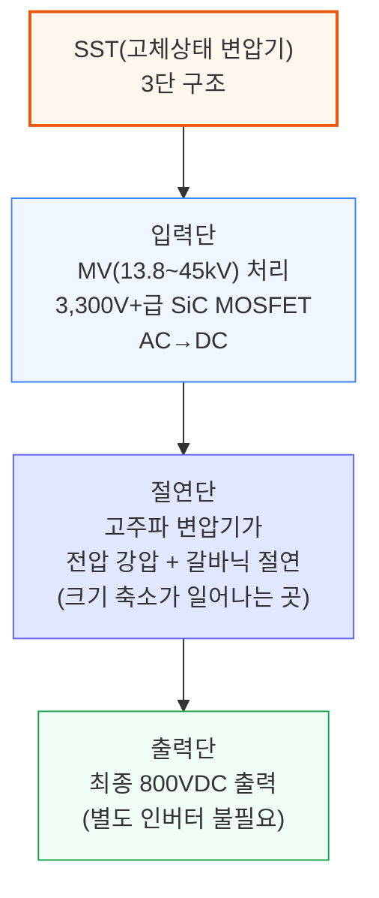

### SST의 장단점

SST의 핵심 가치 제안은 에너지 효율이며, 이는 곧바로 운영비 절감이나 추가 컴퓨팅 용량 확보로 이어집니다. MV 변압기와 정류기를 하나의 전력전자 단으로 합쳐, SST는 전기 체인에서 변환 단계 2개를 없앱니다. 벤더들은 최대 15%의 전체 시스템 효율 개선을 목표로 하며, 82\~85% 수준에서 97% 이상까지 오른다고 주장합니다.

SST는 크기도 극적으로 작습니다. 재래식 변압기는 50\~60Hz에서 작동해 거대한 철심이 필요하지만, SST는 20,000Hz 이상에서 스위칭해 철심을 약 90% 줄입니다. 여기서 Infineon이 주장하는 무게 40분의 1, 크기 14분의 1 축소가 나옵니다.

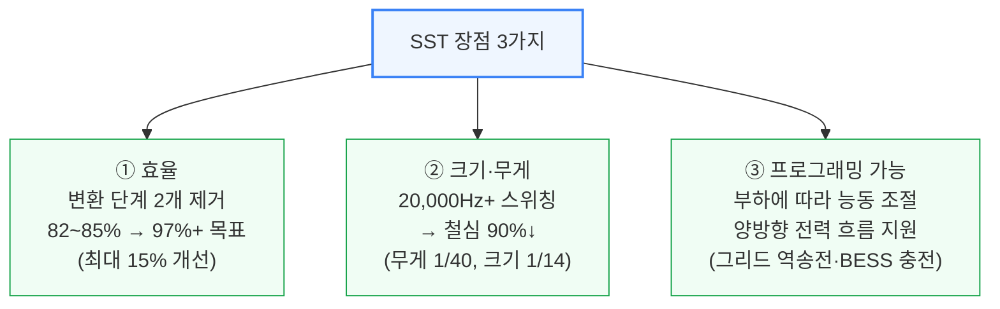

재래식 변압기는 고정된 비율로만 전압을 낮추지만, SST는 출력을 능동적으로 조절하며 부하에 따라 대응합니다. 양방향 전력 흐름(수요반응 시 그리드로 전력을 밀어내거나 BESS를 충전하는 것)도 지원합니다. 다만 양방향성과 BESS 통합 기능을 갖춘 SST는 연계 유틸리티로부터 분산에너지자원(DER)으로 재분류되어 IEEE 1547/2800 준수가 요구될 수 있습니다.

또 다른 핵심 가치는 입력 유연성입니다. 일부 SST 아키텍처는 이 유연성을 멀티포트 토폴로지로 확장해, 하나의 장치가 여러 입력(유틸리티 AC, 온사이트 발전, DC 전원)을 모아 여러 출력으로 소프트웨어 상에서(양방향으로도) 라우팅합니다. 멀티포트 방식의 장점은 구역 간 좌초 전력을 줄이고 운영사가 부지 전체의 전력 흐름을 조율할 수 있게 해준다는 것입니다.

### 신뢰성

재래식 변압기는 수동 장치로 30\~40년을 버팁니다. 데이터센터 규모에서 SST의 실사용 신뢰성 데이터를 공개한 벤더는 아직 없습니다 — 가장 오래된 배치 사례는 2011년부터 가동 중인 스위스 연방철도의 Hitachi-ABB PETT뿐입니다. SST는 반도체 접합부에 열이 집중되어 능동 냉각이 필요한데, DG Matrix는 통합 수랭식을, Novos Power는 독자 절연 방식을 이용한 공랭식을 씁니다.

ETH 취리히의 비교 평가에 따르면, 상용주파수 변압기에 SiC 정류기를 결합하면 SST의 효율·기능성에 맞먹을 수 있습니다. 데이터센터급 SST는 여전히 생산량이 제한적인 3,300V 이상급 SiC MOSFET에 의존합니다. 약 650V로 상한이 정해진 GaN은 800VDC를 랙 수준 전압으로 낮추는 하류 단계에서만 쓰입니다.

### 현재 효율 수준

가장 신뢰할 만한 공개 SST 벤치마크는 ETH 취리히에서 나왔습니다: INTELEC 2025에서 발표된 13.2kVAC-800VDC 프로토타입이 400kW에서 98% 효율을 기록했습니다. Johann Kolar는 98.0\~98.5%를 오늘날 완전 규모 SST의 최신 기술 수준으로, 99%를 데이터센터용 장비의 다음 목표로 규정합니다.

다양한 벤더들이 이제 98.5%라는 상한선에 수렴하고 있습니다: DG Matrix의 Interport 플랫폼은 최대 98.5%, Amperesand의 3세대 시스템은 98.5% 이상, Heron Power의 Heron Link는 MV-to-rack 효율 98.5%를 목표로 합니다. Novos Power는 98% 이상의 정점 효율을 보고합니다. 고무적인 수치지만, 데이터센터는 3\~6MW급 유닛이 지속 부하에서 99% 이상을 유지해야 할 것입니다.

두 가지 데이터포인트가 실제 스케일업이 진행 중임을 시사합니다. 중국 무역 언론에 따르면 China XD Electric은 "동수서산(East Data West Compute)" 프로그램 하에서 2.4MW급 데이터센터 SST를 배치했습니다. DG Matrix의 학문적 뿌리인 NC State의 FREEDM Systems Center는 3.3kV SiC로 210kHz 스위칭을 시연했고, 모듈형 DC-DC SST 변형에 대해 99% 효율 목표를 제시했습니다.

### 공급사 지형

공급사 지형은 빠르게 움직이고 있습니다. DG Matrix(ABB 후원, Infineon SiC 공급 계약)는 사전 인증 유닛을 출하 중이며 2026년 2분기 말까지 UL 인증을 목표로 합니다 — Nvidia MGX 레퍼런스 아키텍처에 포함된 유일한 SST입니다. Amperesand는 2026년 30MW 규모 상업 배치를 목표로 합니다. Heron Power는 자사 4.2MW급 Heron Link 유닛을 위해 40GW 규모 미국 제조 시설을 짓고 있습니다.

SST 카테고리 안에서 제품들은 LV·MV 입력을 기준으로 갈라지고 있습니다. DG Matrix와 Amperesand는 두 경로 모두 추진하며, 지금 당장 배치 가능한 LV 입력 SST 스키드(3.2\~4.8MW)로 먼저 시작해 3,300V급 SiC가 성숙하면 MV 입력 유닛을 뒤따르게 합니다. Heron Power와 Novos Power는 LV 변압기와 정류기를 하나의 장치로 합치는 직접 MV 입력 유닛에 집중합니다. 두 경로 모두 출력에서는 800VDC로 수렴하지만, LV 경로는 상류 MV-LV 변압기를 그대로 유지하는 대가로 더 짧은 배치 소요 시간을 제공합니다.

Novos Power는 직접 MV-800VDC 변환 SST를 주장하며 풋프린트가 50% 작고 공랭식이라고 밝힙니다. 기존 강자 쪽에서는 Eaton이 2025년 8월 SST 전문성을 위해 Resilient Power Systems를 인수했습니다. 2026년 3월로 끝나는 12개월 동안 SST 스타트업에 3억 2천만 달러 이상이 유입되었습니다.

### 데이터센터 레이아웃에 미치는 영향

SST는 MW당 약 55만 달러의 LV 장비와, MW당 약 20만 달러의 Phase 2 정류기를 없앱니다. SST의 추정 비용이 MW당 100만\~150만 달러 수준임을 고려하면, 초기 SST 도입은 직접 대체되는 장비 대비 초기 투자(Capex) 프리미엄을 안고 시작할 것으로 예상합니다.

Phase 3와 나머지 전기 아키텍처는 그대로 유지됩니다 — 냉각·조명·시설 시스템용 480V AC 보조 버스는 그대로 넘어갑니다. IT 랙 쪽에서는, SST가 배치될 시점이면 컴퓨팅 트레이가 이미 800VDC 네이티브일 것으로 예상하지만, SST 도입이 800V 마이크로그리드와 DC-DC 전력 셸프 컨버터를 쓰는 IT 랙과 함께 이뤄지는 배치도 나타날 수 있으며, 이 경우 도입이 더 빨라질 수 있습니다.

시점상으로 이 신기술은 아직 설계 단계이며, 2029년 초 이전에는 본격적인 SST 채택을 기대하지 않습니다. 다만 모든 주요 하이퍼스케일러가 주요 SST 벤더들과 파일럿·테스트를 진행 중이고 상업 계약도 이미 맺어져 있는 것으로 파악됩니다. 기술 개발 자체가 여기서 도입 곡선을 결정하는 유일한 변수는 아닙니다 — 규제 프레임워크와 표준도 큰 변수입니다. SST 분야에서는 2026년 5월 기준 어떤 벤더도 데이터센터 SST 배치를 위한 UL 인증을 완료하지 못했습니다.

### SST 시장 규모

2030년까지 SST 시장 규모는 약 320억 달러에 이를 것으로 예상하며, 이는 사이드카 계층에서 옮겨온 수요와 신규 MV-800VDC 변환 수요를 모두 포함합니다. MW당 콘텐츠는 125만 달러로 가정합니다. 이 기회의 일부는 MV 정류기와 경쟁하지만, SST가 대부분의 점유율을 가져갈 것으로 예상합니다.

---

*작성 진행률: 약 70% 완료 (1~11장)*
*업데이트: 화이트 스페이스 진화(배터리 랙, BBU 대형화), 시설 단위·MV 정류기, Phase 4(SST 전체) 작성 완료*
