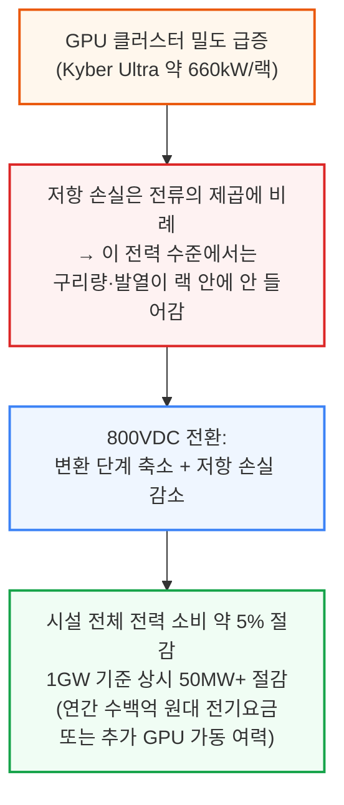
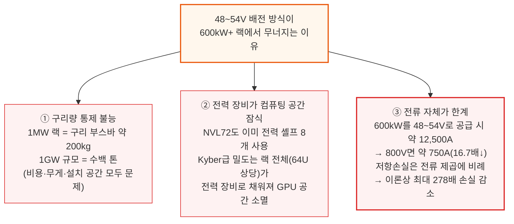
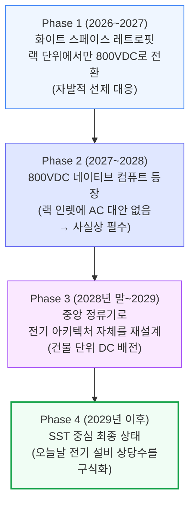
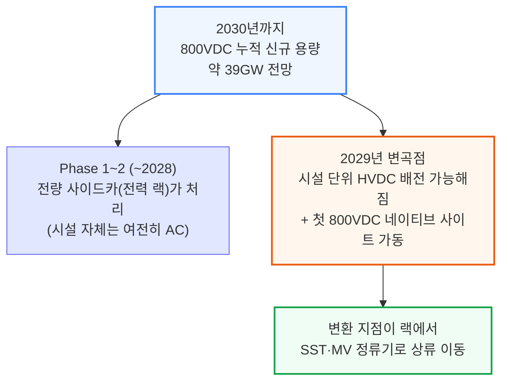

# Inside the 800VDC Revolution

> **출처**: [SemiAnalysis Newsletter](https://newsletter.semianalysis.com/p/inside-the-800vdc-revolution-part)
> **저자**: Dylan Patel
> **발행일**: 2026-05-26

---

## 📑 목차

### 전체 섹션
 1. [서론: 800VDC 혁명이 시작되다](#1-서론-800vdc-혁명이-시작되다)
 2. [800VDC란 무엇이고 왜 피할 수 없는가](#2-800vdc란-무엇이고-왜-피할-수-없는가)
 3. [HVDC 전환 4단계 로드맵과 도입 곡선](#3-hvdc-전환-4단계-로드맵과-도입-곡선)
 4. [Phase 1: 화이트 스페이스 레트로핏과 전력 랙의 등장](#4-phase-1-화이트-스페이스-레트로핏과-전력-랙의-등장)
 5. [전력 랙 규격의 진화: ORv3 HPR에서 Diablo 400까지](#5-전력-랙-규격의-진화-orv3-hpr에서-diablo-400까지)
 6. [Phase 1의 비용과 사이드카 시장 규모](#6-phase-1의-비용과-사이드카-시장-규모)
 7. [Phase 2: 800VDC 네이티브 컴퓨트가 만드는 전환점](#7-phase-2-800vdc-네이티브-컴퓨트가-만드는-전환점)
 8. [UPS와 배터리 저장장치의 운명](#8-ups와-배터리-저장장치의-운명)
 9. [Phase 3: 중앙 정류기로 전기 아키텍처 재설계](#9-phase-3-중앙-정류기로-전기-아키텍처-재설계)
10. [화이트 스페이스의 진화: 전력 랙에서 배터리 랙으로](#10-화이트-스페이스의-진화-전력-랙에서-배터리-랙으로)
11. [Phase 4: SST(고체상태 변압기), 최종 단계](#11-phase-4-sst고체상태-변압기-최종-단계)
12. [데이터센터 레이아웃 종합: 총비용 유지, 구성 이동, 효율 상승](#12-데이터센터-레이아웃-종합-총비용-유지-구성-이동-효율-상승)
13. [800VDC의 4가지 과제](#13-800vdc의-4가지-과제)
14. [물리 원리 심화: 저전압 배전이 무너지는 이유와 전압 토폴로지](#14-물리-원리-심화-저전압-배전이-무너지는-이유와-전압-토폴로지)
15. [공급사 영향 (1): 화이트 vs 그레이 스페이스, Delta·Lite-On·Vertiv](#15-공급사-영향-1-화이트-vs-그레이-스페이스-delta·lite-on·vertiv)
16. [공급사 영향 (2): 서구 종합 장비업체](#16-공급사-영향-2-서구-종합-장비업체)
17. [공급사 영향 (3): 백업 전원 공급망](#17-공급사-영향-3-백업-전원-공급망)

---

## 🔑 용어 정리

본문을 순서대로 읽기 전에 알아두면 좋은 용어들입니다. 자세한 수치와 설명은 본문에서 처음 등장하는 위치에 나옵니다.

- **HVDC (고전압 직류, High Voltage DC)**: 데이터센터 안에서 전기를 교류(AC) 대신 약 800V의 직류(DC)로 실어 나르는 방식 — 전선의 굵기·발열·변환 손실을 크게 줄이기 위한 배전 방식 전환
- **화이트 스페이스 vs 그레이 스페이스**: 화이트 스페이스는 GPU 서버가 실제로 늘어선 전산실 구역, 그레이 스페이스는 변압기·UPS 등 전력 설비가 들어선 후방 설비 구역 — 800VDC 전환은 이 두 구역 사이에서 "어느 쪽이 전력 변환을 맡느냐"를 두고 벌어지는 힘겨루기이기도 함
- **전력 랙 (Power Rack, 사이드카)**: GPU만 채운 서버 랙 옆에 별도로 세우는 전용 랙으로, AC를 DC로 바꾸고 배터리로 전력을 잠깐 buffer해주는 역할을 GPU 랙에서 떼어내 전담하는 장비
- **Diablo 400**: Google·Meta·Microsoft가 공동 저술해 OCP(오픈 컴퓨트 프로젝트)에 표준으로 등록한 HVDC 전력 랙 규격 — 서로 다른 제조사의 부품이 한 랙 안에서 호환되도록 정한 공통 규칙
- **배터리 랙 (Battery Rack)**: 전력 랙에서 AC→DC 변환 기능만 빠진 후속 버전 — 건물 단위로 이미 DC가 들어오는 단계에서는 배터리·커패시터로 순간 정전을 막아주는 역할만 남음
- **SST (고체상태 변압기, Solid-State Transformer)**: 철심을 감은 재래식 변압기 대신 반도체 스위칭 소자로 전압을 바꾸는 차세대 장비 — 부피는 훨씬 작으면서 중간 변환 단계를 통째로 없애줌
- **양극형(±400V) vs 단극형(800V)**: 같은 800V를 두 가닥의 +400V·-400V 전선으로 나눠 보낼지(양극형), 한 가닥의 800V로 통째로 보낼지(단극형)를 가르는 배선 설계 방식 차이
- **BBU와 슈퍼커패시터**: BBU(배터리 예비 전원)는 정전 발생 후 수초\~수분을 버텨주는 배터리, 슈퍼커패시터는 GPU 부하가 순간적으로 튀는 밀리초 단위 변동을 흡수하는 장치 — 역할과 반응 속도가 다름

---

## 1. 서론: 800VDC 혁명이 시작되다

**📌 핵심:**
- GPU 랙 하나의 전력이 **Kyber Ultra 기준 약 660kW**까지 치솟으면서, 지금까지 써온 저전압(48\~54V) 배전 방식이 물리적 한계에 부딪힘
- 800V 직류(HVDC)로 바꾸면 변환 단계가 줄고 전선 손실이 줄어 시설 전체 전력 소비를 **약 5% 절감** → 1GW급 시설 기준 상시 50MW 이상 절감, 연간 수백억 원대 전기요금 절감 또는 그만큼의 GPU를 더 돌릴 수 있는 여유 확보
- 2020년대 초 물 냉각 도입이 그랬듯, "이번에도 과할 것 같다"는 반응이 나오지만 물리와 반도체 경제성이 결국 몰아붙임
- 결론: 800VDC는 취향의 문제가 아니라 랙 전력이 계속 오르는 한 피할 수 없는 물리적 전환이며, 이번 딥다이브는 그 전환이 4단계에 걸쳐 어떻게 데이터센터 설비 구성표(BoM)를 바꾸는지, 어떤 장비가 살아남고 어떤 장비가 사라지는지를 추적

---

2026년 상반기 주요 반도체·데이터센터 컨퍼런스마다 똑같은 광경이 반복되고 있습니다. 부스마다 10\~15명이 몰려들어 "800VDC가 데이터센터 전기 인프라를 바꾼다"는 설명을 듣습니다. 물 냉각이 그랬던 것처럼, 이번 전환도 처음엔 과해 보이지만 물리와 컴퓨팅 경제성은 타협하지 않습니다. 결국 데이터센터 운영사들은 수십 년간 전산실에 물이 들어가지 못하게 막다가, GPU 발열이 감당 안 되자 결국 칩 바로 옆까지 냉각수를 들이는 쪽으로 넘어갔습니다. 800VDC도 같은 논리를 따릅니다 — 토큰당 전력 효율이 핵심이기 때문입니다.

SemiAnalysis는 InferenceX와 Industrials Model을 통해 이 전환을 추적해 왔으며, 개별 가속기 아키텍처에서 출발해 800VDC 보급률과 전력 랙·SST(고체상태 변압기) 등 장비의 시장 규모까지 상향식으로 집계하고 있습니다. 이 리포트는 그 전환을 사이드카 레트로핏 단계부터, 시설 단위 DC 배전, 그리고 SST 최종 단계까지 단계별로 추적하며, 각 단계마다 설비 구성표가 어떻게 바뀌는지, 무엇이 살아남고, 무엇이 재설계되고, 무엇이 사라지는지를 분석합니다.

이 전환은 특정 공급사들의 매출 곡선을 극적으로 바꿔놓을 전망입니다. 700개 이상의 데이터센터 설계와 70개 이상의 장비 카테고리, 500개 이상 공급사를 다루는 Industrials Model을 기반으로, SemiAnalysis는 시장이 미처 알아채기 전에 승자와 (시장이 패자로 잘못 짚은) 기업들을 먼저 짚어낸 바 있습니다.

> **참고**: 이번 글은 800VDC 혁명 시리즈 Part 1로, 데이터센터 레이아웃과 장비 영향을 다룹니다. Part 2는 전력 전자·반도체 혁명을 다룰 예정입니다.

---

## 2. 800VDC란 무엇이고 왜 피할 수 없는가

**📌 핵심:**
- 800VDC는 전산실(화이트 스페이스)까지 약 800V 직류로 전력을 보낸 뒤, 컴퓨팅 장비 바로 앞에서 전압을 낮추는 방식 — 800이라는 숫자는 전류를 크게 줄이면서도 "저전압 DC"로 분류되는 규제 상한(EU 기준 DC 1,500V) 안에 들어가도록 고른 값
- 현재 표준인 48\~54V 배전은 랙 전력이 **600kW를 넘어서면 무너짐**: 1MW 랙에 필요한 구리 부스바만 약 200kg, 1GW 규모면 수백 톤 → 비용·무게·설치 공간 모두 감당 불가
- 600kW를 48\~54V로 공급하려면 전류가 약 12,500A 필요하지만, 800V로 공급하면 약 750A로 **16.7배 감소** → 저항손실(I²R)은 전류의 제곱에 비례하므로 이론상 최대 278배까지 줄어듦(실제로는 이 손실 여유분을 구리 절감으로 상당 부분 맞바꿈)
- 결론: 800VDC는 취향이 아니라 2,300W급 칩과 600kW 랙을 물리적으로 가능하게 하는 전제조건이며, 랙 하나에 GPU를 더 빽빽하게 채울수록(=토큰당 비용을 낮출수록) 더 필요해짐

---

800VDC는 간단히 말해, 데이터홀이나 로우 단위까지 약 800V 직류로 전력을 보낸 뒤 컴퓨팅 장비 바로 앞에서 전압을 낮추는 방식입니다. 800이라는 숫자가 임의로 정해진 것은 아닙니다 — 전류(따라서 구리 손실과 발열 부담)를 크게 줄이면서도, 여러 국가의 규제상 "저전압 DC" 분류 안에 들어가도록 고른 값입니다. 참고로 EU의 저전압지침(Low Voltage Directive)은 DC 기준 최대 1,500V(AC는 최대 1,000V)까지를 규제 범위로 잡고 있습니다.

지금의 데이터센터 전기 아키텍처는 시설 단위에서 3상 교류(415V 또는 480V)로 배전하고, 재래식 UPS 구조를 거친 뒤 랙 안에서 48\~54V DC로 낮추는 방식입니다. 이 방식은 지금의 랙 전력 수준에서는 문제가 없지만, 앞으로 2년 안에 랙 밀도가 **600kW+**에 다가서면 여러 이유로 무너지기 시작합니다.

여기에 네 번째 이유가 더해집니다. AC-DC, DC-DC로 이어지는 다단 변환은 종단 간 효율을 갉아먹고, 발열을 늘리고, 고장 지점을 늘려 냉각 부하·다운타임 위험·유지보수 비용을 모두 끌어올립니다.

결국 800VDC는 2,300W급 칩과 600kW 랙을 가능하게 하는 물리적 전제조건이고, 그 600kW 랙 자체는 "토큰당 비용을 낮추기 위한 밀도 경쟁"의 직접적인 결과물입니다. 토큰당 비용은 NVLink 대역폭을 최대로 유지한 채로 얼마나 큰 스케일업 세계를 지을 수 있는지에 달려 있습니다 — 도메인이 클수록 Expert Parallelism·Tensor Parallelism을 더 넓게 펼칠 수 있고, MoE 라우팅도 스케일아웃 대신 NVLink 위에서 처리할 수 있어 디코드 과정의 직렬화가 줄어듭니다. Nvidia의 설계 원칙은 구리가 랙 안 구석구석까지 닿을 만큼 컴퓨팅을 빽빽하게 채우는 것이며, 랙 하나의 물리적 경계가 곧 만들 수 있는 Expert Layer의 크기를 결정합니다 — all-to-all 통신이 랙 경계를 넘어가는 순간, NVLink보다 약 8배 느린 스케일아웃 패브릭으로 떨어지기 때문입니다.

즉, 더 큰 스케일업 세계 → 더 밀도 높은 랙 → 600kW급 전력 envelope → 그리고 800VDC는 바로 그 envelope을 가능하게 만드는 전제조건이라는 인과관계로 이어집니다.

**📌 용어 풀이: 저항 손실과 I²R**
> - **저항 손실(Resistive Loss)**: 전선에 전류가 흐를 때 저항 때문에 열로 사라지는 에너지 — 전류가 커질수록 제곱으로 늘어남(I²R)
> - **왜 전압을 올리면 유리한가**: 같은 전력(P=V×I)을 옮길 때 전압을 올리면 전류(I)가 줄어들고, 손실은 전류의 제곱에 비례하므로 손실이 훨씬 큰 폭으로 줄어듦
> - **쉬운 비유**: 같은 양의 물을 옮길 때 굵은 호스(저전압·고전류)보다 가는 고압 호스(고전압·저전류)로 옮기면 마찰 손실이 훨씬 적은 것과 비슷한 원리

---

## 3. HVDC 전환 4단계 로드맵과 도입 곡선

**📌 핵심:**
- SemiAnalysis는 800VDC 전환을 **4단계**로 구분: Phase 1\~2(2026\~2028)는 기존 AC 인프라를 그대로 두고 랙 단위에서만 800VDC로 바꾸는 "레트로핏", Phase 3(2028\~2029)는 시설 전체를 DC로 재설계, Phase 4(2029년 이후)는 SST 중심의 최종 상태
- 2030년까지 800VDC로 공급되는 누적 신규 용량은 **약 39GW**로 전망 — Phase 1\~2 동안은 전량이 사이드카(전력 랙)로 처리되다가, 2029년부터 시설 단위 HVDC 배전이 가능해지며 변환 지점이 랙에서 SST·MV 정류기로 옮겨감
- Phase 1은 강제가 아니라 Google·Meta가 먼저 나선 "선제적 효율화"이고, Phase 2부터는 800VDC 네이티브 칩 때문에 사실상 필수가 됨
- 결론: 800VDC 전환은 한 번에 오지 않고, "랙만 바꾸는 레트로핏"에서 "건물 전체를 바꾸는 재설계"로 점진적으로 확산되는 다단계 과정

---

800VDC로의 전환은 전기 아키텍처 전체를 다시 쓰는 복잡한 변태(metamorphosis) 과정입니다. 새로운 안전 표준, 새로운 규제 프레임워크가 필요하고, 무엇보다 운영사들이 언제 기존 AC 배전을 버릴지 판단해야 하는 중요한 전략적 선택을 강요합니다.

Phase 1\~2는 2026년 말\~2027년 초부터 기존 AC 배전을 랙 단위에서 전력 랙(Power Rack)을 통해 800VDC로 레트로핏하는 단계입니다. Phase 1은 하이퍼스케일러들이 미래 대비와 효율 개선을 위해 먼저 비용을 치르는 초기 도입 단계이고, Phase 2는 800VDC 네이티브 시스템이 대량으로 출하되기 시작하면서 열립니다. Phase 3는 전기 아키텍처 자체를 시설 전체 단위로 다시 쓰는 단계이고, Phase 4는 오늘날 전기 설비 상당 부분을 구식화할 새로운 장비들을 중심으로 한 최종 상태입니다.

그 결과 800VDC는 점진적인 도입 곡선을 그립니다. 2030년까지 800VDC로 공급되는 누적 신규 용량은 **약 39GW**에 이를 전망입니다. Phase 1\~2 동안은 시설 자체가 여전히 AC로 배전되고 변환이 전력 랙에서 일어나기 때문에, 대응 가능한 용량 전량이 사이드카(전력 랙)로 처리됩니다. 이 구성비는 2029년에 뒤집히는데, 시설 단위 HVDC 배전이 현실화되고 첫 800VDC 네이티브 사이트가 가동되면서 변환 단계가 랙에서 SST 또는 MV 정류기로 위쪽으로 옮겨가기 때문입니다.

이후 섹션에서 데이터센터 레이아웃이 실제로 어떻게 바뀌는지 단계별로 살펴봅니다. (참고로 SemiAnalysis의 [데이터센터 해부학 Part 1(전기 시스템)](https://newsletter.semianalysis.com/p/datacenter-anatomy-part-1-electrical)이 이 글의 배경 개념들을 다루고 있습니다.)

---

*작성 진행률: 약 20% 완료 (1~3장)*
*업데이트: 서론, 800VDC 기초 물리, 4단계 로드맵 작성 완료*
