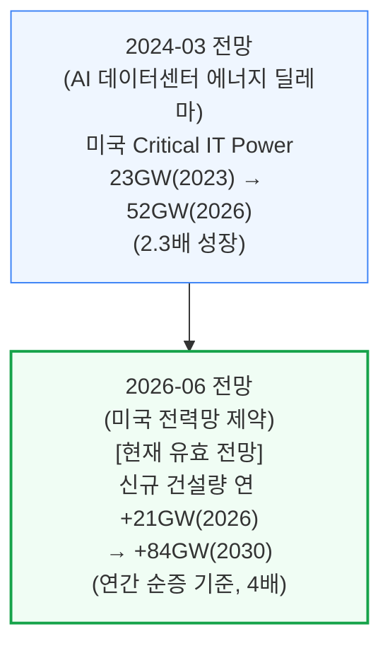
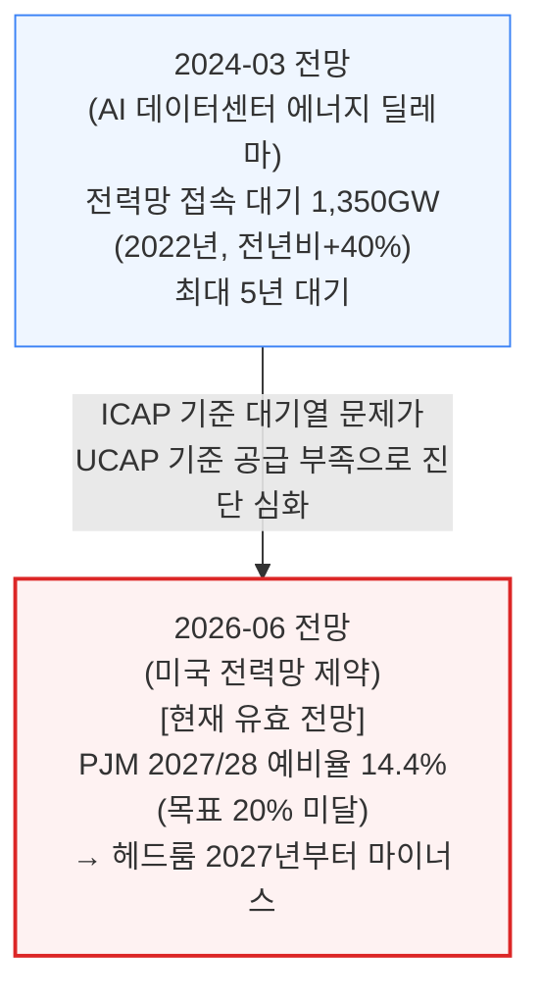
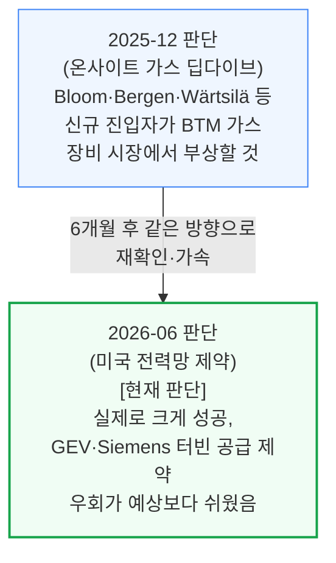
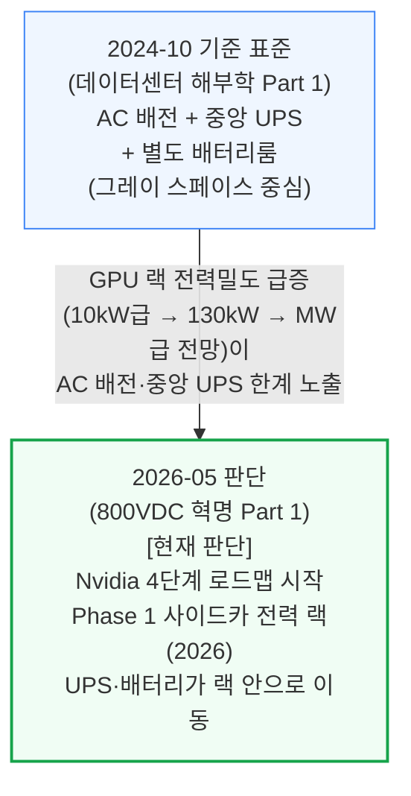

# 전력(ai-infra/power) 통합 리포트

> **생성일**: 2026-07-04
> **최종 갱신일**: 2026-07-10
> **대상 문서**: 6개
> - `[240314]` AI 데이터센터 에너지 딜레마 - AI 데이터센터 공간 확보 경쟁 (2024-03-14)
> - `[241014]` 데이터센터 해부학 Part 1 - 전기 시스템 (2024-10-14)
> - `[251231]` AI 랩들은 어떻게 전력난을 해결하는가 - 온사이트 가스 딥다이브 (2025-12-31)
> - `[260526]` 800VDC 혁명 Part 1 - 전력 배전 아키텍처의 대전환 (2026-05-26)
> - `[260619]` 2026년 미국 데이터센터 용량 절반 취소설은 틀렸다 (2026-06-19)
> - `[260626]` 미국 전력망 제약 - 2028년까지 40GW+ 자가발전 데이터센터로 가는 길 (2026-06-26)

---

## 📌 현재 종합 판단

- **수요는 계속 가속**: 미국 데이터센터 신규 건설량이 연 +21GW(2026) → +84GW(2030)로 가속하는 방향이 유지됨 (§1.1, 확신도: 높음)
- **그리드는 구조적 공급 부족**: 대기열 문제(2024)에서 예비율 적자 진단(2026)으로 심화 — 그리드 연결만 기다리는 전략은 갈수록 불리 (§1.2, 확신도: 높음)
- **BTM 자가발전이 주류화**: 온사이트 가스 방향이 6개월 만에 재확인·가속, 신규 진입자(Bloom 등)의 터빈 공급 제약 우회가 예상보다 쉬웠음 — "그리드 직접 지불·전력 딸린 땅·BTM" 3갈래 병행과 장비(선확보·중국산 OEM·모듈러) 3가지 적응이 지난 12개월 새 표준 관행으로 정착했다는 근거가 추가 확인됨 (§1.3, 확신도: 높음)
- **"용량 절반 취소" 헤드라인은 파이프라인 실체와 괴리**: 취소·지연은 부지·전원·인허가 관문을 통과하지 못한 초기 발표 단계에 집중되며, 이 계층은 SemiAnalysis 모델이 이미 구조적 공급 과잉으로 낮게 처리해온 부분 — 장비 공급사(Vertiv·Schneider) 마진 20%+·리드타임 3\~4년 등 수주 잔고 지표도 실제 인도량 가속과 함께 견조함 (신규 관점, 확신도: 중간 — 단일 문서지만 §1.3 흐름과 동일 방향)
- **새 축 — 전력 배전 아키텍처 전환 시작**: Nvidia 주도로 AC·중앙 UPS 아키텍처가 800VDC·랙 배터리로 옮겨가는 4단계 로드맵이 시작 — 지출 총량은 유지되며 그레이 스페이스(UPS·PDU) → 화이트 스페이스(전력 랙·랙 배터리)로 가치 이동 (§1.4, 확신도: 중간 — 단일 문서, Phase 1 초기)
- **결론**: 전력 "확보"(BTM 발전)와 전력 "배전"(800VDC) 양쪽에서 기존 그레이 스페이스 장비 벤더로부터 화이트 스페이스 벤더(Delta·Vertiv·Panasonic 등)로 가치가 이동하는 방향에 확신도가 쌓이고 있음

---

## 📑 목차

1. [시계열 흐름: 반복 등장 주제](#1-시계열-흐름-반복-등장-주제)
2. [다음 확인 포인트](#2-다음-확인-포인트)
3. [문서별 요약](#3-문서별-요약)

---

## 1. 시계열 흐름: 반복 등장 주제

### 1.1 미국 데이터센터 전력 수요 증가 속도

**확신도: 높음** — 2개 문서가 같은 방향(가속)을 재확인, 최신 데이터포인트 2026-06

측정 기준이 "누적 용량 전망"에서 "연간 신규 건설량"으로 세분화됐지만, 증가 속도 자체는 계속 가속하는 방향으로 일관됩니다.

### 1.2 그리드 연결의 신뢰성: 대기 물량에서 헤드룸 적자로

**확신도: 높음** — 2개 문서에서 진단이 같은 방향으로 심화(대기열 → 예비율 적자), 최신 데이터포인트 2026-06

2024년에는 "얼마나 기다려야 하는가"가 문제였다면, 2026년에는 "애초에 공급 자체가 부족해진다"는 더 구조적인 진단으로 발전했습니다.

### 1.3 BTM(자가발전) 확산 — 같은 방향이 재확인·가속

**확신도: 높음** — 6개월 간격 재확인·가속, 최신 데이터포인트 2026-06

2025년 말 온사이트 가스 딥다이브가 짚은 방향을, 반년 뒤 전력망 제약 리포트가 더 구체적인 수치로 재확인합니다. **이 방향에 대한 확신도가 올라갔다는 뜻이지, "누가 맞혔나"를 채점하려는 게 아닙니다** — 지금 시점에 BTM 쪽에 베팅하는 판단의 근거가 두터워지고 있다는 게 핵심입니다.

같은 방향을 뒷받침하는 보강 자료로, [260619](2026-06-19, 미국 전력망 제약 발행 직전)는 "그리드에 직접 지불·전력 딸린 땅 매매·BTM 전환"이라는 3갈래 병행 전략과, 변압기·중저압 배전반 선확보·중국산 OEM 편입·모듈러 시공이라는 장비 측 3가지 적응이 지난 12개월 새 예외적 사례에서 표준 관행으로 자리잡았음을 확인합니다.

### 1.4 전력 배전 아키텍처: 중앙 UPS·AC에서 800VDC·랙 배터리로

**확신도: 중간** — 단일 문서 기반이나 Nvidia 로드맵·OCP 규격 등 정량 근거 구체적, 최신 데이터포인트 2026-05

Nvidia가 주도하는 800VDC 전환은 기존 AC 배전 + 중앙 UPS 아키텍처를 800VDC + 랙 배터리 구조로 옮기는 변화입니다. 전기 설비 지출 총량(MW당 약 370만\~400만 달러)은 유지되면서, 그레이 스페이스(중앙 UPS·PDU)에서 화이트 스페이스(전력 랙·랙 배터리)로 가치가 이동합니다.

---

## 2. 다음 확인 포인트

- **PJM 차기 용량 경매 결과·예비율 발표** — 예비율 적자 전망이 실측으로 확인되면 §1.2 강화, 완화되면 약화
- **ERCOT Batch Zero 후속 배치 규모** — BTM 하이브리드 접속 물량이 커지면 §1.3 강화
- **가스터빈 리드타임(GEV·Siemens) 변화와 Bloom 등 신규 진입자 수주 발표** — 공급 제약 우회가 계속 쉬우면 §1.3 강화
- **Nvidia Kyber 세대(Phase 2, 2027년경) 실배치와 OCP Diablo 400 규격 확정** — 일정대로 진행되면 §1.4를 중간→높음으로 상향 가능
- **Delta·Vertiv의 HVDC 전력 랙 수주·매출 공개** — 화이트 스페이스 가치 이동이 실적으로 확인되면 §1.4 강화
- **2026년 3분기 장비 리드타임 OEM 코멘트리** — [260619]가 명시한 확인 포인트. 안정화가 계속되면 "용량 절반 취소" 반박 판단 강화, "장비 절벽"이 현실화되면 약화
- **주(州) 단위 데이터센터 모라토리엄 확산 여부(펜실베이니아 3년 유예 등 12개 주 법안)** — [260619]가 명시한 확인 포인트. 단일 주(州)라도 전면 시행되면 건설 가능 지도 자체가 좁아지는 선례가 됨
- **Oracle/STACK 뉴멕시코(Project Jupiter) 가스관 인허가 진행 상황** — [260619] 기준 첫 전력 공급이 2027년→2029년으로 밀린 사례, 재인허가·대체 노선 확정 여부로 지연 규모 재확인

---

## 3. 문서별 요약

**[240314] AI 데이터센터 에너지 딜레마** (2024-03-14) — AI 데이터센터 전력 수요를 둘러싼 비관론(2030년 전세계 발전량 24%)과 SemiAnalysis 자체 전망(4.5%)을 실측 데이터로 비교하고, Critical IT Power/PUE 계산법과 국가별(미국·일본·중국·유럽·중동) 전기요금·전원 믹스·탄소집약도를 비교. 전력 인프라 시리즈의 기초 진단 문서.

**[241014] 데이터센터 해부학 Part 1 - 전기 시스템** (2024-10-14) — 예측·전망 문서가 아니라 데이터센터 전기 시스템 자체의 구조(UPS, 변압기, 발전기, Tier 등급, N+1/2N 이중화 전략)를 다루는 기초 참고 자료. 시계열 비교 대상이 아니라 용어·개념의 배경지식으로 활용.

**[251231] AI 랩들은 어떻게 전력난을 해결하는가 - 온사이트 가스 딥다이브** (2025-12-31) — 그리드를 우회하는 BYOG(자가 발전) 전략의 부상을 다루며, 터빈·RICE·연료전지 등 발전 기술을 비교하고 Bloom Energy 등 신규 진입자의 성장을 예측. 이 예측은 §1.3에서 후속 문서로 확인됨.

**[260526] 800VDC 혁명 Part 1 - 전력 배전 아키텍처의 대전환** (2026-05-26) — Nvidia가 주도하는 데이터센터 전력 배전의 AC → 800VDC 전환을 4단계 로드맵(① 사이드카 전력 랙 → ② 네이티브 800VDC 컴퓨트 → ③ 시설 중앙 정류 → ④ SST)으로 분석. 전기 설비 지출 총량(MW당 약 370만\~400만 달러)은 유지되면서 그레이 스페이스(중앙 UPS·PDU)에서 화이트 스페이스(전력 랙·랙 배터리)로 가치가 이동함을 정량화하고, 공급사 지형(Delta·Vertiv·Panasonic 등 수혜 vs Legrand·Eaton 등 리스크)까지 정리.

**[260619] 2026년 미국 데이터센터 용량 절반 취소설은 틀렸다** (2026-06-19) — "2026년 미국 데이터센터 용량 절반이 취소·지연"이라는 블룸버그발 헤드라인 주장을 반박. 지연을 3가지 유형(신생 개발사 과장 발표·경험 부족 개발사의 낙관적 일정·인허가/NIMBY)으로 구분하고, 실제 취소는 부지·전원·인허가 관문을 통과하지 못한 초기 발표 단계(구조적 공급 과잉 계층)에 집중됨을 실증. 선두 운영사의 정치적·물리적 제약 돌파 플레이북과 장비 공급사(Vertiv·Schneider 마진 20%+) 수주 잔고가 견조함을 함께 제시, §1.3(BTM 확산)과 같은 방향을 보강.

**[260626] 미국 전력망 제약 - 2028년까지 40GW+ 자가발전 데이터센터로 가는 길** (2026-06-26) — 현재 코퍼스에서 가장 최신 문서. 미국 그리드 공급이 구조적으로 제약되는 이유(ELCC, ICAP/UCAP 헤드룸)를 정량 분석하고, BTM이 그리드 연결을 이기는 이유와 ERCOT Batch Zero 하이브리드 구조, 승자·패자 지형까지 다룸.

---

*리포트 생성 규칙: REPORT_RULES.md 참고*
