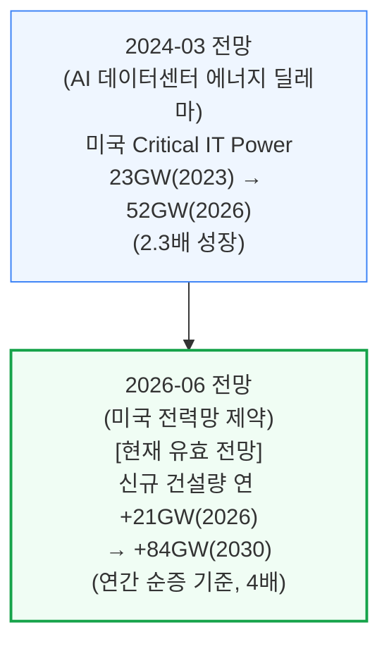
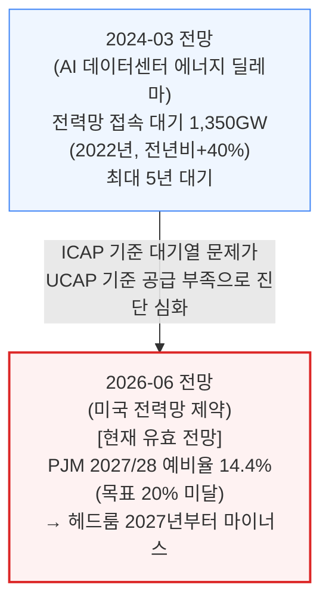
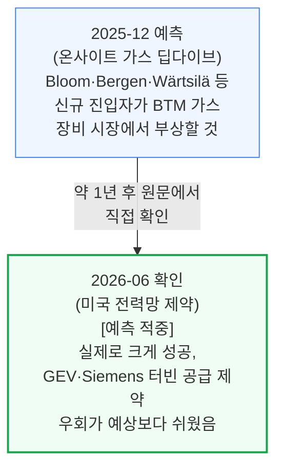

# 전력(ai-infra/power) 통합 리포트

> **생성일**: 2026-07-04
> **대상 문서**: 4개
> - `[240314]` AI 데이터센터 에너지 딜레마 - AI 데이터센터 공간 확보 경쟁 (2024-03-14)
> - `[241014]` 데이터센터 해부학 Part 1 - 전기 시스템 (2024-10-14)
> - `[251231]` AI 랩들은 어떻게 전력난을 해결하는가 - 온사이트 가스 딥다이브 (2025-12-31)
> - `[260626]` 미국 전력망 제약 - 2028년까지 40GW+ 자가발전 데이터센터로 가는 길 (2026-06-26)

---

## 📑 목차

1. [시계열 흐름: 반복 등장 주제](#1-시계열-흐름-반복-등장-주제)
2. [문서별 요약](#2-문서별-요약)

---

## 1. 시계열 흐름: 반복 등장 주제

### 1.1 미국 데이터센터 전력 수요 증가 속도

측정 기준이 "누적 용량 전망"에서 "연간 신규 건설량"으로 세분화됐지만, 증가 속도 자체는 계속 가속하는 방향으로 일관됩니다.

### 1.2 그리드 연결의 신뢰성: 대기 물량에서 헤드룸 적자로

2024년에는 "얼마나 기다려야 하는가"가 문제였다면, 2026년에는 "애초에 공급 자체가 부족해진다"는 더 구조적인 진단으로 발전했습니다.

### 1.3 BTM(자가발전) 확산 — 예측이 실현된 사례

이 흐름은 충돌이 아니라 **예측 적중 확인** 사례입니다: 2025년 말 온사이트 가스 딥다이브가 예측한 내용을, 반년 뒤 전력망 제약 리포트가 원문에서 직접 확인해줍니다.

---

## 2. 문서별 요약

**[240314] AI 데이터센터 에너지 딜레마** (2024-03-14) — AI 데이터센터 전력 수요를 둘러싼 비관론(2030년 전세계 발전량 24%)과 SemiAnalysis 자체 전망(4.5%)을 실측 데이터로 비교하고, Critical IT Power/PUE 계산법과 국가별(미국·일본·중국·유럽·중동) 전기요금·전원 믹스·탄소집약도를 비교. 전력 인프라 시리즈의 기초 진단 문서.

**[241014] 데이터센터 해부학 Part 1 - 전기 시스템** (2024-10-14) — 예측·전망 문서가 아니라 데이터센터 전기 시스템 자체의 구조(UPS, 변압기, 발전기, Tier 등급, N+1/2N 이중화 전략)를 다루는 기초 참고 자료. 시계열 비교 대상이 아니라 용어·개념의 배경지식으로 활용.

**[251231] AI 랩들은 어떻게 전력난을 해결하는가 - 온사이트 가스 딥다이브** (2025-12-31) — 그리드를 우회하는 BYOG(자가 발전) 전략의 부상을 다루며, 터빈·RICE·연료전지 등 발전 기술을 비교하고 Bloom Energy 등 신규 진입자의 성장을 예측. 이 예측은 §1.3에서 후속 문서로 확인됨.

**[260626] 미국 전력망 제약 - 2028년까지 40GW+ 자가발전 데이터센터로 가는 길** (2026-06-26) — 현재 코퍼스에서 가장 최신 문서. 미국 그리드 공급이 구조적으로 제약되는 이유(ELCC, ICAP/UCAP 헤드룸)를 정량 분석하고, BTM이 그리드 연결을 이기는 이유와 ERCOT Batch Zero 하이브리드 구조, 승자·패자 지형까지 다룸.

---

*리포트 생성 규칙: REPORT_RULES.md 참고*
