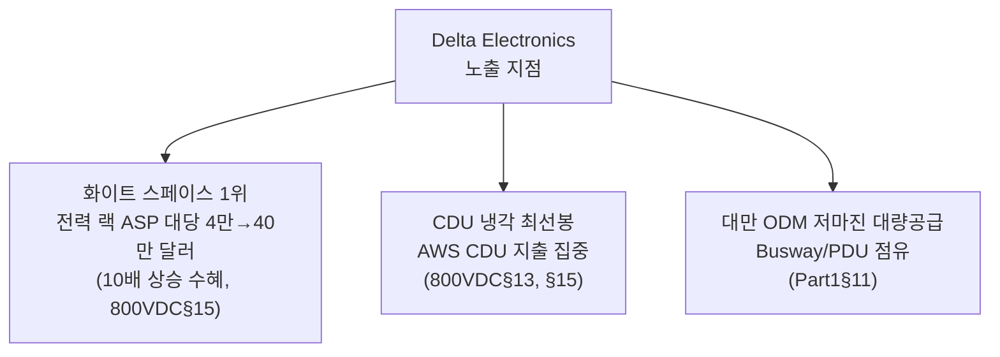
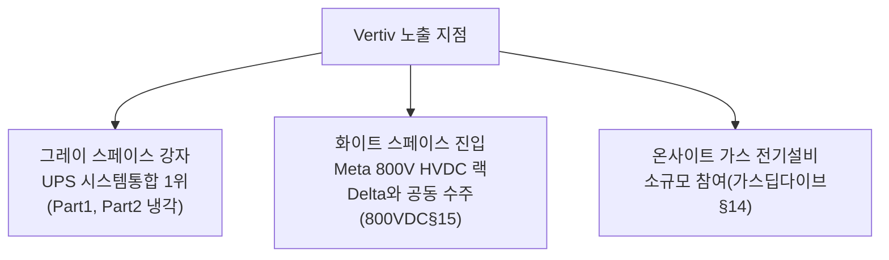
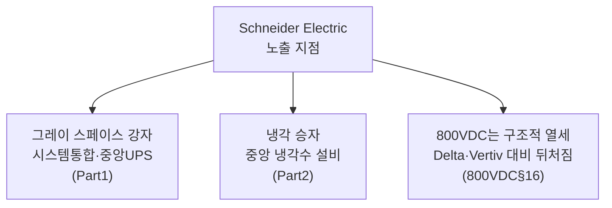
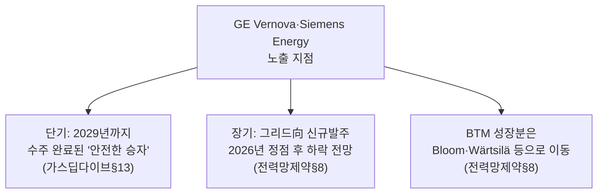

# 기업별 익스포저 리포트 — AI 인프라 전력·냉각

> **생성일**: 2026-07-05
> **최종 갱신일**: 2026-07-05
> **대상 문서**: 6개 (발행일순)
> - `[240314]` AI 데이터센터 에너지 딜레마 - AI 데이터센터 공간 확보 경쟁 (2024-03-14)
> - `[241014]` 데이터센터 해부학 Part 1 - 전기 시스템 (2024-10-14)
> - `[250214]` 데이터센터 해부학 Part 2 - 냉각 시스템 (2025-02-14)
> - `[251231]` AI 랩들은 어떻게 전력난을 해결하는가 - 온사이트 가스 딥다이브 (2025-12-31)
> - `[260526]` 800VDC 혁명 Part 1 - 전력 배전 아키텍처의 대전환 (2026-05-26)
> - `[260626]` 미국 전력망 제약 - 2028년까지 40GW+ 자가발전 데이터센터로 가는 길 (2026-06-26)
>
> **산업 스코프**: AI 인프라 전력·냉각 장비/에너지 밸류체인 — 다른 산업 클러스터(반도체·메모리, AI 모델·서비스 등)의 기업이 코퍼스에 들어오면 이 파일에 추가하지 않고 별도 익스포저 리포트로 분리 (REPORT_RULES.md 참고)
> **관점**: 카테고리 축 통합 리포트(전력/냉각 각각)와 달리, 기업 하나가 여러 문서·여러 흐름(전력 확보, 전력 배전, 냉각)에 걸쳐 어떤 포지션인지를 종합합니다. 같은 기업이 문서마다 다른 맥락(예: Vertiv는 냉각 문서에서 CDU 승자, 800VDC 문서에서 전력 랙 공급사)으로 등장하는데, 이를 한곳에 모아야 "이 기업은 지금 흐름 전체에서 수혜인가 리스크인가"를 한 번에 판단할 수 있습니다.

---

## 📌 현재 종합 판단

- **화이트 스페이스(랙 안 전력·냉각 부품) 벤더가 여러 흐름에서 동시에 수혜**: Delta Electronics는 전력 배전(800VDC 랙)과 냉각(CDU) 양쪽에서 모두 선두이고, Vertiv는 그레이 스페이스(중앙 UPS) 강자 지위를 지키면서 화이트 스페이스로도 영역을 넓히는 중 (§2.1, §2.2 — 확신도: 높음, 2개 이상 문서에서 같은 방향 재확인)
- **순수 그레이 스페이스 의존 벤더는 구조적 리스크가 반복 확인됨**: Legrand는 2024년 문서에서 이미 "화이트 스페이스 노출 과다"로 지목됐고, 2026년 800VDC 문서에서는 매출의 약 55%가 위험 구간에 있는데도 대응 제품·일정이 전무하다고 재확인됨 (§2.6 — 확신도: 높음)
- **서구 종합 장비업체(Schneider·Eaton·ABB)는 그레이 스페이스·냉각에서는 여전히 강자이지만 800VDC 전환에서는 뒤처져 있어 "기존 사업은 방어, 신사업은 열세"라는 혼재 신호**: 실제 물량은 대부분 2028년 이후로 잡혀 있어 근시일 매출 기여는 제한적 (§2.3\~§2.5 — 확신도: 중간)
- **에너지 저장 공급망(배터리·슈퍼커패시터)은 단일 문서 근거지만 수치가 뚜렷함**: Panasonic(BBU 약 80% 점유율)과 Musashi Seimitsu(슈퍼커패시터 사실상 독점)는 800VDC 전환에 직접 올라탄 수혜 사례 (§2.7, §2.8 — 확신도: 중간)
- **대형 가스터빈 2강(GE Vernova·Siemens Energy)은 문서마다 판단 축이 달라 사람 검토가 필요**: 2025년 말 문서는 이들을 "수주잔고 완료된 안전한 승자"로 보는 반면, 2026년 중반 문서는 같은 기업들을 BTM(자가발전) 흐름의 "구조적 패자"로 지목함 — 단기 수주잔고와 장기 성장축이 서로 다른 이야기를 하고 있어 방향이 뒤집힌 것인지 판단 시점이 다른 것인지 구분이 필요 (§2.9 — 확신도: 낮음)
- **결론**: 전력 배전과 냉각 두 축 모두에서 "랙 안(화이트 스페이스)"으로 가치가 이동하는 흐름이 확인되며, 이 이동에 먼저 올라탄 기업(Delta·Vertiv·Panasonic·Musashi 등)과 대응이 늦은 기업(Legrand 등) 사이의 격차가 벌어지는 중. 서구 종합 장비업체와 대형 가스터빈 업체는 기존 사업의 방어력은 있지만 신흥 성장축에서는 아직 증명되지 않은 상태

---

## 📑 목차

1. [익스포저 맵 (전체 조망)](#1-익스포저-맵-전체-조망)
2. [주요 기업 상세](#2-주요-기업-상세)
3. [단일 언급 기업](#3-단일-언급-기업)

---

## 1. 익스포저 맵 (전체 조망)

아래 표는 순수 분류 매트릭스로, 각 기업이 몇 개 문서에 등장했는지와 관련 흐름, 현재 방향을 정리합니다. 2개 이상 문서에 등장하는 기업을 위쪽에, 방향이 선명한 순으로 정렬했습니다.

| 기업 | 등장 문서 수 | 관련 흐름 | 방향 |
|---|---|---|---|
| Delta Electronics | 2 (Part1, 800VDC — 800VDC 문서 안에서 전력배전·냉각 두 흐름 모두 등장) | 전력 배전, 냉각(CDU) | 수혜 |
| Bloom Energy | 3 (가스딥다이브, 전력망제약, 800VDC) | 전력 확보(BTM) | 수혜 |
| Vertiv | 4 (Part1, Part2 냉각, 가스딥다이브, 800VDC) | 전력 배전, 냉각, 전력 확보 | 수혜(주로) |
| Legrand | 2 (Part1, 800VDC) | 전력 배전 | 리스크 |
| Schneider Electric | 4 (Part1, Part2 냉각, 가스딥다이브, 800VDC) | 전력 배전, 냉각, 전력 확보 | 혼재 |
| Eaton | 3 (Part1, 가스딥다이브, 800VDC) | 전력 배전, 전력 확보 | 혼재 |
| ABB | 2 (Part1, 800VDC) | 전력 배전 | 혼재 |
| Lite-On | 2 (Part1, 800VDC) | 전력 배전 | 혼재 |
| GE Vernova·Siemens Energy | 2 (가스딥다이브, 전력망제약) | 전력 확보(터빈) | 혼재 (판단 축 상충) |
| Panasonic | 1 (800VDC, 비중 큼) | 전력 배전(BBU) | 수혜 |
| Musashi Seimitsu | 1 (800VDC, 비중 큼) | 전력 배전(슈퍼커패시터) | 수혜 |

---

## 2. 주요 기업 상세

### 2.1 Delta Electronics

**방향: 수혜 (확신도: 높음)** — 2개 문서(2024년, 2026년)가 같은 방향을 재확인, 최신 데이터포인트가 2026-05로 1년 이내

Delta는 이 코퍼스에서 가장 여러 흐름에 걸쳐 등장하는 기업입니다. 2024년 Part1 문서에서는 대만 ODM으로서 Busway·PDU를 낮은 마진에 대량 공급하는 업체로 언급됐습니다(Part1 문서 §11). 2026년 800VDC 문서에서는 비중이 크게 늘어, 전력 셸프·BBU·PCS·수랭까지 "그리드-투-칩" 전 구간을 한 회사가 검증된 패키지로 공급하는 유일한 벤더로 가장 비중 있게 다뤄집니다(800VDC 문서 §15). 같은 800VDC 문서 안에서도 전력 배전과 냉각 두 흐름에 걸쳐 있습니다 — 냉각 관련 공급망 논의에서도 "Delta의 CDU가 최선봉"이라는 평가가 나오고(800VDC 문서 §13), Lite-On 관련 서술에서는 AWS의 CDU 지출이 Lite-On에서 Delta 쪽으로 옮겨가는 흐름이 지적됩니다(800VDC 문서 §15).

800VDC 문서는 Delta의 해자를 "그리드-투-칩" 수직 통합으로 설명합니다 — 유틸리티 연계 지점부터 GPU 보드 위 VRM까지 전 구간을 공급할 수 있는 유일한 업체이며, ODM 채널(Foxconn·Wiwynn·Wistron)을 통해 MSFT·META·ORCL에도 CDU 시스템을 공급합니다(800VDC 문서 §15). 다만 그레이 스페이스(UPS·PDU)에서는 미국 시장 점유율이 미미하다는 약점도 함께 지적됩니다 — 이 영역은 Vertiv·Schneider·Eaton·ABB 같은 서구 기존 강자가 지배하고 있습니다(800VDC 문서 §15).

**지켜볼 포인트**: Nvidia·Meta·Google의 800VDC·전력 랙 초기 물량이 2026년 말까지 실제 출하로 이어지는지(800VDC 문서 §15), 전용 Kyber 800V-50V 사이드카가 없어지는 시나리오가 현실화돼 Delta의 인랙 PSU 점유율이 더 커지는지(800VDC 문서 §15).

---

### 2.2 Vertiv

**방향: 수혜(주로) (확신도: 높음)** — 4개 문서에서 등장, 그레이 스페이스 강자 지위를 지키면서 화이트 스페이스로 영역을 넓히는 방향이 반복 확인되며 최신 데이터포인트 2026-05

Vertiv는 코퍼스에서 가장 많은 문서(4개)에 등장하는 기업입니다. Part1(전기 시스템)에서는 UPS 시스템 통합업체 승자로(Part1 문서 §11), Part2(냉각 시스템)에서는 중앙 냉각수 설비 승자로(Part2 문서), 온사이트 가스 딥다이브에서는 비중은 작지만 전기 설비 공급사 중 하나로(가스딥다이브 문서 §14), 800VDC 문서에서는 Meta의 800V HVDC 전력 랙 프로그램을 Delta와 함께 따낸 사례로 등장합니다(800VDC 문서 §15).

800VDC 문서는 Vertiv를 "화이트 스페이스로 밀고 들어오는 그레이 스페이스 리더"로 표현합니다 — META·GOOGL에서 역사적으로 낮았던 콘텐츠가 이번 HVDC 전력 랙 프로그램으로 MW당 약 100만 달러 수준까지 뛰어올랐고, 기존 UPS 사업은 잠식되지 않은 채 그 위에 새 전력 랙 콘텐츠가 얹히는 구조라 단기적으로 순풍이라고 평가합니다(800VDC 문서 §15). 다만 서버 사이드 전력 전자(PSU·BBU)에는 아직 참여하지 못해 현재 GB200 랙에서 화이트 스페이스 콘텐츠 점유율이 사실상 0이라는 한계도 함께 지적됩니다(800VDC 문서 §15).

**지켜볼 포인트**: Vertiv가 랙 단위 변환(PSU·BBU) 역량을 자체 구축·제휴·인수로 확보하는지(800VDC 문서 §15), Delta·Vertiv의 HVDC 전력 랙 수주·매출이 실적으로 공개되는지(전력 통합 리포트 §2에서도 동일 포인트로 추적 중).

---

### 2.3 Schneider Electric

**방향: 혼재 (확신도: 중간)** — 4개 문서에 등장하지만 사업 영역별로 방향이 갈림: 그레이 스페이스·냉각에서는 강자, 800VDC 전환에서는 구조적으로 뒤처짐

Schneider는 Part1에서 UPS·설계·설치·유지보수를 아우르는 주요 시스템 통합업체로(Part1 문서 §11), Part2(냉각)에서는 중앙 냉각수 설비 승자로(Part2 문서), 온사이트 가스 딥다이브에서는 전기 설비 대표 기업 중 하나로 꾸준히 언급됩니다(가스딥다이브 문서 §14). 그러나 800VDC 문서는 "Schneider Electric은 800V HVDC 경쟁에서 Delta·Vertiv보다 구조적으로 뒤처진 것으로 보인다"고 명시합니다(800VDC 문서 §16).

OCP 2025에서 랙당 최대 1.2MW급 800VDC 사이드카를 선보였지만 출하 시점에 대한 경영진 코멘트는 모호했고, 2025년 12월 자본시장의 날에서는 800V 메시지 없이 2025\~30년 한 자릿수 후반 매출 성장(그중 데이터센터 연 12\~14%) 가이던스를 제시했습니다(800VDC 문서 §16). 중압(MV) 스위치기어·배전 분야의 글로벌 리더 지위는 800V 전환을 거쳐도 안전하게 유지될 것으로 평가됩니다(800VDC 문서 §16).

**지켜볼 포인트**: Schneider의 800VDC 사이드카 실제 출하 시점 공개 여부(800VDC 문서 §16), 데이터센터 매출 연 12\~14% 성장 가이던스의 실적 확인.

---

### 2.4 Eaton

**방향: 혼재 (확신도: 중간)** — 3개 문서에서 그레이 스페이스 강자 지위는 재확인되나, 800VDC 화이트 스페이스 콘텐츠는 전무하다는 점이 반복 지적됨

Part1에서는 전력 관리·UPS·배전을 담당하는 주요 시스템 통합업체 승자로(Part1 문서 §11), 온사이트 가스 딥다이브에서는 전기 설비 대표 기업으로 꾸준히 등장합니다(가스딥다이브 문서 §14). 800VDC 문서는 Eaton을 "그리드-투-칩"을 표방하는 서구 종합 장비업체 중 하나로 다루면서, 800VDC 레퍼런스 아키텍처 공개(2025년 10월, Nvidia 800VDC AI 팩토리 아키텍처 지원)에도 불구하고 "화이트 스페이스 서버 전력 사업이 거의 없다"고 지적합니다 — PSU도, BBU도, DC-DC 컨버터도 없어 현재 GB200 랙에서 화이트 스페이스 콘텐츠를 전혀 확보하지 못한 상태입니다(800VDC 문서 §16).

다만 Eaton은 Resilient Power Systems 인수(2025년 8월, 5,500만 달러 + 언아웃 9,500만 달러)로 SST(고체상태 변압기) 지적재산을 이미 사내에 확보했고, 사우스캐롤라이나 존스빌에 3억 4천만 달러를 투자해 미국 3번째 변압기 생산시설을 짓고 있습니다(2027년 생산 예정) — Phase 3\~4 표준이 SST로 굳어질 경우 여러 해에 걸친 옵션가치를 쥐고 있다는 평가입니다(800VDC 문서 §16).

**지켜볼 포인트**: Phase 3\~4(시설 중앙 정류·SST) 표준이 실제로 SST로 수렴하는지(800VDC 문서 §16\~§17), Eaton의 SST 상업화 일정 공개 여부.

---

### 2.5 ABB

**방향: 혼재 (확신도: 중간)** — 근시일 그레이 스페이스(MV 스위치기어) 수주는 호조이나, 800VDC 매출 기여는 스스로 "2028년 이후"라고 못박음

Part1에서는 변압기·스위치기어 구성요소 공급업체로 등장하고(Part1 문서 §11), 800VDC 문서에서는 별도 섹션으로 비중 있게 다뤄집니다. ABB는 변압기 사업을 이미 Hitachi Energy에 넘겼고, 현재는 LV·MV 스위치기어·차단기·전력 배전·MV UPS·발전기·조립식 eHouse 솔루션에 집중하는 "개별 패키지 최고 공급사" 전략을 취하고 있습니다(800VDC 문서 §16).

2025 회계연도는 "ABB 역사상 최고의 해"(사상 최대 46억 달러 잉여현금흐름, 19% EBITA 마진, 4분기 비교가능 수주 +32%)였고, MV 스위치기어는 리드타임 30\~35주로 데이터센터 건설의 실질적 병목이 되어 3교대·24시간 체제로 운영 중입니다(800VDC 문서 §16). 하지만 800VDC에 대해서는 ABB 스스로 "현재 강한 수주는 기존 AC 전력 아키텍처용이며, Nvidia와 함께하는 새로운 800V DC 아키텍처는 2028년 이후의 기회"라고 명확히 밝혔습니다(800VDC 문서 §16).

**지켜볼 포인트**: ABB의 백로그 커버리지(약 5개월, Vertiv 10\~12개월·Eaton 7\~9개월 대비 짧음)가 MV 스위치기어 병목 완화와 함께 어떻게 변하는지(800VDC 문서 §16), 2028년 이후로 예상된 800VDC 매출 기여 시점이 앞당겨지는지.

---

### 2.6 Legrand

**방향: 리스크 (확신도: 높음)** — 2개 문서(2024년, 2026년)가 같은 방향(화이트 스페이스 노출 과다)을 재확인, 최신 데이터포인트 2026-05

Legrand는 이 코퍼스에서 방향이 가장 일관되게 부정적인 기업입니다. 2024년 Part1 문서는 이미 "White space 구성 요소에 과도하게 노출된 업체"로 Legrand를 패자로 지목했습니다 — 하이퍼스케일러가 저마진을 수용하는 대만 ODM(Delta·Lite-On)을 선호하기 때문입니다(Part1 문서 §11). 2026년 800VDC 문서는 이 진단을 훨씬 구체적인 수치로 재확인·심화합니다 — 데이터센터가 Legrand 매출의 약 26%를 차지하는데, 경영진은 DC 세그먼트 매출의 약 20%(PDU·UPS)만 위험에 노출됐다고 주장하지만, 800VDC 문서는 rPDU·버스웨이(Legrand의 최고 마진 제품군)까지 포함하면 실제로는 DC 매출의 약 55%가 노출 구간에 있다고 반박합니다(800VDC 문서 §16).

가장 치명적인 진단은 "Legrand에 사이드카 제품도, 개발 일정도, 이를 메울 파트너십·인수도 없다"는 경영진 확인입니다 — Delta·Vertiv·Schneider와 달리 Legrand는 Nvidia의 800VDC 생태계에 속해 있지 않습니다(800VDC 문서 §16). 다만 Legrand가 과거 인수(2015년 Raritan, 2017년 Server Technology)로 데이터센터 사업에 진입했고 지난 8년간 약 30건의 관련 인수를 진행한 이력을 볼 때, M&A가 추격 경로로 남아 있다는 점은 언급됩니다(800VDC 문서 §16).

**지켜볼 포인트**: Legrand의 DC 부스바/버스웨이 제품 출하(2026년 말 목표, ABB의 2027년 일정보다 앞섬) 여부(800VDC 문서 §16), 800VDC 대응을 위한 인수·파트너십 발표 여부.

---

### 2.7 Panasonic

**방향: 수혜 (확신도: 중간)** — 단일 문서 기반이나 점유율·매출 목표 등 정량 근거가 구체적, 데이터포인트 2026-05

Panasonic은 800VDC 문서에서만 등장하지만 비중이 매우 큰 기업입니다. Panasonic Energy는 데이터센터 BBU(배터리 예비 전원) 시장에서 약 80% 점유율을 확보한 압도적 1위로, 6억 개 이상의 리튬이온 셀을 데이터센터 용도로 출하하면서도 중대한 안전사고가 없었다고 밝혔습니다(800VDC 문서 §17). 매출은 FY25 "2,000억 엔대 후반"에서 FY29 목표 8,000억 엔(ROIC 20%+)까지 성장할 전망이며, FY29 매출의 80% 이상이 이미 고객사 설계 확정으로 확보된 상태입니다(800VDC 문서 §17).

생산 확대 방식도 자본 효율적입니다 — 활용도가 낮은 국내 EV 배터리 라인을 전환하는 방식으로 FY2029까지 일본 셀 생산능력을 3배로 늘리면서 추가 투자는 "많아야 두 자릿수 억 엔" 수준만 필요할 것으로 봅니다(800VDC 문서 §17). Panasonic은 800VDC 전환에 직접 연결된 두 가지 차세대 제품(CBU 슈퍼커패시터, 800V 전력 랙 전용 고전압 BBU)도 개발 중이며, 이는 Musashi Seimitsu(§2.8)의 잠재적 도전자로 자리매김하는 지점이기도 합니다(800VDC 문서 §17).

**지켜볼 포인트**: BBU 수요가 2025년 12월 가이던스 대비 "일정보다 앞서" 확장되는 추세가 이어지는지(800VDC 문서 §17), CBU(커패시터 백업 유닛) 상업화 시점.

---

### 2.8 Musashi Seimitsu

**방향: 수혜 (확신도: 중간)** — 단일 문서 기반이나 사실상 독점적 시장 지위라는 구체적 근거, 데이터포인트 2026-05

Musashi Seimitsu 역시 800VDC 문서에서만 등장하지만, 자회사 Musashi Energy Solutions(MES)를 통해 슈퍼커패시터 분야에서 사실상 독점 지위를 갖고 있다는 점에서 비중이 큽니다(800VDC 문서 §17). 역사적으로는 혼다 계열 협력사로 변속기 기어·크랭크샤프트·서스펜션 부품을 만들어온 소형주 일본 자동차 부품 회사였으나, AI 데이터센터 에너지 저장으로 고확신 피벗을 감행한 사례로 다뤄집니다(800VDC 문서 §17).

Musashi의 HSC(하이브리드 슈퍼커패시터)는 표준 EDLC(전기이중층 커패시터)보다 훨씬 높은 정전용량·에너지 밀도를 제공하는 하이브리드 장치입니다. HSC 사업은 800VDC 배치와 함께 본격 확대될 전망이지만 내년 전까지는 큰 트랙션을 보이지 않을 것으로 예상되며, HSC 매출은 FY26 기준 약 100억 엔(연간 이익의 한 자릿수 초반 %) 수준으로 아직 초기 단계입니다(800VDC 문서 §17). 이미 미국 Flex, 대만 Delta 등 전력 공급 업체와 파트너십을 체결한 상태입니다(800VDC 문서 §17).

**지켜볼 포인트**: HSC 매출이 FY26 가이던스(약 100억 엔) 대비 실제로 얼마나 빠르게 트랙션을 얻는지(800VDC 문서 §17), Panasonic CBU와의 경쟁 구도 전개.

---

### 2.9 GE Vernova·Siemens Energy (대형 가스터빈 2강)

**방향: 혼재 — 판단 축 자체가 문서마다 다름 (확신도: 낮음)** — 방향이 뒤집힌 것인지 판단 시점(단기 vs 장기)이 다른 것인지 구분이 필요해, 사람 검토를 권장하는 항목

GE Vernova(GEV)와 Siemens Energy는 이 코퍼스에서 가장 해석이 엇갈리는 기업입니다. 2025년 말 온사이트 가스 딥다이브 문서는 이들을 "안전한 승자"로 분류합니다 — 이미 2029년까지 수주가 꽉 찼고, 입찰 경쟁이 가격 인상을 통해 마진·매출을 늘리는 전략으로 이어지고 있다는 것입니다(가스딥다이브 문서 §13). 그런데 반년 뒤인 2026년 중반 전력망 제약 문서는 같은 두 기업(+ Mitsubishi Power)을 BTM(자가발전) 부상에 따른 "패자"로 지목합니다 — 매출 대부분이 전력망 연결형 발전소 수주에 걸려 있는데, 전력망 신규 가스 발주가 2028년 이후 정체될 전망이라 2026년이 이들 터빈 수주의 정점이 될 가능성이 있다는 진단입니다(전력망제약 문서 §8).

두 진단이 서로 모순되는 것은 아닙니다 — 단기 수주잔고(2029년까지 꽉 참, 가격 결정력 있음)와 장기 성장축(BTM 수요는 다른 업체로 흘러가는 중)이 서로 다른 시간대·다른 질문에 답하고 있을 뿐입니다. 다만 두 문서가 강조점을 완전히 다르게 두고 있어, "지금 이 기업에 얼마나 베팅해도 되는가"라는 이 리포트의 목적에 비추면 단일한 방향으로 정리하기 어렵습니다 — 이 지점은 특히 사람의 판단이 필요합니다.

**지켜볼 포인트**: 전력망向 신규 가스터빈 발주가 실제로 2026년에 정점을 찍는지, 2030년 이후 유틸리티向 신규 발주가 회복되는지(전력망제약 문서 §8), GEV·Siemens가 자체적으로 BTM 전용 소형 설비 라인을 확대하는지 여부.

---

### 2.10 Bloom Energy

**방향: 수혜 (확신도: 높음)** — 3개 문서에서 같은 방향(BTM 흐름의 핵심 수혜주)이 재확인·가속, 최신 데이터포인트 2026-06

Bloom Energy는 BTM(자가발전) 흐름 전체에서 가장 일관되게 수혜주로 지목되는 기업입니다. 온사이트 가스 딥다이브 문서는 SOFC(고체산화물 연료전지) 기술로 연소 과정 없이 천연가스에서 전기를 뽑아내 인허가가 훨씬 수월하다는 점, "속도가 해자"인 AI 시대에 설치 몇 주 만에 배치 가능하다는 점을 핵심 경쟁력으로 꼽고, "계속 성장 궤도"에 있는 승자로 분류합니다(가스딥다이브 문서 §7, §13). 전력망 제약 문서는 이 판단을 반년 뒤 재확인하며, BTM 부상에 따른 승자 그룹(Bloom Energy·INNIO·Wärtsilä·Bergen Engines)에 Bloom을 포함시킵니다(전력망제약 문서 §8). 800VDC 문서에서도 Bloom은 자사 "Bloom Energy Stamp" 아키텍처에서 슈퍼커패시터를 결합한 고빈도 부하 추종 사례로 짧게 언급됩니다(800VDC 문서 §17).

다만 초기 투자·운영비가 터빈·RICE 대비 약 2배($3,000\~4,000/kW)로 비싸고, 스택 수명이 5\~6년에 불과해 전체 서비스 비용의 약 65%가 교체·재조립에 들어간다는 트레이드오프도 함께 지적됩니다(가스딥다이브 문서 §7). 그럼에도 "가장 빠른 전력화"라는 장점 하나로 고객에게는 충분하다는 것이 코퍼스의 일관된 평가입니다(가스딥다이브 문서 §13).

**지켜볼 포인트**: Bloom Energy의 2026년 말 목표(2GW/년) 생산능력 확대 달성 여부(가스딥다이브 문서 §13), BTM 시장 규모(TAM)가 2029년 연 50GW를 돌파할 전망의 실현 여부(전력망제약 문서 §1).

---

### 2.11 Lite-On

**방향: 혼재 (확신도: 중간)** — 문서에 따라 상대적 위치가 달라짐: 2024년 문서에서는 Legrand 대비 상대적 수혜, 2026년 문서에서는 Delta 대비 상대적 열위

Lite-On은 2024년 Part1 문서에서 하이퍼스케일러가 선호하는 대만 ODM(Delta와 함께)으로 등장해, 화이트 스페이스 구성 요소에 과도 노출된 Legrand 대비 상대적으로 유리한 위치로 그려집니다(Part1 문서 §11). 그러나 2026년 800VDC 문서는 Lite-On을 "화이트 스페이스 2위 업체"로 규정하면서, 이번에는 비교 대상이 Delta로 바뀝니다 — 시스템 통합 실적에서 Delta에 밀리고, AWS의 CDU 지출까지 Delta로 쏠리는 흐름이 나타나며 인접 전력 콘텐츠(PSU·BBU)까지 잠식당할 위험이 있다고 진단됩니다(800VDC 문서 §15).

Lite-On도 Delta처럼 PDU·전력 제어·섀시·캐비닛 등을 자체 제조하는 수직 통합을 갖추고 있고, AI 서버 전력 사업 매출총이익률이 약 30%로 회사 전체(약 22\~24%)보다 높다는 강점이 있습니다(800VDC 문서 §15). 다만 2026년 생산능력 증설 계획이 시장 기대 BBU 수요 성장률(약 50%)보다 낮은 약 30% 수준으로 보수적이어서, Delta의 공격적 증설과 대비된다는 평가입니다(800VDC 문서 §15).

**지켜볼 포인트**: Lite-On의 CDU 사업 상업 출하(2026년 1분기경 시작)가 액체 냉각 콘텐츠 램프업으로 이어지는지(800VDC 문서 §15), AWS Trainium 서버 PSU·BBU 점유율 유지 여부.

---

## 3. 단일 언급 기업

한 문서에만 짧게 등장한 기업들입니다.

**전력 배전(800VDC) 관련**
- **Advanced Energy Industries(AEIS)** — 800VDC 문서 §16 — 다중 벤더 전력 셸프를 조율하는 소프트웨어·펌웨어 역할(OCP Diablo 400 규격의 레퍼런스 구현체)이지만, Delta 같은 수직 통합 벤더가 사이드카 전체를 자사 펌웨어로 묶으면 조율 계층 자체가 사라질 위험
- **Forgent Power Solutions(FPS)** — 800VDC 문서 §16 — 순수 그레이 스페이스 전기배전 벤더(변압기·스위치기어·PDU), 약 75% 여유 생산능력으로 리드타임을 Eaton·Schneider·ABB 대비 크게 단축시키지만 800VDC 대응은 뒤처짐
- **DG Matrix** — 800VDC 문서 §11 — ABB 후원·Infineon SiC 공급 SST 스타트업, Nvidia MGX 레퍼런스 아키텍처에 포함된 유일한 SST
- **Novos Power** — 800VDC 문서 §11 — 독자 절연 방식의 공랭식 SST, 풋프린트가 50% 작다고 주장
- **Amperesand** — 800VDC 문서 §11 — 2026년 30MW 규모 상업 배치를 목표로 하는 SST 스타트업
- **Heron Power** — 800VDC 문서 §11 — 4.2MW급 Heron Link SST 유닛을 위해 40GW 규모 미국 제조 시설 건설 중
- **Resilient Power Systems** — 800VDC 문서 §16 — Eaton이 2025년 8월 인수한 SST 전문 스타트업(Eaton 섹션 §2.4 참고)
- **Hitachi Energy** — 800VDC 문서 §16 — ABB의 변압기 사업을 이어받은 회사
- **TE Connectivity** — 800VDC 문서 §5 — Diablo 400 규격 멀티벤더 부품(부스바) 공급사 중 하나
- **Infineon** — 800VDC 문서 §10\~§11 — BBU 로드맵(모듈형 부분전력변환기 카드)과 SST 무게·크기 축소 주장의 근거를 제공하는 전력반도체 공급사
- **ON Semiconductor** — 800VDC 문서 §15 — 2025년 4분기 실적에서 Delta·Lite-On 양쪽 모두와 랙 단위 BBU·PSU 설계를 확보했다고 확인
- **LS Electric** — 800VDC 문서 §9, §13 — 데이터센터 용도로 등재된 최초의 UL 인증 1500V DC 몰드케이스 차단기 보유, DistribuTECH 2026에서 DC 전력 장비 전시
- **Hammond Power** — 800VDC 문서 §15 — Legrand와 함께 그레이 스페이스 노출로 데이터센터 서사를 쌓아온 기업으로 언급, 같은 리스크 노출

**전력 확보(BTM·가스터빈) 관련**
- **Caterpillar** — 온사이트 가스 딥다이브 문서 §13 — 터빈·왕복동 엔진을 모두 만드는 몇 안 되는 업체, 엔진 2배·터빈 2.5배 공격적 증설 중이나 백업 디젤 사업과의 포트폴리오 내 잠식 우려
- **Wärtsilä** — 온사이트 가스 딥다이브 문서 §13, 전력망 제약 문서 §8 — 중속 엔진 제조사, 선박 고객 10년 관계와 2026년 큰 폭 성장 전망 사이 "줄타기", BTM 승자 그룹에도 포함
- **Mitsubishi Power(MHI)** — 온사이트 가스 딥다이브 문서 §13, 전력망 제약 문서 §8 — 대형 터빈 3사 중 하나, 생산 확대는 빠르나 데이터센터向 프로젝트는 아직 미발표
- **두산에너빌리티(Doosan Enerbility)** — 온사이트 가스 딥다이브 문서 §13 — 저평가 다크호스, 2025년 첫 H-class 터빈 출하 이후 주가 급등, xAI向 H-class 터빈 5기 계약 체결
- **INNIO(Jenbacher)** — 온사이트 가스 딥다이브 문서 §13, 전력망 제약 문서 §8 — 고속 엔진 제조사, VoltaGrid向 대규모 계약 확보(단기 상승 여력은 제한적으로 평가)
- **Bergen Engines** — 온사이트 가스 딥다이브 문서 §13, 전력망 제약 문서 §8 — 중속 엔진 제조사, BTM 승자 그룹에 포함
- **Everllence(구 MAN Energy Systems)** — 온사이트 가스 딥다이브 문서 §13 — 비상장 "조용한 다크호스", 최근 600MW 규모 엔진 계약 체결
- **Cummins·Rolls-Royce(MTU)** — 온사이트 가스 딥다이브 문서 §13 — 고속 엔진 제조사, 성장 여력권으로 분류되나 단기 상승 여력은 제한적
- **NRG Energy** — 전력망 제약 문서 §8 — ERCOT BYOG 체계의 조건부 승자, 최대 5.4GW 규모 거래 준비 중(연간 EBITDA 약 25억 달러 기여 전망)
- **Constellation(CEG)·Vistra·Talen(TLN)** — 전력망 제약 문서 §8 — 독립발전사업자, BTM 부상에 따른 패자 그룹으로 GE Vernova·Siemens Energy·MHI와 함께 분류
- **Energy Transfer(ET)·Williams(WMB)·Targa Resources(TRGP)** — 온사이트 가스 딥다이브 문서 §14 — 온사이트 발전에 필요한 미드스트림 가스 배관·처리·압축 인프라 대표 기업
- **Argan(AGX)** — 온사이트 가스 딥다이브 문서 §14 — 가장 근접한 EPC 순수 플레이 기업, 다만 OFE(발주처 직접 조달) 확산으로 단가 상승만큼의 매출 성장은 누리지 못함
- **Powell Industries(POWL)** — 온사이트 가스 딥다이브 문서 §14 — 온사이트 가스 발전기를 시설 부하에 연결하는 전기 설비(배전반) 대표 기업

---

*리포트 생성 규칙: 온디맨드 신규 유형 (규칙 공식화 전 첫 시도)*

