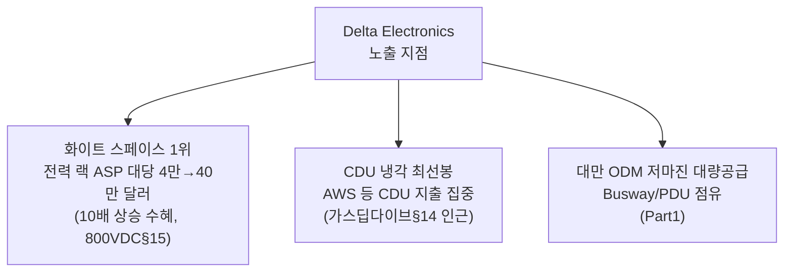
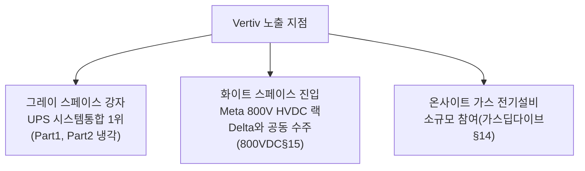
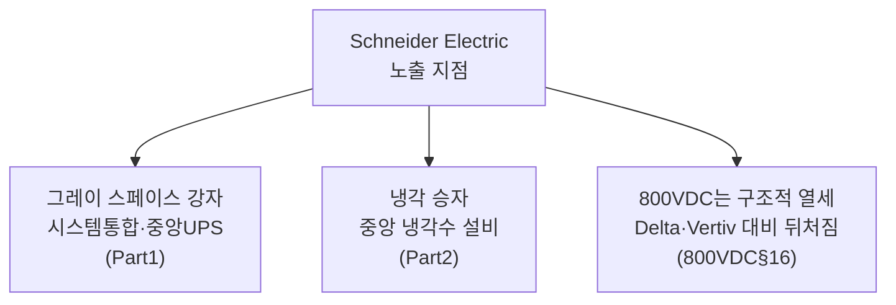

# 기업별 익스포저 리포트 — SemiAnalysis 코퍼스 크로스 분석

> **생성일**: 2026-07-05
> **최종 갱신일**: 2026-07-05
> **대상 문서**: 6개 (발행일순)
> - `[240314]` AI 데이터센터 에너지 딜레마 - AI 데이터센터 공간 확보 경쟁 (2024-03-14)
> - `[241014]` 데이터센터 해부학 Part 1 - 전기 시스템 (2024-10-14)
> - `[250214]` 데이터센터 해부학 Part 2 - 냉각 시스템 (2025-02-14)
> - `[251231]` AI 랩들은 어떻게 전력난을 해결하는가 - 온사이트 가스 딥다이브 (2025-12-31)
> - `[260526]` 800VDC 혁명 Part 1 - 전력 배전 아키텍처의 대전환 (2026-05-26)
> - `[260626]` 미국 전력망 제약 - 2028년까지 40GW+ 자가발전 데이터센터로 가는 길 (2026-06-26)
>
> **관점**: 카테고리 축 통합 리포트(전력/냉각 각각)와 달리, 기업 하나가 여러 문서·여러 흐름(전력 확보, 전력 배전, 냉각)에 걸쳐 어떤 포지션인지를 종합합니다. 같은 기업이 문서마다 다른 맥락(예: Vertiv는 냉각 문서에서 CDU 승자, 800VDC 문서에서 전력 랙 공급사)으로 등장하는데, 이를 한곳에 모아야 "이 기업은 지금 흐름 전체에서 수혜인가 리스크인가"를 한 번에 판단할 수 있습니다.

---

## 📌 현재 종합 판단

- **화이트 스페이스(랙 안 전력·냉각 부품) 벤더가 여러 흐름에서 동시에 수혜**: Delta Electronics는 전력 배전(800VDC 랙)과 냉각(CDU) 양쪽에서 모두 선두이고, Vertiv는 그레이 스페이스(중앙 UPS) 강자 지위를 지키면서 화이트 스페이스로도 영역을 넓히는 중 (§2.1, §2.2 — 확신도: 높음, 3개 이상 문서에서 반복 확인)
- **순수 그레이 스페이스 의존 벤더는 구조적 리스크가 반복 확인됨**: Legrand는 2024년 문서에서 이미 "화이트 스페이스 노출 과다"로 지목됐고, 2026년 800VDC 문서에서는 매출의 약 55%가 위험 구간에 있는데도 대응 제품·일정이 전무하다고 재확인됨 (§2.6 — 확신도: 높음)
- **서구 종합 장비업체(Schneider·Eaton·ABB)는 그레이 스페이스·냉각에서는 여전히 강자이지만 800VDC 전환에서는 뒤처져 있어 "기존 사업은 방어, 신사업은 열세"라는 혼재 신호**: 실제 물량은 대부분 2028년 이후로 잡혀 있어 근시일 매출 기여는 제한적 (§2.3\~§2.5 — 확신도: 중간)
- **에너지 저장 공급망(배터리·슈퍼커패시터)은 단일 문서 근거지만 수치가 뚜렷함**: Panasonic(BBU 약 80% 점유율)과 Musashi Seimitsu(슈퍼커패시터 사실상 독점)는 800VDC 전환에 직접 올라탄 수혜 사례 (§2.7, §2.8 — 확신도: 중간)
- **대형 가스터빈 2강(GE Vernova·Siemens Energy)은 문서마다 판단 축이 달라 사람 검토가 필요**: 2025년 말 문서는 이들을 "수주잔고 완료된 안전한 승자"로 보는 반면, 2026년 중반 문서는 같은 기업들을 BTM(자가발전) 흐름의 "구조적 패자"로 지목함 — 단기 수주잔고와 장기 성장축이 서로 다른 이야기를 하고 있어 방향이 뒤집힌 것인지 판단 시점이 다른 것인지 구분이 필요 (§2.9 — 확신도: 낮음)
- **결론**: 전력 배전과 냉각 두 축 모두에서 "랙 안(화이트 스페이스)"으로 가치가 이동하는 흐름이 확인되며, 이 이동에 먼저 올라탄 기업(Delta·Vertiv·Panasonic·Musashi 등)과 대응이 늦은 기업(Legrand 등) 사이의 격차가 벌어지는 중. 서구 종합 장비업체와 대형 가스터빈 업체는 기존 사업의 방어력은 있지만 신흥 성장축에서는 아직 증명되지 않은 상태

---

## 📑 목차

1. [익스포저 맵 (전체 조망)](#1-익스포저-맵-전체-조망)
2. [주요 기업 상세](#2-주요-기업-상세)
3. [단일 언급 기업](#3-단일-언급-기업)

---

## 1. 익스포저 맵 (전체 조망)

아래 표는 순수 분류 매트릭스로, 각 기업이 몇 개 문서에 등장했는지와 관련 흐름, 현재 방향을 정리합니다. 2개 이상 문서에 등장하는 기업을 위쪽에, 방향이 선명한 순으로 정렬했습니다.

| 기업 | 등장 문서 수 | 관련 흐름 | 방향 |
|---|---|---|---|
| Delta Electronics | 3 (Part1, 가스딥다이브, 800VDC) | 전력 배전, 냉각(CDU) | 수혜 |
| Bloom Energy | 3 (가스딥다이브, 전력망제약, 800VDC) | 전력 확보(BTM) | 수혜 |
| Vertiv | 4 (Part1, Part2 냉각, 가스딥다이브, 800VDC) | 전력 배전, 냉각, 전력 확보 | 수혜(주로) |
| Legrand | 2 (Part1, 800VDC) | 전력 배전 | 리스크 |
| Schneider Electric | 4 (Part1, Part2 냉각, 가스딥다이브, 800VDC) | 전력 배전, 냉각, 전력 확보 | 혼재 |
| Eaton | 3 (Part1, 가스딥다이브, 800VDC) | 전력 배전, 전력 확보 | 혼재 |
| ABB | 2 (Part1, 800VDC) | 전력 배전 | 혼재 |
| Lite-On | 2 (Part1, 800VDC) | 전력 배전 | 혼재 |
| GE Vernova·Siemens Energy | 2 (가스딥다이브, 전력망제약) | 전력 확보(터빈) | 혼재 (판단 축 상충) |
| Panasonic | 1 (800VDC, 비중 큼) | 전력 배전(BBU) | 수혜 |
| Musashi Seimitsu | 1 (800VDC, 비중 큼) | 전력 배전(슈퍼커패시터) | 수혜 |

---

## 2. 주요 기업 상세

### 2.1 Delta Electronics

**방향: 수혜 (확신도: 높음)** — 3개 문서에서 일관되게 화이트 스페이스(랙 안 전력·냉각 부품) 확대 수혜주로 지목되고, 최신 데이터포인트가 2026-05로 1년 이내

Delta는 이 코퍼스 전체에서 가장 여러 흐름에 걸쳐 등장하는 기업입니다. 2024년 문서에서는 대만 ODM으로서 Busway·PDU를 낮은 마진에 대량 공급하는 업체로 언급됐고(Part1 문서), 온사이트 가스 딥다이브에서는 CDU(냉각) 지출이 Delta로 쏠리는 흐름의 진원지로 잠깐 등장하며(가스딥다이브 문서 §14 인근), 800VDC 문서에서는 전력 셸프·BBU·PCS·수랭까지 "그리드-투-칩" 전 구간을 한 회사가 검증된 패키지로 공급하는 유일한 벤더로 가장 비중 있게 다뤄집니다(800VDC 문서 §15).

800VDC 문서는 Delta의 해자를 "그리드-투-칩" 수직 통합으로 설명합니다 — 유틸리티 연계 지점부터 GPU 보드 위 VRM까지 전 구간을 공급할 수 있는 유일한 업체이며, ODM 채널(Foxconn·Wiwynn·Wistron)을 통해 MSFT·META·ORCL에도 CDU 시스템을 공급합니다(800VDC 문서 §15). 다만 그레이 스페이스(UPS·PDU)에서는 미국 시장 점유율이 미미하다는 약점도 함께 지적됩니다 — 이 영역은 Vertiv·Schneider·Eaton·ABB 같은 서구 기존 강자가 지배하고 있습니다(800VDC 문서 §15).

**지켜볼 포인트**: Nvidia·Meta·Google의 800VDC·전력 랙 초기 물량이 2026년 말까지 실제 출하로 이어지는지(800VDC 문서 §15), 전용 Kyber 800V-50V 사이드카가 없어지는 시나리오가 현실화돼 Delta의 인랙 PSU 점유율이 더 커지는지(800VDC 문서 §15).

---

### 2.2 Vertiv

**방향: 수혜(주로) (확신도: 높음)** — 4개 문서에서 등장, 그레이 스페이스 강자 지위를 지키면서 화이트 스페이스로 영역을 넓히는 방향이 반복 확인되며 최신 데이터포인트 2026-05

Vertiv는 코퍼스에서 가장 많은 문서(4개)에 등장하는 기업입니다. Part1(전기 시스템)에서는 UPS 시스템 통합업체 승자로, Part2(냉각 시스템)에서는 중앙 냉각수 설비 승자로, 온사이트 가스 딥다이브에서는 비중은 작지만 전기 설비 공급사 중 하나로, 800VDC 문서에서는 Meta의 800V HVDC 전력 랙 프로그램을 Delta와 함께 따낸 사례로 등장합니다.

800VDC 문서는 Vertiv를 "화이트 스페이스로 밀고 들어오는 그레이 스페이스 리더"로 표현합니다 — META·GOOGL에서 역사적으로 낮았던 콘텐츠가 이번 HVDC 전력 랙 프로그램으로 MW당 약 100만 달러 수준까지 뛰어올랐고, 기존 UPS 사업은 잠식되지 않은 채 그 위에 새 전력 랙 콘텐츠가 얹히는 구조라 단기적으로 순풍이라고 평가합니다(800VDC 문서 §15). 다만 서버 사이드 전력 전자(PSU·BBU)에는 아직 참여하지 못해 현재 GB200 랙에서 화이트 스페이스 콘텐츠 점유율이 사실상 0이라는 한계도 함께 지적됩니다(800VDC 문서 §15).

**지켜볼 포인트**: Vertiv가 랙 단위 변환(PSU·BBU) 역량을 자체 구축·제휴·인수로 확보하는지(800VDC 문서 §15), Delta·Vertiv의 HVDC 전력 랙 수주·매출이 실적으로 공개되는지(전력 통합 리포트 §2에서도 동일 포인트로 추적 중).

---

### 2.3 Schneider Electric

**방향: 혼재 (확신도: 중간)** — 4개 문서에 등장하지만 사업 영역별로 방향이 갈림: 그레이 스페이스·냉각에서는 강자, 800VDC 전환에서는 구조적으로 뒤처짐

Schneider는 Part1에서 UPS·설계·설치·유지보수를 아우르는 주요 시스템 통합업체로, Part2(냉각)에서는 중앙 냉각수 설비 승자로, 온사이트 가스 딥다이브에서는 전기 설비 대표 기업 중 하나로 꾸준히 언급됩니다. 그러나 800VDC 문서는 "Schneider Electric은 800V HVDC 경쟁에서 Delta·Vertiv보다 구조적으로 뒤처진 것으로 보인다"고 명시합니다(800VDC 문서 §16).

OCP 2025에서 랙당 최대 1.2MW급 800VDC 사이드카를 선보였지만 출하 시점에 대한 경영진 코멘트는 모호했고, 2025년 12월 자본시장의 날에서는 800V 메시지 없이 2025\~30년 한 자릿수 후반 매출 성장(그중 데이터센터 연 12\~14%) 가이던스를 제시했습니다(800VDC 문서 §16). 중압(MV) 스위치기어·배전 분야의 글로벌 리더 지위는 800V 전환을 거쳐도 안전하게 유지될 것으로 평가됩니다(800VDC 문서 §16).

**지켜볼 포인트**: Schneider의 800VDC 사이드카 실제 출하 시점 공개 여부(800VDC 문서 §16), 데이터센터 매출 연 12\~14% 성장 가이던스의 실적 확인.

---

### 2.4 Eaton

**방향: 혼재 (확신도: 중간)** — 3개 문서에서 그레이 스페이스 강자 지위는 재확인되나, 800VDC 화이트 스페이스 콘텐츠는 전무하다는 점이 반복 지적됨

Part1에서는 전력 관리·UPS·배전을 담당하는 주요 시스템 통합업체 승자로, 온사이트 가스 딥다이브에서는 전기 설비 대표 기업으로 꾸준히 등장합니다. 800VDC 문서는 Eaton을 "그리드-투-칩"을 표방하는 서구 종합 장비업체 중 하나로 다루면서, 800VDC 레퍼런스 아키텍처 공개(2025년 10월, Nvidia 800VDC AI 팩토리 아키텍처 지원)에도 불구하고 "화이트 스페이스 서버 전력 사업이 거의 없다"고 지적합니다 — PSU도, BBU도, DC-DC 컨버터도 없어 현재 GB200 랙에서 화이트 스페이스 콘텐츠를 전혀 확보하지 못한 상태입니다(800VDC 문서 §16).

다만 Eaton은 Resilient Power Systems 인수(2025년 8월, 5,500만 달러 + 언아웃 9,500만 달러)로 SST(고체상태 변압기) 지적재산을 이미 사내에 확보했고, 사우스캐롤라이나 존스빌에 3억 4천만 달러를 투자해 미국 3번째 변압기 생산시설을 짓고 있습니다(2027년 생산 예정) — Phase 3\~4 표준이 SST로 굳어질 경우 여러 해에 걸친 옵션가치를 쥐고 있다는 평가입니다(800VDC 문서 §16).

**지켜볼 포인트**: Phase 3\~4(시설 중앙 정류·SST) 표준이 실제로 SST로 수렴하는지(800VDC 문서 §16\~§17), Eaton의 SST 상업화 일정 공개 여부.

---

### 2.5 ABB

**방향: 혼재 (확신도: 중간)** — 근시일 그레이 스페이스(MV 스위치기어) 수주는 호조이나, 800VDC 매출 기여는 스스로 "2028년 이후"라고 못박음

Part1에서는 변압기·스위치기어 구성요소 공급업체로 등장하고, 800VDC 문서에서는 별도 섹션으로 비중 있게 다뤄집니다. ABB는 변압기 사업을 이미 Hitachi Energy에 넘겼고, 현재는 LV·MV 스위치기어·차단기·전력 배전·MV UPS·발전기·조립식 eHouse 솔루션에 집중하는 "개별 패키지 최고 공급사" 전략을 취하고 있습니다(800VDC 문서 §16).

2025 회계연도는 "ABB 역사상 최고의 해"(사상 최대 46억 달러 잉여현금흐름, 19% EBITA 마진, 4분기 비교가능 수주 +32%)였고, MV 스위치기어는 리드타임 30\~35주로 데이터센터 건설의 실질적 병목이 되어 3교대·24시간 체제로 운영 중입니다(800VDC 문서 §16). 하지만 800VDC에 대해서는 ABB 스스로 "현재 강한 수주는 기존 AC 전력 아키텍처용이며, Nvidia와 함께하는 새로운 800V DC 아키텍처는 2028년 이후의 기회"라고 명확히 밝혔습니다(800VDC 문서 §16).

**지켜볼 포인트**: ABB의 백로그 커버리지(약 5개월, Vertiv 10\~12개월·Eaton 7\~9개월 대비 짧음)가 MV 스위치기어 병목 완화와 함께 어떻게 변하는지(800VDC 문서 §16), 2028년 이후로 예상된 800VDC 매출 기여 시점이 앞당겨지는지.

---
