# 기업별 익스포저 리포트 — 반도체·메모리

> **생성일**: 2026-07-06
> **최종 갱신일**: 2026-07-06
> **대상 문서**: 6개 (발행일순)
> - `[230717]` 낸드플래시 독점 균열 - 도쿄일렉트론 vs 램리서치 (2023-07-17)
> - `[250812]` HBM 로드맵 - 메모리 벽을 넘는 HBM의 부상과 미래 (2025-08-12)
> - `[260114]` CFET 1,000개와 SK하이닉스 차세대 낸드 - IEDM 2025 총정리 (2026-01-14)
> - `[260207]` 메모리 마니아 - 40년 만의 공급 부족이 부르는 메모리 붐 (2026-02-07)
> - `[260416]` ISSCC 2026 총정리 - HBM4, LPDDR6, CPO, 액티브 LSI 등 차세대 메모리·인터커넥트 (2026-04-16)
> - `[260623]` 중국 CXMT, DRAM 강자들에 도전장을 내밀다 (2026-06-23)
>
> **산업 스코프**: 반도체·메모리 제조·장비 밸류체인(DRAM·NAND·HBM 생산, 웨이퍼 팹 장비, 파운드리·첨단 패키징) — 다른 산업 클러스터(AI 인프라 전력·냉각, AI 모델·서비스 등)의 기업이 코퍼스에 들어오면 이 파일에 추가하지 않고 별도 익스포저 리포트로 분리 (REPORT_RULES.md 참고)
> **관점**: NVIDIA·AMD·인텔 등 로직/AI가속기 기업은 이 클러스터에서 "메모리 수요자" 맥락으로만 짧게 등장하며, 별도 주요 기업으로 다루지 않음(전력·냉각 리포트와의 역할 중복 방지). 이 리포트는 메모리·NAND 제조사, 웨이퍼 팹 장비사, 파운드리·패키징 업체가 여러 문서·여러 흐름(HBM 생산 경쟁, NAND 적층 경쟁, 웨이퍼 팹 장비 점유율 이동, 중국 반도체 자립)에 걸쳐 어떤 포지션인지를 종합합니다.

---

## 📌 현재 종합 판단

- **SK하이닉스는 이 코퍼스 전체(6개 문서 모두)에서 가장 일관되게 수혜로 지목되는 기업**: HBM3E·HBM4 세대 내내 MR-MUF 패키징·전력배선망(PDN) 설계 우위로 앞서고, Rubin향 HBM4 R200급 공급 점유율도 약 60%로 최대 — SK하이닉스 자체 발주 변경으로 한미반도체와 일시적 공급망 갈등을 겪었으나 봉합됐고, NAND 밀도에서는 경쟁사에 뒤처지는 약점도 함께 확인됨(HBM로드맵 §4\~6, 메모리마니아 §9, IEDM문서 §2 — 확신도: 높음)
- **삼성전자·마이크론은 혼재**: 삼성전자는 HBM3E 수율·품질 문제로 AMD·아마존 저가 소켓 위주로 밀려났던 이력이 있지만 ISSCC 2026에서 유일하게 HBM4 기술 논문을 공개하며 JEDEC 표준 대비 2배 이상의 핀 속도를 시연 — 다만 1c 공정 수율은 아직 약 50%에 불과. 마이크론은 커먼디티 DRAM·NAND 원가 효율에서는 꾸준히 앞서지만 HBM4 초기 R200급 점유율은 0%로 전망돼 세대 전환기마다 정반대의 그림이 반복됨(HBM로드맵 §5·§18, 메모리마니아 §9, ISSCC문서 §2, IEDM문서 §2 — 확신도: 중간)
- **웨이퍼 팹 장비에서는 도쿄일렉트론(TEL)이 램리서치의 아성을 잠식하는 흐름**: 초저온 식각 기술로 복수 고객사에 장비를 이미 출하했고, 400단+ NAND 세대에서 초저온 식각·몰리브덴 증착을 동시에 따낼 경우 램리서치로부터 10억 달러 이상의 매출 이전이 추정됨 — 다만 이 서사의 근거는 2023년 단일 문서이고, 이후 문서에서는 TEL이 중국 장비 표에 부수적으로만 재등장해 최근 시점의 재확인은 부재(NAND문서 §5\~7, CXMT문서 §7 — 확신도: 중간, 단일 문서 기반이나 정량 근거가 구체적)
- **램리서치는 판단 축 자체가 상충하는 사례**: NAND 고종횡비 식각이라는 특정 니치에서는 TEL에 잠식당하는 리스크가 지목되지만, 메모리 슈퍼사이클 전체를 보면 HBM 웨이퍼 확장과 1b·1c 노드 전환이라는 매크로 흐름의 수혜도 동시에 받고 있어(메모리마니아 §10) 단일 방향으로 정리하기 어려움 — 사람 검토가 필요한 항목(NAND문서 전체, 메모리마니아 §10, CXMT문서 §7 — 확신도: 낮음)
- **CXMT는 범용 DRAM과 HBM에서 서로 다른 그림**: 슈퍼사이클 가격 급등을 등에 업고 매출이 3년 연속 세 자릿수 성장률로 폭증하며 역대 최대급 반도체 IPO를 준비 중이지만, 이 실적은 점유율 확대가 아니라 순전히 가격 상승이 만든 결과이고 HBM은 아직 8단 종합 수율이 약 25%에 그쳐 3사와의 격차가 구조적으로 유지되는 중(CXMT문서 §4·§5, HBM로드맵 §7 — 확신도: 중간)
- **한미반도체는 HBM TC본더 사실상 독점 지위가 흔들리는 조짐**: SK하이닉스가 경쟁사 한화 장비를 대량 발주하자 현장 서비스를 철수시키는 초강수로 맞섰고 봉합은 됐지만, ASMPT·Besi까지 추격에 가세하고 있어 독점 구도가 오래갈지는 불확실(HBM로드맵 §6 — 확신도: 낮음)
- **결론**: AI발 메모리 슈퍼사이클의 최대 수혜는 SK하이닉스와 TEL처럼 "기술 우위를 실제 물량·수주로 전환한" 기업에 집중돼 있고, 삼성전자·마이크론·CXMT·램리서치처럼 "한쪽 사업에서는 앞서지만 다른 쪽에서는 뒤처지는" 기업들의 순위는 세대 전환(HBM4, 400단+ NAND, 1c 노드)마다 다시 흔들릴 수 있는 유동적 상태

---

## 📑 목차

1. [익스포저 맵 (전체 조망)](#1-익스포저-맵-전체-조망)
2. [주요 기업 상세](#2-주요-기업-상세)
3. [단일 언급 기업](#3-단일-언급-기업)

---

## 1. 익스포저 맵 (전체 조망)

아래 표는 순수 분류 매트릭스로, 각 기업이 몇 개 문서에 등장했는지와 관련 흐름, 현재 방향을 정리합니다. 2개 이상 문서에 등장하는 기업을 위쪽에 배치했습니다.

| 기업 | 등장 문서 수 | 관련 흐름 | 방향 |
|---|---|---|---|
| SK하이닉스 | 6 (전 문서) | HBM 생산·패키징, NAND 적층, 웨이퍼 팹 장비 수요 | 수혜 |
| 삼성전자 | 6 (전 문서) | HBM 생산, NAND 적층·소재, 파운드리·패키징 | 혼재 |
| 마이크론 | 6 (전 문서) | HBM 생산, NAND 적층, 커먼디티 DRAM | 혼재 |
| 램리서치 | 3 (NAND, 메모리마니아, CXMT) | 고종횡비 식각 장비, 웨이퍼 팹 장비 전반 | 혼재(판단축 상충) |
| 키옥시아·샌디스크(옛 웨스턴디지털 낸드사업) | 3 (NAND, ISSCC, IEDM) | NAND 적층·밀도 경쟁 | 수혜 |
| TSMC | 3 (HBM로드맵, ISSCC, IEDM) | HBM4 베이스 다이 파운드리, 첨단 패키징(CoWoS·aLSI), CFET | 수혜 |
| CXMT | 2 (HBM로드맵, CXMT) | 중국 DRAM 자립, HBM 국산화 | 혼재 |
| 도쿄일렉트론(TEL) | 2 (NAND, CXMT — CXMT문서는 장비 표 언급 수준) | 고종횡비 식각(초저온 식각), 중국 장비 공급 | 수혜 |
| 화웨이 | 2 (HBM로드맵, CXMT) | 중국 AI 반도체·HBM 자립 생태계 | 리스크(제약) |
| 한미반도체 | 2 (HBM로드맵, CXMT) | HBM 본딩 장비(TC본더) | 혼재 |
| ASML | 2 (메모리마니아, CXMT) | EUV 노광 장비, 대중 수출통제 | 수혜 |
| 나우라·AMEC(중국 장비 국산화 진영) | 1(CXMT, 비중 큼) | 중국 반도체 장비 국산화, TSV 장비 | 수혜(중국 국산화 관점) |

---

## 2. 주요 기업 상세

### 2.1 SK하이닉스

**방향: 수혜 (확신도: 높음)** — 6개 문서 전부에서 등장하며 HBM 기술·물량 우위가 반복 재확인, 최신 데이터포인트 2026-06

SK하이닉스는 이 코퍼스에서 가장 폭넓게, 가장 일관되게 긍정적으로 다뤄지는 기업입니다. HBM 적층 패키징에서는 NAMICS와 공동 개발한 몰딩 언더필 재료 기반의 MR-MUF 방식으로 마이크론·삼성의 TC-NCF 대비 발열 처리·생산성 모두에서 앞서고(HBM로드맵 §4), HBM3E에서는 전력배선망(PDN)을 다이 전체로 확장해 TSV 수를 약 6배 늘리고 전압강하(IR Drop)를 최대 75% 낮추는 설계 우위를 확보했습니다(HBM로드맵 §5). 그 결과 Rubin향 HBM4 R200급 공급 점유율은 약 60%로 삼성전자(약 30%)·마이크론(0%)을 크게 앞설 것으로 전망됩니다(메모리마니아 §9).

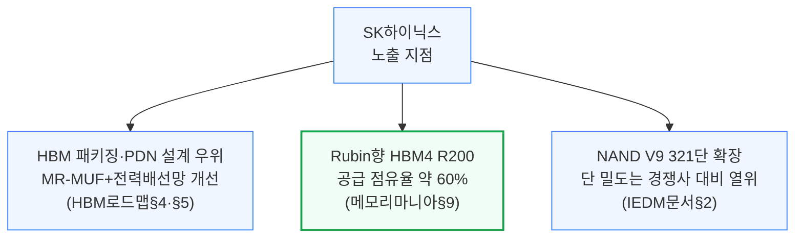

다만 약점도 함께 확인됩니다. NAND에서는 238단(V8)에서 321단(V9)으로 층수를 늘렸지만 덱(층 묶음)이 3개로 늘며 공정이 복잡해져, 비슷한 층수의 마이크론 G9(2덱, 원가 우위)나 키옥시아·샌디스크 BiCS10(3덱, 더 높은 밀도)에 밀도 경쟁에서 뒤처집니다(IEDM문서 §2). 또한 2025년 가을 HBM용 열압착(TC) 본더 공급사 한미반도체와의 갈등으로 현장 서비스가 일시 철수되며 HBM3E 12-hi 출하가 몇 주\~몇 달간 막힐 위기를 겪기도 했습니다(HBM로드맵 §6, 아래 2.10 한미반도체 참고). 2026년 DRAM WFE(웨이퍼 팹 장비) 자본투자 증가율은 3사 중 최고인 약 34%로, HBM·1c 노드 전환에 가장 공격적으로 베팅하고 있습니다(메모리마니아 §10).

**지켜볼 포인트**: HBM4 본격 교차전환(2026년 하반기 전망, 메모리마니아 §9)이 실제로 이 시점에 이뤄지는지, 한미반도체·한화 사이 TC본더 공급망 갈등이 재발하지 않는지(HBM로드맵 §6), NAND 밀도 열위를 만회할 차세대 적층·소재 전환 계획 공개 여부(IEDM문서 §2).

---

### 2.2 삼성전자

**방향: 혼재 (확신도: 중간)** — 6개 문서에 등장하지만 사업 영역·시점별로 방향이 갈림: 커먼디티 DRAM·NAND 소재에서는 강자, HBM에서는 추격자

삼성전자는 이 코퍼스에서 가장 등장 빈도가 높으면서도 평가가 가장 엇갈리는 기업입니다. NAND 시장에서는 세계 3위(점유율 34%)지만 236단으로 세대를 건너뛰는 대규모 전환 투자를 단행 중이며, 이는 손해를 감수하고서라도 경쟁사를 시장에서 밀어내려는 최고위층의 의도적 전략으로 분석됩니다(NAND문서 §4). IEDM 2025에서는 워드라인 금속을 텅스텐에서 몰리브덴으로 교체해 접촉저항을 40% 낮추고 읽기 속도를 30% 이상 개선하는 등 소재 혁신에서는 앞서갑니다(IEDM문서 §2).

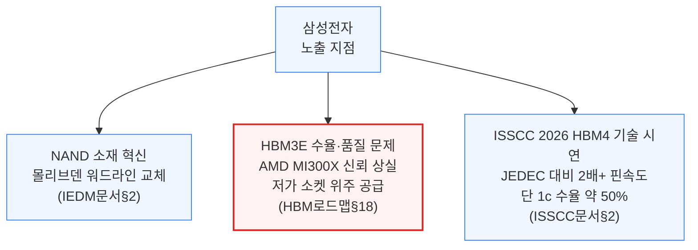

HBM에서는 반대로 뚜렷한 약점이 반복 확인됩니다. 구형 1a 모바일 공정을 재활용한 설계와 열악한 패키징 수율 탓에 AMD MI300X에서 GPU 오류를 유발해 신뢰를 잃었고, 이후 아마존 Trainium2e 등 가격 민감형 저가 소켓 위주로 밀려났습니다(HBM로드맵 §18). HBM4에서는 SK하이닉스·마이크론이 검증된 1b 노드로 안정적으로 수성하는 것과 달리 삼성전자만 1c 노드로 직행하는 모험을 택했는데, 초기 테스트 웨이퍼 수율이 극도로 낮아 시장 진입이 2026년 하반기로 밀렸습니다(HBM로드맵 §18). 다만 2026년 4월 ISSCC에서는 3사 중 유일하게 HBM4 기술 논문을 공개하며 JEDEC 공식 표준(핀당 6.4Gb/s) 대비 2배 이상인 핀당 13Gb/s·3.3TB/s 대역폭을 시연해 기술 격차를 좁히고 있음을 보여줬습니다 — 다만 이 발표조차 1c 전공정 수율이 2025년 한 해 약 50%에 그쳤다는 한계를 함께 인정합니다(ISSCC문서 §2). 하이브리드 본딩 관련해서도 SK하이닉스·마이크론이 언급을 줄이는 사이 삼성전자만 가장 목소리를 높이는 패턴이 반복되는데, 이는 추격 기업이 공격적으로 홍보한 뒤 실행에서 기대에 못 미치는 전형적 패턴으로 지적됩니다(HBM로드맵 §8).

**지켜볼 포인트**: 삼성 HBM4의 2026년 하반기 양산 진입이 실제로 이뤄지는지, 1c 공정 수율이 50%에서 얼마나 개선되는지(ISSCC문서 §2), Rebel100(2.9 화웨이 다음 섹션이 아니라 3장 단일언급 참고) 등 삼성 파운드리 I-CubeS 패키징 채택 사례가 확대되는지.

---

### 2.3 마이크론

**방향: 혼재 (확신도: 중간)** — 6개 문서에 등장, 커먼디티 DRAM·NAND 원가 효율에서는 꾸준히 앞서지만 HBM4 초기 점유율은 3사 중 최하위로 전망

마이크론은 셀당 3비트(TLC)가 장기적으로 가장 원가 효율적이라는 판단 아래 논리적 미세화보다 수직·구조적 미세화에 집중해왔고(NAND문서 §2), IEDM 2025에서 공개한 G9 NAND(276단, 2덱)는 SK하이닉스 V9(321단, 3덱)과 비슷한 밀도를 더 적은 덱 수로 달성해 원가 우위를 지킵니다(IEDM문서 §2). HBM에서는 표준 HBM3를 건너뛰고 TSV·PDN 설계에 집중해 전력소비 30% 절감을 주장하며(미검증) 단숨에 추격하는 전략을 택했습니다(HBM로드맵 §5).

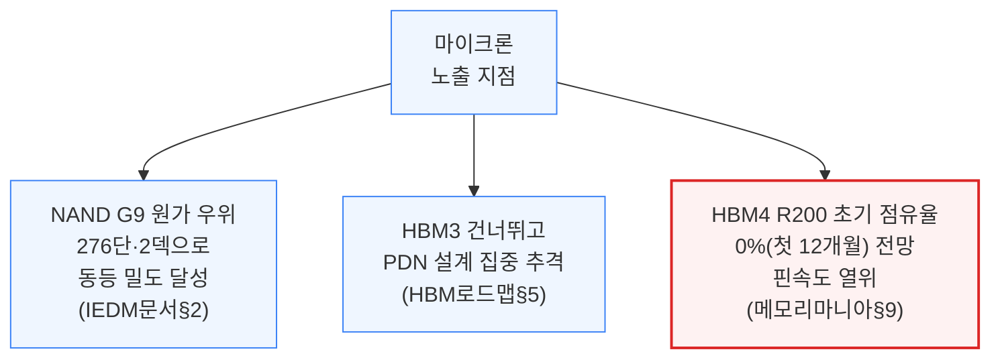

그러나 HBM4 세대에서는 정반대의 그림이 나타납니다. HBM4 엔지니어링 샘플의 핀 속도가 삼성·SK하이닉스보다 훨씬 낮아 점유율·양산 일정에 타격을 입을 것으로 전망되며, Rubin향 R200급 HBM 공급 점유율은 첫 12개월간 사실상 0%로 예상됩니다(메모리마니아 §9). ISSCC 2026에서는 베이스 다이 공정으로 자체 CMOS(가장 저비용)를 택해 삼성(자사 SF4)·SK하이닉스(TSMC N12) 대비 비용 우선 전략을 취하고 있음이 확인됐습니다(ISSCC문서 §2). 2026년 DRAM WFE 자본투자 증가율은 3사 중 가장 낮은 약 20%로, 상대적으로 보수적인 증설 기조를 유지하고 있습니다(메모리마니아 §10).

**지켜볼 포인트**: HBM4 R200급 점유율 0% 전망이 "첫 12개월"이라는 한시적 상황인지, 아니면 세대 전체로 이어지는지(메모리마니아 §9), 저비용 CMOS 베이스 다이 전략이 실제 양산 성능·수율로 이어지는지(ISSCC문서 §2).

---

### 2.4 CXMT (창신메모리)

**방향: 혼재 (확신도: 중간)** — 2개 문서(HBM로드맵·CXMT문서)에서 범용 DRAM 수혜와 HBM 구조적 열위라는 상반된 그림이 반복 확인, 최신 데이터포인트 2026-06

CXMT는 중국 최대 DRAM 기업으로, 메모리 슈퍼사이클의 가격 급등에 올라타 매출이 2023년 약 12억 달러에서 2025년 약 86억 달러로 급증했고(전년비 각각 175%·156% 성장), 2026년 1분기에는 매출 73억 달러(전년비 약 700%)까지 치솟아 중국 역대 최대급 반도체 IPO를 준비 중입니다(CXMT문서 §4). 다만 이 실적은 비트 출하량 확대(1분기 전분기 대비 +11%)가 아니라 평균판매단가 급등(+57%)이 만든 결과이며, 비트 기준 시장점유율은 2025년 9%에서 2027년 12%로 완만하게만 늘어날 전망입니다(CXMT문서 §4).

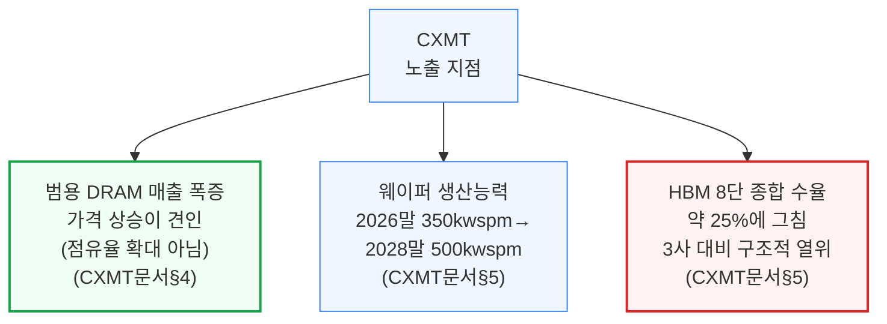

HBM에서는 구조적 열위가 뚜렷합니다. 2025년 말 기준 전체 웨이퍼(265kwspm) 중 HBM 배분 비중은 약 2%(5kwspm)에 불과하며, 범용 DRAM이 마진도 좋고 웨이퍼당 비트 생산량도 3배 이상 많아 정부의 AI 반도체 자립 압박이 없다면 HBM보다 범용 DRAM을 우선하는 것이 CXMT 입장에서 합리적입니다(CXMT문서 §5). HBM3 8단(8-hi) 종합 수율은 전공정 35%×후공정 70%로 약 25%에 그쳐, 화웨이·캄브리콘 등 일부 중국 AI 반도체 업체만 제한적으로 채택할 전망입니다(CXMT문서 §5). 앞선 HBM로드맵 문서(2025-08)에서도 CXMT의 HBM2 8-high가 2025년 상반기 양산 진입, 연말까지 TSV 생산능력을 마이크론 수준으로 확장한다는 목표가 제시됐는데(HBM로드맵 §7), 1년 뒤 CXMT문서(2026-06)에서는 이 목표가 아직 8단 안정화 단계에 머물러 있는 것으로 재확인돼, 방향은 같지만(구조적 열위 지속) 진행 속도는 당초 로드맵보다 더딘 것으로 보입니다.

미국의 수출규제(2019년 ASML EUV 금지 → 2022\~2024년 단계적 확대)로 EUV를 못 쓰는 CXMT는 DUV 다중패터닝으로 우회해야 해 비트당 원가가 구조적으로 높습니다(CXMT문서 §7). IPO 지분구조도 특이한데, 2025년 연결 순이익 71.4억 위안 중 공모 주주 귀속분은 26%(18.7억 위안)뿐이며, 국가 벤처자본이 상장 후에도 30% 이상 지분을 유지합니다(CXMT문서 §6).

**지켜볼 포인트**: 296억 위안 규모 IPO의 실제 완료 여부와 산정가(CXMT문서 §6), HBM 웨이퍼 배분이 계획대로 2026년 30kwspm→2028년 100kwspm까지 확대되는지(CXMT문서 §5), 서버 DDR5 비중이 계획대로 30% 이상으로 확대되며 알리바바·바이트댄스·텐센트와의 장기공급계약이 체결되는지(CXMT문서 §8).

---

### 2.5 도쿄일렉트론(TEL)

**방향: 수혜 (확신도: 중간)** — 램리서치 잠식 서사의 근거가 2023년 단일 문서(NAND문서)에 사실상 집중돼 있고, 정량 근거(장비 스펙·점유율 이동 추정)는 구체적이나 이후 시점의 독립적 재확인은 코퍼스 내에 없음

도쿄일렉트론(TEL)은 이 코퍼스에서 장비사 중 가장 뚜렷한 도전자 서사를 가진 기업입니다. 2023년 NAND문서는 TEL이 영하 60도의 2세대 초저온 식각(Cryo Etch) 장비로 램리서치의 고종횡비 식각 독점(점유율 90%+)에 도전하고 있으며, 이미 복수 고객사에 장비를 출하했다고 짚었습니다 — HF 식각가스 농도를 36%에서 91%로 높이고 인(P) 촉매를 추가해 식각 속도를 1세대 대비 2배로, 깊이 한계를 7마이크로미터에서 10마이크로미터로 늘렸습니다(NAND문서 §5).

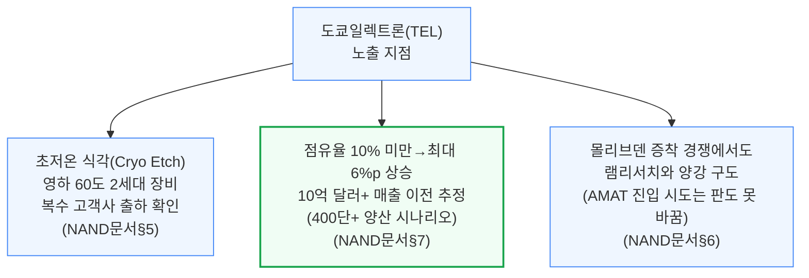

NAND문서는 400단 이상 NAND 양산이 본격화될 때 TEL이 초저온 식각과 몰리브덴 증착(Mo CVD)을 동시에 따낼 경우 고종횡비 식각 점유율을 최대 6%포인트 끌어올려 램리서치로부터 10억 달러 이상의 매출을 가져올 수 있다고 추정합니다(NAND문서 §7). 실제 대형 NAND 제조사 한 곳이 "이득이 비용을 웃돈다"고 평가했고, 램리서치는 2021년 예고했던 2022년 초저온 식각 양산 공급을 실현하지 못한 채 고객사로부터 TEL 대비 총소유비용(TCO) 문제까지 지적받아 상용화 경쟁에서 뒤처진 상태였습니다(NAND문서 §5). 증착 영역에서도 400단 이상 NAND부터 워드라인 소재가 텅스텐에서 몰리브덴으로 바뀔 가능성이 높은데, AMAT의 진입 시도에도 불구하고 이 시장은 사실상 TEL과 램리서치의 2파전으로 좁혀지고 있습니다(NAND문서 §6). 다만 이 서사는 2023년 시점 단일 문서에 근거하며, 이후 문서에서 TEL은 CXMT의 장비 생태계 표에 RTP(급속열처리)·후공정(코트·현상·식각) 영역의 지배적 해외 장비사로 부수적으로만 재등장할 뿐(CXMT문서 §7), 초저온 식각의 수주·점유율 이동이 실제로 어디까지 진행됐는지에 대한 최근 시점의 재확인은 코퍼스에 없습니다 — 방향은 뚜렷하지만 베팅 확신도는 그만큼 할인해야 합니다.

**지켜볼 포인트**: 400단 이상 NAND 양산이 본격화되며 초저온 식각·몰리브덴 증착 수주에서 TEL이 실제 점유율을 따내는지(NAND문서 §6·§7), TEL의 초저온 식각이 NAND를 넘어 3D D램 검토 중인 주요 D램 업체 2곳으로 확산되는지(NAND문서 §5).

---

### 2.6 램리서치 (Lam Research)

**방향: 혼재 — 판단 축 자체가 상충 (확신도: 낮음)** — 특정 니치(NAND 고종횡비 식각)에서는 리스크, 메모리 산업 전체 매크로 사이클에서는 수혜라는 서로 다른 질문에 답하는 두 서사가 공존

램리서치는 이 코퍼스에서 3개 문서(NAND문서·메모리마니아·CXMT문서)에 등장하는 장비사이며, 평가가 시점과 관점에 따라 크게 갈리는 사례입니다. NAND문서(2023)는 램리서치가 고종횡비 식각 시장의 90% 이상, NAND 장비 지출 전체의 26%를 차지하는 사실상 독점 사업자이지만 이번이 처음으로 TEL이라는 진짜 경쟁자를 만난 순간이라고 진단하며, 생성형 AI 열풍에 편승해 사상 최고치 부근인 램리서치 주가의 밸류에이션 프리미엄을 낮춰 볼 필요가 있다고 지적합니다(NAND문서 §4·§7).

```mermaid
flowchart TD
    LRCX["램리서치<br/>노출 지점"] --> A["NAND 고종횡비 식각<br/>90%+ 독점 지위가<br/>TEL에 잠식당하는 리스크<br/>(NAND문서§4·§7)"]
    LRCX --> B["메모리 슈퍼사이클 전체:<br/>1b·1c 노드 전환 수요<br/>경영진이 직접 확인한 수혜<br/>(메모리마니아§10)"]
    LRCX --> C["중국向 여전히<br/>식각·금속화·CMP<br/>지배적 해외 장비사<br/>(수출규제로 신규공급 제약)<br/>(CXMT문서§7)"]

    classDef default fill:#eff6ff,stroke:#3b82f6,stroke-width:1px;
    classDef danger fill:#fef2f2,stroke:#dc2626,stroke-width:2px;
    class A danger;
```

그런데 2026년 메모리마니아 문서는 완전히 다른 각도에서 램리서치를 다룹니다 — "ASML과 Lam Research(LRCX) 경영진이 최근 실적발표에서 확인"한 1b·1c 대규모 노드 전환과 HBM 웨이퍼 확장이 전공정·후공정 장비 공급사 전반에 구조적 수혜로 이어질 것이라고 서술합니다(메모리마니아 §10). CXMT문서의 장비 표에서도 램리서치는 식각·금속화(ECP)·CMP·세정 등 여러 공정 단계에서 여전히 지배적인 해외 장비사로 등재돼 있어, 중국 시장에서조차(수출규제로 신규 공급은 제약되지만) 기존 설치 기반의 영향력이 유지되고 있음을 보여줍니다(CXMT문서 §7).

두 서사는 서로 모순되지 않습니다 — NAND 고종횡비 식각이라는 좁은 니치에서의 경쟁 지위 하락과, 메모리 산업 전체 웨이퍼 팹 장비 지출 확대라는 매크로 수혜가 서로 다른 질문에 답하고 있을 뿐입니다. 다만 "지금 램리서치에 얼마나 베팅해도 되는가"라는 이 리포트의 목적에 비추면, 특정 사업부의 구조적 잠식과 회사 전체 매출의 순풍이 동시에 진행 중이라는 사실 자체가 단일한 방향으로 정리하기 어려운 지점이며 사람의 판단이 필요합니다.

**지켜볼 포인트**: TEL의 초저온 식각·몰리브덴 증착 수주가 실제 램리서치 NAND 매출 비중(2019년 이후 40%+, 일부 분기 50%+)을 얼마나 깎아먹는지(NAND문서 §4), 1b·1c 노드 전환 수요가 이 손실을 상쇄할 만큼 램리서치의 다른 사업부(D램·로직 식각·증착)에서 크게 나타나는지(메모리마니아 §10).

---

### 2.7 키옥시아·샌디스크 (옛 웨스턴디지털 낸드 사업)

**방향: 수혜 (확신도: 중간)** — 3개 문서에 걸쳐 서사가 "생존을 위한 합병 모색"(2023)에서 "세계 최고 밀도 달성"(2026)으로 이동, 최신 데이터포인트 2026-04

이 진영은 2023년 NAND문서에서는 아직 독립 생존이 불확실한 상태로 그려집니다. 웨스턴디지털(WDC)은 안정적인 HDD 사업과 달리 NAND은 중기적으로 현금흐름이 마이너스인 사업으로 보고 분사를 원했고, 마이크론과의 인수 협상이 결렬된 뒤 결국 키옥시아와의 NAND 사업 합병을 모색하는 처지였습니다 — 다른 수익원이 없는 독립 사업자라 삼성전자·SK하이닉스·마이크론처럼 D램 이익으로 NAND 적자를 메울 수 없었기 때문입니다(NAND문서 §8). 다만 이 합병이 실제로 어떤 형태로 마무리됐는지는 코퍼스 내에서 확인되지 않으며(예측 대장 참고), 이후 문서들에는 "웨스턴디지털"이 아니라 "샌디스크"라는 이름으로 재등장합니다.

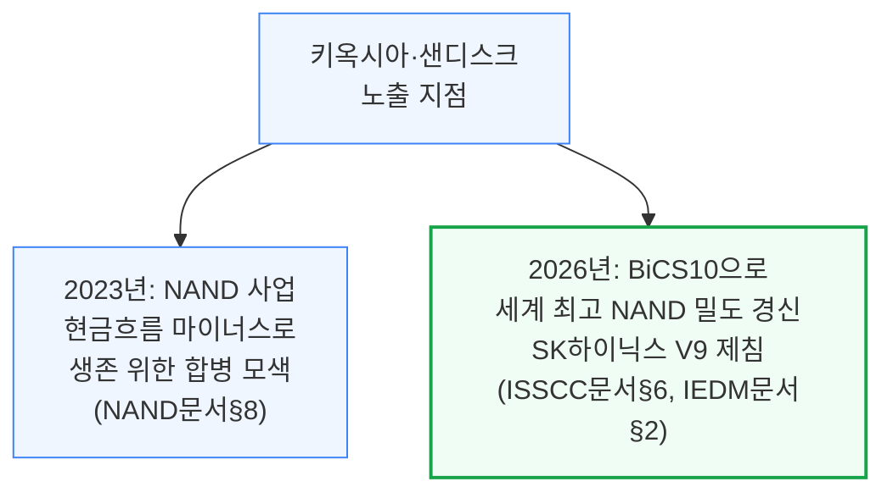

2026년 ISSCC·IEDM 문서에서는 완전히 다른 위치에 서 있습니다. 332층·3덱 구조의 BiCS10 낸드로 37.6Gb/mm²(QLC 기준)를 기록해, 종전 1위였던 SK하이닉스 321층 V9(28.8Gb/mm²)를 30% 차이로 제치고 낸드 비트 밀도 신기록을 세웠습니다(ISSCC문서 §6). IEDM 2025 비교표에서도 TLC 기준 29 대 21Gb/mm²로 SK하이닉스와의 격차가 재확인됩니다(IEDM문서 §2). 6플레인을 1×6 배치로 나누는 방식이 SK하이닉스의 2×3 배치보다 면적을 2.1% 더 아꼈고, 다이 게이팅으로 대기전류를 100분의 1 수준까지 낮추는 기술도 확인됐습니다(ISSCC문서 §6).

**지켜볼 포인트**: 2023년 논의됐던 웨스턴디지털-키옥시아 NAND 합병의 실제 최종 구조(코퍼스 밖 확인 필요, 예측 대장에 검증 보류로 표기됨), BiCS10의 양산 수율과 실제 출하 규모가 발표 밀도만큼 뒷받침되는지.

---

### 2.8 TSMC

**방향: 수혜 (확신도: 중간)** — 3개 문서에서 HBM4 베이스 다이 파운드리·첨단 패키징·CFET 세 갈래 모두에서 앞서가는 모습이 반복 확인, 메모리 자체 제조사는 아니라는 점에서 간접적 익스포저

TSMC는 메모리 제조사는 아니지만, 이 클러스터의 세 가지 핵심 흐름(HBM4 베이스 다이, 첨단 패키징, 차세대 트랜지스터)에서 모두 핵심 공급자로 등장합니다. HBM4부터 베이스 다이가 D램 공정에서 첨단 로직 공정으로 바뀌면서, Nvidia 등이 설계한 커스텀 베이스 다이를 TSMC의 N12·N3 공정으로 위탁 생산하는 구조가 자리잡았습니다(HBM로드맵 §17). CoWoS 2.5D 패키징은 HBM과 GPU를 인터포저로 묶는 필수 기술로 계속 언급됩니다(HBM로드맵 §2).

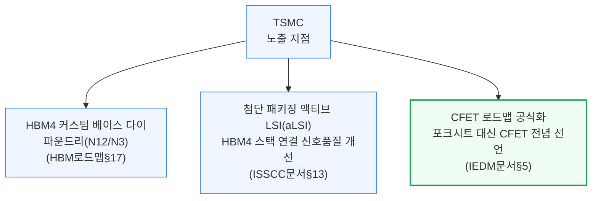

2026년 ISSCC에서는 액티브 LSI(aLSI)로 기존 CoWoS-L·EMIB 대비 신호 품질을 높여 범프 간격을 45㎛에서 38.8㎛로 줄이고, AMD MI450과 유사한 구성(SoC 다이 2개+HBM4 스택 12개)에서 실증했습니다(ISSCC문서 §13). N16 공정 MRAM에서도 삼성의 8LPP 공정 대비 저비용이면서도 듀얼포트 등 필요 기능을 더 잘 갖춰 임베디드 비휘발성 메모리 시장에서 유리한 위치를 확보했습니다(ISSCC문서 §8). IEDM 2025에서는 CFET(N형·P형 트랜지스터 적층 구조)의 2030년대 상업화·양산을 공식화한 첫 파운드리로서, 포크시트 대신 CFET에 전념한다고 선언했고 2023\~2025년 3년 연속 단계적 진전(단일 소자→인버터→101단 링 오실레이터+6T SRAM)을 보여줬습니다(IEDM문서 §5).

**지켜볼 포인트**: HBM4 베이스 다이 파운드리 물량이 실제 매출로 얼마나 잡히는지(HBM로드맵 §17), 액티브 LSI(aLSI)가 실제 양산 패키지에 채택되는 시점(ISSCC문서 §13), CFET A7\~A5 노드 도입이 로드맵대로 2030년대 초중반에 이뤄지는지(IEDM문서 §5·§7).

---

### 2.9 화웨이

**방향: 리스크(제약) (확신도: 중간)** — 3개 문서에서 "미국 제재로 첨단 장비 접근이 막힌 채 자체 생태계를 구축하려 하지만 아직 R&D 단계"라는 같은 방향이 반복 확인

화웨이는 DRAM 원자재 생산(XMC)부터 첨단 패키징(SJSemi)까지 자국 내에서 반도체 조립을 완결하려는 전 주기 내재화를 추진 중입니다(보조금전쟁[축약본] §3). 로컬 공급사 XMC가 생산한 DRAM 웨이퍼를 SJSemi가 범핑·TSV 공정으로 가공해 화웨이 Ascend 가속기에 공급하는 구조인데, XMC(2020년 등재)와 SJSemi(2024년 등재) 모두 미국 Entity List에 올라 있어 핵심 노광·식각 장비 조달이 막혀 있습니다(보조금전쟁[축약본] §3).

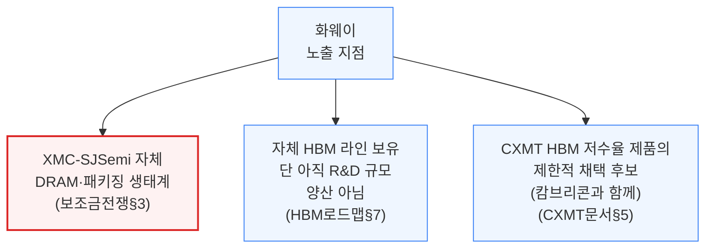

HBM로드맵 문서(2025-08)는 화웨이가 XMC 웨이퍼+SJSemi 패키징으로 자체 HBM 라인을 갖췄지만 "아직 R&D 규모일 뿐 양산 단계는 아니다"라고 명확히 선을 긋습니다(HBM로드맵 §7). 1년 뒤 CXMT문서(2026-06)에서도 화웨이·캄브리콘 등 일부 중국 AI 반도체 업체만 CXMT의 저수율 HBM을 제한적으로 채택할 것으로 전망돼(CXMT문서 §5), 화웨이 자체 HBM 생태계가 아직 CXMT에도 크게 의존해야 하는 초기 단계임을 시사합니다. 우회 조달 사례도 확인되는데, 글로벌파운드리가 정부 승인 없이 SJSemi에 1,700만 달러 규모의 장비를 인도했다가 미 상무부로부터 과징금을 받은 사건이 두 문서(보조금전쟁, HBM로드맵)에서 공통으로 언급됩니다(보조금전쟁[축약본] §3, HBM로드맵 §7).

**지켜볼 포인트**: 화웨이 자체 HBM 라인이 R&D 단계에서 실제 양산으로 전환되는 시점(HBM로드맵 §7), 중국의 2,000억 달러 반도체 보조금 중 화웨이 진영에 배분되는 몫이 구체화되는지(보조금전쟁[축약본] §1·§5).

---

### 2.10 한미반도체

**방향: 혼재 (확신도: 낮음)** — 사실상 독점 지위와 그 지위가 흔들리는 조짐이 동시에 나타나 사람의 판단이 필요한 항목

한미반도체는 HBM용 열압착(TC) 본더 시장에서, 당시 시장 리더였던 Besi·ASMPT가 외면하던 영역에 일찍 베팅해 사실상 독점 지위를 확보한 사례입니다 — SK하이닉스 내 점유율은 2025년 가을까지 100%였습니다(HBM로드맵 §6).

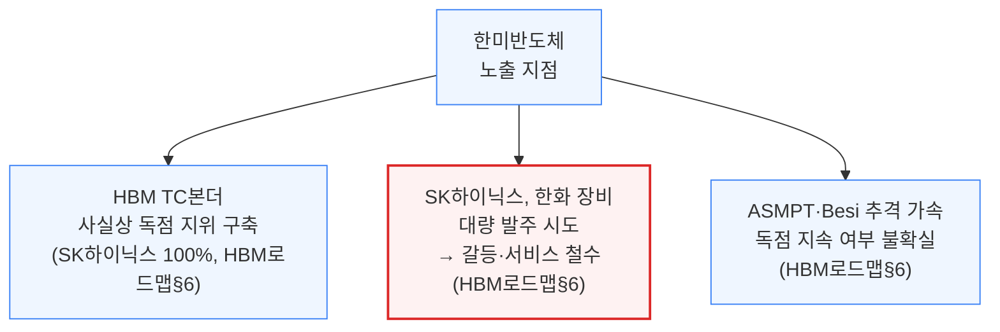

그런데 SK하이닉스가 경쟁사 한화(Hanwha) 장비를 더 비싼 가격에 대량 발주하자, 한미반도체는 2026년 4월 초 SK하이닉스 팹에서 현장 서비스 인력을 철수시키는 초강수로 맞섰습니다. 한화 장비는 아직 미납품 상태였고 기존 ASMPT 본더는 SK하이닉스 HBM3E 12-hi에 작동하지 않아, SK하이닉스는 몇 주\~몇 달 안에 대표 제품 출하가 막힐 위기에 처했고 마이크론·삼성도 그 생산 공백을 단기간에 메울 수 없어 전체 가속기 공급망까지 위협받는 상황이 벌어졌습니다(HBM로드맵 §6). 결국 SK하이닉스가 한미반도체에 소규모 달래기 주문을 넣어 현장 서비스가 복구됐지만, ASMPT·Besi가 HBM 전용 TC 본더 개선에 속도를 내고 있어 한미반도체의 독점적 지위가 오래갈지는 불확실하다고 문서는 명시적으로 판단을 유보합니다(HBM로드맵 §6). CXMT문서의 장비 표에서도 한미반도체는 후공정 TSV·TCB 영역에서 여전히 해외 지배적 공급사로 등재돼(중국조차 국산 대안이 미흡), 글로벌 영향력 자체는 건재함을 보여줍니다(CXMT문서 §7).

**지켜볼 포인트**: SK하이닉스-한미반도체 관계가 재차 악화되는지, ASMPT·Besi의 HBM 전용 TC 본더가 실제 고객사 인증·물량으로 이어지는 시점(HBM로드맵 §6).

---

### 2.11 ASML

**방향: 수혜 (확신도: 중간)** — 2개 문서에서 메모리발 EUV 수요 확대가 일관되게 긍정적으로 평가됨

ASML은 메모리마니아 문서에서 "메모리향 EUV 전망이 매우 강하다"고 직접 인용되며, 그 근거로 ① HBM 웨이퍼 확장에 따른 EUV 레이어 수 요구 증가, ② 1b·1c 노드 전환 수요 강세 두 가지를 꼽습니다 — 단기적으로는 EUV 강도가 급증하고, 장기적으로는 SK하이닉스가 1γ 공정에서 MOR 채택 등으로 증가세가 다소 둔화되지만 그래도 증가 추세는 유지될 것으로 전망됩니다(메모리마니아 §10).

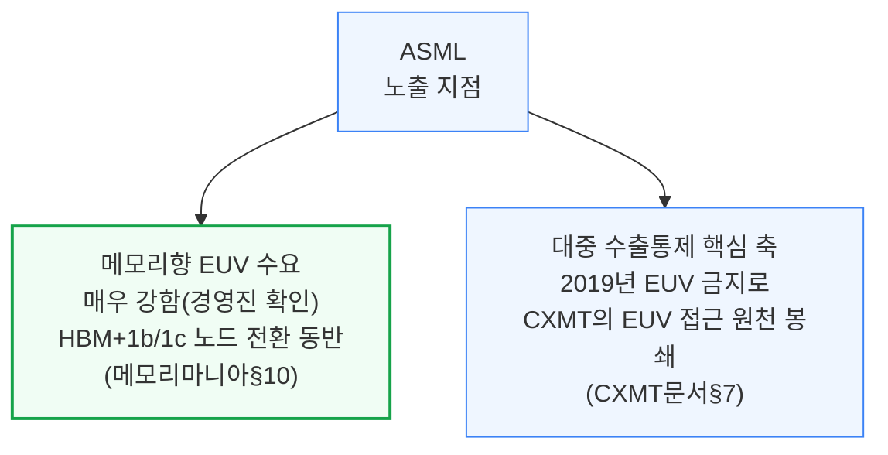

CXMT문서에서는 다른 맥락으로 등장합니다 — 2019년 ASML의 EUV 수출금지가 중국 대상 반도체 장비 제재의 첫 단추였고, 이 때문에 CXMT는 여전히 EUV에 접근하지 못해 DUV 다중패터닝으로 우회해야 하는 구조적 원가 열위를 겪고 있습니다(CXMT문서 §7). 이는 ASML 자체의 리스크라기보다는, ASML의 최첨단 장비가 지정학적으로 가치 있는 자산임을 보여주는 방증에 가깝습니다.

**지켜볼 포인트**: SK하이닉스 1γ 공정에서의 MOR 채택이 실제 ASML EUV 노광 강도를 얼마나 둔화시키는지(메모리마니아 §10), 중국 대상 EUV 수출통제 완화 논의가 나오는지.

---

### 2.12 나우라·AMEC (중국 반도체 장비 국산화 진영)

**방향: 수혜(중국 국산화 관점 한정) (확신도: 중간)** — 단일 문서(CXMT문서) 기반이지만 8개 공정 단계별 국산·해외 장비 비교표와 별도 다이어그램으로 비중 있게 다뤄짐

나우라(NAURA)와 AMEC은 CXMT문서가 정리한 8개 주요 공정 단계별 국산·해외 장비 비교표에서 중국 국산화의 양대 축으로 등장합니다. 나우라는 산화·확산, 증착, 이온주입(초기 단계)까지 폭넓게 커버하며, HBM용 TSV(실리콘관통전극) 장비에서는 식각·PVD·ALD·어닐링·구리도금까지 전 공정을 아우릅니다(CXMT문서 §7). AMEC은 고종횡비 식각에 특화해 DRAM 어레이·TSV 미세피치 영역을 담당합니다(CXMT문서 §7).

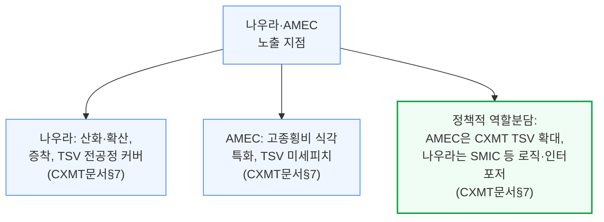

정책적으로는 AMEC이 CXMT의 TSV 물량을 더 많이 가져가고 나우라는 SMIC 등 로직·인터포저 분야에서 입지를 다지는 역할 분담이 진행 중인 것으로 파악됩니다(CXMT문서 §7). 다만 이온주입과 포토리소그래피는 여전히 국산화가 가장 뒤처진 영역으로 남아 있고(SMEE의 격차가 큼), 후공정 핵심 TSV 공정(딥실리콘 식각·PVD·구리 전착)과 임시본딩·재배선도 여전히 해외 장비사(EVG·SUSS MicroTec)가 지배적입니다(CXMT문서 §7).

**지켜볼 포인트**: AMEC의 TSV 장비가 CXMT의 HBM 웨이퍼 배분 확대(2026년 30kwspm→2028년 100kwspm, CXMT문서 §5)를 실제로 뒷받침할 만큼 물량을 확보하는지, 포토리소그래피·이온주입 국산화 격차가 좁혀지는 신호가 나오는지.

---

## 3. 단일 언급 기업

한 문서에만 짧게 등장했거나, 등장 문서는 여럿이어도 서사 비중이 작은 기업들입니다.

**HBM 공급망 관련**
- **웨스턴디지털(WDC)** — NAND문서 §8 — 2023년 시점 NAND 사업을 키옥시아와 통합하려던 논의의 당사자(현재는 "샌디스크"로 재등장, 2.7 참고). 합병의 실제 최종 구조는 코퍼스 내에서 확인되지 않아 예측 대장에 검증 보류로 표기됨
- **NAMICS** — HBM로드맵 §4 — SK하이닉스와 MR-MUF 몰딩 언더필 재료를 공동 개발한 일본 소재사
- **Camtek·Onto** — HBM로드맵 §3 — HBM 범프 공정 결함 여부를 확인하는 광학검사 장비 공급사
- **CoAsia Electronics·Faraday·SPIL** — HBM로드맵 §7 — 완제품 GPU에서 HBM을 탈부착·재활용해 중국向으로 우회 유통시키는 경유업체
- **ASMPT·Besi** — HBM로드맵 §6 — 한미반도체의 HBM TC본더 독점에 도전하는 추격 경쟁사(2.10 참고)
- **한화(Hanwha)·한화세미텍** — HBM로드맵 §6, CXMT문서 §7 — SK하이닉스가 한미반도체 대신 발주를 시도해 갈등을 촉발한 TC본더 공급사

**중국 반도체 자립 관련**
- **SJSemi(중신성무)** — 보조금전쟁(축약본) §3, HBM로드맵 §7 — 화웨이 진영의 범핑·TSV 첨단 패키징 파운드리, 미국 Entity List 등재(2024년)
- **XMC** — 보조금전쟁(축약본) §3, HBM로드맵 §7 — 화웨이 진영의 DRAM 웨이퍼 공급사, Entity List 등재(2020년)
- **글로벌파운드리(GlobalFoundries)** — HBM로드맵 §7, 보조금전쟁(축약본) §3 — 정부 승인 없이 SJSemi에 1,700만 달러 규모 장비를 판매해 미 상무부로부터 제재받은 사례
- **폴라리스(Polaris)** — CXMT문서 §2 — 캐나다 WiLAN 자회사, 2015년 파산한 키몬다(Qimonda)의 DRAM 특허 약 7,000건을 인수해 2019년 CXMT에 라이선스
- **기가디바이스(GigaDevice)** — CXMT문서 §1, §6 — CXMT 창업자 주이밍이 2005년 세운 NOR 플래시 회사, CXMT IPO 지분 1.8% 보유
- **알리바바** — CXMT문서 §6 — CXMT의 앵커 고객(서버 DRAM 대량 구매)이자 지분 약 4% 보유자로 시장 신뢰 보증 역할까지 겸함
- **Applied Materials(AMAT)** — NAND문서 §6, CXMT문서 §7 — 몰리브덴 증착 시장 진입을 시도했으나 판도를 바꾸진 못함(TEL·램리서치 2파전으로 정리), 중국向으로는 여전히 증착·이온주입·CMP 장비의 지배적 해외 공급사
- **CXMT문서 §7 표의 기타 중국 국산 장비사** — 매트슨(모회사 이타운)·SMEE·베스트(이탕)·화천(Hwatsing)·ACM리서치·피오텍·CETC·킹스톤·스카이버스·징스 — 8개 공정 단계별 국산화 진행 중인 개별 업체들, 포토리소그래피(SMEE)·이온주입 영역의 격차가 가장 큼
- **CXMT문서 §7 표의 기타 해외 장비사** — 코쿠사이·EBARA·KLA·어드밴테스트·테라다인·넥스틴·미래산업·박시스템즈·EVG·SUSS MicroTec·Axcelis — CXMT의 검사·계측·후공정 TSV 영역에서 여전히 지배적인 해외 공급사군

**차세대 로직·패키징 관련(메모리 인접)**
- **리벨리온스(Rebellions)** — ISSCC문서 §18 — 한국 AI가속기 스타트업, TSMC 대신 삼성 파운드리 SF4X 공정과 삼성 I-CubeS 인터포저(주요 AI가속기 최초 채택 사례)를 선택
- **eSilicon·바이두·Preferred Networks** — ISSCC문서 §18 — 삼성 I-CubeS 인터포저를 채택한 나머지 사례(전체 5곳 중)
- **마벨(Marvell)** — ISSCC문서 §10 — 800G "코히런트-라이트" 광트랜시버로 데이터센터 캠퍼스급 인터커넥트 신제품 공개
- **미디어텍(MediaTek)** — ISSCC문서 §7 — SRAM 셀 스케일링 정체를 로직형 10트랜지스터 xBIT 셀 구조로 우회, 온칩 메모리 밀도 22\~63% 개선

---

*리포트 생성 규칙: REPORT_RULES.md "기업별 익스포저 리포트(기업 축)" 절 기준 신규 작성*
