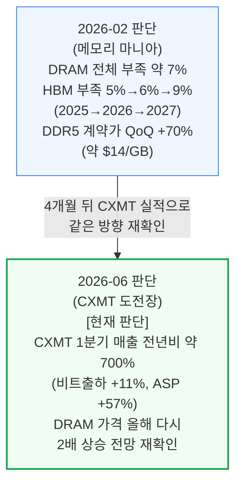
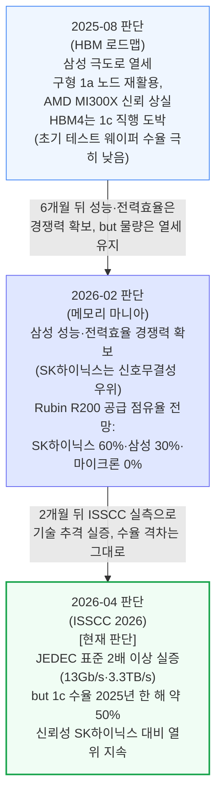
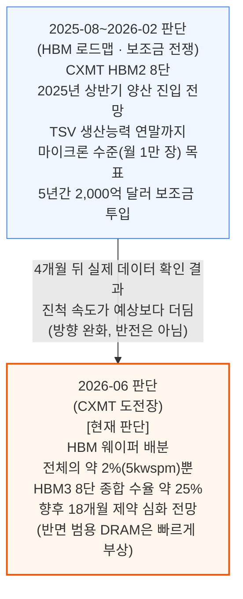
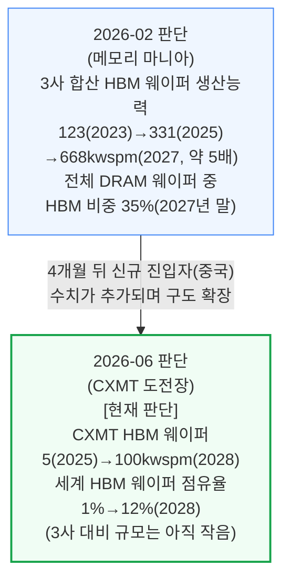

# 메모리(ai-infra/memory) 통합 리포트

> **생성일**: 2026-07-06
> **최종 갱신일**: 2026-07-06
> **대상 문서**: 5개 (완전판 4편 + 축약본 1편)[^1]
> - `[250812]` HBM 로드맵 - 메모리 벽을 넘는 HBM의 부상과 미래 (2025-08-12)
> - `[260207]` 메모리 마니아 - 40년 만의 공급 부족이 부르는 메모리 붐 (2026-02-07)
> - `[260214]` 중국의 반도체 보조금 전쟁 - CXMT, 화웨이, SJSemi, HBM, 고종횡비 식각, 그리고 도쿄 일렉트론 (2026-02-14, **축약본**)[^2]
> - `[260416]` ISSCC 2026 총정리 - HBM4, LPDDR6, CPO, 액티브 LSI 등 차세대 메모리·인터커넥트 (2026-04-16)
> - `[260623]` 중국 CXMT, DRAM 강자들에 도전장을 내밀다 (2026-06-23)

[^1]: `[230717] 낸드플래시 독점 균열 - 도쿄일렉트론 vs 램리서치`, `[260114] CFET` 2편은 아직 변환 작업 중이라 이번 리포트에서 제외 — 완료 후 증보 예정.
[^2]: 원문("China's Semiconductor Subsidy War", 2026-02-14) 자체가 Drive에서 유실되어, Gemini가 원문 없이 재구성한 5섹션 요약본을 기반으로 함. 이 문서 단독으로 뒷받침하는 판단은 확신도를 상향하지 않음.

---

## 📌 현재 종합 판단

- **DRAM·HBM 공급 부족은 심화 중이며 아직 정점이 아님**: 2026년 DRAM 전체 부족률 약 7%, HBM 부족률은 2025년 약 5%→2027년 약 9%로 확대 전망이 4개월 뒤 실제 실적(CXMT 매출 급등)으로 재확인됨 (§1.1, 확신도: 높음)
- **HBM4 삼파전에서 삼성전자는 기술은 추격했지만 물량·신뢰성은 아직 SK하이닉스에 뒤짐**: 2025년 8월 "극도의 열세" 진단이 2026년 4월 ISSCC 실측(JEDEC 표준 2배 이상 실증)으로 기술 격차 축소가 확인됐으나, 수율(약 50%)·물량 점유율(SK하이닉스 60% vs 삼성 30%) 격차는 그대로 유지 (§1.2, 확신도: 높음)
- **중국의 HBM 자립은 보조금 규모(2,000억 달러)에 비해 실행 속도가 예상보다 더딤**: 2026년 2월 "마이크론 수준 추격" 전망이 4개월 뒤 실제로는 "HBM 웨이퍼 배분 전체의 2%뿐" · "수율 25%"라는 훨씬 완만한 현실로 조정됨 — 방향 자체가 꺾인 것은 아니지만 속도에 대한 확신은 낮춰야 함 (§1.3, 확신도: 낮음)
- **글로벌 HBM 웨이퍼 생산능력 경쟁은 3사 중심에서 중국까지 확대되는 국면**: 3사 합산 생산능력이 4년간 약 5배(123→668kwspm) 늘어나는 가운데 중국(CXMT)도 소규모로 진입하기 시작 — 다만 아직 3사 대비 규모는 미미 (§1.4, 확신도: 중간)
- **결론**: 메모리 산업은 HBM 수요가 커먼디티 DRAM 생산 여력까지 잠식하는 구조적 공급 부족 국면에 진입했고, 이 방향은 여러 문서에서 반복·가속 확인됨 — 다만 "누가 그 부족을 메우는가"에서는 SK하이닉스의 우위가 가장 확실하고, 삼성의 기술 추격과 중국의 범용 DRAM 진입은 아직 지켜봐야 할 변수

---

## 📑 목차

1. [시계열 흐름: 반복 등장 주제](#1-시계열-흐름-반복-등장-주제)
2. [다음 확인 포인트](#2-다음-확인-포인트)
3. [문서별 요약](#3-문서별-요약)

---

## 1. 시계열 흐름: 반복 등장 주제

### 1.1 DRAM·HBM 공급 부족 심화 — 슈퍼사이클은 아직 정점 전

**확신도: 높음** — 2개 문서가 같은 방향(부족 심화)을 재확인, 최신 데이터포인트 2026-06

2026년 2월 메모리 마니아가 제시한 정량 전망(부족률·가격 상승폭)을, 4개월 뒤 CXMT 문서가 실제 기업 실적으로 재확인합니다.

CXMT 문서는 메모리 마니아의 "가격 급등" 전망을 별도로 검증한 것이 아니라 같은 저자가 같은 전망을 재인용하며 실제 기업 실적으로 뒷받침한 구조입니다 — CXMT의 매출 급증이 물량 확대가 아니라 가격(ASP) 급등에서 나왔다는 사실 자체가 "공급 부족이 실제로 가격에 반영되고 있다"는 신호로 해석됩니다.

### 1.2 HBM4 삼파전: 삼성전자의 기술 추격 vs SK하이닉스의 물량 우위

**확신도: 높음** — 3개 문서가 8개월에 걸쳐 같은 두 방향(기술 격차 축소 + 물량 격차 유지)을 반복 확인, 최신 데이터포인트 2026-04

삼성전자의 HBM4 스토리는 세 문서에 걸쳐 일관된 패턴을 보입니다: 기술적으로는 계속 따라잡고 있지만, 수율과 실제 공급 물량에서는 격차가 좀처럼 좁혀지지 않습니다.

세 시점 모두에서 "삼성이 기술적으로는 좁히고 있다"와 "그럼에도 물량·신뢰성에서는 SK하이닉스가 우위"라는 두 축이 동시에 반복돼, 이 구도 자체에 대한 확신도가 높습니다. 다만 "언제 격차가 실제로 좁혀지는가"는 여전히 미확인 변수입니다.

### 1.3 중국의 HBM 자립 — 공격적 로드맵과 더딘 실행 현실

**확신도: 낮음** — 방향이 완화됨(가속이 아니라 속도 조정), 최신 데이터포인트 2026-06

2025년 8월과 2026년 2월(축약본) 두 문서는 CXMT가 마이크론 수준까지 빠르게 추격할 것이라는 공격적 로드맵을 전했지만, 4개월 뒤 CXMT를 단독으로 심층 분석한 문서는 훨씬 완만한 실행 속도를 보여줍니다. **이는 "예측이 틀렸다"는 채점이 아니라, 실제 실행 데이터가 쌓이면서 속도에 대한 판단이 하향 조정됐다는 뜻이며, 방향 자체(중국의 HBM 진입)는 유지되고 있습니다.**

주의할 점은 두 시점이 서로 다른 지표를 쓴다는 것입니다 — 2025\~2026년 초 문서는 "TSV 가공 생산능력"(월 1만 장)을, 2026년 6월 문서는 "전체 웨이퍼 중 HBM 배분 비중"(kwspm)을 기준으로 삼습니다. 지표가 달라 직접 비교는 어렵지만, 두 시점 모두 "중국이 HBM에서 3사를 얼마나 빨리 따라잡는가"라는 같은 질문에 답하고 있고, 최신 문서의 결론("HBM은 구조적으로 부족에 몰릴 것, 범용 DRAM은 빠르게 부상")이 더 신중한 쪽으로 조정됐다는 점에서 확신도를 낮게 매겼습니다.

CXMT 문서 자체에도 "중국 DRAM 점유율" 수치가 지표에 따라 다르게 병존합니다: 웨이퍼 생산능력 기준 2025년 약 13%(2027년 약 17%)와 비트 출하 기준 2025년 약 9%(2027년 약 12%)라는 두 개의 서로 다른 2025년 기준치가 같은 문서 안에 함께 등장합니다[^3]. 두 수치 모두 원문에 그대로 있는 값이며, 어느 한쪽이 오기라고 단정할 근거는 코퍼스 안에 없습니다.

[^3]: `[260623] 중국 CXMT, DRAM 강자들에 도전장을 내밀다` 5절("웨이퍼 생산능력과 HBM 배분 전략")은 "세계 DRAM 생산능력의 약 17%(2025년 13%에서 상승)"라 쓰고, 같은 절 바로 다음 문장과 4절 다이어그램은 "비트 출하 기준 점유율 2025년 9%→2027년 12%"라 쓴다. 생산능력(capacity) 기준과 비트 출하(bit shipment) 기준이라는 서로 다른 지표라 수치가 다른 것은 논리적으로 설명 가능하지만, 두 수치 모두 "중국 DRAM 점유율"이라는 같은 표현으로 통칭될 수 있어 인용 시 어느 지표인지 반드시 명시해야 함.

### 1.4 글로벌 HBM 웨이퍼 생산능력 경쟁 — 3사 중심에서 중국까지 확대

**확신도: 중간** — 서로 다른 두 주체(3사 합산 vs 중국 단독)를 다룬 2개 문서라 직접 비교는 제한적이나, 같은 현상(HBM 웨이퍼 생산능력 급팽창)을 다룬 방향은 일관, 최신 데이터포인트 2026-06

메모리 마니아가 짚은 "3사가 HBM에 웨이퍼를 얼마나 빨리 밀어넣고 있는가"라는 구도에, 4개월 뒤 CXMT 문서가 "중국도 소규모로 가세하기 시작했다"는 새 축을 더합니다.

두 문서를 합쳐 보면, HBM 웨이퍼 생산능력 경쟁은 "3사끼리의 속도 경쟁"에서 "3사+중국 진입자"로 참여자가 늘어나는 국면에 들어섰습니다. 다만 2028년 기준으로도 CXMT의 HBM 웨이퍼 점유율(약 12%)은 3사 합산 대비 작은 비중이라, §1.3의 "더딘 실행" 판단과 정합적입니다.

---

## 2. 다음 확인 포인트

- **2026년 하반기 HBM4 본격 교차 전환 실제 도래 여부** — 메모리 마니아·ISSCC 문서 모두 "2026년 하반기"를 HBM3E→HBM4 전환 시점으로 지목. 예정대로 진행되면 §1.2 확신도 유지·강화, 지연되면 삼성·마이크론의 수율 문제가 더 심각하다는 신호로 §1.2 방향 재검토 필요
- **삼성전자 HBM4 1c 노드 실제 수율 공개치 (2025년 기준 약 50%)** — 개선 추세가 확인되면 §1.2에서 "삼성 추격"에 대한 확신도 상향, 정체되면 물량 점유율 격차(SK하이닉스 60% vs 삼성 30%) 고착으로 해석
- **CXMT 상하이거래소 커촹반 IPO 완료 및 실제 조달금 사용 내역 공개** — 조달금 205억 위안(69.5%)이 실제로 웨이퍼 생산라인·기술 고도화에 쓰이는지, HBM 관련 프로젝트가 사후에 추가되는지 여부가 §1.3·§1.4에 영향
- **CXMT HBM 웨이퍼 배분 실제 확대 여부 (2026년 30kwspm 목표)** — 목표치 도달 시 §1.3·§1.4 확신도 상향(더딘 실행 판단 완화), 미달 시 "구조적으로 HBM에 몰릴 중국" 판단 강화
- **DRAM 가격 2026년 4분기 실제 수준 (메모리 마니아의 "2025년 4분기 대비 추가 약 2배 상승" 전망)** — 실현되면 §1.1 확신도 유지, 미달이면 슈퍼사이클 정점이 예상보다 이르다는 신호
- **삼성·SK하이닉스·마이크론 1b·1c 팹 실제 가동 일정 (삼성 P4 Phase 4, SK하이닉스 용인 1기, 마이크론 아이다호·통뤄)** — 일정대로 가동되면 §1.1·§1.4의 공급 확대 전망 강화, 지연되면 공급 부족이 더 오래갈 가능성(§1.1 방향 강화)

---

## 3. 문서별 요약

**[250812] HBM 로드맵 - 메모리 벽을 넘는 HBM의 부상과 미래** (2025-08-12) — HBM의 구조적 원리(쉐어라인·TSV·베이스 다이)부터 후공정 경쟁(MR-MUF vs TC-NCF), 중국의 HBM 자립 시도(CXMT·화웨이), HBM4의 구조 혁신(버스 폭 2배·커스텀 베이스 다이)까지 다루는 코퍼스 내 가장 포괄적인 HBM 기초 문서. 특히 삼성전자가 HBM3E에서 극도로 열세였고 HBM4에서 1c 노드 직행이라는 위험한 도박을 선택했다는 진단은 §1.2 타임라인의 출발점.

**[260207] 메모리 마니아 - 40년 만의 공급 부족이 부르는 메모리 붐** (2026-02-07) — DRAM·HBM 시장이 "이중 공급부족 딜레마"에 진입했다는 정량 분석. HBM 웨이퍼 생산능력 확대(4년간 약 5배)가 커먼디티 DRAM 생산 여력을 구조적으로 잠식하는 메커니즘을 규명하고, HBM4 품질 인증 현황과 공급사별 점유율 전망(SK하이닉스 60%·삼성 30%·마이크론 0%)을 제시. §1.1·§1.2·§1.4 타임라인의 중간 기준점.

**[260214] 중국의 반도체 보조금 전쟁 - CXMT, 화웨이, SJSemi, HBM, 고종횡비 식각, 그리고 도쿄 일렉트론** (2026-02-14, **축약본**) — 원문 유실로 Gemini가 재구성한 5섹션 요약본. 중국의 5년간 2,000억 달러 반도체 보조금이 HBM·첨단 패키징에 집중된다는 거시 구도와, CXMT의 HBM2 8단 양산·TSV 생산능력 확장 목표, 도쿄일렉트론의 초저온 식각 장비를 통한 램리서치 점유율 잠식을 다룸. §1.3 타임라인의 초기 데이터포인트로 활용하되, 축약본이라는 한계상 이 문서 단독 근거 주제의 확신도는 상향하지 않음.

**[260416] ISSCC 2026 총정리 - HBM4, LPDDR6, CPO, 액티브 LSI 등 차세대 메모리·인터커넥트** (2026-04-16) — 학회 발표 20건을 메모리·인터커넥트·프로세서 3개 축으로 정리한 기술 스냅숏. 삼성전자가 3사 중 유일하게 HBM4 논문을 공개해 JEDEC 표준 대비 2배 이상의 실측 성능(13Gb/s, 3.3TB/s)을 시연했지만 1c 공정 수율이 아직 약 50%에 그친다는 사실이 §1.2 타임라인의 최신 검증 데이터포인트. HBM4 베이스 다이 공정 선택(삼성 SF4·SK하이닉스 TSMC N12·마이크론 자체 CMOS)이 갈린다는 내용은 단일 문서 기반이라 시계열 대상 외 참고 정보로 유지.

**[260623] 중국 CXMT, DRAM 강자들에 도전장을 내밀다** (2026-06-23) — 상하이거래소 IPO를 앞둔 CXMT를 창업사·기술 계승(키몬다)·국가 벤처자본(허페이시)·재무 구조·웨이퍼 생산능력·지분구조·장비 생태계·HBM 병목까지 8개 축으로 심층 분석한, 코퍼스에서 가장 최신이자 가장 상세한 중국 메모리 문서. CXMT의 매출 급증이 물량이 아니라 가격(ASP) 급등에서 나왔다는 점, HBM 웨이퍼 배분이 아직 전체의 2%에 불과하다는 점을 밝혀 §1.1·§1.3·§1.4 타임라인 모두의 최신 기준점 역할을 함. 문서 내 "중국 DRAM 점유율"이 웨이퍼 생산능력 기준(13%)과 비트 출하 기준(9%)으로 병존하는 점은 §1.3 각주로 명시.

---

*리포트 생성 규칙: REPORT_RULES.md 참고*
