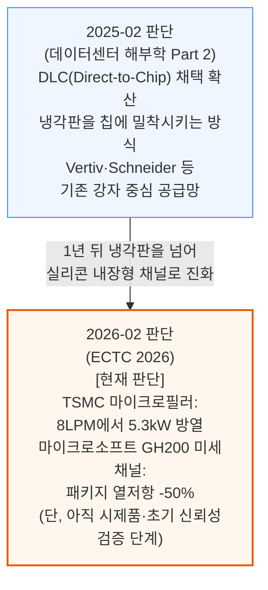

# 냉각(ai-infra/cooling) 통합 리포트

> **생성일**: 2026-07-04
> **최종 갱신일**: 2026-07-12
> **대상 문서**: 2개
> - `[250214]` 데이터센터 해부학 Part 2 - 냉각 시스템 (2025-02-14)
> - `[260205]` ECTC 2026 총정리 - EMIB-T 로드맵, 커스텀 HBM, 마이크로플루이딕 냉각, 광학 인터커넥트 (2026-02-05, 1차 카테고리는 ai-infra/memory — 이 리포트는 마이크로플루이딕 냉각·TIM 섹션만 반영)

---

## 📌 현재 종합 판단

- **랙 레벨 DLC(직접 칩 냉각)에서 칩 내장형 마이크로플루이딕 냉각으로 진화가 진행 중**: 2025년 2월 문서가 정리한 냉각판 기반 DLC 채택 흐름이, 1년 뒤 TSMC·마이크로소프트의 실제 시제품(실리콘에 직접 새긴 냉각 통로)으로 구체화됨 (§1.1, 확신도: 중간)
- **결론**: 아직 문서 2개뿐이라 확신도 있는 종합 판단은 이르지만, "물을 칩에 더 가깝게"라는 방향성 하나는 반복 확인되고 있음 — 마이크로플루이딕 냉각이 실험실 시연을 넘어 실제 배포로 이어지는 속도가 다음 문서에서 확인할 핵심 변수

---

## 📑 목차

1. [시계열 흐름: 반복 등장 주제](#1-시계열-흐름-반복-등장-주제)
2. [다음 확인 포인트](#2-다음-확인-포인트)
3. [문서별 요약](#3-문서별-요약)

---

## 1. 시계열 흐름: 반복 등장 주제

### 1.1 냉각 기술의 진화 - 랙 레벨 DLC에서 칩 내장형 마이크로플루이딕 냉각으로

**확신도: 중간** — 2개 문서가 같은 방향(물을 열원에 더 가깝게)을 다루지만, 다루는 기술 단계가 달라(냉각판 vs 실리콘 내장 채널) 직접적인 수치 재확인은 아님, 최신 데이터포인트 2026-02

2025년 2월 문서는 냉각판을 칩에 최대한 밀착시키는 DLC(Direct-to-Chip 액체냉각) 채택 확산을 다뤘는데, 1년 뒤 ECTC 2026 문서는 냉각판보다 한 단계 더 나아가 냉각수를 실리콘 표면·내부까지 직접 주입하는 마이크로플루이딕 냉각의 실제 시제품 결과를 공개했습니다.

두 문서가 다루는 기술 성숙도 단계가 달라(하나는 이미 상용화된 DLC 공급망, 다른 하나는 실험실 시제품) 같은 수치를 재확인하는 관계는 아니지만, "냉각수를 열원에 더 가깝게 붙인다"는 방향 자체는 일관됩니다. 마이크로플루이딕 냉각이 아직 6개월 신뢰성 데이터(마이크로소프트: 4,370회 관측 중 잠재적 막힘 9건) 단계에 머물러 있어, 실제 양산 배포까지 이어지는지는 다음 문서에서 확인이 필요합니다.

---

## 2. 다음 확인 포인트

- **TSMC 마이크로필러·마이크로소프트 미세채널 냉각의 실제 양산 채택 시점** — 상용 제품에 채택되면 §1.1 확신도 상향(DLC→마이크로플루이딕 전환이 실현), 실험실 단계에 머물면 확신도 유지 또는 하향
- **마이크로소프트 GH200 미세채널의 클러스터 레벨 MTBF(평균 고장 간격) 검증 결과 공개** — ECTC 2026 문서 시점 기준 아직 검증 중이라고 명시됨, 결과가 양호하면 §1.1 방향 강화

---

## 3. 문서별 요약

**[250214] 데이터센터 해부학 Part 2 - 냉각 시스템** (2025-02-14) — L2A·L2L·이머전·투페이즈 등 냉각 방식을 비교하고, Google·Meta·Microsoft·Amazon의 수랭 설계 전략 차이를 다룸. WUE·PUE 지표, Nvidia Rubin 세대의 전력·냉각 아키텍처, DLC(Direct-to-Chip 액체냉각) 채택이 늘어나는 이유와 공급업체 지형(Vertiv·Schneider Electric 등 기존 강자 vs 대만 신규 진입자)을 정리. §1.1 타임라인의 출발점(랙 레벨 DLC 채택 단계).

**[260205] ECTC 2026 총정리 - EMIB-T 로드맵, 커스텀 HBM, 마이크로플루이딕 냉각, 광학 인터커넥트** (2026-02-05, 1차 카테고리는 ai-infra/memory) — 1차 카테고리는 ai-infra/memory이며, 이 리포트에는 마이크로플루이딕 냉각·열계면 소재(TIM) 섹션만 반영. TSMC가 CoWoS-R 시험차량 실리콘 배면에 미세기둥(마이크로필러)을 직접 형성해 8LPM에서 5.3kW를 방열했고, 마이크로소프트는 실제 엔비디아 GH200 GPU에 미세채널을 식각해 패키지 열저항을 50% 낮추면서 6개월 신뢰성 데이터(막힘 9건/4,370회 관측)까지 공개. 갈륨 기반 액체금속(LM) TIM과 나노결정 다이아몬드 접합 등 열계면 소재 신기술도 함께 다룸. §1.1 타임라인의 최신 데이터포인트(칩 내장형 마이크로플루이딕 냉각 단계).

---

*리포트 생성 규칙: REPORT_RULES.md 참고*
