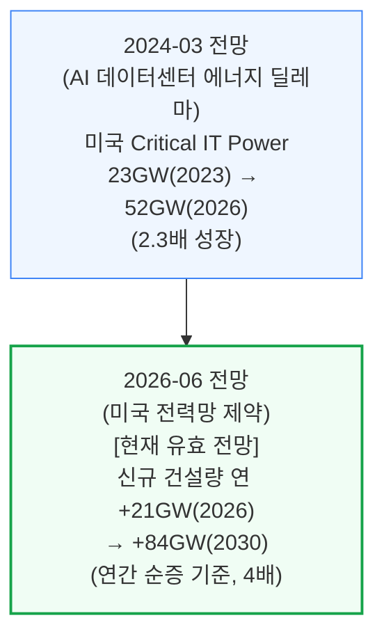
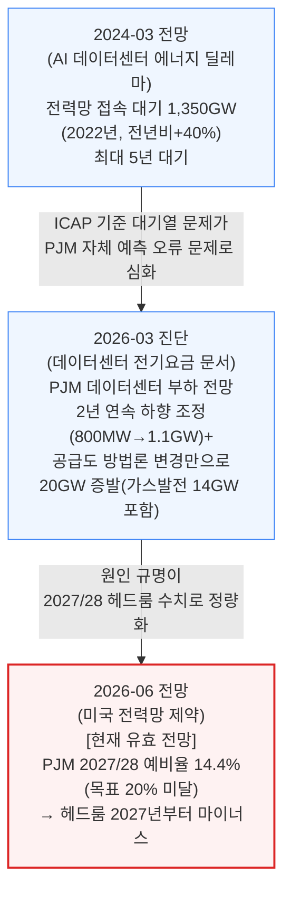
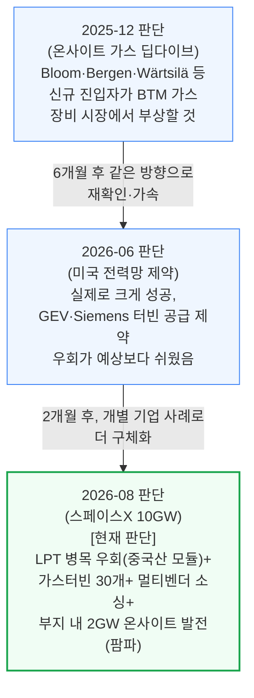
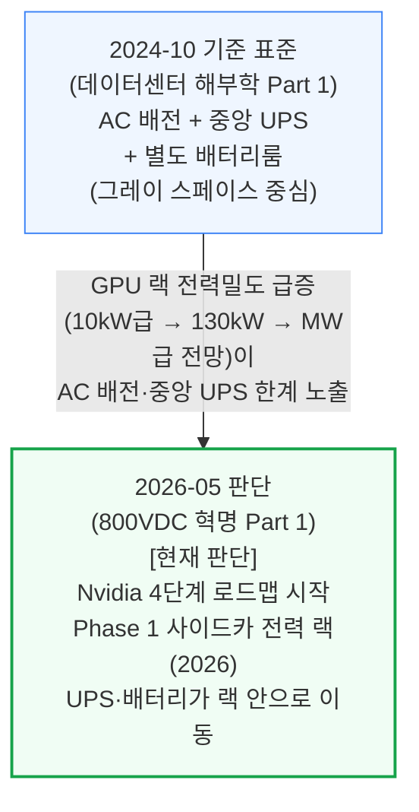
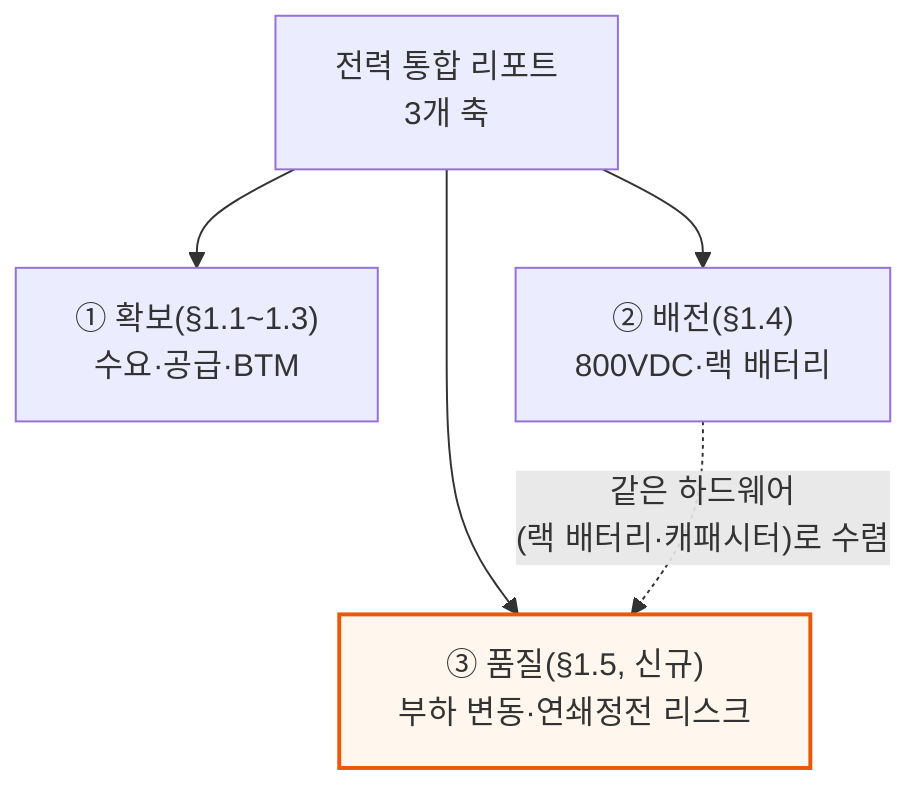

# 전력(ai-infra/power) 통합 리포트

> **생성일**: 2026-07-04
> **최종 갱신일**: 2026-08-17
> **대상 문서**: 9개
> - `[240314]` AI 데이터센터 에너지 딜레마 - AI 데이터센터 공간 확보 경쟁 (2024-03-14)
> - `[241014]` 데이터센터 해부학 Part 1 - 전기 시스템 (2024-10-14)
> - `[250625]` 기가와트급 AI 학습 부하 변동 - 전력망 정전을 부를 수 있는가 (2025-06-25)
> - `[251231]` AI 랩들은 어떻게 전력난을 해결하는가 - 온사이트 가스 딥다이브 (2025-12-31)
> - `[260303]` 데이터센터가 미국 가정의 전기요금을 올리는가 (2026-03-03)
> - `[260526]` 800VDC 혁명 Part 1 - 전력 배전 아키텍처의 대전환 (2026-05-26)
> - `[260619]` 2026년 미국 데이터센터 용량 절반 취소설은 틀렸다 (2026-06-19)
> - `[260626]` 미국 전력망 제약 - 2028년까지 40GW+ 자가발전 데이터센터로 가는 길 (2026-06-26)
> - `[260807]` 스페이스X 2027년 10GW 베팅 - 마이크로소프트가 최대 고객이 되는 이유 (2026-08-07)

---

## 📌 현재 종합 판단

- **수요는 계속 가속**: 미국 데이터센터 신규 건설량이 연 +21GW(2026) → +84GW(2030)로 가속하는 방향이 유지됨 (§1.1, 확신도: 높음)
- **그리드는 구조적 공급 부족**: 대기열 문제(2024)에서 예비율 적자 진단(2026)으로 심화 — 그리드 연결만 기다리는 전략은 갈수록 불리 (§1.2, 확신도: 높음). 2026-03 문서는 그 예비율 위기의 메커니즘을 규명 — PJM 용량가격 9.3배 급등은 실물 수급이 아니라 PJM 자체 시뮬레이션(VRR 곡선)이 만든 결과이고, 같은 수요 증가를 겪은 ERCOT는 용량 경매 자체가 없어 요금이 대체로 안정적이었음 — "AI가 요금을 올린다"가 아니라 "시장 설계가 AI발 수요를 요금으로 전환하는 방식을 결정한다"는 인과관계가 명확해짐
- **BTM 자가발전이 주류화**: 온사이트 가스 방향이 6개월 만에 재확인·가속, 신규 진입자(Bloom 등)의 터빈 공급 제약 우회가 예상보다 쉬웠음 — "그리드 직접 지불·전력 딸린 땅·BTM" 3갈래 병행과 장비(선확보·중국산 OEM·모듈러) 3가지 적응이 지난 12개월 새 표준 관행으로 정착했다는 근거가 추가 확인됨. 2026-08 스페이스X 사례는 이 방향을 기업 단위 실행 각본(LPT 우회·멀티벤더 가스터빈 소싱·부지 내 2GW 온사이트 발전)으로 한층 더 구체화 (§1.3, 확신도: 높음)
- **"용량 절반 취소" 헤드라인은 파이프라인 실체와 괴리**: 취소·지연은 부지·전원·인허가 관문을 통과하지 못한 초기 발표 단계에 집중되며, 이 계층은 SemiAnalysis 모델이 이미 구조적 공급 과잉으로 낮게 처리해온 부분 — 장비 공급사(Vertiv·Schneider) 마진 20%+·리드타임 3\~4년 등 수주 잔고 지표도 실제 인도량 가속과 함께 견조함 (신규 관점, 확신도: 중간 — 단일 문서지만 §1.3 흐름과 동일 방향)
- **새 축 — 전력 배전 아키텍처 전환 시작**: Nvidia 주도로 AC·중앙 UPS 아키텍처가 800VDC·랙 배터리로 옮겨가는 4단계 로드맵이 시작 — 지출 총량은 유지되며 그레이 스페이스(UPS·PDU) → 화이트 스페이스(전력 랙·랙 배터리)로 가치 이동 (§1.4, 확신도: 중간 — 단일 문서, Phase 1 초기)
- **새 축 — AI 학습 부하 변동이 전력망 연쇄정전으로 번질 수 있는 구체 임계선 확인**: 2025-06 문서가 ERCOT의 실제 모델링(서부 텍사스 2\~2.5GW 동시 이탈 시 연쇄정전 위험)을 통해 "확보"·"배전" 축과는 별개인 세 번째 축(전력 "품질")을 제시 — 800VDC 전환(§1.4)에서 다루는 랙 배터리·캐패시터가 이 문제의 하드웨어 해법과 정확히 겹쳐, 두 축이 같은 물리적 장비(랙 레벨 배터리·캐패시터)를 놓고 수렴하고 있음이 확인됨 (§1.5, 확신도: 중간 — 단일 문서, ERCOT 공개 모델링 기반)
- **결론**: 전력 "확보"(BTM 발전)와 전력 "배전"(800VDC) 양쪽에서 기존 그레이 스페이스 장비 벤더로부터 화이트 스페이스 벤더(Delta·Vertiv·Panasonic 등)로 가치가 이동하는 방향에 확신도가 쌓이고 있음

---

## 📑 목차

1. [시계열 흐름: 반복 등장 주제](#1-시계열-흐름-반복-등장-주제)
2. [다음 확인 포인트](#2-다음-확인-포인트)
3. [문서별 요약](#3-문서별-요약)

---

## 1. 시계열 흐름: 반복 등장 주제

### 1.1 미국 데이터센터 전력 수요 증가 속도

**확신도: 높음** — 2개 문서가 같은 방향(가속)을 재확인, 최신 데이터포인트 2026-06

측정 기준이 "누적 용량 전망"에서 "연간 신규 건설량"으로 세분화됐지만, 증가 속도 자체는 계속 가속하는 방향으로 일관됩니다.

### 1.2 그리드 연결의 신뢰성: 대기 물량에서 헤드룸 적자로

**확신도: 높음** — 3개 문서에서 진단이 같은 방향으로 심화(대기열 → 예측 오류 원인규명 → 예비율 적자), 최신 데이터포인트 2026-06

2024년에는 "얼마나 기다려야 하는가"가 문제였다면, 2026년 초에는 "PJM의 수급 예측 자체가 매년 틀린다"는 원인 규명이, 2026년 중반에는 "애초에 공급 자체가 부족해진다"는 정량화된 진단으로 발전했습니다.

### 1.3 BTM(자가발전) 확산 — 같은 방향이 재확인·가속

**확신도: 높음** — 3개 문서가 2개월\~6개월 간격으로 같은 방향을 재확인·가속, 최신 데이터포인트 2026-08

2025년 말 온사이트 가스 딥다이브가 짚은 방향을, 반년 뒤 전력망 제약 리포트가 더 구체적인 수치로 재확인하고, 다시 2개월 뒤 스페이스X 문서가 개별 기업의 실행 각본으로 구체화합니다. **이 방향에 대한 확신도가 올라갔다는 뜻이지, "누가 맞혔나"를 채점하려는 게 아닙니다** — 지금 시점에 BTM 쪽에 베팅하는 판단의 근거가 두터워지고 있다는 게 핵심입니다.

같은 방향을 뒷받침하는 보강 자료로, [260619](2026-06-19, 미국 전력망 제약 발행 직전)는 "그리드에 직접 지불·전력 딸린 땅 매매·BTM 전환"이라는 3갈래 병행 전략과, 변압기·중저압 배전반 선확보·중국산 OEM 편입·모듈러 시공이라는 장비 측 3가지 적응이 지난 12개월 새 예외적 사례에서 표준 관행으로 자리잡았음을 확인합니다. [260807](2026-08-07, 스페이스X 10GW)은 이 적응 방식을 한 기업의 실제 각본으로 보여주는 사례로, 대형 전력변압기(LPT) 품절을 중국산 전력 모듈+저전압 직접 변환으로 우회하고, 가스터빈 공급 지연은 30개 넘는 대체 제조사로, 그리드 연결 지연은 텍사스 팜파 부지의 2GW 온사이트 발전 계획으로 각각 우회하는 방식을 보여줍니다.

### 1.4 전력 배전 아키텍처: 중앙 UPS·AC에서 800VDC·랙 배터리로

**확신도: 중간** — 단일 문서 기반이나 Nvidia 로드맵·OCP 규격 등 정량 근거 구체적, 최신 데이터포인트 2026-05

Nvidia가 주도하는 800VDC 전환은 기존 AC 배전 + 중앙 UPS 아키텍처를 800VDC + 랙 배터리 구조로 옮기는 변화입니다. 전기 설비 지출 총량(MW당 약 370만\~400만 달러)은 유지되면서, 그레이 스페이스(중앙 UPS·PDU)에서 화이트 스페이스(전력 랙·랙 배터리)로 가치가 이동합니다.

### 1.5 AI 학습 부하 변동과 연쇄정전 리스크 — 세 번째 축(전력 "품질")

**확신도: 중간** — 단일 문서, ERCOT 공개 모델링·회의록 기반 정량 근거, 데이터포인트 2025-06(원문 발행 기준 코퍼스 내 가장 이른 시점)

기존 §1.1\~1.4가 전력 "확보"(수요·공급·BTM)와 "배전"(800VDC 아키텍처) 축을 다뤘다면, 이 문서는 AI 학습 특유의 부하 변동(밀리초\~수초 단위 출렁임)이 전력망 "품질"·안정성 자체를 위협한다는 세 번째 축을 제시합니다. ERCOT의 2025년 5월 자체 모델링은 서부 텍사스에서 2\~2.5GW 규모 데이터센터가 동시에 전력망 이탈(저전압 통과, LVRT 실패)하면 2025년 4월 이베리아 반도 정전(2.2GW 이탈, 27초 만에 붕괴)과 같은 경로로 연쇄정전이 시작될 수 있다고 진단합니다.

§1.4가 다루는 800VDC 전환의 "정류기 랙"(배터리+슈퍼캐패시터)이 바로 이 문서가 제시하는 해법(랙 레벨 캐패시터 뱅크·리튬이온 캐패시터)과 동일한 하드웨어입니다. 즉 배전 축의 화이트 스페이스 전환과 품질 축의 부하 변동 대응이 같은 부품을 놓고 수렴하고 있다는 뜻으로, Delta·Vertiv 같은 화이트 스페이스 벤더의 수혜 논리가 두 축에서 이중으로 뒷받침됩니다. 이 문서는 또한 테슬라 메가팩(BESS) economics를 구체적으로 정량화(100MW 4시간 배터리 기준 7,600만\~1억 5,700만 달러, GW급 데이터센터 기준 거의 10억 달러)해, 향후 BTM(§1.3)·배전(§1.4) 축 문서에서 BESS 관련 수치가 등장할 때 대조군으로 쓸 수 있습니다.

---

## 2. 다음 확인 포인트

- **PJM 차기 용량 경매 결과·예비율 발표** — 예비율 적자 전망이 실측으로 확인되면 §1.2 강화, 완화되면 약화
- **ERCOT Batch Zero 후속 배치 규모** — BTM 하이브리드 접속 물량이 커지면 §1.3 강화
- **가스터빈 리드타임(GEV·Siemens) 변화와 Bloom 등 신규 진입자 수주 발표** — 공급 제약 우회가 계속 쉬우면 §1.3 강화
- **스페이스X 텍사스 팜파(2GW) 온사이트 발전 계획 공식 확인 여부** — [260807]이 명시한 확인 포인트. 공개 문서로 확정되면 §1.3 강화, 무산되면 개별 기업 사례로서의 신뢰도 약화
- **Nvidia Kyber 세대(Phase 2, 2027년경) 실배치와 OCP Diablo 400 규격 확정** — 일정대로 진행되면 §1.4를 중간→높음으로 상향 가능
- **Delta·Vertiv의 HVDC 전력 랙 수주·매출 공개** — 화이트 스페이스 가치 이동이 실적으로 확인되면 §1.4 강화
- **2026년 3분기 장비 리드타임 OEM 코멘트리** — [260619]가 명시한 확인 포인트. 안정화가 계속되면 "용량 절반 취소" 반박 판단 강화, "장비 절벽"이 현실화되면 약화
- **주(州) 단위 데이터센터 모라토리엄 확산 여부(펜실베이니아 3년 유예 등 12개 주 법안)** — [260619]가 명시한 확인 포인트. 단일 주(州)라도 전면 시행되면 건설 가능 지도 자체가 좁아지는 선례가 됨
- **Oracle/STACK 뉴멕시코(Project Jupiter) 가스관 인허가 진행 상황** — [260619] 기준 첫 전력 공급이 2027년→2029년으로 밀린 사례, 재인허가·대체 노선 확정 여부로 지연 규모 재확인
- **ERCOT의 UPS 재프로그래밍·GRL(보장된 신뢰성 부하) 계약 표준화 여부** — [250625]가 명시한 확인 포인트. 표준 계약으로 자리잡으면 §1.5 강화, 개별 협상에 머물면 연쇄정전 리스크가 그대로 남음
- **오픈AI 핵심 학습 캠퍼스 기가와트급 도달(2026년 중반 전망) 및 서부 텍사스 데이터센터 부하의 10GW 돌파 시점** — [250625]가 명시한 확인 포인트, 실현되면 §1.5의 서부 텍사스 2\~2.5GW 임계선 논의의 긴급성이 높아짐
- **PJM 2028/29년 BRA 경매에서 가격상한이 유지되는지, VRR 곡선 방법론이 실제로 개정되는지** — [260303]이 명시한 확인 포인트. 방법론이 그대로면 §1.2의 예비율 적자 진단이 계속 시뮬레이션 오차에 취약한 채로 남음
- **텍사스 SB6(대형부하 차단 권한)가 실제 발동된 사례가 나오는지** — [260303]이 명시한 확인 포인트. 실제 발동되면 ERCOT의 요금 안정성이 규제 대응력 덕분이라는 §1.2 확장 판단이 강화됨
- **PJM이 겨울폭풍 펀 이후 발전설비 방한을 의무화하는 규정을 신설하는지** — [260303]이 명시한 확인 포인트. 신설되면 §1.2의 "용량 요금을 냈지만 신뢰성을 사지 못했다"는 진단이 개선 방향으로 전환

---

## 3. 문서별 요약

**[240314] AI 데이터센터 에너지 딜레마** (2024-03-14) — AI 데이터센터 전력 수요를 둘러싼 비관론(2030년 전세계 발전량 24%)과 SemiAnalysis 자체 전망(4.5%)을 실측 데이터로 비교하고, Critical IT Power/PUE 계산법과 국가별(미국·일본·중국·유럽·중동) 전기요금·전원 믹스·탄소집약도를 비교. 전력 인프라 시리즈의 기초 진단 문서.

**[241014] 데이터센터 해부학 Part 1 - 전기 시스템** (2024-10-14) — 예측·전망 문서가 아니라 데이터센터 전기 시스템 자체의 구조(UPS, 변압기, 발전기, Tier 등급, N+1/2N 이중화 전략)를 다루는 기초 참고 자료. 시계열 비교 대상이 아니라 용어·개념의 배경지식으로 활용.

**[250625] 기가와트급 AI 학습 부하 변동 - 전력망 정전을 부를 수 있는가** (2025-06-25) — 코퍼스 내 전력 카테고리 문서 중 가장 이른 시점(2025-06) 발행. AI 학습 특유의 부하 변동(밀리초\~수초 단위 출렁임)이 전력망 관성·저전압 통과(LVRT) 대응력을 넘어서는 문제를 전력 품질 기초부터 짚고, ERCOT의 2025년 5월 모델링(서부 텍사스 2\~2.5GW 동시 이탈發 연쇄정전 시나리오)을 2025년 4월 이베리아 반도 정전 사례와 대조. 해법으로 테슬라 메가팩(BESS)·수요반응·랙 레벨 캐패시터·UPS 재설계(GRL 계약)를 검토, §1.4(800VDC 전환)의 랙 배터리·캐패시터 하드웨어와 정확히 겹치는 세 번째 축(전력 "품질")을 §1.5로 신설.

**[251231] AI 랩들은 어떻게 전력난을 해결하는가 - 온사이트 가스 딥다이브** (2025-12-31) — 그리드를 우회하는 BYOG(자가 발전) 전략의 부상을 다루며, 터빈·RICE·연료전지 등 발전 기술을 비교하고 Bloom Energy 등 신규 진입자의 성장을 예측. 이 예측은 §1.3에서 후속 문서로 확인됨.

**[260303] 데이터센터가 미국 가정의 전기요금을 올리는가** (2026-03-03) — PJM(용량 시장·BRA 경매·VRR 곡선 시뮬레이션)과 ERCOT(용량 경매 없는 에너지 온리 시장·ORDC 희소성 가격)의 시장 설계 차이가 2025\~2026년 요금 격차의 원인임을 실증. PJM 2025/26년 BRA 청산가 9.3배 급등(160억 달러) 중 IMM 분석 기준 데이터센터 부하 기여분이 최대 64%로 추정되지만, 그 경매 자체가 PJM 내부 예측(2024\~2025년 2년 연속 하향 조정)에 기반한 시뮬레이션이라는 근본 취약점을 지적. 겨울폭풍 펀(2026-01) 실전 테스트에서 ERCOT 무사·PJM 21GW 발전 이탈로 "비싼 신뢰성이 실제 신뢰성으로 이어지지 않았다"는 대조를 확인하고, 정치적 후폭풍(FERC 제소·가격상한)과 규제 비대칭(텍사스주 단독 관할 vs PJM 13개 주+FERC)까지 다룸. §1.2(그리드 헤드룸 적자)의 원인 규명 단계로 확장.

**[260526] 800VDC 혁명 Part 1 - 전력 배전 아키텍처의 대전환** (2026-05-26) — Nvidia가 주도하는 데이터센터 전력 배전의 AC → 800VDC 전환을 4단계 로드맵(① 사이드카 전력 랙 → ② 네이티브 800VDC 컴퓨트 → ③ 시설 중앙 정류 → ④ SST)으로 분석. 전기 설비 지출 총량(MW당 약 370만\~400만 달러)은 유지되면서 그레이 스페이스(중앙 UPS·PDU)에서 화이트 스페이스(전력 랙·랙 배터리)로 가치가 이동함을 정량화하고, 공급사 지형(Delta·Vertiv·Panasonic 등 수혜 vs Legrand·Eaton 등 리스크)까지 정리.

**[260619] 2026년 미국 데이터센터 용량 절반 취소설은 틀렸다** (2026-06-19) — "2026년 미국 데이터센터 용량 절반이 취소·지연"이라는 블룸버그발 헤드라인 주장을 반박. 지연을 3가지 유형(신생 개발사 과장 발표·경험 부족 개발사의 낙관적 일정·인허가/NIMBY)으로 구분하고, 실제 취소는 부지·전원·인허가 관문을 통과하지 못한 초기 발표 단계(구조적 공급 과잉 계층)에 집중됨을 실증. 선두 운영사의 정치적·물리적 제약 돌파 플레이북과 장비 공급사(Vertiv·Schneider 마진 20%+) 수주 잔고가 견조함을 함께 제시, §1.3(BTM 확산)과 같은 방향을 보강.

**[260626] 미국 전력망 제약 - 2028년까지 40GW+ 자가발전 데이터센터로 가는 길** (2026-06-26) — 미국 그리드 공급이 구조적으로 제약되는 이유(ELCC, ICAP/UCAP 헤드룸)를 정량 분석하고, BTM이 그리드 연결을 이기는 이유와 ERCOT Batch Zero 하이브리드 구조, 승자·패자 지형까지 다룸.

**[260807] 스페이스X 2027년 10GW 베팅 - 마이크로소프트가 최대 고객이 되는 이유** (2026-08-07) — 현재 코퍼스에서 가장 최신 문서. 스페이스X가 2027년 한 해에만 6\~8GW(최대 10GW+) 데이터센터를 지을 수 있다고 보는 근거(추론 매출 경제성, 마이크로소프트의 컴퓨트 수요, 자금조달)를 다루면서, 대형 전력변압기(LPT) 품절을 중국산 전력 모듈로, 가스터빈 리드타임 지연을 30개 넘는 대체 제조사로, 그리드 연결 지연을 텍사스 팜파 부지의 2GW 온사이트 발전 계획으로 우회하는 실제 각본을 제시. §1.3(BTM 확산)의 일반론을 기업 단위 실행 사례로 구체화.

---

*리포트 생성 규칙: REPORT_RULES.md 참고*
