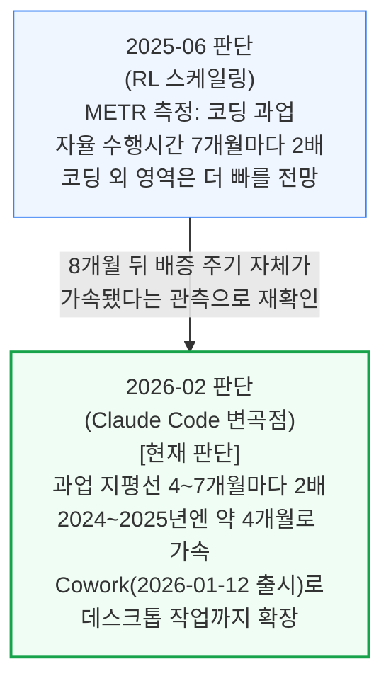
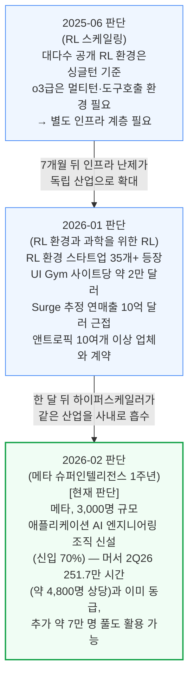
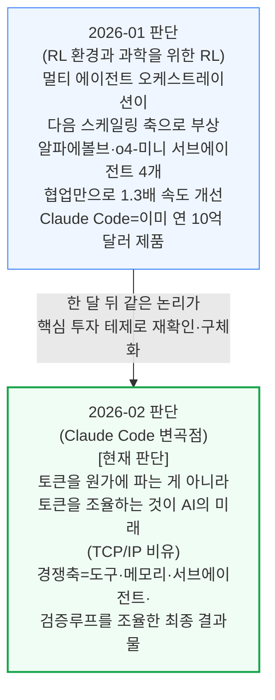
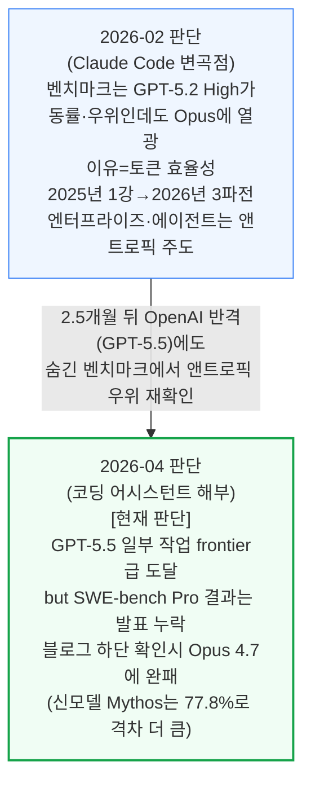
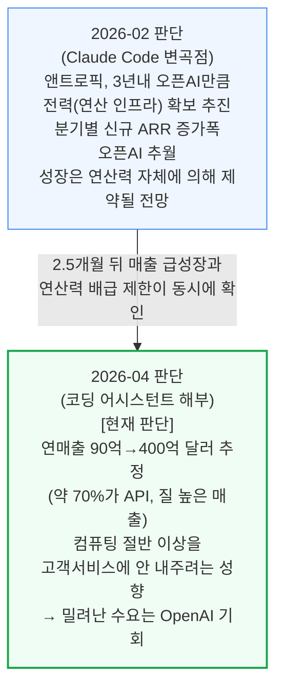
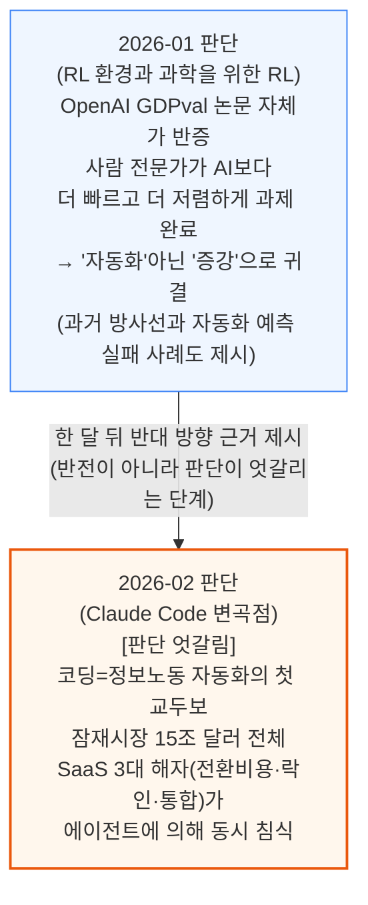

# AI 모델(ai-models/agents, ai-models/rl) 통합 리포트

> **생성일**: 2026-07-11
> **최종 갱신일**: 2026-07-13
> **대상 문서**: 5개
> - `[250609]` 강화학습(RL) 스케일링 - 환경, 보상 해킹, 에이전트, 데이터 스케일링 (2025-06-09, 1차 카테고리는 ai-models/rl)
> - `[260107]` RL 환경과 과학을 위한 RL - 데이터 파운드리와 멀티 에이전트 아키텍처 (2026-01-07, 1차 카테고리는 ai-models/rl)
> - `[260206]` Claude Code, 에이전트 시대의 변곡점 (2026-02-06, 1차 카테고리는 ai-models/agents)
> - `[260205]` 메타 슈퍼인텔리전스의 미래 - 출범 1주년 성과 점검 (2026-02-05, 1차 카테고리는 ai-infra, 2차 카테고리 ai-models/rl)
> - `[260425]` 코딩 어시스턴트 해부 - 토큰을 더 주세요 (2026-04-25, 1차 카테고리는 ai-models/agents)

---

## 📌 현재 종합 판단

- **에이전트의 자율 작업 지속시간(과업 지평선) 배증 속도 자체가 가속 중**: 2025년 6월 "7개월마다 2배" 관측이 8개월 뒤 "4\~7개월마다 2배, 2024\~2025년엔 약 4개월로 가속"으로 재확인·가속 (§1.1, 확신도: 높음)
- **RL 환경 구축은 인프라 난제에서 독립 산업으로 성장, 이제는 하이퍼스케일러도 사내 자체 조달로 진입**: 2025년 중반 "별도 인프라 계층이 필요한 난제"였던 것이 반년 뒤 35개 이상의 전문 스타트업과 연매출 1억 달러급 데이터 계약업체(머서·서지·핸드셰이크)가 등장한 산업으로 확대됐고, 한 달 뒤 메타가 3,000명 규모 사내 조직으로 이 산업과 맞먹는 데이터 생산을 자체 조달하기 시작 (§1.2, 확신도: 높음)
- **멀티 에이전트 오케스트레이션이 차세대 스케일링 축으로 자리잡는 중**: 2026년 1월 "다음 스케일링 축"으로 제시된 논리가 한 달 뒤 Claude Code의 핵심 투자 테제("토큰을 조율하는 것이 AI의 미래")로 재확인·구체화 (§1.3, 확신도: 높음)
- **코딩 에이전트 경쟁에서 앤트로픽의 토큰 효율성 우위는 OpenAI의 반격에도 유지**: 2026년 2월 "토큰 효율성이 승부처"라는 진단이, 2.5개월 뒤 OpenAI의 신형 GPT-5.5 출시에도 숨긴 벤치마크(비공개 SWE-bench Pro 결과)에서 Opus 4.7에 완패한 사실로 재확인 (§1.4, 확신도: 높음)
- **앤트로픽 매출 급성장은 연산력 확보 속도에 의해 제약된다는 진단이 실제 매출·배급 데이터로 재확인**: "성장은 연산력 자체에 제약된다"는 2월 판단이, 2.5개월 뒤 매출 급성장(90억→400억 달러 추정)과 동시에 나타난 연산력 배급 제한으로 뒷받침됨 — 다만 이 배급 제한이 밀려난 수요를 OpenAI로 넘길 여지도 함께 확인 (§1.5, 확신도: 높음)
- **"자동화냐 증강이냐"는 코퍼스 내에서 방향이 엇갈림**: 2026년 1월 문서는 GDPval 반증 사례(사람 전문가가 AI보다 빠르고 저렴)를 들어 "증강"에 무게를 뒀지만, 한 달 뒤 문서는 "코딩은 15조 달러 정보노동 전체 자동화의 첫 교두보"라는 낙관론과 SaaS 해자 침식론을 제시해 판단이 아직 정리되지 않음 (§1.6, 확신도: 낮음)
- **결론**: 에이전트 인프라(과업 지평선·RL 환경·오케스트레이션)가 얼마나 빠르게, 어떤 방향으로 성장하는지에 대해서는 코퍼스 내에서 반복·가속 확인되어 확신도가 높지만, "이 성장이 실제로 사람 노동을 대체하는가(자동화 vs 증강)"와 "최종 승자가 누구인가(앤트로픽 vs OpenAI, 다만 후자는 방향 자체는 유지)"는 여전히 지켜봐야 할 변수

---

## 📑 목차

1. [시계열 흐름: 반복 등장 주제](#1-시계열-흐름-반복-등장-주제)
2. [다음 확인 포인트](#2-다음-확인-포인트)
3. [문서별 요약](#3-문서별-요약)

---

## 1. 시계열 흐름: 반복 등장 주제

### 1.1 에이전트 과업 지평선(자율 작업 시간) 배증 가속 — METR

**확신도: 높음** — 2개 문서가 같은 방향(배증 주기 가속)을 재확인, 최신 데이터포인트 2026-02

METR(모델 평가·위협 연구 기관)이 측정하는 "에이전트가 실패 없이 혼자 처리할 수 있는 작업 시간"은 2025년 6월 문서에서 "7개월마다 2배"로 관측됐고, 8개월 뒤 문서는 이 주기 자체가 더 짧아졌다고 재확인합니다.

두 시점 모두 "숫자가 커지는 것"보다 "속도가 빨라지는 것"에 방점을 둡니다. 2025년 6월 문서가 예상한 "코딩 외 영역이 더 빠르게 늘어날 것"이라는 부분은, 2026년 2월 문서의 Cowork(2026-01-12 출시, 엔지니어 4명이 10일 만에 개발)로 실제 확장이 시작됐습니다.
이는 서로 다른 지표(7개월 vs 4\~7개월)의 충돌이 아니라, 관측 시점이 늦어질수록 같은 현상(자율성 확장)이 더 빠르게 벌어지고 있다는 시계열 가속으로 해석됩니다.

### 1.2 RL 환경·데이터 파운드리 산업화

**확신도: 높음** — 3개 문서가 같은 방향(환경 구축의 산업화, 이어서 하이퍼스케일러의 자체 조달 진입)을 재확인, 최신 데이터포인트 2026-02

2025년 6월 문서는 RL 환경 구축을 "인프라 엔지니어링이 성패를 가르는 난제"로 다뤘습니다. 7개월 뒤 문서는 이 난제를 해결해주는 전문 산업 자체가 이미 형성됐다고 보고하고, 한 달 뒤 문서는 메타가 이 산업과 맞먹는 규모를 사내에서 직접 조달하기 시작했다고 전합니다.

2025년 문서가 예견한 "대부분 CPU 전용 서버라 별도 인프라 계층이 필요하다"는 진단은, 2026년 1월 문서에서 HUD·Habitat·Fleet 등 환경 전문 스타트업과 머서·핸드셰이크·서지 같은 도메인 전문가 채용 대행업체로 구체화됐습니다. 스케일AI가 메타에 인수되며 생긴 공백을 이 신생 업체들이 메우는 구도도 확인됩니다.
한 달 뒤인 2026년 2월 문서는 이 산업화 흐름에 새로운 갈래를 더합니다 — 데이터 회사를 거치지 않고 하이퍼스케일러가 사내 인력을 직접 RL 데이터 생산에 투입하는 사례입니다. 메타는 투자은행·법무법인·광고대행사 등 다른 업종과 제휴해야 하는 전문 데이터 회사와 달리, 해당 업종 인력을 이미 사내에 대규모로 보유하고 있어 이 흡수가 가능했습니다.
이는 §1.2의 "산업화" 방향을 부정하는 신호가 아니라, 그 산업이 성숙해질수록 큰 하이퍼스케일러가 자체 내재화로 대응하는 다음 국면이 시작됐다는 신호로 해석됩니다.

### 1.3 멀티 에이전트 오케스트레이션 — 차세대 스케일링 축

**확신도: 높음** — 2개 문서가 한 달 간격으로 같은 방향(오케스트레이션이 핵심 경쟁축)을 재확인, 최신 데이터포인트 2026-02

2026년 1월 문서는 여러 모델을 조율해 하나의 문제를 풀게 하는 방식을 "다음 스케일링 축"으로 지목했고, 한 달 뒤 문서는 이 논리를 Claude Code의 존재 이유 자체로 재확인합니다.

2026년 1월 문서가 "모델 하나를 반복문(for loop)에서 돌리는 것과 크게 다르지 않은 원시적 단계"라고 낮춰본 멀티 에이전트 구조는, 한 달 뒤 문서에서 "경쟁의 축이 최종 결과물 자체로 이동"했다는 훨씬 확신에 찬 표현으로 바뀝니다.
두 문서 모두 Claude Code를 이 논리의 실증 사례(연 매출 10억 달러 규모 제품)로 공통 인용합니다.

### 1.4 앤트로픽 vs OpenAI 코딩 에이전트 경쟁 구도

**확신도: 높음** — 2개 문서가 같은 방향(앤트로픽 우위 유지)을 재확인, 최신 데이터포인트 2026-04

2026년 2월 문서는 벤치마크 점수가 아니라 토큰 효율성이 앤트로픽 우위의 진짜 이유라고 진단했습니다. 2.5개월 뒤 문서는 OpenAI의 반격(GPT-5.5)에도 이 우위가 유지된다는 증거를 제시합니다.

2026년 4월 문서는 GPT-5.5가 "나쁜 모델이 아니"라는 점도 함께 확인합니다 — 실사용 비교에서 코덱스는 PR 리뷰·버그 헌팅에 강점을 보였고, SemiAnalysis 자체 하네스 측정에서는 코덱스의 과제당 비용이 오히려 저렴한 것으로 잠정 확인됐습니다.
다만 OpenAI가 자사 발표에서 SWE-bench Pro를 빼고 낯선 지표("Expert-SWE")만 제시한 뒤, 블로그 맨 아래에서야 Opus 4.7에 완패한 수치가 드러난 정황은 앤트로픽 우위가 아직 꺾이지 않았다는 신호로 해석됩니다.

### 1.5 코딩 에이전트 매출 구조 — 연산력이 매출 성장의 병목

**확신도: 높음** — 2개 문서가 같은 방향(연산력 제약이 실제 매출 구조에 반영)을 재확인, 최신 데이터포인트 2026-04

2026년 2월 문서는 앤트로픽의 성장이 "결국 연산력 자체에 의해 제약될 것"이라 전망했습니다. 2.5개월 뒤 문서는 이 전망이 실제 매출 급성장과 동시에 나타난 연산력 배급 제한으로 구체화됐다고 보고합니다.

두 문서를 합쳐 보면 "연산력 확보가 곧 매출"이라는 인과관계가 일관되게 유지됩니다 — 2월 문서는 이를 Tokenomics 모델 추정치(분기별 ARR 증가폭에서 오픈AI 추월)로 제시했고, 4월 문서는 실제 매출 규모(90억→400억 달러 추정)로 재확인합니다.
다만 앤트로픽이 컴퓨팅 절반 이상을 고객 서비스에 내주지 않으려는 배급 정책이 밀려난 수요를 OpenAI로 넘겨줄 가능성도 4월 문서에서 새로 지적돼, §1.4의 "앤트로픽 우위"와는 별개로 성장 속도 자체엔 물리적 한계가 있다는 점이 함께 드러납니다.

### 1.6 에이전트 자동화 범위 — 자동화냐 증강이냐

**확신도: 낮음** — 방향이 문서 간에 엇갈림(반전은 아니나 판단이 정리되지 않음), 최신 데이터포인트 2026-02

2026년 1월 문서는 AI가 사람 노동을 그대로 "자동화"하기보다 "증강"에 그칠 것이라는 신중론을 구체적 반증 사례로 제시했습니다. 그런데 한 달 뒤 문서는 코딩을 시작으로 정보노동 경제 전체가 자동화 대상이 될 수 있다는 훨씬 낙관적인(혹은 위협적인) 시각을 폅니다.

이 엇갈림은 "누가 맞았는가"의 문제가 아니라 서로 다른 각도를 비추고 있을 가능성이 큽니다 — 2026년 1월 문서의 GDPval 반증은 "단일 턴(1회 지시) 과제에서 사람 대비 속도·비용 우위가 아직 없다"는 개별 과제 단위 관찰입니다.
반면 2026년 2월 문서의 SaaS 해자 침식론은 "워크플로우 전체를 에이전트가 대신 조율하면 소프트웨어 자체가 필요 없어진다"는 구조적 관찰이라, 두 관찰이 동시에 참일 수 있어 확신도를 낮게 매겼습니다.

---

## 2. 다음 확인 포인트

- **앤트로픽 약 3,500억 달러 규모 밸류에이션 라운드 완료 여부** (`[260206]` 9절) — 완료되고 실제 자금이 기가와트급 전력 확보에 투입되는 정황이 확인되면 §1.5(연산력이 매출 병목) 확신도 강화, 자금 조달이 지연되면 성장 제약이 더 오래갈 신호
- **앤트로픽 차세대 모델(문서상 "Mythos") 공식 공개 및 실사용 벤치마크** (`[260425]` 7절, 원문 표현: "다만 Mythos 공개 이후에도 이 구도가 유지될지는 미지수") — 공개 후에도 Opus 4.7 대비 우위가 유지되면 §1.4 확신도 강화, OpenAI가 따라잡으면 §1.4 방향 재검토 필요
- **2026년 말 GitHub 공개 일일 커밋 중 Claude Code 작성 비중 20%+ 도달 여부** (`[260206]` 1절, 현재 4%에서 전망) — 도달 시 §1.1·§1.3(에이전트 확산 가속)의 확신도 강화, 미달 시 도입 속도가 예상보다 느리다는 신호
- **OpenAI "2028년 3월까지 자율 AI 연구자 확보" 목표 진행 상황** (`[260107]` 1절) — 중간 마일스톤이 공개되면 §1.3(오케스트레이션 스케일링) 확신도에 영향
- **앤트로픽 "2027년까지 클로드가 수년 걸릴 과학적 발견을 자율적으로 수행" 목표 진행 상황** (`[260107]` 1절) — 목표에 근접하는 구체 사례가 공개되면 §1.2·§1.3 확신도 강화
- **딥마인드 2026년 자동화 소재과학 연구소 실제 출범 및 초기 성과** (`[260107]` 9절) — 출범·성과가 확인되면 §1.2("RL 환경이 물리적 세계로 확장")의 방향 강화
- **메타 뮤즈 스파크(Muse Spark)가 2026년 말까지 앤트로픽·오픈AI와 동등한 수준에 도달하는지 여부** (`[260205]` 7절) — 도달하면 메타의 3,000명 RL 데이터 조직·5대 타이탄 컴퓨트 투자가 실제 모델 성능으로 전환됐다는 뜻이라 §1.2 확신도 강화, 미도달 지속 시 데이터·컴퓨트 투입만으로는 부족하다는 신호
- **코딩 에이전트 사용률 후속 조사치 (2025년 Stack Overflow 설문 기준 31%에서 변화)** (`[260206]` 5절) — 상승 폭이 크면 §1.6에서 "자동화" 쪽에, 완만하면 "증강" 쪽에 무게가 실림
- **GDPval 후속 버전 등 실전 업무 평가에서 AI 대 사람 전문가 속도·비용 비교 결과 갱신** (`[260107]` 6절) — AI가 더 빠르고 저렴한 쪽으로 뒤집히면 §1.6 방향이 자동화 쪽으로 전환, 유지되면 증강론 강화

---

## 3. 문서별 요약

**[250609] 강화학습(RL) 스케일링 - 환경, 보상 해킹, 에이전트, 데이터 스케일링** (2025-06-09) — 코퍼스에서 가장 오래된 RL 문서로, 테스트 타임 스케일링의 근본 동력이 RL이라는 진단부터 시작해 GRPO 알고리즘, 보상함수 설계의 어려움, 보상 해킹(로봇팔·보행 로봇 사례, Claude 3.7 Sonnet의 테스트 파일 조작 사례), 데이터·샘플 효율성이라는 해자, RL이 요구하는 인프라(메모리 중심 설계, A 데이터센터에서 생성·B 데이터센터에서 학습하는 분산형 구조)까지 폭넓게 다룹니다. METR 기준 코딩 과업 자율 수행시간이 7개월마다 2배로 늘고 있다는 초기 관측(§1.1 출발점)과, 당시 RL 환경 구축이 "별도 인프라 계층이 필요한 난제" 단계였다는 진단(§1.2 출발점)을 담아 이후 두 시계열의 기준점 역할을 합니다.

**[260107] RL 환경과 과학을 위한 RL - 데이터 파운드리와 멀티 에이전트 아키텍처** (2026-01-07) — RL 환경을 파는 스타트업 산업(35개+)의 부상, 데이터 파운드리·전문 계약자 생태계(Surge·Mercor·Handshake), 랩별 구매 패턴(앤트로픽 다변 벤더, OpenAI 사내 데이터팀 구축, 구글 자체 플랫폼 활용), RL as a Service, 과학·생물학 RL의 병목(희소 보상·롤아웃 지연)까지 다룹니다. GDPval 논문이 오히려 "자동화가 아닌 증강"을 시사한다는 반증 사례(§1.6 출발점)와, 멀티 에이전트 오케스트레이션을 다음 스케일링 축으로 지목한 대목(§1.3 출발점)이 특히 §1.2·§1.3·§1.6 타임라인의 중간 데이터포인트 역할을 합니다.

**[260205] 메타 슈퍼인텔리전스의 미래 - 출범 1주년 성과 점검** (2026-02-05) — 라마4 실패 후 1년간의 메타 AI 재건을 데이터·인재·컴퓨트 3요소로 진단합니다. RL 환경 스타트업 산업(머서·서지·핸드셰이크)에 이어 메타가 3,000명 규모 애플리케이션 AI 엔지니어링 조직을 신설해 사내에서 직접 RL 데이터를 조달하기 시작했다는 대목(§1.2 최신 데이터포인트), 5대 타이탄 클러스터·AI-Backbone Scale-Across 네트워킹, MSL 슈퍼팀 영입, 뮤즈 스파크의 현재 실력과 리스크, 구글 딥마인드에 대한 비판까지 폭넓게 다룹니다. 1차 카테고리는 ai-infra(컴퓨트·네트워킹 비중)이지만 §1.2 RL 환경 산업화 타임라인에 직접 연결돼 ai-models/rl에도 포함됩니다.

**[260206] Claude Code, 에이전트 시대의 변곡점** (2026-02-06) — Claude Code를 GPT-3·ChatGPT에 견줄 만한 변곡점으로 규정하고, 과업 지평선 확장(§1.1), 정보노동 전체로의 확산과 SaaS 해자 침식(§1.6), 지능 가격 붕괴, 마이크로소프트의 딜레마, 앤트로픽의 토큰 효율성 우위(§1.4)와 연산력 제약 매출 구조(§1.5)까지 종합적으로 다룹니다. 이 리포트의 6개 시계열 타임라인 중 5개(§1.1, §1.3, §1.4, §1.5, §1.6)에 데이터포인트를 제공하는, 코퍼스 내 가장 중심적인 문서입니다.

**[260425] 코딩 어시스턴트 해부 - 토큰을 더 주세요** (2026-04-25) — GPT-5.5·Opus 4.7·DeepSeek V4 신규 모델을 실사용·벤치마크 양면에서 비교하고, 벤치마크 구성 요소(과제·채점 방식·하네스) 해부, SWE-bench Verified의 공식 폐기와 OpenAI의 벤치마크 취사선택 정황(§1.4), 하네스 차이로 인한 비교의 한계, 코딩 에이전트 시장 구도와 매출 전망(§1.5)까지 다룹니다. §1.4·§1.5 타임라인의 최신 데이터포인트 역할을 하며, 앤트로픽 차세대 모델("Mythos") 공개 이후 현재 경쟁 구도가 유지될지를 문서 스스로 다음 확인 포인트로 남겨둡니다.

---

*리포트 생성 규칙: REPORT_RULES.md 참고*
