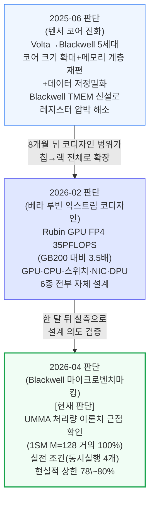
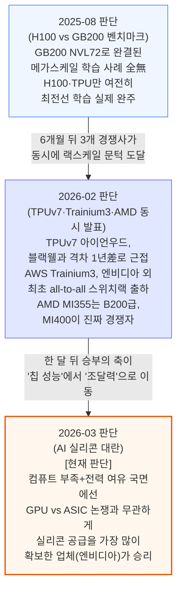
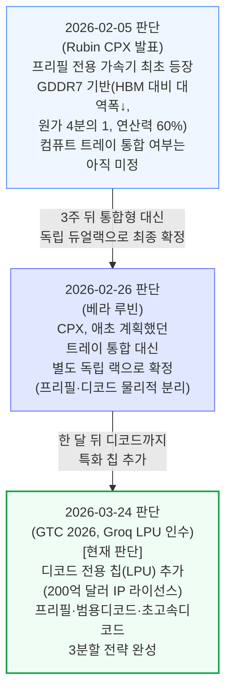
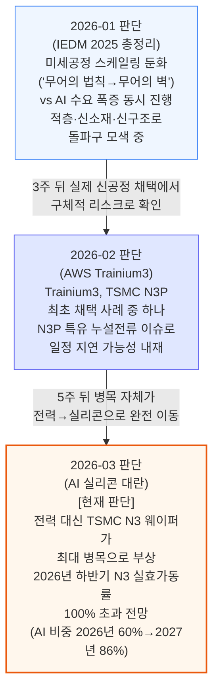
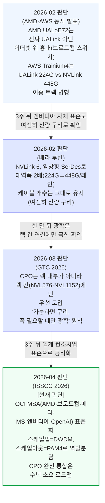

# 컴퓨트(ai-infra/compute) 통합 리포트

> **생성일**: 2026-07-11
> **최종 갱신일**: 2026-07-12
> **대상 문서**: 16개
> - `[250623]` NVIDIA 텐서 코어 진화 - Volta에서 Blackwell까지 (2025-06-23)
> - `[250820]` H100 vs GB200 NVL72 학습 벤치마크 - 전력, TCO, 신뢰성 분석 (2025-08-20)
> - `[260114]` CFET 1,000개와 SK하이닉스 차세대 낸드 - IEDM 2025 총정리 (2026-01-14, 낸드 섹션은 메모리 리포트 소관 — 이 리포트는 CFET·차세대 배선·2D 소재 섹션만 반영)
> - `[260205]` AMD Advancing AI - MI350X와 MI400 UALoE72, MI500 UAL256 (2026-02-05, **부분 변환본** — 12/16장, 13\~16장(MI400 Flexible I/O·UALoE72, Helios 랙, MI500 UAL256, BOM·TCO 비교) 미작성)
> - `[260205]` AWS Trainium3 딥다이브 - 다가오는 잠재적 도전자 (2026-02-05, **부분 변환본** — 9/16장, 10\~16장(스위치 세대 진화, 구리 케이블·BOM, 스케일아웃 네트워킹, 마이크로아키텍처, 소프트웨어 전략, LNC/Megacore, TCO 비교) 미작성)
> - `[260205]` TPUv7 - 구글, AI 반도체 왕좌에 도전장을 내밀다 (2026-02-05)
> - `[260205]` 루빈 CPX 특화 가속기와 랙 - 또 하나의 거대한 도약 (2026-02-05)
> - `[260226]` 베라 루빈 - 익스트림 코디자인, 그레이스 블랙웰 오베론에서의 진화 (2026-02-26)
> - `[260313]` AI 실리콘 대란 - TSMC N3부터 메모리까지 (2026-03-13, 메모리 섹션은 메모리 리포트 소관 — 이 리포트는 TSMC N3·CoWoS·공급망 섹션만 반영)
> - `[260324]` GTC 2026 - 추론 왕국의 확장 (2026-03-24)
> - `[260401]` Nvidia Blackwell 해부 - 텐서 코어, PTX 명령어, SASS, 플로어스위프, 수율 (2026-04-01)
> - `[250812]` HBM 로드맵 - 메모리 벽을 넘는 HBM의 부상과 미래 (2025-08-12, 1차 카테고리는 ai-infra/memory — 이 리포트는 "AI 가속기가 메모리에 요구하는 것"·"대역폭이 용량을 이긴다" 등 가속기-메모리 코디자인 섹션만 반영)
> - `[260416]` ISSCC 2026 총정리 - HBM4, LPDDR6, CPO, 액티브 LSI 등 차세대 메모리·인터커넥트 (2026-04-16, 1차 카테고리는 ai-infra/memory — 이 리포트는 CPO·다이간 인터커넥트·프로세서 섹션(9\~20절)만 반영)
> - `[260526]` 800VDC 혁명 Part 1 - 전력 배전 아키텍처의 대전환 (2026-05-26, 1차 카테고리는 ai-infra/power — 이 리포트는 "Phase 2: 800VDC 네이티브 컴퓨트" 섹션만 반영)
> - `[260205]` AI 가치 포착 - 모델 랩으로의 이동 (2026-02-05, 1차 카테고리는 ai-infra 복수(compute+memory) — GPU 임대가격·TCO·SOCAMM 가격 결정 섹션 전체 반영)
> - `[260205]` DeepSeekV4 1.6T Day 0 to Day 43 Performance Over Time - Huawei, GB300 NVL72, MI355X, B200 (2026-02-05, 카테고리는 ai-infra/compute + ai-models 복수 — 이 리포트는 하드웨어·엔진별 Day 0\~43일 실측 벤치마크 섹션 전체 반영)

---

## 📌 현재 종합 판단

- **엔비디아의 "익스트림 코디자인" 전략은 칩 단위에서 랙 전체로 계속 확장되며 실측으로도 뒷받침되는 중**: 텐서 코어 5세대 진화(코어 확대·메모리 재편·저정밀화)가 2026년 베라 루빈에서 GPU·CPU·스위치·NIC·DPU 6종 전부를 자체 설계하는 랙 단위 코디자인으로 확장됐고, 두 달 뒤 공개된 실측 마이크로벤치마크가 이 설계 의도(이론치 근접 처리량)를 그대로 확인 (§1.1, 확신도: 높음)
- **커스텀 실리콘(TPU·Trainium·AMD)의 랙스케일 추격은 실제로 이뤄졌지만, 경쟁의 축 자체가 "누가 더 빠른 칩을 만드는가"에서 "누가 실리콘 공급을 더 많이 확보하는가"로 옮겨가는 중**: 2025년 8월 시점 랙스케일 경쟁자가 전무했던 데서, 2026년 2월 TPUv7·Trainium3·MI400이 동시에 랙스케일 문턱에 도달했지만, 한 달 뒤 발행된 문서는 "실리콘 부족·전력 여유" 국면에서 조달력을 가진 엔비디아가 GPU-ASIC 논쟁과 무관하게 승리한다고 재확인 (§1.2, 확신도: 중간)
- **추론 서빙 하드웨어는 프리필·범용디코드·초고속디코드 3갈래로 분화가 가속**: 2026년 2월 프리필 전용 칩(Rubin CPX) 발표 후 3주 만에 통합형에서 독립 랙으로 설계가 확정됐고, 한 달 뒤 Groq LPU 인수로 디코드 특화까지 더해져 분화가 빠르게 구체화 (§1.3, 확신도: 높음)
- **AI 인프라의 물리적 병목이 전력에서 반도체 제조(TSMC 웨이퍼)로 이동 중이며, 이 전환이 여러 각도에서 재확인**: 공정 미세화 둔화(1월) → TSMC N3P 신공정 리스크(2월) → 전력을 제치고 실리콘이 최대 병목이라는 명시적 선언(3월)까지 3개월 연속 같은 방향의 신호 (§1.4, 확신도: 중간)
- **스케일업 네트워크는 구리가 예상보다 오래 주력을 지키고, 광학(CPO) 전환은 업계 표준화를 거쳐 점진적으로만 진행**: UALink는 아직 "진짜"가 아니고, NVLink 6도 여전히 전량 구리이며, CPO는 랙 간 연결에만 우선 투입되는 원칙이 4개 문서에 걸쳐 일관되게 확인되고 4월 업계 컨소시엄 표준으로 공식화 (§1.5, 확신도: 높음)
- **결론**: 컴퓨트 산업은 엔비디아 주도의 통합형 코디자인이 칩→랙 단위로 계속 심화되는 가운데, 경쟁자의 추격이 반복적으로 발생하지만 엔비디아가 매번 새로운 특화 축(프리필·디코드 칩 등)으로 재도약하는 패턴이 굳어지고 있음 — 동시에 물리적 제약(웨이퍼 공급·구리 대역폭 한계)이 경쟁 구도 자체보다 더 근본적인 병목으로 부상하는 중이며, 이 병목이 어떻게 풀리는지가 향후 경쟁 구도의 실질적 변수가 될 전망

---

## 📑 목차

1. [시계열 흐름: 반복 등장 주제](#1-시계열-흐름-반복-등장-주제)
2. [다음 확인 포인트](#2-다음-확인-포인트)
3. [문서별 요약](#3-문서별-요약)

---

## 1. 시계열 흐름: 반복 등장 주제

### 1.1 엔비디아 GPU 세대 진화와 익스트림 코디자인 — 칩에서 랙 전체로

**확신도: 높음** — 3개 문서가 같은 방향(통합 범위 확대 + 설계 의도의 실측 검증)을 재확인, 최신 데이터포인트 2026-04

텐서 코어 아키텍처의 세대별 진화 논리가, 2026년에는 칩 하나가 아니라 랙 전체를 하나의 제품으로 설계하는 "익스트림 코디자인"으로 확장됐고, 두 달 뒤 실측 마이크로벤치마크 리포트가 이 설계가 실제로 이론치에 근접한 성능을 낸다는 것을 검증했습니다.

텐서 코어 진화 문서가 짚은 "코어 크기 확대·메모리 계층 재편·데이터 저정밀화"라는 3대 흐름은, 베라 루빈에서 칩 6종 전부를 자체 설계하는 랙 단위 코디자인으로 그대로 이어졌습니다.

Blackwell 해부 문서는 이 설계가 마케팅 수치가 아니라 실제로 하드웨어 카운터 기준 이론치에 근접한 처리량을 낸다는 것을 직접 실측해, 코디자인 전략의 실효성을 뒷받침합니다.

### 1.2 커스텀 실리콘 도전 구도 — 랙스케일 추격은 성공했지만 경쟁의 축이 이동

**확신도: 중간** — 3개 문서가 같은 현상(경쟁 심화)을 다루지만, "무엇이 승부를 가르는가"에 대한 판단 축이 문서마다 다름, 최신 데이터포인트 2026-03

2025년 8월까지만 해도 엔비디아 랙스케일(GB200 NVL72)에 맞설 경쟁자가 전무했지만, 6개월 뒤 TPUv7·Trainium3·AMD MI400이 동시에 랙스케일 문턱에 도달했습니다. 다만 한 달 뒤 발행된 문서는 "칩 성능 격차"가 아니라 "실리콘 조달력"이 승부를 가른다는 다른 축을 제시합니다.

세 시점을 관통하는 것은 "커스텀 실리콘이 엔비디아를 실제로 위협할 정도로 성숙했다"는 사실 자체이지만, 정작 승부처는 계속 이동했습니다.

처음엔 "메가스케일 학습을 완주할 수 있는가"였다가, "랙 전체를 하나의 스케일업 도메인으로 묶을 수 있는가"로, 다시 "웨이퍼·메모리 등 실리콘 자체를 얼마나 확보했는가"로 옮겨갔습니다. 이 축 이동 자체가 아직 승부가 완전히 결정되지 않았다는 신호이며, 확신도를 중간으로 매긴 이유입니다.

### 1.3 추론 서빙 하드웨어 분화 — 프리필·범용디코드·초고속디코드 3갈래

**확신도: 높음** — 3개 문서가 같은 방향(분화 가속)을 재확인, 최신 데이터포인트 2026-03, 6주 안에 3단계 진전

프리필 전용 가속기가 발표된 지 3주 만에 랙 설계가 확정되고, 다시 한 달 만에 디코드 전용 칩까지 추가되며 추론 서빙 하드웨어의 분화가 빠르게 구체화됐습니다.

세 문서 모두 "프리필과 디코드는 자원 요구가 정반대라 한 칩에서 처리하면 서로 성능을 갉아먹는다"는 동일한 문제의식에서 출발해, 물리적 분리(독립 랙) → 역할별 특화 칩 추가(LPU)로 일관되게 심화됐습니다. 이 흐름이 경쟁사에 미치는 영향은 §1.2에서 다룬 "추격→재도약" 패턴의 구체적 실체이기도 합니다.

### 1.4 TSMC 웨이퍼·공정 병목 — 전력에서 실리콘 제조로 이동

**확신도: 중간** — 3개 문서가 같은 방향(제조 제약 심화)을 다루지만 각기 다른 각도(공정 스케일링·신공정 리스크·웨이퍼 물량)에서 접근, 최신 데이터포인트 2026-03

반도체 미세공정 스케일링 둔화라는 학술적 관찰이, 실제 신공정 채택 리스크로 구체화됐다가, 결국 "AI 인프라의 최대 병목이 전력에서 실리콘 제조로 완전히 넘어갔다"는 명시적 선언으로 이어졌습니다.

세 문서가 다루는 구체적 지표(공정 노드 스케일링·개별 칩의 수율 리스크·산업 전체 웨이퍼 물량)는 서로 다르지만, "반도체 제조 능력이 AI 인프라 확장 속도를 못 따라간다"는 방향만큼은 3개월 연속 일관됩니다. 다만 서로 다른 각도의 근거라 확신도는 중간으로 매겼습니다.

### 1.5 스케일업 네트워크 진화 — 구리 우선, 광학(CPO)은 점진적·표준화된 전환

**확신도: 높음** — 4개 문서가 같은 방향(구리 지속 + CPO는 랙 간 연결에만 제한적 도입)을 재확인, 최신 데이터포인트 2026-04, 업계 컨소시엄 표준으로 공식화

경쟁사의 스케일업 표준(UALink)이 아직 "진짜"가 아니라는 지적에서 시작해, 엔비디아 자체 NVLink조차 대역폭을 2배로 늘리면서도 구리를 고수하고, 광학(CPO)은 랙 내부가 아니라 랙 간 연결에만 우선 투입된다는 원칙이 반복 확인된 뒤, 결국 업계 컨소시엄 표준으로 공식화됐습니다.

4개 문서 모두 "구리 대역폭을 최대한 짜낸 뒤에만 광학으로 전환한다"는 같은 원칙을 확인합니다.

특히 2월 두 문서(AMD·AWS 및 베라 루빈)는 서로 다른 진영(경쟁사 대 엔비디아 자사)에서 같은 결론(구리 우선)에 도달했다는 점에서, 이 방향이 특정 업체의 전략이 아니라 산업 전체의 물리적 제약에서 나온다는 점을 뒷받침합니다.

4월 ISSCC 문서는 이 원칙이 경쟁 관계인 6개 업체가 함께 만든 컨소시엄 표준(OCI MSA)으로 공식화됐음을 확인해, 확신도를 높음으로 매겼습니다.

---

## 2. 다음 확인 포인트

- **TPU v8(2027년 예정) 세대 간 성능 향상 폭 실제 확인** — TPUv7 대비 향상 폭이 좁게 나오면 §1.2 "엔비디아 우위 유지" 방향 강화, 예상보다 크게 나오면 §1.2 재검토 필요 (`[260205] TPUv7`)
- **AMD MI400 Helios 랙 실제 출하(2026년 말 목표) 및 MI500 UAL256(2027년 말) 로드맵 준수 여부** — 지연되면 §1.2·§1.5의 "엔비디아 우위 지속" 방향 강화, 예정대로면 격차 축소 재확인 (`[260205] AMD Advancing AI`)
- **AWS Trainium4의 UALink 224G vs NVLink Fusion 448G 이중 트랙 중 실제 채택 결과** — NVLink Fusion이 채택되면 §1.5 "엔비디아 표준 장악력" 강화, UALink 진영이 확산되면 §1.5에 대안 표준 부상 신호로 반영 필요 (`[260205] AWS Trainium3`, 부분 변환본)
- **Groq LPX 랙의 2026년 3분기 실제 출하 버전과 GTC 전시 설계 간 변경 폭** — 변경이 크면 §1.3 "3분할 전략"의 통합 난이도가 예상보다 높다는 신호, 예정대로면 §1.3 확신도 강화 (`[260324] GTC 2026`)
- **TSMC N3 2026년 하반기 실효 가동률 실제 수치 및 스마트폰 수요 조정(두 자릿수 감소) 실현 여부** — 실현되면 §1.4에 웨이퍼 재배정으로 여유가 확보된다는 신호 추가, 미실현이면 병목 심화가 지속된다는 방향 강화 (`[260313] AI 실리콘 대란`)
- **Rubin Ultra NVL576·Feynman NVL1152의 "랙 내부까지 CPO 적용" 여부 확정** — 원문 내 이견 존재(기술 블로그는 "랙 간에만", Jensen 발언은 "전부 CPO") — 랙 내부까지 확산되면 §1.5의 "구리 우선" 방향 재검토 필요, 랙 간에만 국한되면 현행 판단 재확인 (`[260324] GTC 2026`)
- **Feynman 세대 448Gbit/s 단방향 SerDes 대량 양산 검증 결과** — 검증에 성공하면 §1.5 "구리 한계 재연장" 방향 강화, 실패하면 CPO 전환이 예상보다 앞당겨질 신호 (`[260324] GTC 2026`)
- **AWS Trainium3의 TSMC N3P 누설전류 리스크로 인한 실제 일정 지연 여부** — 지연되면 §1.4의 "TSMC 신공정 리스크" 판단 재확인, 예정대로 출하되면 리스크가 과장이었다는 신호 (`[260205] AWS Trainium3`, 부분 변환본)

---

## 3. 문서별 요약

**[250623] NVIDIA 텐서 코어 진화 - Volta에서 Blackwell까지** (2025-06-23) — 2017년 Volta부터 2024년 Blackwell까지 텐서 코어 5세대 아키텍처 변화의 동기를 "왜 그렇게 설계를 바꿨는가" 관점에서 해부한 코퍼스 내 가장 기초적인 GPU 아키텍처 문서. 데이터 이동이 연산보다 훨씬 비싸다는 1대 원칙에서 코어 크기 확대·메모리 계층 재편(Blackwell TMEM 신설)·데이터 저정밀화(FP16→FP4)라는 3대 진화 흐름이 갈라져 나왔음을 규명하고, 구조적 희소성이 마케팅 약속을 지키지 못한 사례도 짚음. §1.1 타임라인의 출발점.

**[250820] H100 vs GB200 NVL72 학습 벤치마크 - 전력, TCO, 신뢰성 분석** (2025-08-20) — H100 2,000개 이상 실측과 GB200 NVL72 초기 벤치마크를 근거로 신뢰성 문제까지 반영한 실제 성능/TCO 비교를 제시. GB200이 소프트웨어 성숙 5개월 만에 H100 대비 1.5배 성능/비용 우위로 역전했지만, 백플레인 신뢰성(MTBI H100 대비 낮음)을 반영하면 우위가 50%→20\~30%까지 줄어들어 일반 밀집 모델에는 오히려 바닐라 B200이 나을 수 있다는 반전을 제시. §1.2 타임라인의 출발점(경쟁자 부재 확인).

**[260114] CFET 1,000개와 SK하이닉스 차세대 낸드 - IEDM 2025 총정리** (2026-01-14) — 1차 카테고리는 ai-infra/memory·compute 복수이며, 이 리포트에는 낸드 섹션을 제외한 CFET·차세대 배선(루테늄)·2D 소재(TMD) 섹션만 반영. 반도체 업계가 슈퍼사이클과 공정 스케일링 둔화를 동시에 겪는 가운데, TSMC가 CFET 상업화를 2030년대로 공식화하고 3년 연속 단계적 진전(단일소자→인버터→101단 링오실레이터+SRAM)을 보였음을 확인. §1.4 타임라인의 출발점(제조 병목의 학술적 관찰).

**[260205] AMD Advancing AI - MI350X와 MI400 UALoE72, MI500 UAL256** (2026-02-05, **부분 변환본**, 12/16장) — MI355X는 소형\~중형 추론에서 HGX B200과 경쟁 가능하지만 랙 스케일 솔루션이 아니며(스케일업 8 GPU뿐), UALoE72도 진짜 UALink가 아니라 이더넷 위에 얹은 흉내(브로드컴 스위치 사용)라는 마케팅 과장을 지적. AWS·Meta·OpenAI·x.AI·Oracle이 적극 채택하는 반면 Microsoft는 소극적이고, ROCm 소프트웨어 개선은 빨라지고 있으나 RCCL은 여전히 NCCL 포크 수준에 머무름을 확인. §1.2·§1.5 타임라인의 중간 데이터포인트.

**[260205] AWS Trainium3 딥다이브 - 다가오는 잠재적 도전자** (2026-02-05, **부분 변환본**, 9/16장) — AWS가 "최저 TCO+최단 출시"를 노스스타로 삼아 토러스에서 스위치 방식으로 전환한 Trainium3를 공개, 엔비디아 외 최초로 all-to-all 스위치 스케일업 랙을 실제 출하(AMD보다 1년 빠름)했음을 확인. TSMC N3P 최초 채택 사례 중 하나로 신공정 리스크를 안고 있으며, Trainium4는 UALink 224G와 엔비디아 NVLink 448G 이중 트랙을 동시에 준비 중. §1.2·§1.4·§1.5 타임라인의 중간 데이터포인트.

**[260205] TPUv7 - 구글, AI 반도체 왕좌에 도전장을 내밀다** (2026-02-05) — TPUv7 아이언우드가 처음으로 이론상 스펙에서 블랙웰에 근접(격차 1년差로 축소)했고, Anthropic이 100만 개 TPU를 발주하는 대형 거래가 성사됐음을 심층 분석. 다만 TPU v8(2027년)의 세대 간 성능 향상 폭은 엔비디아 루빈보다 훨씬 작을 것으로 전망돼, 구글의 TCO 우위가 다음 세대에서 좁혀질 수 있다는 경고도 함께 제시. §1.2 타임라인의 중간 데이터포인트, §2 확인 포인트 대상.

**[260205] 루빈 CPX 특화 가속기와 랙 - 또 하나의 거대한 도약** (2026-02-05) — 엔비디아가 프리필(입력 처리) 전용 가속기 Rubin CPX를 최초 공개, 대역폭 대신 연산력에 극단적으로 치우친 설계(GDDR7 기반, HBM 대비 원가 4분의 1)로 프리필의 HBM 대역폭 낭비를 해소. 이 발표가 경쟁사(AMD·구글·AWS·Meta)에 "프리필 전용 칩까지 새로 개발해야 하는" 격차 재확대 압박을 준다고 분석. §1.2·§1.3 타임라인의 핵심 데이터포인트.

**[260226] 베라 루빈 - 익스트림 코디자인, 그레이스 블랙웰 오베론에서의 진화** (2026-02-26) — CES 2026에서 공개된 Rubin 플랫폼 6개 실리콘(GPU·CPU·NVLink 6·ConnectX-9·BlueField-4·Spectrum-6) 전부를 자체 설계하는 "익스트림 코디자인" 전략을 심층 분석. 컴퓨트 트레이를 100% 케이블 없는 모듈형으로 재설계(조립 시간 2시간→5분)했고, Rubin CPX는 애초 계획과 달리 독립 듀얼랙으로 최종 확정됐음을 확인. VR NVL72의 실측 성능/TCO는 스펙만으로는 예측 불가하다는 결론도 제시. §1.1·§1.3·§1.5 타임라인의 핵심 데이터포인트.

**[260313] AI 실리콘 대란 - TSMC N3부터 메모리까지** (2026-03-13) — 1차 카테고리는 ai-infra/compute·memory 복수이며, 이 리포트에는 메모리 섹션을 제외한 TSMC N3 웨이퍼 부족·CoWoS·공급망 섹션만 반영. AI 인프라의 최대 병목이 전력에서 반도체 제조 능력으로 완전히 이동했다고 선언하고, 2026년 N3 웨이퍼 수요 중 AI 비중이 60%(2027년 86%)까지 치솟아 스마트폰·PC 물량을 밀어낼 것으로 전망. 컴퓨트 부족·전력 여유 국면에서는 실리콘 조달력을 가장 많이 확보한 엔비디아가 승리한다고 결론. §1.2·§1.4 타임라인의 핵심 데이터포인트.

**[260324] GTC 2026 - 추론 왕국의 확장** (2026-03-24) — 엔비디아가 Groq LPU를 200억 달러 규모로 사실상 인수(IP 라이선스+인력 채용 형태로 반독점 심사 우회)해 디코드 전용 칩까지 확보, 프리필(CPX)·범용 디코드(GPU)·초고속 디코드(LPU) 3분할 추론 전략을 완성했음을 확인. CPO(공동 패키징 광학)는 랙 내부가 아니라 랙 간(NVL576·NVL1152) 연결에만 우선 투입된다는 원칙도 재확인. §1.3·§1.5 타임라인의 핵심 데이터포인트.

**[260401] Nvidia Blackwell 해부 - 텐서 코어, PTX 명령어, SASS, 플로어스위프, 수율** (2026-04-01) — Blackwell(SM100)의 공식 백서·PTX/SASS 실측 자료가 전무한 상황에서, 수개월간 실물 B200을 직접 뜯어 명령어 단위로 성능을 측정한 코퍼스 내 유일한 마이크로벤치마킹 문서. UMMA(5세대 MMA)가 거의 모든 설정에서 이론치에 근접한 처리량을 낸다는 것과, 플로어스위핑으로 다이마다 결함 SM 분포가 다르다는 것을 실측으로 확인해 텐서 코어 진화 문서의 설계 의도를 검증. §1.1 타임라인의 최신 데이터포인트.

**[250812] HBM 로드맵 - 메모리 벽을 넘는 HBM의 부상과 미래** (2025-08-12) — 1차 카테고리는 ai-infra/memory이며, 이 리포트에는 "AI 가속기가 메모리에 요구하는 것"·"대역폭이 용량을 이긴다" 등 가속기-메모리 코디자인 섹션만 반영. AI 가속기는 CPU와 달리 처리량 극대화를 위해 칩 밖 대역폭이 절대적으로 필요하다는 원리와, "메모리-파킨슨 법칙"(HBM이 커져도 모델이 곧바로 그 여유를 다 써버리는 역설)을 규명. OpenAI 자체 ASIC이 업계 통념(고단 적층)을 깨고 8-Hi HBM4를 택해 대역폭/비용 효율을 높인 역발상 사례도 제시.

**[260416] ISSCC 2026 총정리 - HBM4, LPDDR6, CPO, 액티브 LSI 등 차세대 메모리·인터커넥트** (2026-04-16) — 1차 카테고리는 ai-infra/memory이며, 이 리포트에는 메모리 섹션을 제외한 CPO·다이간 인터커넥트·프로세서 섹션(9\~20절)만 반영. 엔비디아가 스케일업(DWDM)과 스케일아웃(PAM4)에 서로 다른 광통신 방식을 쓰기로 한 설계가 2026년 3월 결성된 업계 컨소시엄(OCI MSA, AMD·브로드컴·메타·MS·엔비디아·OpenAI) 표준으로 공식화됐음을 확인. 브로드컴의 상용 CPO 스위치 실증, 인텔 UCIe-S 다이간 인터커넥트 등 학회 발표 12건을 정리. §1.5 타임라인의 최신 데이터포인트.

**[260526] 800VDC 혁명 Part 1 - 전력 배전 아키텍처의 대전환** (2026-05-26) — 1차 카테고리는 ai-infra/power이며, 이 리포트에는 "Phase 2: 800VDC 네이티브 컴퓨트가 만드는 전환점" 섹션만 반영. 엔비디아 Kyber 랙(NVL144)이 800V 버스를 컴퓨트 블레이드까지 직접 끌어들이는 네이티브 설계로 전환하면서, 전력 배전 아키텍처가 GPU 세대 로드맵(Oberon→Kyber)과 함께 진화하고 있음을 확인 — §1.1에서 다룬 "코디자인이 칩→랙으로 확장"되는 흐름이 전력 인프라까지 이어지는 사례.

**[260205] AI 가치 포착 - 모델 랩으로의 이동** (2026-02-05) — 2023\~2025년 인프라(전력·메모리)가 독점하던 AI 가치가 2026년 들어 모델 랩(앤트로픽 등)으로 급격히 이동했다는 진단에서 출발해, Nvidia·TSMC가 이 가치 폭발기에도 가격을 거의 올리지 않고 있음을 지적. VR NVL72의 임대가격을 원가 기반(바닥 $4.92/hr/GPU)과 가치 기반(천장 $12.25/hr/GPU) 두 축으로 삼각측량하는 "One Chart to Rule Them All" 프레임워크를 제시하고, SOCAMM 소켓형 메모리가 Nvidia에게 GPU와 별도로 조정 가능한 마진 레버가 됐음을 분석. 5개 기존 타임라인 주제와 직접 연결되는 반복 등장까지는 아니나, §1.1(엔비디아 코디자인)·§1.2(경쟁 구도) 판단의 가격결정력 측면 근거를 보강하는 문서로, 향후 관련 문서가 추가되면 별도 시계열 주제("AI 가치사슬 내 마진 이동")로 승격 검토 필요.

**[260205] DeepSeekV4 1.6T Day 0 to Day 43 Performance Over Time - Huawei, GB300 NVL72, MI355X, B200** (2026-02-05, 카테고리는 ai-infra/compute + ai-models 복수) — SemiAnalysis의 오픈소스 InferenceX 팀이 DeepSeek V4(1.6조 파라미터 MoE) 출시 당일부터 43일간 Nvidia CUDA·화웨이 Ascend(CANN)·AMD ROCm 세 스택의 실측 성능을 매일 추적한 벤치마크 문서. Day 0엔 CUDA·화웨이 CANN 두 스택만 정상 작동했고 AMD ROCm은 사실상 작동 불능이었으나, HaiShaw가 이끄는 AMD 팀이 1개월 만에 처리량 100배 이상을 끌어올려 §1.2("커스텀 실리콘 추격")의 방향을 실제 소프트웨어 성숙 속도라는 각도에서 재확인. GB300 NVL72는 광역 전문가 병렬화(Wide EP)로 H200 대비 비용 10배 이상 우위를 실측으로 확인해, §1.1("코디자인이 칩→랙으로 확장")이 랙스케일 추론 성능으로도 그대로 이어짐을 뒷받침. DeepSeek V4 자체의 CSA·HCA 압축 어텐션(KV 캐시 50배 압축)과 MegaMoE 융합 커널 아키텍처도 함께 다룸. 5개 기존 타임라인과 직접 연결되는 신규 주제 승격까지는 아니나, §1.1·§1.2 판단에 "스펙이 아닌 실측 벤치마크" 근거를 추가하는 문서.

---

*리포트 생성 규칙: REPORT_RULES.md 참고*
